## Gradient Bandit Algorithms com Baseline

### Introdução
No contexto do aprendizado por reforço, os **algoritmos bandit** são modelos que lidam com o dilema de exploração versus explotação em ambientes simples, onde as ações têm efeitos isolados e imediatos [1]. Em vez de estimar os valores das ações, como nos métodos action-value, os algoritmos gradient bandit aprendem preferências numéricas para cada ação. Estas preferências indicam a frequência com que cada ação deve ser selecionada, sem estabelecer uma relação direta com a recompensa esperada. Essas preferências são então usadas para determinar as probabilidades de seleção de ação através de uma distribuição softmax [1], um tipo de distribuição probabilística que aloca probabilidades maiores para ações com preferências mais elevadas. A principal distinção desse método é que ele não estima valores de ação, mas sim aprende preferências, usando estas para tomar decisões [1].

### Conceitos Fundamentais
O cerne dos algoritmos gradient bandit reside na aprendizagem das **preferências de ação** $H_t(a) \in \mathbb{R}$ [1]. Estas preferências são atualizadas através de um método de **ascensão de gradiente estocástico**. As probabilidades de seleção de ação são dadas pela distribuição softmax:
$$
\Pr\{A_t = a\} = \frac{e^{H_t(a)}}{\sum_{b=1}^k e^{H_t(b)}} = \pi_t(a)
$$
onde $\pi_t(a)$ denota a probabilidade de selecionar a ação $a$ no tempo $t$, e $k$ é o número total de ações [1]. As preferências de ação são inicialmente configuradas como iguais para todas as ações, por exemplo, $H_1(a) = 0$ para todo $a$, garantindo que todas as ações tenham inicialmente a mesma probabilidade de serem selecionadas [1]. As preferências de ação são atualizadas com base na recompensa recebida após a seleção da ação, e um termo chamado **baseline**. Esta atualização é dada por:
```mermaid
flowchart LR
    A[Ação A_t Selecionada] -->|Recompensa R_t| B(Atualizar Preferências H_t(a));
    B --> C{H_t+1(A_t) = H_t(A_t) + alpha * (R_t - R_bar_t) * (1 - pi_t(A_t))};
    B --> D{H_t+1(a) = H_t(a) - alpha * (R_t - R_bar_t) * pi_t(a), para a != A_t};
    C --> E(Nova Preferência H_t+1(A_t));
    D --> F(Novas Preferências H_t+1(a), para a != A_t);
    E --> G(Próxima Iteração);
    F --> G;
    style C fill:#f9f,stroke:#333,stroke-width:2px
    style D fill:#f9f,stroke:#333,stroke-width:2px
```
onde $\alpha > 0$ é o parâmetro step-size, $R_t$ é a recompensa recebida após selecionar a ação $A_t$, e $\bar{R}_t$ é a média das recompensas até o instante $t$ [1]. Esta média atua como um baseline. O baseline é importante pois ele auxilia a dar sentido ao valor de $R_t$. Se a recompensa $R_t$ é maior que o baseline $\bar{R}_t$, a probabilidade de selecionar a ação $A_t$ é aumentada; caso contrário, ela é diminuída. As ações não selecionadas são ajustadas na direção oposta [1].

> 💡 **Exemplo Numérico:** Vamos considerar um problema com 3 ações ($k=3$) e um step-size $\alpha = 0.1$. Inicialmente, as preferências são $H_1(a_1) = H_1(a_2) = H_1(a_3) = 0$, o que implica probabilidades iniciais $\pi_1(a_1) = \pi_1(a_2) = \pi_1(a_3) = 1/3$. No tempo $t=1$, a ação $a_2$ é selecionada (i.e., $A_1 = a_2$) e recebe uma recompensa $R_1 = 1$. Como este é o primeiro passo, o baseline $\bar{R}_1 = 0$. A atualização das preferências é:
>
> $H_{2}(a_2) = H_1(a_2) + \alpha(R_1 - \bar{R}_1)(1 - \pi_1(a_2)) = 0 + 0.1(1 - 0)(1 - 1/3) = 0.0667$
>
> $H_{2}(a_1) = H_1(a_1) - \alpha(R_1 - \bar{R}_1)\pi_1(a_1) = 0 - 0.1(1 - 0)(1/3) = -0.0333$
>
> $H_{2}(a_3) = H_1(a_3) - \alpha(R_1 - \bar{R}_1)\pi_1(a_3) = 0 - 0.1(1 - 0)(1/3) = -0.0333$
>
> As novas preferências são $H_2(a_1) = -0.0333$, $H_2(a_2) = 0.0667$, e $H_2(a_3) = -0.0333$. As novas probabilidades podem ser calculadas através da distribuição softmax.

**Lema 1:** *O uso da função softmax para obter as probabilidades de ações é equivalente à função logística, ou sigmoide, no caso de duas ações*.

*Prova:* Considere um cenário com duas ações, $a_1$ e $a_2$. De acordo com a distribuição softmax, temos que:
$$\pi_t(a_1) = \frac{e^{H_t(a_1)}}{e^{H_t(a_1)} + e^{H_t(a_2)}}$$
Dividindo o numerador e o denominador por $e^{H_t(a_1)}$, obtemos:
$$\pi_t(a_1) = \frac{1}{1 + e^{H_t(a_2) - H_t(a_1)}}$$
Se definirmos a diferença entre as preferências como $z = H_t(a_2) - H_t(a_1)$, podemos reescrever a equação como:
$$\pi_t(a_1) = \frac{1}{1 + e^z}$$
Esta é precisamente a forma da função logística ou sigmoide, onde $z$ representa a diferença entre as preferências das duas ações. $\blacksquare$

```mermaid
flowchart LR
    A["Função Softmax (k=2)"] --> B["pi_t(a_1) = e^(H_t(a_1)) / (e^(H_t(a_1)) + e^(H_t(a_2)))"];
    B --> C["Dividindo por e^(H_t(a_1))"];
    C --> D["pi_t(a_1) = 1 / (1 + e^(H_t(a_2) - H_t(a_1)))"];
    D --> E["z = H_t(a_2) - H_t(a_1)"];
    E --> F["pi_t(a_1) = 1 / (1 + e^z) = Função Logística"];
    style F fill:#ccf,stroke:#333,stroke-width:2px
```

> 💡 **Exemplo Numérico:** Se tivermos duas ações com preferências $H_t(a_1) = 1$ e $H_t(a_2) = 2$, então $z = H_t(a_2) - H_t(a_1) = 2 - 1 = 1$.  Assim, $\pi_t(a_1) = \frac{1}{1 + e^1} \approx 0.269$ e $\pi_t(a_2) = 1 - \pi_t(a_1) \approx 0.731$.  A ação $a_2$ é mais provável de ser escolhida, devido à sua maior preferência, e a probabilidade é calculada exatamente pela função logística.

**Lema 1.1:** *A atualização das preferências de ação pode ser expressa de forma mais concisa usando uma notação indicadora*.

*Prova:* Defina $I(A_t = a)$ como uma função indicadora que retorna 1 se $A_t = a$ e 0 caso contrário. Então a atualização das preferências de ação pode ser escrita como:
$$ H_{t+1}(a) = H_t(a) + \alpha(R_t - \bar{R}_t)(I(A_t = a) - \pi_t(a)) $$
Esta expressão condensa as duas atualizações em uma única fórmula. Note que quando $a = A_t$, temos $I(A_t = a) = 1$ e obtemos a atualização para a ação selecionada, e quando $a \neq A_t$, temos $I(A_t = a) = 0$ e obtemos a atualização para as demais ações. $\blacksquare$
```mermaid
flowchart LR
    A["Notação Original para Atualização de Preferências"] --> B{ "H_{t+1}(A_t) = H_t(A_t) + alpha * (R_t - R_bar_t) * (1 - pi_t(A_t))" };
    A --> C{ "H_{t+1}(a) = H_t(a) - alpha * (R_t - R_bar_t) * pi_t(a), para a != A_t" };
    B --> D["Atualização da ação selecionada A_t"];
    C --> E["Atualização das outras ações a"];
    F["Função Indicadora I(A_t = a)"] --> G{ "H_{t+1}(a) = H_t(a) + alpha * (R_t - R_bar_t) * (I(A_t = a) - pi_t(a))" };
    G --> H["Notação Concisa"];
    style G fill:#ccf,stroke:#333,stroke-width:2px
```

> 💡 **Exemplo Numérico:** Usando o exemplo anterior com 3 ações e após a atualização, no tempo t=2, temos $H_2(a_1) = -0.0333$, $H_2(a_2) = 0.0667$ e $H_2(a_3) = -0.0333$. Se no instante t=2, a ação $a_3$ é selecionada ($A_2 = a_3$) e recebe uma recompensa $R_2 = 0.5$, e vamos calcular o baseline atualizado como $\bar{R}_2 = (1+0.5)/2 = 0.75$, e as probabilidades de cada ação através da softmax, que são, aproximadamente, $\pi_2(a_1) \approx 0.29, \pi_2(a_2) \approx 0.40, \pi_2(a_3) \approx 0.31$.  A atualização da preferência para a ação $a_3$ usando a notação indicadora é:
>
> $H_{3}(a_3) = H_2(a_3) + \alpha(R_2 - \bar{R}_2)(I(A_2 = a_3) - \pi_2(a_3)) = -0.0333 + 0.1(0.5 - 0.75)(1 - 0.31) = -0.0333 -0.01725 = -0.05055$
>
> Para as ações não selecionadas, $a_1$ e $a_2$:
>
> $H_{3}(a_1) = H_2(a_1) + \alpha(R_2 - \bar{R}_2)(I(A_2 = a_1) - \pi_2(a_1)) = -0.0333 + 0.1(0.5 - 0.75)(0 - 0.29) = -0.0333 + 0.00725 = -0.02605$
>
> $H_{3}(a_2) = H_2(a_2) + \alpha(R_2 - \bar{R}_2)(I(A_2 = a_2) - \pi_2(a_2)) = 0.0667 + 0.1(0.5 - 0.75)(0 - 0.40) = 0.0667 + 0.01000 = 0.0767$
>
> A atualização usando a notação indicadora resulta nos mesmos valores que a notação original, mas de forma mais compacta e com menos cálculos repetitivos.

A importância do baseline  $\bar{R}_t$ reside em seu papel como ponto de referência para a recompensa. Se o baseline não fosse usado (isto é, $\bar{R}_t$ fosse igual a zero), o algoritmo ainda funcionaria como um método de ascensão de gradiente estocástico [1], mas a convergência seria mais lenta. Isso ocorre porque o baseline serve para adaptar-se ao novo nível de recompensas, sendo que, sem ele, a performance do algoritmo se degradaria [1]. O uso do baseline não afeta o valor esperado das atualizações, mas reduz a variância dessas atualizações [1].

> 💡 **Exemplo Numérico:** Para ilustrar o efeito do baseline na variância, considere uma sequência de recompensas onde todas as ações tem valor esperado de recompensa 1.  Sem o baseline,  uma recompensa de 2  aumentaria a preferência da ação mesmo que essa fosse uma flutuação aleatória.  Com um baseline (digamos 1), o efeito da mesma recompensa (2) na preferência seria menor, pois seria $2 - 1 = 1$, indicando que esta recompensa é apenas acima do esperado, e não uma recompensa excepcional. O baseline age como uma normalização, reduzindo o impacto de recompensas aleatórias na preferência de ação.
```mermaid
flowchart LR
    A["Recompensa R_t"] --> B{ "Sem Baseline" };
    A --> C{ "Com Baseline R_bar_t" };
    B --> D["Aumento Direto da Preferência"];
    C --> E["Aumento da Preferência = R_t - R_bar_t"];
    D --> F["Maior Variância"];
    E --> G["Menor Variância"];
    H["R_bar_t = Média das Recompensas"]
    style G fill:#ccf,stroke:#333,stroke-width:2px
```

**Observação 1:** *A escolha do baseline como a média das recompensas anteriores é apenas uma das opções. Outros baselines, como a mediana das recompensas, ou uma média móvel exponencial, podem ser utilizados, com impactos na convergência e estabilidade do algoritmo.* A média das recompensas é uma opção comum devido à sua simplicidade e eficácia em muitos casos. No entanto, para ambientes não estacionários, um baseline que atribua maior importância às recompensas mais recentes pode ser mais adequado, assim como os métodos de atualização da média.

> 💡 **Exemplo Numérico:** Suponha que em um ambiente não estacionário, as recompensas mudam abruptamente no tempo $t = 100$. Antes de $t=100$, a recompensa média era $\bar{R}_{99} = 1$.  Após a mudança, as novas recompensas tem média 3.  Um baseline que usa uma média simples, levaria algum tempo até refletir essa mudança. Um baseline que usa uma média móvel exponencial com um fator de decaimento $\lambda$ daria mais peso às recompensas mais recentes, permitindo que o baseline se adapte mais rapidamente a novas médias, por exemplo, $\bar{R}_t = \lambda \bar{R}_{t-1} + (1-\lambda)R_t$, com $\lambda$ perto de 0.
```mermaid
flowchart LR
    A["Ambiente Não Estacionário"] --> B["Mudança Abrupta de Recompensas"];
    B --> C{ "Baseline como Média Simples" };
    B --> D{ "Baseline como Média Móvel Exponencial" };
    C --> E["Adaptação Lenta à Mudança"];
    D --> F["Adaptação Rápida à Mudança"];
    G["R_bar_t = lambda * R_bar_{t-1} + (1-lambda) * R_t"]
    style F fill:#ccf,stroke:#333,stroke-width:2px
```

**Teorema 1:** *O algoritmo gradient bandit, com a atualização de preferência e o baseline como média das recompensas, converge para um ótimo local sob certas condições de suavidade e step-size*.

*Prova (esboço):* A prova desse teorema geralmente envolve a análise da convergência do processo de ascensão de gradiente estocástico. Sob condições apropriadas (como um step-size $\alpha$ decrescente ao longo do tempo, satisfazendo as condições de Robbins-Monro, e uma função de recompensa diferenciável), pode-se mostrar que as preferências de ação convergem para um ponto onde o gradiente da recompensa esperada é zero. Formalmente, este resultado requer ferramentas de análise estocástica e não será detalhado aqui. No entanto, a intuição é que o algoritmo ajusta iterativamente as preferências na direção de recompensas maiores, até atingir um ponto estacionário. $\blacksquare$

**Teorema 1.1:** *No caso de um ambiente estacionário, a média das recompensas $\bar{R}_t$ converge para o valor esperado da recompensa sob a política ótima.*

*Prova (esboço):* No caso estacionário, a recompensa média converge para um valor constante conforme $t$ tende ao infinito, dado que o algoritmo explora adequadamente todas as ações. O baseline $\bar{R}_t$ converge para a recompensa média sob a política que o algoritmo segue. Com o tempo e a convergência da política para a ótima, a média das recompensas converge também para a recompensa esperada sob a política ótima. A prova formal envolve o uso de leis dos grandes números para processos estocásticos. $\blacksquare$

```mermaid
flowchart LR
    A["Ambiente Estacionário"] --> B["Algoritmo Explora Ações"];
    B --> C["Média das Recompensas R_bar_t Converge"];
    C --> D["Política do Algoritmo Converge para Ótima"];
    D --> E["R_bar_t Converge para Recompensa Esperada"];
    style E fill:#ccf,stroke:#333,stroke-width:2px
```


> 💡 **Exemplo Numérico:** Suponha que após um grande número de iterações, o algoritmo esteja em um estado em que sempre escolhe a ação $a_1$, que tem recompensa média 2. O baseline $\bar{R}_t$ irá convergir para 2 com o tempo. Se de repente o algoritmo começar a escolher outras ações menos vantajosas (em uma fase de exploração, por exemplo), o baseline também se ajustará a este novo comportamento. Eventualmente, quando o algoritmo retornar para a ação ótima $a_1$, o baseline voltará a convergir para o valor esperado da recompensa ótima, no caso, 2.

### Conclusão
Os gradient bandit algorithms representam uma abordagem alternativa aos métodos action-value, aprendendo diretamente as preferências de ação em vez de estimar os valores das ações. A inclusão de um baseline na atualização das preferências de ação, com a média das recompensas anteriores, é importante para melhorar a taxa de convergência e a robustez do algoritmo. O baseline atua como um ponto de referência adaptativo que ajuda o algoritmo a distinguir melhor as recompensas boas das ruins, acelerando o processo de aprendizagem. Esta abordagem é especialmente útil em situações onde a interpretação direta das recompensas é mais importante do que a predição de recompensas futuras.

### Referências
[^1]: "So far in this chapter we have considered methods that estimate action values and use those estimates to select actions. This is often a good approach, but it is not the only one possible. In this section we consider learning a numerical preference for each action a, which we denote $H_t(a) \in \mathbb{R}$. The larger the preference, the more often that action is taken, but the preference has no interpretation in terms of reward. Only the relative preference of one action over another is important; if we add 1000 to all the action preferences there is no effect on the action probabilities, which are determined according to a soft-max distribution (i.e., Gibbs or Boltzmann distribution) as follows:
$\Pr\{A_t=a\} = \frac{e^{H_t(a)}}{\sum_{b=1}^k e^{H_t(b)}} = \pi_t(a)$,
where here we have also introduced a useful new notation, $\pi_t(a)$, for the probability of taking action a at time t. Initially all action preferences are the same (e.g., $H_1(a) = 0$, for all a) so that all actions have an equal probability of being selected. There is a natural learning algorithm for soft-max action preferences based on the idea of stochastic gradient ascent. On each step, after selecting action $A_t$ and receiving the reward $R_t$, the action preferences are updated by:
$H_{t+1}(A_t) = H_t(A_t) + \alpha(R_t – R_t) (1 – \pi_t(A_t))$, and for all $a \neq A_t$,
$H_{t+1}(a) = H_t(a) – \alpha(R_t – R_t)\pi_t(a)$,
where $\alpha > 0$ is a step-size parameter, and $R_t \in \mathbb{R}$ is the average of the rewards up to but not including time t (with $R_1 = R_1$), which can be computed incrementally as described in Section 2.4 (or Section 2.5 if the problem is nonstationary)." *(Trecho de Multi-armed Bandits)*
