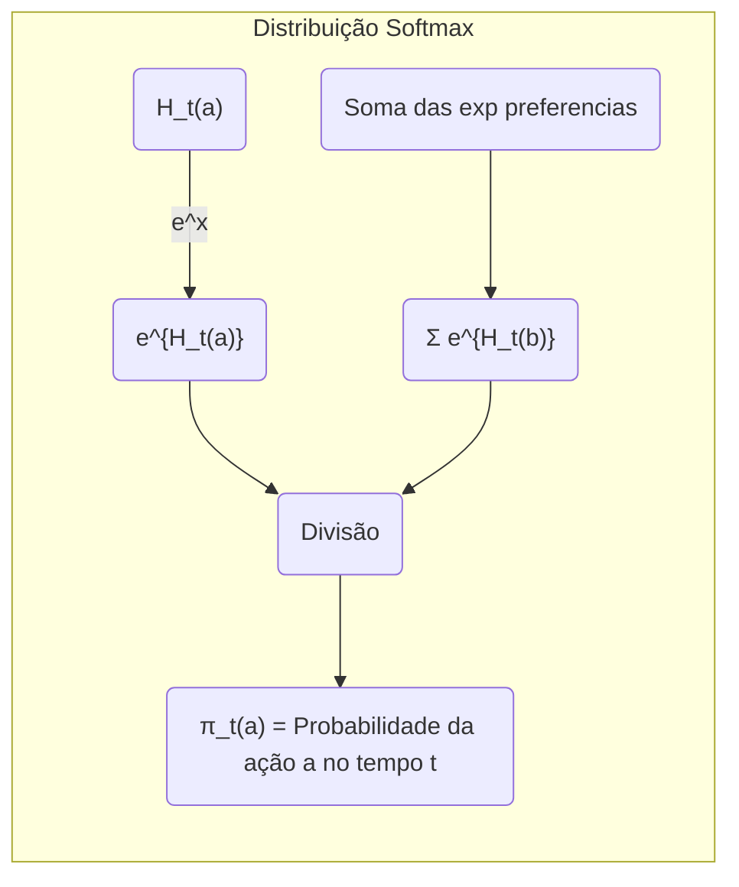
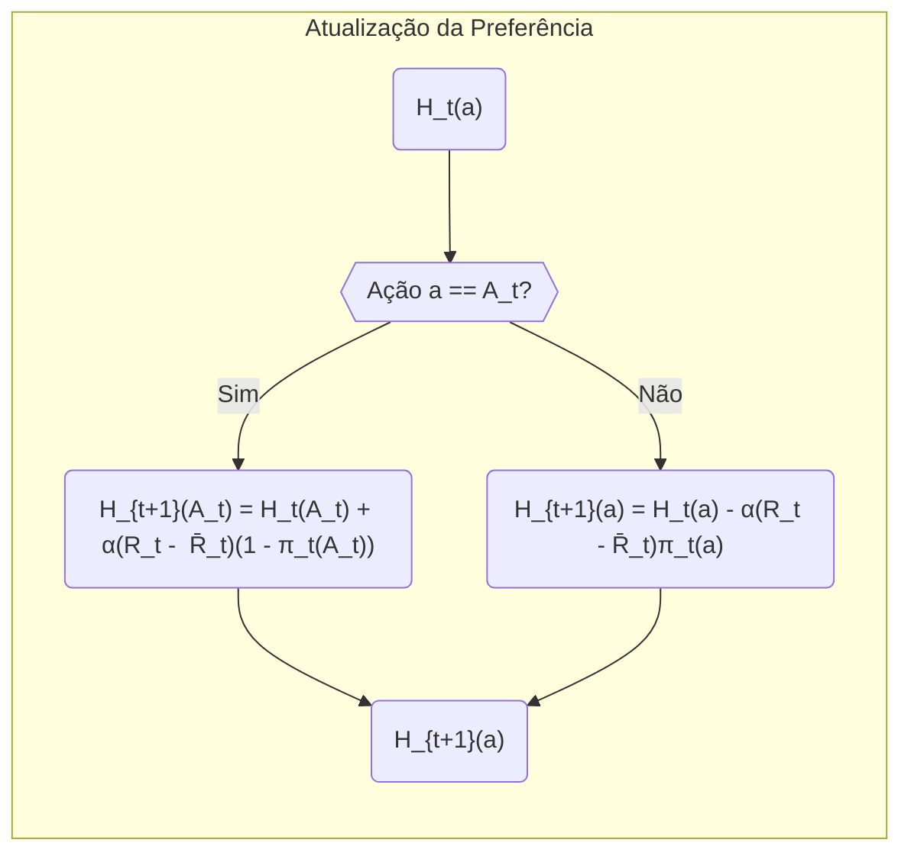
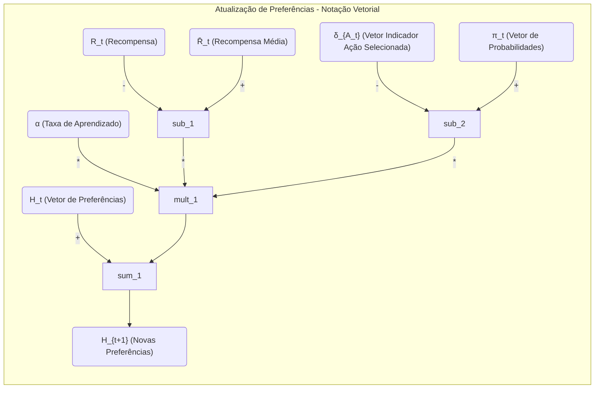
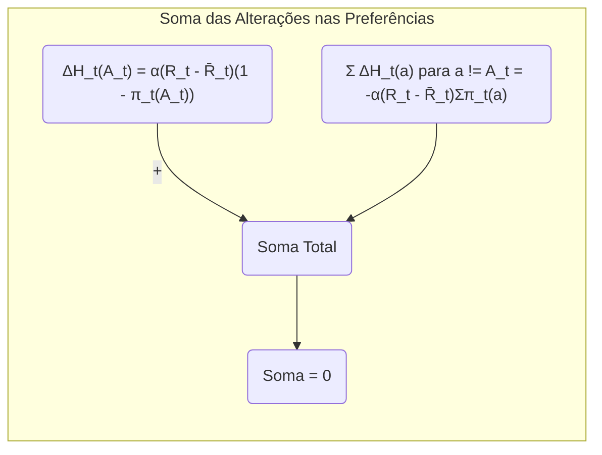

## Gradient Bandit Algorithms: Ajustando Probabilidades de Ação Baseado na Recompensa

### Introdução

Este capítulo explora algoritmos que aprendem preferências numéricas para cada ação, em vez de estimar valores de ação. O foco está em como essas preferências são utilizadas para selecionar ações, utilizando uma distribuição softmax, que é um método probabilístico. Essa abordagem contrasta com os métodos de valor de ação que são discutidos em outros capítulos [^1], e que visam estimar os valores das ações para orientar a tomada de decisão. Uma das características distintas dos Gradient Bandit Algorithms é o uso de uma *baseline* de recompensa, que permite ajustes mais precisos das probabilidades de ação com base no desempenho relativo da ação tomada.

### Conceitos Fundamentais

#### Preferências de Ação e Distribuição Softmax

Nos **Gradient Bandit Algorithms**, cada ação $a$ é associada a uma preferência numérica $H_t(a) \in \mathbb{R}$ [^1]. Diferentemente dos valores de ação, essas preferências não têm uma interpretação direta em termos de recompensa. O que importa é a preferência relativa entre as ações. A probabilidade de selecionar uma ação $a$ no instante $t$ é dada pela distribuição softmax:

$$
Pr\{A_t = a\} = \frac{e^{H_t(a)}}{\sum_{b=1}^{k}e^{H_t(b)}} = \pi_t(a)
$$

onde $k$ é o número total de ações e $\pi_t(a)$ é a probabilidade de selecionar a ação $a$ no instante $t$ [^1]. Inicialmente, todas as preferências são iguais (por exemplo, $H_1(a) = 0$ para todas as ações), resultando em uma probabilidade igual de seleção para todas as ações [^1].

> 💡 **Exemplo Numérico:** Suponha que temos 3 ações (k=3) e inicialmente, as preferências são $H_1(1) = 0$, $H_1(2) = 0$, e $H_1(3) = 0$. A probabilidade de selecionar cada ação no primeiro passo ($t=1$) é:
>
> $\pi_1(1) = \frac{e^0}{e^0 + e^0 + e^0} = \frac{1}{3} \approx 0.333$
>
> $\pi_1(2) = \frac{e^0}{e^0 + e^0 + e^0} = \frac{1}{3} \approx 0.333$
>
> $\pi_1(3) = \frac{e^0}{e^0 + e^0 + e^0} = \frac{1}{3} \approx 0.333$
>
> Todas as ações têm a mesma probabilidade de serem escolhidas inicialmente.

**Proposição 1:** *A distribuição softmax garante que todas as ações tenham uma probabilidade não-nula de serem selecionadas, a menos que as preferências sejam $-\infty$*.

*Proof:* A função exponencial $e^{H_t(a)}$ é sempre positiva para qualquer valor real de $H_t(a)$. Assim, o numerador da distribuição softmax é sempre positivo. O denominador é a soma de termos positivos, então também é positivo. Portanto, a probabilidade $\pi_t(a)$ é sempre maior que zero, a menos que $H_t(a) = -\infty$, o que na prática não ocorre devido à atualização das preferências. $\blacksquare$

#### Atualização das Preferências via Gradiente Estocástico

As preferências de ação são atualizadas usando um algoritmo de ascensão de gradiente estocástico. Após selecionar a ação $A_t$ e receber a recompensa $R_t$, as preferências são atualizadas da seguinte forma:

$$
\begin{aligned}
H_{t+1}(A_t) &= H_t(A_t) + \alpha(R_t - \bar{R}_t)(1 - \pi_t(A_t)) \\
H_{t+1}(a) &= H_t(a) - \alpha(R_t - \bar{R}_t)\pi_t(a), \quad \forall a \ne A_t
\end{aligned}
$$

onde $\alpha > 0$ é um parâmetro de tamanho do passo e $\bar{R}_t$ é a recompensa média até o instante $t$ [^1]. Este termo, $\bar{R}_t$, serve como *baseline*, onde $R_1$ é o primeiro valor recebido.

> 💡 **Exemplo Numérico:** Suponha que no instante $t=2$, a ação selecionada foi $A_2=2$. As preferências eram $H_2(1) = 0.1$, $H_2(2) = 0.2$, e $H_2(3) = -0.1$. A recompensa obtida foi $R_2 = 1$, e a recompensa média até agora é $\bar{R}_2 = 0.5$ (supondo que $R_1 = 0$). Usamos um tamanho de passo $\alpha = 0.1$. Primeiro, calculamos as probabilidades de ação:
>
>  $\pi_2(1) = \frac{e^{0.1}}{e^{0.1} + e^{0.2} + e^{-0.1}} \approx \frac{1.105}{1.105 + 1.221 + 0.905} \approx 0.336$
>
>  $\pi_2(2) = \frac{e^{0.2}}{e^{0.1} + e^{0.2} + e^{-0.1}} \approx \frac{1.221}{1.105 + 1.221 + 0.905} \approx 0.372$
>
>  $\pi_2(3) = \frac{e^{-0.1}}{e^{0.1} + e^{0.2} + e^{-0.1}} \approx \frac{0.905}{1.105 + 1.221 + 0.905} \approx 0.292$
>
> Agora, atualizamos as preferências:
>
> $H_3(2) = 0.2 + 0.1 * (1 - 0.5) * (1 - 0.372) \approx 0.2 + 0.1 * 0.5 * 0.628 = 0.231$
>
> $H_3(1) = 0.1 - 0.1 * (1 - 0.5) * 0.336 \approx 0.1 - 0.1 * 0.5 * 0.336 = 0.083$
>
> $H_3(3) = -0.1 - 0.1 * (1 - 0.5) * 0.292 \approx -0.1 - 0.1 * 0.5 * 0.292 = -0.115$
>
> Observe que a preferência da ação escolhida (ação 2) aumentou, pois $R_2 > \bar{R}_2$, enquanto as preferências das ações não selecionadas (ações 1 e 3) diminuíram.

**Lemma 1:** *A atualização das preferências de ação nos Gradient Bandit Algorithms é uma instância de ascensão de gradiente estocástico*.

*Proof:* O objetivo é maximizar o valor esperado da recompensa, $E[R_t]$. A atualização das preferências de ação é baseada no gradiente da recompensa esperada em relação às preferências de ação. A derivada parcial da recompensa esperada é dada por [^1]:

$$
\frac{\partial E[R_t]}{\partial H_t(a)} = \sum_x (q_*(x) - \bar{R}_t) \frac{\partial \pi_t(x)}{\partial H_t(a)}
$$

onde $q_*(x)$ é o valor real da ação $x$.

Substituindo $\frac{\partial \pi_t(x)}{\partial H_t(a)} = \pi_t(x)(\delta_{ax}-\pi_t(a))$, onde $\delta_{ax} = 1$ se $a=x$ e 0 caso contrário, temos:

$$
\frac{\partial E[R_t]}{\partial H_t(a)} = \sum_x (q_*(x) - \bar{R}_t) \pi_t(x)(\delta_{ax}-\pi_t(a))
$$

Essa expressão pode ser reescrita como:

$$
E[(R_t - \bar{R}_t) (\delta_{aA_t} - \pi_t(a))]
$$

A atualização das preferências de ação no algoritmo é feita tomando um passo na direção desse gradiente:

$$
H_{t+1}(a) = H_t(a) + \alpha(R_t - \bar{R}_t) (\delta_{aA_t} - \pi_t(a))
$$
que é equivalente às equações de atualização apresentadas anteriormente, estabelecendo o algoritmo como uma instância de ascensão de gradiente estocástico. $\blacksquare$

**Lemma 1.1:** *A atualização das preferências pode ser reescrita utilizando uma notação mais compacta.*

*Proof:* Podemos definir o vetor de preferências $H_t = [H_t(1), H_t(2), \ldots, H_t(k)]$ e a probabilidade de ação $\pi_t = [\pi_t(1), \pi_t(2), \ldots, \pi_t(k)]$. Então a atualização das preferências pode ser escrita de forma mais compacta como:

$$
H_{t+1} = H_t + \alpha(R_t - \bar{R}_t)(\delta_{A_t} - \pi_t)
$$
onde $\delta_{A_t}$ é um vetor com todos os elementos iguais a 0 exceto o elemento correspondente à ação $A_t$ que é 1. Essa notação compacta facilita a análise e implementação do algoritmo. $\blacksquare$

> 💡 **Exemplo Numérico (Notação Compacta):** Usando o exemplo anterior com $k=3$, podemos representar as preferências e probabilidades como vetores:
>
> $H_2 = [0.1, 0.2, -0.1]$
>
> $\pi_2 = [0.336, 0.372, 0.292]$
>
> $\delta_{A_2} = [0, 1, 0]$ (pois $A_2 = 2$)
>
> $R_2 = 1$, $\bar{R}_2 = 0.5$, $\alpha = 0.1$
>
> A atualização das preferências em notação vetorial é:
>
> $H_{3} = H_2 + \alpha(R_2 - \bar{R}_2)(\delta_{A_2} - \pi_2)$
>
> $H_{3} = [0.1, 0.2, -0.1] + 0.1*(1 - 0.5)*([0, 1, 0] - [0.336, 0.372, 0.292])$
>
> $H_{3} = [0.1, 0.2, -0.1] + 0.05*[-0.336, 0.628, -0.292]$
>
> $H_{3} = [0.1 - 0.0168, 0.2 + 0.0314, -0.1 - 0.0146]$
>
> $H_{3} = [0.0832, 0.2314, -0.1146]$
>
> Este resultado é equivalente ao calculado anteriormente, demonstrando a utilidade da notação compacta.

**Corolário 1:** *O termo baseline, $\bar{R}_t$, não afeta a convergência do algoritmo, mas sim a taxa de convergência*.

*Proof:* Conforme demonstrado no Lemma 1, a atualização das preferências é um método de ascensão de gradiente estocástico e independe do termo $\bar{R}_t$.  Qualquer valor constante de $\bar{R}_t$ não altera o resultado da derivada, garantindo a convergência. Entretanto, o termo *baseline* reduz a variância da atualização, resultando em uma taxa de convergência mais rápida e estável. $\blacksquare$

**Corolário 1.1:** *Se a recompensa $R_t$ for sempre igual a $\bar{R}_t$, então as preferências não são modificadas no passo atual.*

*Proof:* Se $R_t = \bar{R}_t$, então o termo $(R_t - \bar{R}_t)$ é zero. Consequentemente, a atualização das preferências $H_{t+1}(a)$ torna-se igual a $H_t(a)$ para toda ação $a$, ou seja, $H_{t+1} = H_t$. Isso demonstra que quando a recompensa atual é igual à média, não há ajustes nas preferências, o que indica que o desempenho atual é considerado "neutro" em relação ao passado.  $\blacksquare$

> 💡 **Exemplo Numérico:** Suponha que no tempo $t=3$, as preferências são $H_3(1)=0.083$, $H_3(2)=0.231$, $H_3(3)=-0.115$, e a ação selecionada foi $A_3=1$. A recompensa obtida foi $R_3 = 0.6$ e a média das recompensas até o momento é $\bar{R}_3 = 0.6$. Como $R_3=\bar{R}_3$, então:
>
> $H_{4}(1) = H_3(1) + \alpha(R_3 - \bar{R}_3)(1 - \pi_3(1)) = 0.083 + \alpha(0)(1 - \pi_3(1)) = 0.083$
>
> $H_{4}(2) = H_3(2) - \alpha(R_3 - \bar{R}_3)\pi_3(2) = 0.231 - \alpha(0)\pi_3(2) = 0.231$
>
> $H_{4}(3) = H_3(3) - \alpha(R_3 - \bar{R}_3)\pi_3(3) = -0.115 - \alpha(0)\pi_3(3) = -0.115$
>
> Todas as preferências permanecem inalteradas, confirmando o Corolário 1.1.

####  Impacto da Baseline

A recompensa média $\bar{R}_t$ serve como uma *baseline* com a qual a recompensa $R_t$ é comparada [^1]. Se a recompensa obtida é maior que a *baseline*, a probabilidade de escolher a ação $A_t$ é aumentada; caso contrário, é diminuída. As ações que não foram selecionadas no tempo $t$ têm suas probabilidades ajustadas na direção oposta [^1]. Este mecanismo garante que o algoritmo aprenda quais ações são relativamente melhores ou piores, em vez de apenas aprender o valor absoluto das recompensas. Este ponto também está descrito na seção *2.8. Gradient Bandit Algorithms* do texto [^1].

#### Ajuste da Probabilidade de Ação com Base na Recompensa

A chave do Gradient Bandit Algorithm é o ajuste da probabilidade de cada ação baseada na recompensa recebida. Se a recompensa $R_t$ excede a baseline $\bar{R}_t$, a probabilidade $\pi_t(A_t)$ da ação $A_t$ é incrementada. Isso é obtido adicionando $\alpha(R_t - \bar{R}_t)(1-\pi_t(A_t))$ à preferência $H_t(A_t)$. Para as ações que não foram selecionadas, a preferência é reduzida por $\alpha(R_t - \bar{R}_t)\pi_t(a)$. Assim, as ações que levam a recompensas acima da baseline são favorecidas ao longo do tempo, enquanto as ações que levam a recompensas abaixo da baseline são desfavorecidas. Este mecanismo assegura que o algoritmo de aprendizado se ajuste para as ações mais recompensadoras.

**Lema 2:** *A soma das alterações nas preferências em um dado passo de tempo é sempre zero.*

*Proof:* A alteração na preferência da ação selecionada $A_t$ é dada por $\alpha(R_t - \bar{R}_t)(1-\pi_t(A_t))$, enquanto que para qualquer outra ação $a \neq A_t$, é dada por $-\alpha(R_t - \bar{R}_t)\pi_t(a)$. A soma de todas as alterações nas preferências no passo $t$ é então dada por:

$$
\alpha(R_t - \bar{R}_t)(1-\pi_t(A_t)) + \sum_{a \neq A_t} -\alpha(R_t - \bar{R}_t)\pi_t(a)
$$

Reescrevendo a soma:

$$
\alpha(R_t - \bar{R}_t) - \alpha(R_t - \bar{R}_t)\pi_t(A_t) - \alpha(R_t - \bar{R}_t)\sum_{a \neq A_t} \pi_t(a)
$$
Como $\sum_{a=1}^{k} \pi_t(a) = 1$, então $\sum_{a \neq A_t} \pi_t(a) = 1 - \pi_t(A_t)$. Substituindo:
$$
\alpha(R_t - \bar{R}_t) - \alpha(R_t - \bar{R}_t)\pi_t(A_t) - \alpha(R_t - \bar{R}_t)(1 - \pi_t(A_t))
$$
$$
\alpha(R_t - \bar{R}_t) - \alpha(R_t - \bar{R}_t)\pi_t(A_t) - \alpha(R_t - \bar{R}_t) + \alpha(R_t - \bar{R}_t)\pi_t(A_t) = 0
$$

Portanto, a soma das alterações nas preferências em um dado passo é sempre zero. Isso garante que a média das preferências não se desloque arbitrariamente, focando na alteração relativa entre as preferências. $\blacksquare$

> 💡 **Exemplo Numérico:** Retomando o exemplo do tempo t=2, onde $A_2=2$, $R_2 = 1$, $\bar{R}_2 = 0.5$, $\alpha=0.1$, $\pi_2 = [0.336, 0.372, 0.292]$, as atualizações foram:
>
> $\Delta H_2(2) = \alpha(R_2 - \bar{R}_2)(1 - \pi_2(2)) = 0.1 * (1 - 0.5) * (1 - 0.372) \approx 0.0314$
>
> $\Delta H_2(1) = -\alpha(R_2 - \bar{R}_2)\pi_2(1) = -0.1 * (1 - 0.5) * 0.336 \approx -0.0168$
>
> $\Delta H_2(3) = -\alpha(R_2 - \bar{R}_2)\pi_2(3) = -0.1 * (1 - 0.5) * 0.292 \approx -0.0146$
>
> A soma das alterações é: $0.0314 - 0.0168 - 0.0146 = 0$, confirmando o Lema 2.

### Conclusão

Os **Gradient Bandit Algorithms** oferecem uma abordagem alternativa para o problema de *k-armed bandits*, concentrando-se em preferências de ação em vez de valores de ação. A utilização de uma *baseline* de recompensa permite ajustar as probabilidades de ação de forma mais precisa e eficiente. Essa abordagem é uma instância de ascensão de gradiente estocástico e possui propriedades de convergência robustas. O uso da *baseline* é essencial para estabilizar o aprendizado, o que é demonstrado no contexto [^1] quando os resultados de um teste de desempenho do algoritmo *gradient bandit* com e sem linha de base são comparados. Ao ajustar as probabilidades de ação com base no desempenho relativo das ações tomadas, esses algoritmos se tornam muito eficazes no problema de aprendizado por reforço.

### Referências

[^1]: "So far in this chapter we have considered methods that estimate action values and use those estimates to select actions. This is often a good approach, but it is not the only one possible. In this section we consider learning a numerical preference for each action a, which we denote Hł(a) ∈ R. The larger the preference, the more often that action is taken, but the preference has no interpretation in terms of reward. Only the relative preference of one action over another is important; if we add 1000 to all the action preferences there is no effect on the action probabilities, which are determined according to a soft-max distribution (i.e., Gibbs or Boltzmann distribution) as follows: ... where here we have also introduced a useful new notation, πt(a), for the probability of taking action a at time t. Initially all action preferences are the same (e.g., H₁(a) = 0, for all a) so that all actions have an equal probability of being selected. ... There is a natural learning algorithm for soft-max action preferences based on the idea of stochastic gradient ascent. On each step, after selecting action At and receiving the reward Rt, the action preferences are updated by:
Ht+1(At) = Ht(At) + α(Rt – Rt) (1 – πτ(At)), and
Ht+1(a) = H+(a) – α(Rt – Rt)πι(α), for all a ≠ At,
where a > 0 is a step-size parameter, and Rt ∈ R is the average of the rewards up to but not including time t (with R₁ = R₁), which can be computed incrementally as described in Section 2.4 (or Section 2.5 if the problem is nonstationary).¹ The Rt term serves as a baseline with which the reward is compared. If the reward is higher than the baseline, then the probability of taking At in the future is increased, and if the reward is below baseline, then the probability is decreased. The non-selected actions move in the opposite direction." *(Trecho de Multi-armed Bandits)*
