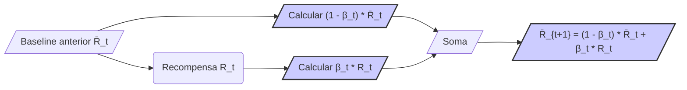
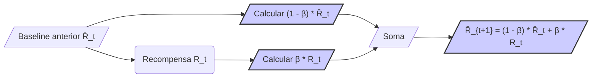

## Gradient Bandit Algorithms e a Média das Recompensas como Baseline

### Introdução
Este capítulo explora os **Gradient Bandit Algorithms**, uma abordagem alternativa para o aprendizado por reforço, focando em como eles utilizam um conceito fundamental: a média das recompensas como *baseline*. Diferentemente dos métodos que estimam valores de ação, os **Gradient Bandit Algorithms** aprendem preferências numéricas para cada ação, onde a probabilidade de selecionar uma ação é proporcional à sua preferência. O conceito de *baseline* desempenha um papel crucial nessa abordagem, permitindo que o algoritmo se adapte e melhore seu desempenho ao longo do tempo [^1].

### Conceitos Fundamentais
#### Preferências de Ação e Soft-Max
Em vez de estimar os valores de ação, $q_*(a)$, os **Gradient Bandit Algorithms** mantêm uma preferência numérica para cada ação $a$, denotada por $H_t(a)$. Estas preferências determinam as probabilidades de selecionar as ações através de uma distribuição **soft-max**, também conhecida como distribuição de *Gibbs* ou de *Boltzmann*. A probabilidade de selecionar uma ação $a$ no tempo $t$, denotada por $\pi_t(a)$, é dada por:

$$
\pi_t(a) = \frac{e^{H_t(a)}}{\sum_{b=1}^k e^{H_t(b)}}  \qquad (2.11)
$$
onde $k$ é o número total de ações [^1]. Inicialmente, todas as preferências são iguais ($H_1(a) = 0$), de modo que todas as ações têm probabilidades iguais de serem selecionadas.

> 💡 **Exemplo Numérico:** Suponha que temos três ações (k=3) e no tempo t=1, todas as preferências são H_1(a) = 0 para a=1,2,3. Então, a probabilidade de cada ação é:
>
> $\pi_1(1) = \frac{e^0}{e^0 + e^0 + e^0} = \frac{1}{3} \approx 0.333$
> $\pi_1(2) = \frac{e^0}{e^0 + e^0 + e^0} = \frac{1}{3} \approx 0.333$
> $\pi_1(3) = \frac{e^0}{e^0 + e^0 + e^0} = \frac{1}{3} \approx 0.333$
>
>  Inicialmente, todas as ações têm a mesma probabilidade de serem escolhidas.

#### Atualização das Preferências
Após selecionar uma ação $A_t$ e receber uma recompensa $R_t$, as preferências das ações são atualizadas com base em um processo de **stochastic gradient ascent**. A regra de atualização é definida por:

```mermaid
graph LR
    A[/"Ação A_t Selecionada"/] -->|/"Recompensa R_t"/| B("Calcular 'delta' = R_t - R̄_t");
    B --> C{/"A_t == a ?"/};
    C -- Sim --> D[/"H_{t+1}(A_t) = H_t(A_t) + α * delta * (1 - π_t(A_t))"/];
    C -- Não --> E[/"H_{t+1}(a) = H_t(a) - α * delta * π_t(a)"/];
    D --> F(/"Atualizar H_t(a)"/);
     E --> F;
    F --> G[/"Próximo passo"/];
    style B fill:#ccf,stroke:#333,stroke-width:2px
    style D fill:#ccf,stroke:#333,stroke-width:2px
        style E fill:#ccf,stroke:#333,stroke-width:2px
     style F fill:#ccf,stroke:#333,stroke-width:2px

```

$$
H_{t+1}(A_t) = H_t(A_t) + \alpha (R_t - \overline{R}_t) (1 - \pi_t(A_t))
$$
e
$$
H_{t+1}(a) = H_t(a) - \alpha (R_t - \overline{R}_t) \pi_t(a), \text{ para todo } a \neq A_t \qquad (2.12)
$$
onde $\alpha > 0$ é o parâmetro *step-size* que controla o tamanho da atualização, e $\overline{R}_t$ é a média das recompensas recebidas até o momento, que atua como *baseline* [^1].

> 💡 **Exemplo Numérico:** Considere que temos 3 ações e no tempo t=1, temos as preferências H_1(1) = 0.2, H_1(2) = 0.1, H_1(3) = -0.1. Suponha que a ação A_1 = 1 foi selecionada, e recebemos uma recompensa R_1 = 1. Inicialmente $\overline{R}_1 = R_1 = 1$. Usando $\alpha = 0.1$, e calculando as probabilidades com a equação (2.11):
>
> $\pi_1(1) = \frac{e^{0.2}}{e^{0.2} + e^{0.1} + e^{-0.1}} \approx \frac{1.221}{1.221+1.105+0.905} \approx 0.396$
> $\pi_1(2) = \frac{e^{0.1}}{e^{0.2} + e^{0.1} + e^{-0.1}} \approx \frac{1.105}{1.221+1.105+0.905} \approx 0.357$
> $\pi_1(3) = \frac{e^{-0.1}}{e^{0.2} + e^{0.1} + e^{-0.1}} \approx \frac{0.905}{1.221+1.105+0.905} \approx 0.292$
>
>  A atualização das preferências será:
>
> $H_{2}(1) = H_{1}(1) + \alpha (R_1 - \overline{R}_1) (1 - \pi_1(1)) = 0.2 + 0.1 * (1 - 1) * (1 - 0.396) = 0.2$
> $H_{2}(2) = H_{1}(2) - \alpha (R_1 - \overline{R}_1) \pi_1(2) = 0.1 - 0.1 * (1 - 1) * 0.357 = 0.1$
> $H_{2}(3) = H_{1}(3) - \alpha (R_1 - \overline{R}_1) \pi_1(3) = -0.1 - 0.1 * (1 - 1) * 0.292 = -0.1$
>
> Neste caso específico, como a recompensa é igual ao baseline, as preferências não se alteram. Contudo, no passo seguinte, caso a recompensa seja diferente do baseline, as preferências serão atualizadas de acordo.
>

**Proposição 1.** *A atualização das preferências pode ser expressa de forma unificada, utilizando o conceito do delta de Kronecker* $\delta_{A_t, a}$, que é igual a 1 se $A_t = a$ e 0 caso contrário. A atualização pode ser reescrita como:
$$
H_{t+1}(a) = H_t(a) + \alpha (R_t - \overline{R}_t) (\delta_{A_t, a} - \pi_t(a)) \qquad (2.13)
$$

*Demonstração:*
Quando $a = A_t$, o delta de Kronecker $\delta_{A_t, a}$ é igual a 1, e a atualização torna-se
$H_{t+1}(A_t) = H_t(A_t) + \alpha (R_t - \overline{R}_t) (1 - \pi_t(A_t))$, que é a primeira parte da equação (2.12). Quando $a \neq A_t$,  $\delta_{A_t, a} = 0$, e a atualização torna-se $H_{t+1}(a) = H_t(a) - \alpha (R_t - \overline{R}_t) \pi_t(a)$, que corresponde à segunda parte da equação (2.12). Portanto, a equação (2.13) é uma representação equivalente das equações (2.12).

#### A Importância do Baseline
O *baseline* $\overline{R}_t$ é um componente essencial da atualização das preferências no **Gradient Bandit Algorithm**. Ele fornece um ponto de referência para a recompensa atual, $R_t$. Se a recompensa obtida é maior que o *baseline* ($R_t > \overline{R}_t$), a preferência da ação selecionada $A_t$ é aumentada, incentivando sua seleção futura. Se a recompensa for menor que o *baseline* ($R_t < \overline{R}_t$), a preferência da ação selecionada é diminuída, desincentivando sua seleção futura. A lógica de usar o *baseline* faz com que as ações com recompensas acima da média sejam mais prováveis de serem selecionadas e as recompensas abaixo da média menos prováveis de serem selecionadas. As ações que não foram selecionadas se movem na direção oposta.

> 💡 **Exemplo Numérico:** Vamos continuar com o exemplo anterior. No passo t=2, suponha que a ação A_2 = 2 foi selecionada e a recompensa R_2 = 0.5. O baseline será atualizado (como veremos abaixo), e por enquanto vamos assumir que $\overline{R}_2=0.75$.  As preferências são atualizadas (usando $\alpha=0.1$) como:
>
> $H_{3}(1) = H_{2}(1) + \alpha (R_2 - \overline{R}_2) (\delta_{2,1} - \pi_2(1)) = 0.2 + 0.1 * (0.5 - 0.75) * (0 - \pi_2(1))$. Calculando $\pi_2(a)$:
>
>  Primeiro, com as preferências H_2(1)=0.2, H_2(2)=0.1, H_2(3)=-0.1:
>
> $\pi_2(1) = \frac{e^{0.2}}{e^{0.2} + e^{0.1} + e^{-0.1}} \approx 0.396$
> $\pi_2(2) = \frac{e^{0.1}}{e^{0.2} + e^{0.1} + e^{-0.1}} \approx 0.357$
> $\pi_2(3) = \frac{e^{-0.1}}{e^{0.2} + e^{0.1} + e^{-0.1}} \approx 0.292$
>
>  Agora podemos concluir o cálculo:
>
> $H_{3}(1) = 0.2 + 0.1 * (-0.25) * (-0.396) \approx 0.2 + 0.0099 = 0.2099$
> $H_{3}(2) = 0.1 + 0.1 * (-0.25) * (1 - 0.357) \approx 0.1 - 0.016 = 0.084$
> $H_{3}(3) = -0.1 + 0.1 * (-0.25) * (0- 0.292) \approx -0.1 + 0.0073 = -0.0927$
>
> Como a recompensa da ação 2 foi menor que o baseline, a preferência da ação 2 diminuiu, e as preferências das outras ações aumentaram, proporcionalmente à probabilidade de escolha de cada uma.

#### Cálculo Incremental do Baseline
O cálculo de $\overline{R}_t$  é realizado de forma incremental, semelhante ao método usado para as estimativas de valores de ação. Embora o texto não forneça uma fórmula específica para o cálculo incremental do baseline no contexto do Gradiente Bandido, o texto indica que o cálculo incremental de média de recompensas pode ser usado [^1]. Portanto, é possível usar uma fórmula semelhante à equação (2.3), com um passo adaptado para a média de recompensas:


$$
\overline{R}_{t+1} = \overline{R}_t + \frac{1}{t} (R_t - \overline{R}_t)
$$
onde, inicialmente, $\overline{R}_1=R_1$.
O uso de um cálculo incremental garante que a complexidade computacional por passo seja constante, o que é eficiente para problemas com um grande número de passos [^1]. Alternativamente, pode-se utilizar também uma média ponderada exponencial para o baseline, similar à utilizada para o cálculo dos valores de ação em problemas não estacionários, o que também resultaria em um baseline com constante complexidade de tempo.

> 💡 **Exemplo Numérico:**  Usando as recompensas dos exemplos anteriores, temos $R_1 = 1$ e $R_2 = 0.5$. Inicialmente, $\overline{R}_1 = R_1 = 1$. Então:
>
> $\overline{R}_2 = \overline{R}_1 + \frac{1}{2} (R_2 - \overline{R}_1) = 1 + \frac{1}{2} (0.5 - 1) = 1 - 0.25 = 0.75$.
>
>  Este é o valor de baseline usado no exemplo anterior.
>
>  Agora, suponha que no passo t=3 a recompensa seja R_3= 1.2. Então:
>  $\overline{R}_3 = \overline{R}_2 + \frac{1}{3} (R_3 - \overline{R}_2) = 0.75 + \frac{1}{3} (1.2 - 0.75) = 0.75 + \frac{0.45}{3} = 0.75 + 0.15 = 0.9$
>
> O baseline se ajusta incrementalmente às recompensas recebidas.

**Lema 1.** *A média incremental de recompensas $\overline{R}_{t+1}$ pode ser expressa de forma recursiva utilizando um fator de decaimento $\beta_t = \frac{1}{t}$, como:*



$$
\overline{R}_{t+1} = (1-\beta_t)\overline{R}_t + \beta_t R_t
$$

*Demonstração:*
Reorganizando a fórmula incremental $\overline{R}_{t+1} = \overline{R}_t + \frac{1}{t} (R_t - \overline{R}_t)$, temos:

$\overline{R}_{t+1} = \overline{R}_t + \frac{1}{t}R_t - \frac{1}{t}\overline{R}_t$

$\overline{R}_{t+1} = \overline{R}_t(1 - \frac{1}{t}) + \frac{1}{t}R_t $

Fazendo $\beta_t = \frac{1}{t}$, obtemos a forma recursiva:

$\overline{R}_{t+1} = (1-\beta_t)\overline{R}_t + \beta_t R_t$

**Observação:** Esta forma recursiva explicita como a média de recompensas $\overline{R}_{t+1}$ é uma média ponderada entre a média anterior $\overline{R}_t$ e a recompensa atual $R_t$, com o fator de decaimento $\beta_t$ dando mais peso para a recompensa atual no início do aprendizado e decaindo com o tempo.

**Teorema 1.** *O baseline $\overline{R}_t$ pode ser generalizado utilizando um fator de decaimento $\beta \in [0, 1]$ para uma média ponderada exponencial, resultando em:*


$$
\overline{R}_{t+1} = (1-\beta)\overline{R}_t + \beta R_t
$$
*Este tipo de baseline oferece maior flexibilidade e é mais apropriado para problemas não estacionários.*

*Demonstração:*
A forma generalizada do baseline corresponde a uma média ponderada exponencial, onde o fator de decaimento $\beta$ permite que o baseline se adapte mais rapidamente a mudanças na distribuição de recompensas, ao dar maior peso às recompensas mais recentes. Quando $\beta = \frac{1}{t}$ , temos o cálculo incremental clássico. Para um $\beta$ constante, o baseline passa a ser uma média exponencialmente ponderada das recompensas, dando mais peso às recompensas recentes.

> 💡 **Exemplo Numérico:**  Usando as recompensas anteriores, $R_1 = 1$, $R_2 = 0.5$, e $R_3 = 1.2$. Vamos usar um $\beta = 0.2$ para uma média ponderada exponencial. Inicialmente, $\overline{R}_1 = R_1 = 1$:
>
> $\overline{R}_2 = (1-0.2)\overline{R}_1 + 0.2 * R_2 = 0.8 * 1 + 0.2 * 0.5 = 0.8 + 0.1 = 0.9$
> $\overline{R}_3 = (1-0.2)\overline{R}_2 + 0.2 * R_3 = 0.8 * 0.9 + 0.2 * 1.2 = 0.72 + 0.24 = 0.96$
>
> Comparando com o cálculo incremental, temos $\overline{R}_2 = 0.75$ e  $\overline{R}_3 = 0.9$ no exemplo anterior.  A média ponderada exponencial com $\beta=0.2$ reage mais rapidamente às mudanças, pois dá mais peso às recompensas recentes. Para $\beta=0.2$, a média ponderada exponencial atribui 20% de peso à recompensa atual e 80% ao valor anterior do baseline, resultando numa média que rapidamente se ajusta a variações nas recompensas. Em contraste, o método incremental, com $\beta_t = 1/t$, diminui gradualmente a importância de novas recompensas no cálculo da média, tornando-o mais estável, mas também mais lento para se adaptar a mudanças. Em problemas não estacionários, onde a distribuição de recompensas pode mudar ao longo do tempo, a média ponderada exponencial com $\beta$ constante pode ser mais adequada, pois é mais responsiva a variações recentes.

#### Derivação da Atualização das Preferências
O texto também aborda a derivação da atualização das preferências, mostrando como ela se relaciona com o conceito de **stochastic gradient ascent**. A atualização das preferências,  dada por (2.12), é uma aproximação da atualização de gradient descent que utiliza o gradiente da recompensa esperada $E[R_t]$ em relação à preferência da ação $H_t(a)$. O gradiente da recompensa esperada é dado por:

$$
\frac{\partial E[R_t]}{\partial H_t(a)} = \sum_x \pi_t(x) (q_*(x) - \overline{R}_t) \frac{\partial \pi_t(x)}{\partial H_t(a)}
$$

A análise do texto detalha como a atualização (2.12) se torna uma aproximação do gradient ascent ao substituir o valor da ação $q_*(x)$ pela recompensa $R_t$ e ao expressar a derivada de $\pi_t(x)$ em relação a $H_t(a)$ explicitamente. Assim, pode-se concluir que o uso do *baseline* $\overline{R}_t$ não afeta o valor esperado da atualização, mas reduz a sua variância. A demonstração completa, apesar de complexa, está presente no texto [^1].

**Lema 2.** *A derivada da probabilidade $\pi_t(x)$ em relação à preferência $H_t(a)$ pode ser expressa como:*

```mermaid
graph LR
    A[/"Probabilidade π_t(x)"/] --> B{/"x == a ?"/};
    B -- Sim --> C[/"π_t(x) * (1 - π_t(a))"/];
    B -- Não --> D[/"- π_t(x) * π_t(a)"/];
    C --> E[/"Resultado"/]
    D --> E
    style C fill:#ccf,stroke:#333,stroke-width:2px
       style D fill:#ccf,stroke:#333,stroke-width:2px
```

$$
\frac{\partial \pi_t(x)}{\partial H_t(a)} = \pi_t(x) (\delta_{x,a} - \pi_t(a))
$$

*Demonstração:*
Utilizando a regra da cadeia e a definição de $\pi_t(x)$ na equação (2.11), temos:

$$
\frac{\partial \pi_t(x)}{\partial H_t(a)} = \frac{\partial}{\partial H_t(a)} \frac{e^{H_t(x)}}{\sum_{b=1}^k e^{H_t(b)}}
$$

Se $x = a$, então:

$$
\frac{\partial \pi_t(x)}{\partial H_t(a)} = \frac{e^{H_t(a)} \sum_{b=1}^k e^{H_t(b)} - e^{H_t(a)}e^{H_t(a)}}{(\sum_{b=1}^k e^{H_t(b)})^2} = \frac{e^{H_t(a)}}{\sum_{b=1}^k e^{H_t(b)}} \left( 1 -  \frac{e^{H_t(a)}}{\sum_{b=1}^k e^{H_t(b)}} \right) = \pi_t(a)(1-\pi_t(a))
$$

Se $x \neq a$, então:
$$
\frac{\partial \pi_t(x)}{\partial H_t(a)} = \frac{0 - e^{H_t(x)}e^{H_t(a)}}{(\sum_{b=1}^k e^{H_t(b)})^2} = - \frac{e^{H_t(x)}}{\sum_{b=1}^k e^{H_t(b)}} \frac{e^{H_t(a)}}{\sum_{b=1}^k e^{H_t(b)}} = -\pi_t(x)\pi_t(a)
$$
Combinando os casos, obtemos:
$$
\frac{\partial \pi_t(x)}{\partial H_t(a)} = \pi_t(x) (\delta_{x,a} - \pi_t(a))
$$

**Teorema 2.** *Substituindo a derivada de* $\pi_t(x)$ *na expressão do gradiente da recompensa esperada e usando a aproximação de substituir* $q_*(x)$ *por* $R_t$, *é possível derivar a atualização das preferências na equação (2.13).*

*Demonstração:*
Substituindo o resultado do Lema 2 na expressão do gradiente, temos:

$$
\frac{\partial E[R_t]}{\partial H_t(a)} = \sum_x \pi_t(x) (q_*(x) - \overline{R}_t) \pi_t(x) (\delta_{x,a} - \pi_t(a))
$$
Aproximando $q_*(x)$ por $R_t$, temos
$$
\frac{\partial E[R_t]}{\partial H_t(a)} \approx \sum_x \pi_t(x) (R_t - \overline{R}_t) (\delta_{x,a} - \pi_t(a))
$$
Na soma acima, o termo $(R_t - \overline{R}_t)$ é constante em relação a $x$, e a soma sobre todas as ações é igual a zero quando  $x \neq A_t$, e igual a 1 quando $x = A_t$

$$
\frac{\partial E[R_t]}{\partial H_t(a)} \approx  (R_t - \overline{R}_t) \sum_x \pi_t(x) (\delta_{x,a} - \pi_t(a))
$$
$$
\frac{\partial E[R_t]}{\partial H_t(a)} \approx  (R_t - \overline{R}_t) (\delta_{A_t,a} - \pi_t(a))
$$
Finalmente, aplicando um passo de tamanho $\alpha$, a atualização das preferências fica:

$$
H_{t+1}(a) = H_t(a) + \alpha (R_t - \overline{R}_t) (\delta_{A_t, a} - \pi_t(a))
$$
Que é a atualização mostrada na equação (2.13)

### Conclusão
O uso de uma média das recompensas como *baseline* nos **Gradient Bandit Algorithms** é um conceito fundamental para seu funcionamento. A linha de base fornece um ponto de referência para avaliar o quão boa é uma recompensa, permitindo que o algoritmo se ajuste e aprenda de forma eficaz. O algoritmo ajusta as preferências de ação, com base na comparação entre as recompensas recebidas e o valor médio acumulado das recompensas. Este mecanismo de comparação possibilita uma atualização mais precisa, e consequentemente uma convergência mais rápida do algoritmo. Embora o uso de um *baseline* seja crítico, a escolha de como calculá-lo (seja de forma incremental ou com uma média ponderada exponencial) não afeta o fato de que o algoritmo é uma instância de *stochastic gradient ascent*, garantindo que o algoritmo tenha boas propriedades de convergência. A utilização da notação delta de Kronecker para descrever a atualização das preferências e a derivação do cálculo da derivada da probabilidade em relação às preferências, demonstram a base matemática da atualização das preferências em direção ao máximo da recompensa esperada.

### Referências
[^1]: "So far in this chapter we have considered methods that estimate action values and use those estimates to select actions. This is often a good approach, but it is not the only one possible. In this section we consider learning a numerical preference for each action a, which we denote Hł(a) ∈ R. The larger the preference, the more often that action is taken, but the preference has no interpretation in terms of reward. Only the relative preference of one action over another is important; if we add 1000 to all the action preferences there is no effect on the action probabilities, which are determined according to a soft-max distribution (i.e., Gibbs or Boltzmann distribution) as follows:
Pr{At=a} =
eHt(a)
Σ=1eHt(b)
k
= πτ(α),
where here we have also introduced a useful new notation, πι(α), for the probability of taking action a at time t. Initially all action preferences are the same (e.g., H₁(a) = 0, for all a) so that all actions have an equal probability of being selected.
There is a natural learning algorithm for soft-max action preferences based on the idea of stochastic gradient ascent. On each step, after selecting action Ať and receiving the reward Rt, the action preferences are updated by:
Ht+1(At) = Ht(At) + a(Rt – Rt) (1 – πτ(At)),
Ht+1(a) = H+(a) – α(Rt – Rt)πι(α),
and
for all a ≠ At,
where a > 0 is a step-size parameter, and Rt ∈ R is the average of the rewards up to but not including time t (with R₁ = R₁), which can be computed incrementally as described in Section 2.4 (or Section 2.5 if the problem is nonstationary). The Rt term serves as a baseline with which the reward is compared. If the reward is higher than the baseline, then the probability of taking At in the future is increased, and if the reward is below baseline, then the probability is decreased. The non-selected actions move in the opposite direction." *(Trecho de /content/reinforcement_learning_notes/01. Multi-armed Bandits)*
