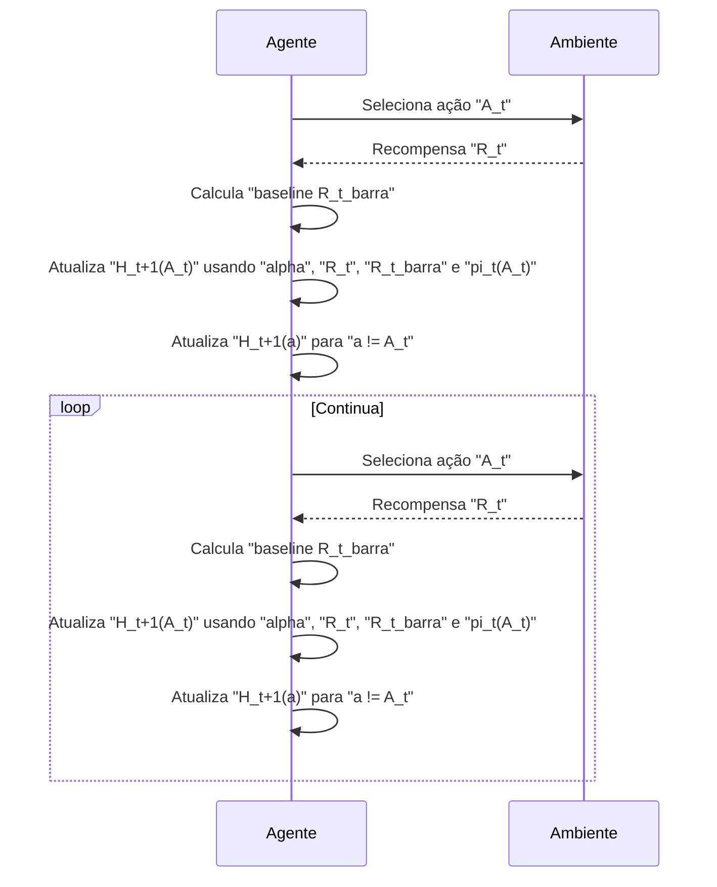
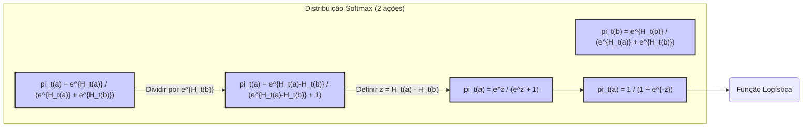
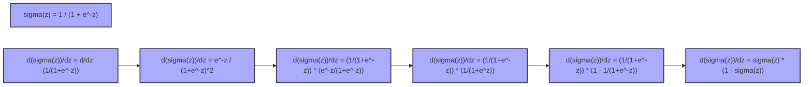
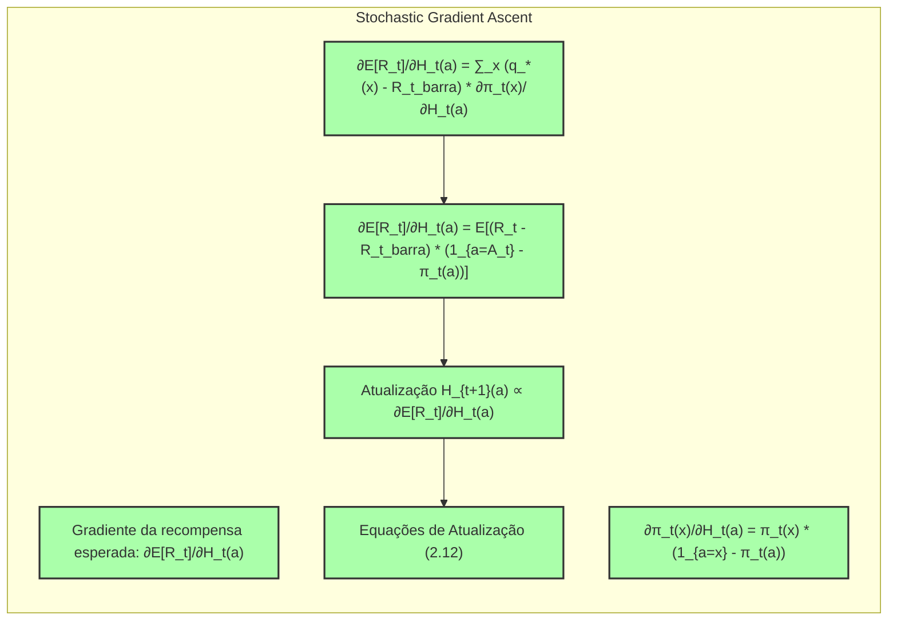
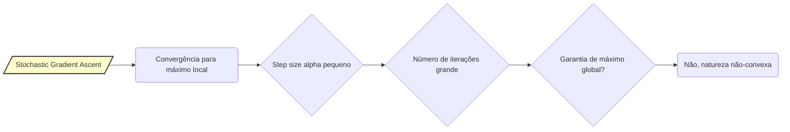
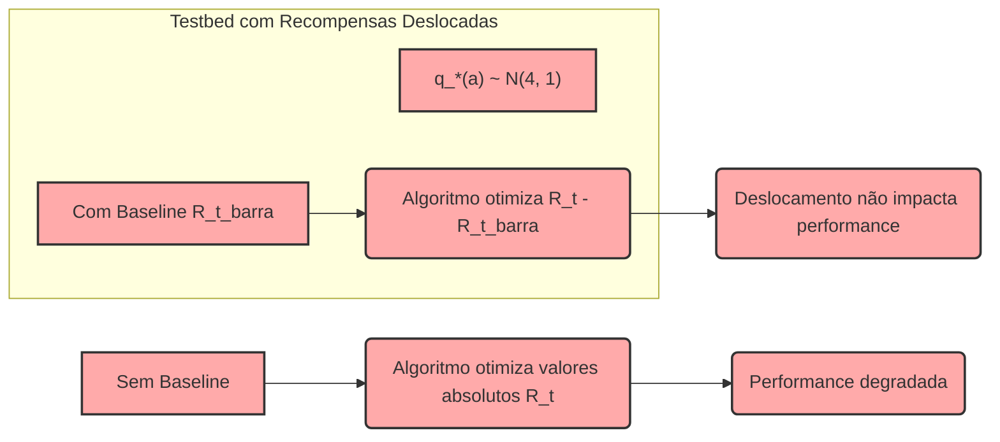
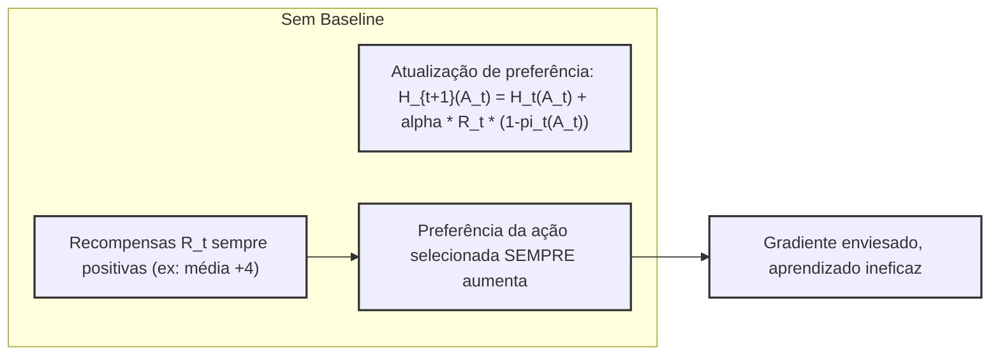

### Gradient Bandit Algorithms com Recompensas Deslocadas

### Introdução
Este capítulo explora o conceito de **Multi-armed Bandits** (MAB) e métodos para equilibrar exploração e explotação. Uma dessas abordagens é o **Gradient Bandit Algorithm**, que não estima valores de ação diretamente, mas sim preferências de ação. Essas preferências são usadas para determinar probabilidades de ação através de uma distribuição softmax [^1]. Este método será o foco principal desta seção, especialmente quando aplicado a uma variante do testbed de 10 braços.

### Conceitos Fundamentais
O **Gradient Bandit Algorithm** aprende preferências numéricas $H_t(a) \in \mathbb{R}$ para cada ação $a$. A probabilidade de selecionar uma ação é determinada pela distribuição **soft-max**, também conhecida como distribuição de Gibbs ou Boltzmann [^1]:

$$
Pr\{A_t = a\} = \frac{e^{H_t(a)}}{\sum_{b=1}^{k} e^{H_t(b)}} = \pi_t(a) \quad (2.11)
$$

onde $k$ é o número total de ações, e $\pi_t(a)$ representa a probabilidade de selecionar a ação $a$ no tempo $t$. Inicialmente, as preferências de todas as ações são iguais, por exemplo, $H_1(a) = 0$ para todo $a$, garantindo que todas as ações tenham a mesma probabilidade de serem selecionadas [^1].

> 💡 **Exemplo Numérico:** Vamos considerar um cenário com 3 ações (k=3). Inicialmente, $H_1(a_1) = H_1(a_2) = H_1(a_3) = 0$. Usando a equação (2.11), a probabilidade de selecionar cada ação no tempo t=1 é:
>
> $\pi_1(a_1) = \frac{e^0}{e^0 + e^0 + e^0} = \frac{1}{3} \approx 0.333$
> $\pi_1(a_2) = \frac{e^0}{e^0 + e^0 + e^0} = \frac{1}{3} \approx 0.333$
> $\pi_1(a_3) = \frac{e^0}{e^0 + e^0 + e^0} = \frac{1}{3} \approx 0.333$
>
> Todas as ações têm igual probabilidade de serem selecionadas no início.

```mermaid
flowchart LR
    A[/"Ações (a)"/] --> B("H_1(a) = 0 para todas as ações")
    B --> C{/"Calcular Probabilidade pi_1(a)"/};
     C --> D("pi_1(a) = 1/k")
    D --> E("Todas ações equiprováveis");
    style A fill:#f9f,stroke:#333,stroke-width:2px
```

#### Atualização das Preferências
As preferências de ação são atualizadas usando um método de **stochastic gradient ascent**. Após selecionar a ação $A_t$ e receber a recompensa $R_t$, as preferências são atualizadas da seguinte forma [^1]:

$$
H_{t+1}(A_t) = H_t(A_t) + \alpha(R_t - \bar{R}_t)(1 - \pi_t(A_t)) \quad \text{e} \\
H_{t+1}(a) = H_t(a) - \alpha(R_t - \bar{R}_t)\pi_t(a) \quad \text{para todo } a \ne A_t \quad (2.12)
$$

Aqui, $\alpha > 0$ é o **step-size parameter**, que controla o tamanho do ajuste nas preferências, e $\bar{R}_t$ é a média das recompensas até o tempo $t$, excluindo a recompensa do tempo $t$. $\bar{R}_t$ serve como uma **baseline** com a qual a recompensa $R_t$ é comparada. Se a recompensa é maior que a baseline, a probabilidade de escolher $A_t$ no futuro é aumentada. Se a recompensa é menor que a baseline, a probabilidade é diminuída [^1].

> 💡 **Exemplo Numérico:** Suponha que temos 3 ações, com preferências iniciais $H_1(a_1) = 0.1$, $H_1(a_2) = 0.2$, e $H_1(a_3) = -0.1$.  O parâmetro de step-size $\alpha = 0.1$.
>
> 1.  **Cálculo das probabilidades iniciais:**
>
> $\pi_1(a_1) = \frac{e^{0.1}}{e^{0.1} + e^{0.2} + e^{-0.1}} = \frac{1.105}{1.105 + 1.221 + 0.905} \approx 0.35$
> $\pi_1(a_2) = \frac{e^{0.2}}{e^{0.1} + e^{0.2} + e^{-0.1}} = \frac{1.221}{1.105 + 1.221 + 0.905} \approx 0.39$
> $\pi_1(a_3) = \frac{e^{-0.1}}{e^{0.1} + e^{0.2} + e^{-0.1}} = \frac{0.905}{1.105 + 1.221 + 0.905} \approx 0.26$
>
> 2.  **Seleção da ação:** Suponha que a ação selecionada no tempo t=1 foi $a_2$ e a recompensa obtida foi $R_1 = 1$, e a baseline anterior $\bar{R}_1 = 0.5$.
>
> 3.  **Atualização das preferências:**
>
> $H_2(a_2) = 0.2 + 0.1(1-0.5)(1-0.39) \approx 0.2 + 0.1*0.5*0.61 = 0.2305$
>
> $H_2(a_1) = 0.1 - 0.1(1-0.5)(0.35) \approx 0.1 - 0.1*0.5*0.35 =  0.0825$
>
> $H_2(a_3) = -0.1 - 0.1(1-0.5)(0.26) \approx -0.1 - 0.1*0.5*0.26= -0.113$
>
> Observe que a preferência da ação $a_2$ aumentou, pois a recompensa foi maior que a baseline, enquanto as preferências de $a_1$ e $a_3$ diminuíram.



**Observação 1:** É importante notar que a atualização das preferências, como definida em (2.12), preserva a propriedade de que a soma das probabilidades de todas as ações é sempre igual a 1. Isso ocorre porque o aumento na preferência da ação selecionada é compensado pela diminuição nas preferências das outras ações, garantindo que a distribuição de probabilidade soft-max permaneça válida em todos os momentos. Além disso, esta atualização garante que as preferências serão sempre números reais, mesmo após repetidas aplicações.

#### Lemma 1
Em um cenário de duas ações, a distribuição soft-max é equivalente à função logística, também conhecida como função sigmóide, usada em estatística e redes neurais artificiais [^1].

*Prova:*
Seja $k = 2$ e as duas ações $a$ e $b$. Então,
$$
\pi_t(a) = \frac{e^{H_t(a)}}{e^{H_t(a)} + e^{H_t(b)}}
$$
e
$$
\pi_t(b) = \frac{e^{H_t(b)}}{e^{H_t(a)} + e^{H_t(b)}} = 1 - \pi_t(a)
$$
Se dividirmos o numerador e o denominador de $\pi_t(a)$ por $e^{H_t(b)}$ teremos:
$$
\pi_t(a) = \frac{e^{H_t(a) - H_t(b)}}{e^{H_t(a) - H_t(b)} + 1}
$$
Definindo $z = H_t(a) - H_t(b)$, temos:
$$
\pi_t(a) = \frac{e^z}{e^z + 1} = \frac{1}{1 + e^{-z}}
$$
que é a forma da função logística. $\blacksquare$

> 💡 **Exemplo Numérico:** Considere duas ações, a e b, com preferências $H_t(a) = 1$ e $H_t(b) = -1$. Então, $z = H_t(a) - H_t(b) = 1 - (-1) = 2$.
>
> Usando a função logística, a probabilidade de selecionar a ação 'a' é:
>
> $\pi_t(a) = \frac{1}{1 + e^{-2}} \approx \frac{1}{1 + 0.135} \approx 0.88$
>
> A probabilidade de selecionar a ação 'b' é:
>
> $\pi_t(b) = 1 - \pi_t(a) \approx 1 - 0.88 = 0.12$
>
> A ação 'a' tem uma probabilidade muito maior de ser selecionada. Isso demonstra como a diferença nas preferências se traduz em probabilidades através da função logística.



**Lemma 1.1:** A função logística, como derivada no Lemma 1, possui uma propriedade importante: sua derivada é dada por $\sigma(z)(1-\sigma(z))$, onde $\sigma(z) = \frac{1}{1 + e^{-z}}$. Esta propriedade é essencial na derivação de muitos algoritmos de aprendizado de máquina, incluindo o algoritmo de backpropagation em redes neurais.
*Proof:*
Seja $\sigma(z) = \frac{1}{1+e^{-z}}$. Então,
$$
\frac{d\sigma(z)}{dz} = \frac{d}{dz} \left( \frac{1}{1+e^{-z}} \right) = \frac{0 - (-e^{-z})}{(1+e^{-z})^2} = \frac{e^{-z}}{(1+e^{-z})^2} = \frac{1}{1+e^{-z}}\frac{e^{-z}}{1+e^{-z}}
$$
Multiplicando e dividindo por $e^z$, obtemos
$$
\frac{d\sigma(z)}{dz} = \frac{1}{1+e^{-z}}\frac{1}{1+e^{z}} = \frac{1}{1+e^{-z}} \left( 1- \frac{1}{1+e^{-z}} \right) = \sigma(z)(1-\sigma(z))
$$
$\blacksquare$



#### Corolário 1
O ajuste das preferências no algoritmo gradiente de bandido, de acordo com a equação (2.12), constitui uma instância de stochastic gradient ascent, onde a direção do ajuste é um passo na direção do gradiente da recompensa esperada [^1].

*Prova:*
A prova de que o algoritmo de bandido gradiente é uma instância de stochastic gradient ascent está detalhada no texto, utilizando um cálculo de derivada parcial, para chegar na mesma equação (2.12).

O gradiente da recompensa esperada é dada por:
$$ \frac{\partial E[R_t]}{\partial H_t(a)} = \sum_x \left(q_*(x) - \bar{R}_t\right) \frac{\partial \pi_t(x)}{\partial H_t(a)} $$
e foi demonstrado que $\frac{\partial \pi_t(x)}{\partial H_t(a)} = \pi_t(x) \left( 1_{a=x} - \pi_t(a) \right)$, então:
$$ \frac{\partial E[R_t]}{\partial H_t(a)} =  \mathbb{E} \left[ (R_t - \bar{R}_t) (1_{a=A_t} - \pi_t(a)) \right] $$
Ao substituir essa equação em um método de stochastic gradient ascent, chegamos nas equações de atualização (2.12). $\blacksquare$



**Corolário 1.1** Uma consequência direta do fato de que o algoritmo de gradiente de bandido é uma forma de stochastic gradient ascent, é que, sob certas condições (como um step size $\alpha$ adequadamente pequeno e um número suficientemente grande de iterações), ele deve convergir para um máximo local da recompensa esperada. No entanto, devido à natureza não convexa do problema, não há garantia de que ele convergiria para o máximo global.

> 💡 **Exemplo Numérico:** Imagine que, após várias iterações, o algoritmo de bandido gradiente encontrou um conjunto de preferências onde a recompensa esperada é relativamente alta, mas não necessariamente a mais alta possível. Suponha que, neste estado, as preferências e probabilidades sejam as seguintes:
>
> Ações: $a_1$, $a_2$, $a_3$
>
> Preferências: $H(a_1) = 2.1$, $H(a_2) = 1.8$, $H(a_3) = 0.9$
>
> Probabilidades: $\pi(a_1) \approx 0.50$, $\pi(a_2) \approx 0.30$, $\pi(a_3) \approx 0.20$
>
> Recompensa Esperada Atual: $E[R] = 10$ (em uma escala arbitrária)
>
> Este ponto pode ser um máximo local. Mesmo que exista outro conjunto de preferências que leve a uma recompensa esperada de 12, o algoritmo pode não ser capaz de chegar até ele com um step size muito pequeno, uma vez que ele vai otimizar a recompensa atual ao invés de explorar um espaço mais amplo de soluções. O algoritmo tenderá a melhorar as preferências atuais, levando a pequenos ajustes em torno do máximo local, mas não a uma mudança drástica para o máximo global.



### Aplicação em um Testbed com Recompensas Deslocadas
Uma variante do **10-armed testbed** é utilizada para testar o Gradient Bandit Algorithm. Nesta variante, as recompensas esperadas $q_*(a)$ são selecionadas a partir de uma distribuição normal com média +4 em vez de 0, como no testbed original [^1]. Este deslocamento nas recompensas não tem impacto no desempenho do Gradient Bandit Algorithm devido ao uso do termo *reward baseline* ($\bar{R}_t$) [^1].

A baseline adapta-se instantaneamente ao novo nível de recompensa, permitindo que o algoritmo funcione de forma eficaz independentemente do deslocamento das recompensas. A figura 2.5 [^1] mostra os resultados do algoritmo com e sem a baseline.  O uso da baseline é crucial para o desempenho do algoritmo em um cenário de recompensas deslocadas; sem ela, o algoritmo tem um desempenho significativamente pior.

> 💡 **Exemplo Numérico:** Num testbed de 10 braços com recompensas deslocadas, suponha que as recompensas esperadas de cada braço são geradas por uma distribuição normal com média +4 e desvio padrão 1. O braço 1 pode ter uma recompensa média de 4.2, o braço 2 de 3.8, o braço 3 de 4.5 e assim por diante. Sem a baseline, o algoritmo tentaria otimizar os valores absolutos das recompensas. No entanto, com a baseline $\bar{R}_t$, o algoritmo otimiza a diferença entre a recompensa obtida e a média de recompensas anteriores. Isso significa que, mesmo que as recompensas estejam todas deslocadas para cima, o algoritmo ainda procura as ações que proporcionam recompensas acima da média atual. Por exemplo, se a baseline fosse 4, e o algoritmo escolhesse o braço 3 com recompensa 4.7, a recompensa de 0.7 acima da baseline seria usada para ajustar as preferências, independentemente do deslocamento das recompensas.



**Proposição 1:** O desempenho do Gradient Bandit Algorithm em um cenário de recompensas deslocadas sem a baseline pode ser interpretado como um problema de otimização onde o sinal do gradiente é enviesado. A ausência da baseline faz com que o algoritmo aprenda as recompensas absolutas, em vez das recompensas relativas à média. Consequentemente, o sinal do gradiente pode apontar na direção errada, levando a um aprendizado ineficaz.
*Proof:*
Quando a baseline não é usada, a atualização das preferências se torna:
$$ H_{t+1}(A_t) = H_t(A_t) + \alpha R_t(1 - \pi_t(A_t)) $$
$$ H_{t+1}(a) = H_t(a) - \alpha R_t\pi_t(a) \quad \text{para todo } a \ne A_t $$
Neste caso, o termo $R_t$ não é comparado com uma média móvel das recompensas anteriores, mas sim com zero. Em um cenário de recompensas deslocadas onde as recompensas esperadas $q_*(a)$ são sempre positivas (por exemplo, com média +4), o termo $R_t$ será sempre positivo. Isto leva ao algoritmo a sempre aumentar a probabilidade da ação selecionada, sem levar em consideração se essa ação foi melhor ou pior que a média. Consequentemente, o algoritmo não consegue convergir para as melhores ações, uma vez que o sinal da atualização estará sempre enviesado para cima. $\blacksquare$

> 💡 **Exemplo Numérico:** Voltando ao exemplo do testbed de 10 braços com recompensas médias de +4, sem a baseline, o algoritmo sempre recebe uma recompensa positiva. Suponha que, em uma iteração, a ação $a_1$ é selecionada e gera uma recompensa $R_t = 4.5$. Sem a baseline, a atualização de preferência de $a_1$ seria:
>
> $H_{t+1}(a_1) = H_t(a_1) + \alpha \cdot 4.5 \cdot (1 - \pi_t(a_1))$
>
> Como $4.5$ é sempre positivo, a preferência de $a_1$ sempre aumenta, independentemente de a recompensa ser melhor ou pior que a média. Mesmo se outra ação tivesse uma recompensa média de 4.8, o algoritmo sem baseline não ajustaria as preferências corretamente para a ação melhor, porque todas as recompensas são positivas e levam a incrementos na preferência da ação escolhida. Isso impede o algoritmo de aprender a diferença relativa entre as ações, levando a um aprendizado ineficaz.
>



### Conclusão
O Gradient Bandit Algorithm oferece uma abordagem eficaz para resolver problemas de MAB, especialmente quando adaptado com uma reward baseline. A capacidade de usar preferências de ação, em vez de valores de ação, e ajustar essas preferências com base no gradiente da recompensa esperada, torna o algoritmo adaptável a diferentes cenários de recompensa. A baseline desempenha um papel vital, adaptando-se a mudanças nos níveis de recompensa e garantindo um bom desempenho, mesmo com recompensas esperadas deslocadas, como demonstrado na variante do testbed de 10 braços.

### Referências
[^1]: "So far in this chapter we have considered methods that estimate action values and use those estimates to select actions. This is often a good approach, but it is not the only one possible. In this section we consider learning a numerical preference for each action a, which we denote Hł(a) ∈ R. The larger the preference, the more often that action is taken, but the preference has no interpretation in terms of reward. Only the relative preference of one action over another is important; if we add 1000 to all the action preferences there is no effect on the action probabilities, which are determined according to a soft-max distribution (i.e., Gibbs or Boltzmann distribution) as follows: ... where here we have also introduced a useful new notation, πτ(α), for the probability of taking action a at time t. Initially all action preferences are the same (e.g., H₁(a) = 0, for all a) so that all actions have an equal probability of being selected." *(Trecho de Chapter 2: Multi-armed Bandits)*
[^2]: "Show that in the case of two actions, the soft-max distribution is the same as that given by the logistic, or sigmoid, function often used in statistics and artificial neural networks." *(Trecho de Chapter 2: Multi-armed Bandits)*
[^3]: "There is a natural learning algorithm for soft-max action preferences based on the idea of stochastic gradient ascent. On each step, after selecting action Ať and receiving the reward Rt, the action preferences are updated by: ... where a > 0 is a step-size parameter, and Rt ∈ R is the average of the rewards up to but not including time t (with R₁ = R₁), which can be computed incrementally as described in Section 2.4 (or Section 2.5 if the problem is nonstationary).1 The Rt term serves as a baseline with which the reward is compared. If the reward is higher than the baseline, then the probability of taking At in the future is increased, and if the reward is below baseline, then the probability is decreased. The non-selected actions move in the opposite direction." *(Trecho de Chapter 2: Multi-armed Bandits)*
[^4]: "Figure 2.5 shows results with the gradient bandit algorithm on a variant of the 10-armed testbed in which the true expected rewards were selected according to a normal distribution with a mean of +4 instead of zero (and with unit variance as before). This shifting up of all the rewards has absolutely no effect on the gradient bandit algorithm because of the reward baseline term, which instantaneously adapts to the new level. But if the baseline were omitted (that is, if Rt was taken to be constant zero in (2.12)), then performance would be significantly degraded, as shown in the figure." *(Trecho de Chapter 2: Multi-armed Bandits)*
[^5]: "One can gain a deeper insight into the gradient bandit algorithm by understanding it as a stochastic approximation to gradient ascent. In exact gradient ascent, each action preference Hł(a) would be incremented in proportion to the increment's effect on performance: ..." *(Trecho de Chapter 2: Multi-armed Bandits)*
[^6]: "The equation is now in the form of an expectation, summing over all possible values x of the random variable At, then multiplying by the probability of taking those values. Thus: ..." *(Trecho de Chapter 2: Multi-armed Bandits)*
[^7]:  "Recall that our plan has been to write the performance gradient as an expectation of something that we can sample on each step, as we have just done, and then update on each step in proportion to the sample. Substituting a sample of the expectation above for the performance gradient in (2.13) yields: ...  for all a, which you may recognize as being equivalent to our original algorithm (2.12)." *(Trecho de Chapter 2: Multi-armed Bandits)*
[^8]: "Thus it remains only to show that
θπt(x)
θHt(a)
= πt(x)(1a=x – πt(a)), as we assumed." *(Trecho de Chapter 2: Multi-armed Bandits)*
