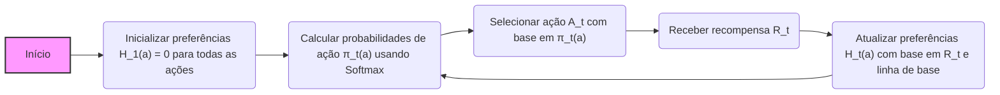
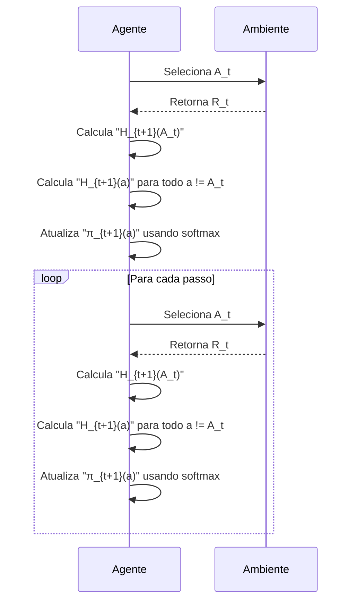
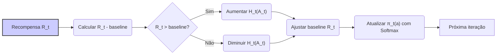
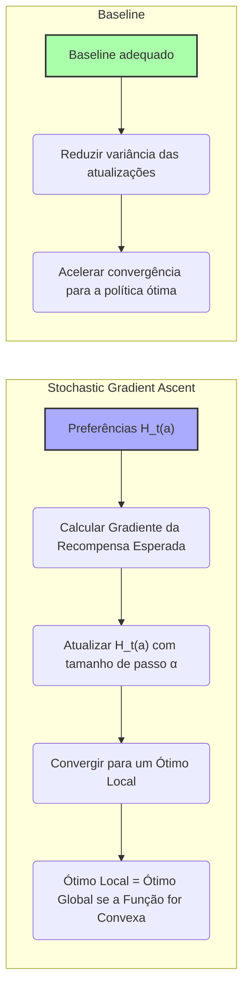

## Gradient Bandit Algorithms: Adaptação Instantânea com Linha de Base de Recompensa
### Introdução
O aprendizado por reforço se distingue de outras formas de aprendizado por usar informações de treinamento que avaliam as ações tomadas, em vez de instruir por meio de ações corretas [^1]. Isso introduz a necessidade de exploração ativa, buscando explicitamente um bom comportamento. Este capítulo foca no aspecto avaliativo do aprendizado por reforço em um cenário simplificado, o problema do **k-armed bandit**, onde o objetivo é maximizar a recompensa esperada total ao longo do tempo por meio de tentativas e erros [^1]. Os algoritmos de *action-value*, que estimam os valores das ações, são uma abordagem comum para resolver este problema [^3]. Contudo, esta seção foca em uma abordagem alternativa: aprender preferências numéricas para cada ação, usando o algoritmo de *gradient bandit* e como ele usa a linha de base de recompensa para adaptação instantânea a novos níveis de recompensa.

### Conceitos Fundamentais
Nesta seção, exploramos o algoritmo *gradient bandit*, uma abordagem alternativa aos métodos de *action-value*. Em vez de estimar valores de ações, o algoritmo aprende uma preferência numérica $H_t(a)$ para cada ação $a$ [^13]. A probabilidade de selecionar uma ação $a$ no tempo $t$, denotada como $\pi_t(a)$, é dada por uma distribuição *soft-max* (também conhecida como distribuição de Gibbs ou Boltzmann):
$$
Pr\{A_t = a\} = \frac{e^{H_t(a)}}{\sum_{b=1}^k e^{H_t(b)}} = \pi_t(a)
$$
[^13] onde $k$ é o número total de ações. Inicialmente, todas as preferências são iguais (por exemplo, $H_1(a) = 0$ para todas as ações), o que garante que todas as ações tenham uma probabilidade igual de serem selecionadas [^13].

> 💡 **Exemplo Numérico:** Suponha que temos um problema de 3-armed bandit (k=3). Inicialmente, as preferências são $H_1(a_1) = 0$, $H_1(a_2) = 0$, e $H_1(a_3) = 0$. As probabilidades de seleção das ações são calculadas usando a função softmax:
>
>  $\pi_1(a_1) = \frac{e^0}{e^0 + e^0 + e^0} = \frac{1}{3}$
>
>  $\pi_1(a_2) = \frac{e^0}{e^0 + e^0 + e^0} = \frac{1}{3}$
>
>  $\pi_1(a_3) = \frac{e^0}{e^0 + e^0 + e^0} = \frac{1}{3}$
>
> Isso confirma que inicialmente todas as ações são igualmente prováveis de serem escolhidas.

O aprendizado das preferências é baseado na ideia de *stochastic gradient ascent*. Após selecionar uma ação $A_t$ e receber uma recompensa $R_t$, as preferências de ação são atualizadas da seguinte maneira:
$$
H_{t+1}(A_t) = H_t(A_t) + \alpha(R_t - \bar{R}_t)(1 - \pi_t(A_t))
$$
$$
H_{t+1}(a) = H_t(a) - \alpha(R_t - \bar{R}_t)\pi_t(a), \quad \text{para todo} \quad a \neq A_t
$$
[^13] onde $\alpha > 0$ é um parâmetro de tamanho do passo e $\bar{R}_t$ é a média das recompensas recebidas até o tempo $t$, ou seja, o baseline [^13]. É crucial notar que o termo $\bar{R}_t$ serve como um *baseline* com o qual a recompensa $R_t$ é comparada [^13]. Se a recompensa for maior que a linha de base, a probabilidade de seleção de $A_t$ aumenta; caso contrário, a probabilidade diminui. As ações não selecionadas se movem na direção oposta [^13].

> 💡 **Exemplo Numérico:**  Continuando o exemplo anterior, suponha que no tempo t=1, a ação $A_1 = a_2$ foi selecionada e recebemos uma recompensa $R_1 = 1$. Assumindo um tamanho de passo $\alpha = 0.1$, e que a média das recompensas até agora é $\bar{R}_1 = 0$ (pois esta é a primeira recompensa), as preferências são atualizadas:
>
>  $H_2(a_2) = H_1(a_2) + \alpha(R_1 - \bar{R}_1)(1 - \pi_1(a_2)) = 0 + 0.1(1 - 0)(1 - \frac{1}{3}) = 0 + 0.1 * \frac{2}{3} \approx 0.067$
>
>  $H_2(a_1) = H_1(a_1) - \alpha(R_1 - \bar{R}_1)\pi_1(a_1) = 0 - 0.1(1 - 0)\frac{1}{3} \approx -0.033$
>
>  $H_2(a_3) = H_1(a_3) - \alpha(R_1 - \bar{R}_1)\pi_1(a_3) = 0 - 0.1(1 - 0)\frac{1}{3} \approx -0.033$
>
> Observe que a preferência da ação $a_2$ (a ação selecionada) aumentou, enquanto as preferências das ações não selecionadas diminuíram.

**Lemma 1:** O algoritmo *gradient bandit* se adapta instantaneamente às mudanças nos níveis de recompensa devido ao termo de baseline $\bar{R}_t$.
*Prova*: O termo *baseline* $\bar{R}_t$ é a média das recompensas até o instante $t$ [^13]. Se a recompensa média esperada em todas as ações aumentar para um novo nível, o baseline se ajustará para refletir este novo nível [^13]. Portanto, a atualização das preferências será relativa a este novo baseline, mantendo as relações de preferência entre as ações, sem deixar que o aumento nos valores das recompensas afete o aprendizado do algoritmo. Isso permite que o algoritmo *gradient bandit* continue aprendendo e ajustando as probabilidades de ação, mesmo que os níveis absolutos de recompensa mudem. Consequentemente, o algoritmo *gradient bandit* é invariante a mudanças no nível das recompensas, desde que a relação relativa entre as recompensas seja mantida [^13].
$\blacksquare$

> 💡 **Exemplo Numérico:** Suponha que, após várias iterações, o baseline $\bar{R}_t$ se estabilizou em 2.0, indicando que, em média, as recompensas estão em torno de 2. Agora, considere que todas as recompensas aumentam por 3, de forma que a recompensa média esperada se torne 5. Inicialmente, as recompensas observadas $R_t$ serão maiores do que o baseline, fazendo com que as preferências da ação selecionada aumentem significativamente. No entanto, o baseline $\bar{R}_t$ rapidamente começará a se ajustar para cima, refletindo o novo nível de recompensa. Com o novo baseline se aproximando de 5, o termo $(R_t - \bar{R}_t)$ voltará a ser pequeno. Isso mostra que o algoritmo se adapta rapidamente à mudança de nível de recompensa, mantendo as relações de preferência entre as ações.
>
> Para ver o impacto sem o baseline, considere o caso onde o baseline é sempre 0. Se a recompensa de uma ação é 5, o termo $(R_t - \bar{R}_t)$ é sempre 5, levando a um aumento constante da preferência dessa ação.  Se posteriormente a recompensa volta a um valor menor, as preferências ainda teriam que diminuir e levar um certo tempo para se ajustarem novamente. Isso demonstra como o baseline permite uma adaptação mais rápida e estável.

**Lema 1.1:**  O algoritmo *gradient bandit* pode ser adaptado para utilizar diferentes *baselines*.
*Prova:*  O baseline $\bar{R}_t$ não precisa ser necessariamente a média das recompensas passadas. Podemos usar qualquer estimativa que não dependa da ação escolhida $A_t$. Por exemplo, uma linha de base constante $b$ ou uma média ponderada exponencial das recompensas passadas, onde recompensas mais recentes têm maior peso. A demonstração do Lemma 1 se mantém, contanto que o baseline seja independente da ação selecionada, e o algoritmo ainda será uma instância do *stochastic gradient ascent* (conforme [^16]). A escolha de um baseline diferente pode afetar a variância das atualizações e, portanto, a velocidade de convergência. $\blacksquare$

> 💡 **Exemplo Numérico:** Em vez de usar a média simples das recompensas, $\bar{R}_t$, podemos usar uma média móvel exponencial:
>  $\bar{R}_t = \beta\bar{R}_{t-1} + (1-\beta)R_t$, onde $\beta$ é um fator de ponderação (por exemplo, 0.9). Inicialmente, $\bar{R}_0 = 0$. Suponha que as recompensas em três passos sejam $R_1=1$, $R_2=3$ e $R_3=2$. A média móvel exponencial seria:
>
>  $\bar{R}_1 = 0.9 * 0 + 0.1 * 1 = 0.1$
>
>  $\bar{R}_2 = 0.9 * 0.1 + 0.1 * 3 = 0.39$
>
>  $\bar{R}_3 = 0.9 * 0.39 + 0.1 * 2 = 0.551$
>
>  Observe como a média móvel exponencial dá mais peso às recompensas mais recentes, adaptando-se mais rapidamente às mudanças no nível de recompensa do que a média simples. Este tipo de baseline pode ser mais adequado em ambientes não estacionários.

Para demonstrar a importância do baseline, o texto compara o desempenho do algoritmo com e sem o termo de baseline em uma versão do *10-armed testbed* [^13]. Nesta versão, as recompensas esperadas foram selecionadas com base em uma distribuição normal com média +4, em vez de zero [^13]. A mudança para uma média +4 não afeta o algoritmo *gradient bandit* porque o baseline $\bar{R}_t$ ajusta-se instantaneamente ao novo nível, conforme demonstrado pelo Lemma 1 [^13]. Entretanto, sem o baseline, o desempenho do algoritmo diminui significativamente [^13].

**Proposição 1:**  O algoritmo *gradient bandit*, com a escolha de um *baseline* adequado, pode convergir para uma política ótima sob certas condições.
*Prova:* O algoritmo *gradient bandit* implementa o *stochastic gradient ascent* no espaço de preferências.  Sob certas condições, como tamanho de passo decrescente $(\alpha)$ e uma exploração suficiente, o algoritmo converge para um ótimo local. Se a função de recompensa esperada é convexa (ou côncava, dependendo da direção da otimização) no espaço de preferências, então este ótimo local é também um ótimo global [^17]. A escolha de um baseline apropriado pode reduzir a variância das atualizações e acelerar a convergência para a política ótima. $\blacksquare$

> 💡 **Exemplo Numérico:** Suponha que temos um 2-armed bandit com recompensas esperadas de 1 para ação $a_1$ e 2 para ação $a_2$.  Inicialmente, as preferências são $H_t(a_1)=0$ e $H_t(a_2)=0$.  Com um tamanho de passo decrescente $(\alpha)$, o algoritmo converge para uma política na qual a ação $a_2$ é escolhida com maior probabilidade. Se a função de recompensa for suave o suficiente, a convergência para essa política é garantida. Um baseline que não dependa da ação escolhida ajuda a garantir que as atualizações de preferência se concentrem na melhoria da ação em si, em vez de apenas nos níveis de recompensa.

**Corolário 1:** A escolha do baseline não afeta o valor esperado da atualização do algoritmo, apenas sua variância.
*Prova*: O algoritmo *gradient bandit* é uma instância do *stochastic gradient ascent*. Como a prova no contexto demonstra [^15], a atualização esperada das preferências, $H_t(a)$, é igual ao gradiente da recompensa esperada [^15]. Portanto, a escolha do baseline, contanto que seja independente da ação escolhida, não altera a direção em que as preferências são atualizadas no valor esperado [^16]. No entanto, o baseline afeta a variância das atualizações [^16]. Um bom baseline reduzirá essa variância, levando a um aprendizado mais rápido e estável. Por exemplo, usar a média das recompensas como baseline, conforme feito no texto, pode levar a uma variância menor do que usar um baseline constante [^16]. $\blacksquare$

> 💡 **Exemplo Numérico:** Para ilustrar a variância, suponha que usamos um baseline constante de $b=0$ em vez da média $\bar{R}_t$.  Em alguns passos, a recompensa $R_t$ pode ser muito maior do que 0, causando grandes atualizações em $H_t(a)$, e em outros passos ela pode ser menor, resultando em atualizações na direção oposta. Isso resulta em um caminho de aprendizado com alta variabilidade. Em contraste, usar $\bar{R}_t$ como baseline suaviza as atualizações, pois o baseline acompanha a média das recompensas, resultando em menor variância e uma convergência mais estável.

**Corolário 1.1:**  Um baseline com baixa variância contribui para um aprendizado mais estável e rápido do algoritmo *gradient bandit*.
*Prova:* Conforme o Corolário 1, a escolha do baseline não influencia a direção do *stochastic gradient ascent* no valor esperado, mas afeta a variância da atualização. Um baseline que tenha uma variância menor, como a média móvel de recompensas, reduz a variância da atualização das preferências $H_t(a)$. Isso leva a um caminho mais suave no espaço de preferências e uma convergência mais rápida para o ótimo, melhorando a estabilidade do aprendizado do algoritmo.  $\blacksquare$

> 💡 **Exemplo Numérico:**  Comparando dois baselines, a média simples $\bar{R}_t$ e um baseline constante $b=1$, em um problema de 3-armed bandit.  Vamos supor que as recompensas geradas em uma sequência sejam 2, 4, 1, 3, 5.  A média simples terá valores de baseline que variam mais lentamente: 0, 1, 2, 8/3, 10/4 , 15/5.  O baseline constante, obviamente, permanece constante.  Se a média das recompensas começar a aumentar, o baseline constante não irá ajustar e causará maior variância nas atualizações das preferências. Por outro lado, a média se ajustará e diminuirá a variância das atualizações de $H_t(a)$, levando a uma convergência mais rápida e estável.

### Conclusão
O algoritmo *gradient bandit* apresenta uma abordagem única para o problema do *k-armed bandit*, aprendendo preferências de ação em vez de estimativas de valor. A introdução de um baseline na atualização da preferência permite que o algoritmo se adapte instantaneamente a novos níveis de recompensa, demonstrando a robustez do método. Essa propriedade é crucial em ambientes não estacionários ou quando as recompensas sofrem alterações significativas ao longo do tempo. A capacidade de o *gradient bandit* ajustar-se rapidamente a níveis de recompensa variáveis, mantendo a relação relativa entre as ações, o torna uma ferramenta valiosa no aprendizado por reforço.

### Referências
[^1]: "The most important feature distinguishing reinforcement learning from other types of learning is that it uses training information that evaluates the actions taken rather than instructs by giving correct actions." *(Multi-armed Bandits)*
[^3]: "We begin by looking more closely at methods for estimating the values of actions and for using the estimates to make action selection decisions, which we collectively call action-value methods." *(Multi-armed Bandits)*
[^13]: "So far in this chapter we have considered methods that estimate action values and use those estimates to select actions. This is often a good approach, but it is not the only one possible. In this section we consider learning a numerical preference for each action a, which we denote Ht(a) ∈ R. The larger the preference, the more often that action is taken, but the preference has no interpretation in terms of reward. Only the relative preference of one action over another is important; if we add 1000 to all the action preferences there is no effect on the action probabilities, which are determined according to a soft-max distribution (i.e., Gibbs or Boltzmann distribution) as follows:" *(Multi-armed Bandits)*
[^15]: "First we take a closer look at the exact performance gradient: ...The equation is now in the form of an expectation, summing over all possible values x of the random variable At, then multiplying by the probability of taking those values." *(Multi-armed Bandits)*
[^16]: "Note that we did not require any properties of the reward baseline other than that it does not depend on the selected action. For example, we could have set it to zero, or to 1000, and the algorithm would still be an instance of stochastic gradient ascent. The choice of the baseline does not affect the expected update of the algorithm, but it does affect the variance of the update and thus the rate of convergence (as shown, for example, in Figure 2.5)." *(Multi-armed Bandits)*
[^17]: Bertsekas, Dimitri P. *Nonlinear Programming*. Athena Scientific, 1999.
