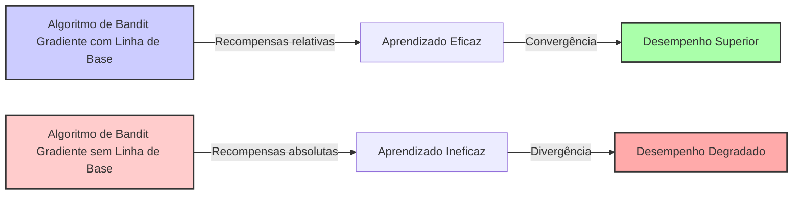

### Gradient Bandit Algorithms e o Impacto da Linha de Base

### Introdução
O aprendizado por reforço (RL) difere de outros métodos de aprendizado por utilizar informações de treinamento que avaliam as ações tomadas, em vez de simplesmente instruir através de ações corretas [1]. Em um cenário simplificado, exploramos o *k-armed bandit problem*, onde o objetivo é maximizar a recompensa total esperada ao longo do tempo, escolhendo entre *k* diferentes opções de ações [1]. Este capítulo aborda métodos que estimam os valores de ação para guiar a seleção de ações. Uma alternativa, explorada nas seções finais deste capítulo, envolve aprender uma **preferência numérica** para cada ação, em vez de um valor estimado [1]. Essas preferências, denotadas como $H_t(a)$, influenciam a probabilidade de seleção de uma ação através da distribuição soft-max [1]. Especificamente, este capítulo busca entender como a omissão da linha de base em algoritmos de bandit gradiente afeta o desempenho do aprendizado.

### Conceitos Fundamentais
Os algoritmos de **bandit gradiente** são uma abordagem alternativa aos métodos de valor de ação para o *k-armed bandit problem*, onde o objetivo não é estimar o valor das ações, mas sim aprender uma preferência numérica para cada ação [1]. Estas preferências, $H_t(a) \in \mathbb{R}$, determinam a frequência com que uma ação é selecionada. A probabilidade de selecionar uma ação $a$ no tempo $t$ é definida pela distribuição *soft-max*:

$$
Pr\{A_t = a\} = \frac{e^{H_t(a)}}{\sum_{b=1}^{k} e^{H_t(b)}} = \pi_t(a)
$$

onde $\pi_t(a)$ denota a probabilidade de selecionar a ação $a$ no tempo $t$ [1]. As preferências das ações são atualizadas usando o conceito de **ascensão de gradiente estocástico**. Após selecionar a ação $A_t$ e receber a recompensa $R_t$, as preferências são atualizadas da seguinte forma:

$$
H_{t+1}(A_t) = H_t(A_t) + \alpha(R_t - \bar{R}_t)(1 - \pi_t(A_t))
$$

$$
H_{t+1}(a) = H_t(a) - \alpha(R_t - \bar{R}_t)\pi_t(a), \quad \text{para todo} \quad a \neq A_t
$$
```mermaid
graph LR
    A[Ação "A_t" Selecionada] -->|Recompensa "R_t" Recebida| B(Atualização de Preferências);
    B --> C{Calcular "H_{t+1}(A_t)"};
    C --> D{Calcular "H_{t+1}(a)" para "a != A_t"};
    D --> E[Preferências "H_{t+1}(a)" Atualizadas];
    style A fill:#f9f,stroke:#333,stroke-width:2px
    style E fill:#ccf,stroke:#333,stroke-width:2px
```
Aqui, $\alpha > 0$ é o parâmetro de *step-size*, e $\bar{R}_t$ é a recompensa média até o tempo $t$ [1]. A introdução da linha de base, $\bar{R}_t$, é crucial. Se a recompensa $R_t$ for maior que a linha de base $\bar{R}_t$, a probabilidade de selecionar $A_t$ no futuro aumenta, caso contrário, diminui [1].

> 💡 **Exemplo Numérico:** Suponha que temos um problema de 3-armed bandit (k=3). Inicialmente, as preferências são $H_1(1) = H_1(2) = H_1(3) = 0$.  Vamos usar $\alpha = 0.1$. No tempo $t=1$, a probabilidade de selecionar qualquer ação é igual: $\pi_1(1) = \pi_1(2) = \pi_1(3) = \frac{e^0}{e^0+e^0+e^0} = \frac{1}{3} \approx 0.33$. Suponha que escolhemos a ação $A_1 = 2$ e recebemos uma recompensa $R_1 = 1$. A recompensa média inicial é $\bar{R}_1 = 0$.
>
> Atualizando as preferências:
>
> $\text{Passo 1: Atualizando } H_2(2)$:
>  $H_2(2) = H_1(2) + \alpha(R_1 - \bar{R}_1)(1 - \pi_1(2)) = 0 + 0.1(1-0)(1-1/3) = 0.1 * 1 * (2/3) \approx 0.067$
>
> $\text{Passo 2: Atualizando } H_2(1)$:
>  $H_2(1) = H_1(1) - \alpha(R_1 - \bar{R}_1)\pi_1(1) = 0 - 0.1(1-0)(1/3) \approx -0.033$
>
> $\text{Passo 3: Atualizando } H_2(3)$:
>  $H_2(3) = H_1(3) - \alpha(R_1 - \bar{R}_1)\pi_1(3) = 0 - 0.1(1-0)(1/3) \approx -0.033$
>
> As novas preferências são $H_2(1) \approx -0.033$, $H_2(2) \approx 0.067$ e $H_2(3) \approx -0.033$. A ação 2 agora tem uma preferência ligeiramente maior.
>  
>
> Vamos para o tempo $t=2$.  A probabilidade de selecionar cada ação agora é:
> $\pi_2(1) = \frac{e^{-0.033}}{e^{-0.033} + e^{0.067} + e^{-0.033}} \approx 0.30$
> $\pi_2(2) = \frac{e^{0.067}}{e^{-0.033} + e^{0.067} + e^{-0.033}} \approx 0.39$
> $\pi_2(3) = \frac{e^{-0.033}}{e^{-0.033} + e^{0.067} + e^{-0.033}} \approx 0.30$
>
>  Observe que a probabilidade de selecionar a ação 2 aumentou em relação às outras ações.

O texto afirma que a omissão da linha de base, isto é, configurar $\bar{R}_t = 0$ no algoritmo de bandit gradiente, levaria a uma **degradação significativa no desempenho** [1].  A razão para essa degradação reside na capacidade da linha de base de adaptar-se ao nível médio das recompensas, permitindo que o algoritmo distinga as ações com base em recompensas relativas, não absolutas. Este mecanismo é essencial especialmente quando as recompensas verdadeiras das ações são positivas ou negativas, mas não centradas em torno de zero.

> 💡 **Exemplo Numérico:** Continuando o exemplo anterior, vamos analisar o que aconteceria se usássemos $\bar{R}_t = 0$.  No tempo $t=1$, ainda escolhemos a ação $A_1 = 2$ e recebemos uma recompensa $R_1 = 1$.
>
> $\text{Passo 1: Atualizando } H_2(2)$:
>  $H_2(2) = H_1(2) + \alpha(R_1 - 0)(1 - \pi_1(2)) = 0 + 0.1(1)(1-1/3) = 0.1 * (2/3) \approx 0.067$
>
> $\text{Passo 2: Atualizando } H_2(1)$:
>  $H_2(1) = H_1(1) - \alpha(R_1 - 0)\pi_1(1) = 0 - 0.1(1)(1/3) \approx -0.033$
>
> $\text{Passo 3: Atualizando } H_2(3)$:
>  $H_2(3) = H_1(3) - \alpha(R_1 - 0)\pi_1(3) = 0 - 0.1(1)(1/3) \approx -0.033$
>
>  Neste caso, as preferências são as mesmas tanto para o caso com linha de base quanto sem linha de base no tempo $t=1$, **mas a interpretação é muito diferente**. Sem linha de base o algoritmo está apenas considerando os valores absolutos das recompensas, e não os valores relativos a média das recompensas. Se todas as recompensas forem positivas o algoritmo sem linha de base irá sempre aumentar a probabilidade de seleção da ação selecionada. Isso faz com que seja muito mais lento para o algoritmo convergir quando há ações com recompensas menores. Imagine o cenário em que uma ação tem recompensa 1 e todas as outras tem recompensa 0. O algoritmo com linha de base tenderá a convergir mais rápido do que o sem linha de base, pois o algoritmo com linha de base irá diminuir a probabilidade de seleção das ações que tem recompensa zero.

**Observação 1:** A escolha da linha de base $\bar{R}_t$ como a média das recompensas até o tempo $t$ não é a única opção. Outras linhas de base podem ser consideradas, como uma média móvel das recompensas ou uma constante pré-definida, dependendo da aplicação específica. A escolha da linha de base pode afetar a velocidade de convergência e a estabilidade do algoritmo.

O texto também deriva o algoritmo de bandit gradiente como uma instanciação do método do gradiente estocástico (2.13) e demonstra que a atualização de preferencia por ação está relacionada à derivada parcial do desempenho com respeito à preferência por ação [1].
```mermaid
graph LR
    A["Derivada parcial do desempenho com respeito à preferência de ação"] --> B["Expressão geral:  "$\frac{\partial E[R_t]}{\partial H_t(a)}$""];
    B --> C["Substituição da linha de base " $B_t$ " por " $\bar{R}_t$ ""];
    C --> D["Uso da esperança condicional e derivada da soft-max"];
    D --> E["Atualização das preferências de ação"];
    E --> F["Algoritmo de bandit gradiente obtido via ascensão de gradiente estocástico"];
   style A fill:#f9f,stroke:#333,stroke-width:2px
   style F fill:#ccf,stroke:#333,stroke-width:2px
```

**Lema 1:** A atualização de preferências de ação no algoritmo bandit gradiente, especificamente,
$$
H_{t+1}(a) = H_t(a) + \alpha(R_t - \bar{R}_t) (1_{A_t=a}-\pi_t(a))
$$
é consistente com o método de ascensão de gradiente estocástico.
*Demonstração:* A derivada parcial do desempenho com respeito à preferência de ação é dada por:
$$
\frac{\partial E[R_t]}{\partial H_t(a)} = \sum_{x} (q_*(x)-B_t) \frac{\partial \pi_t(x)}{\partial H_t(a)}
$$

onde $B_t$ é uma linha de base. O uso da linha de base é permitido pois a soma do gradiente sobre todas as ações é zero [1]. Substituindo $B_t$ por $R_t$ e usando $E[R_t|A_t] = q_*(A_t)$ temos:

$$
\frac{\partial E[R_t]}{\partial H_t(a)} = E[(R_t-\bar{R_t}) \frac{\partial \pi_t(A_t)}{\partial H_t(a)} / \pi_t(A_t) ]
$$
E através do uso da regra do quociente e da derivada da distribuição soft-max [1], se obtém:
$$
\frac{\partial \pi_t(A_t)}{\partial H_t(a)} = \pi_t(A_t)(1_{A_t=a}-\pi_t(a))
$$

Substituindo isso na equação anterior e através da atualização por amostra, obtém-se:

$$
H_{t+1}(a) = H_t(a) + \alpha(R_t-\bar{R_t})(1_{A_t=a}-\pi_t(a))
$$
$\blacksquare$
```mermaid
graph LR
    A["Derivada parcial: "$\frac{\partial E[R_t]}{\partial H_t(a)}$""] --> B["Substituição: "$\frac{\partial \pi_t(A_t)}{\partial H_t(a)}$""];
    B --> C["Regra do quociente e derivada soft-max: "$\pi_t(A_t)(1_{A_t=a}-\pi_t(a))$""];
    C --> D["Substituição na expressão da derivada"];
    D --> E["Atualização por amostra"];
    style A fill:#f0f,stroke:#333,stroke-width:2px
     style E fill:#aaf,stroke:#333,stroke-width:2px
```

**Lema 1.1:** A derivada parcial do desempenho com respeito à preferência de ação pode ser expressa de forma alternativa, utilizando a esperança condicionada:
$$
\frac{\partial E[R_t]}{\partial H_t(a)} = E_{A_t} \left[ (R_t-\bar{R_t}) (1_{A_t=a} - \pi_t(a)) \right]
$$
*Demonstração:*
Começamos com a expressão original da derivada parcial:
$$
\frac{\partial E[R_t]}{\partial H_t(a)} = E[(R_t-\bar{R_t}) \frac{\partial \pi_t(A_t)}{\partial H_t(a)} / \pi_t(A_t) ]
$$
Substituindo a expressão da derivada da soft-max:
$$
\frac{\partial E[R_t]}{\partial H_t(a)} = E[(R_t-\bar{R_t}) \frac{\pi_t(A_t)(1_{A_t=a}-\pi_t(a))}{\pi_t(A_t)} ]
$$
Simplificando:
$$
\frac{\partial E[R_t]}{\partial H_t(a)} = E[(R_t-\bar{R_t}) (1_{A_t=a}-\pi_t(a)) ]
$$
Esta esperança pode ser interpretada como a esperança sobre a distribuição de $A_t$. Portanto, podemos escrever:
$$
\frac{\partial E[R_t]}{\partial H_t(a)} = E_{A_t} \left[ (R_t-\bar{R_t}) (1_{A_t=a} - \pi_t(a)) \right]
$$
$\blacksquare$

**Teorema 1:** Se $\bar{R}_t = 0$ para todo $t$, então a atualização das preferências de ação não corresponde ao gradiente de desempenho e, portanto, não garante a convergência para um ótimo local ou global.

*Demonstração:*
Do lema 1, sabemos que a atualização das preferências de ação é dada por:
$$
H_{t+1}(a) = H_t(a) + \alpha(R_t - \bar{R}_t) (1_{A_t=a}-\pi_t(a))
$$
E a derivada do desempenho com respeito a preferencia é:
$$
\frac{\partial E[R_t]}{\partial H_t(a)} = E_{A_t} \left[ (R_t-\bar{R_t}) (1_{A_t=a} - \pi_t(a)) \right]
$$
Se $\bar{R}_t = 0$ então:
$$
H_{t+1}(a) = H_t(a) + \alpha R_t (1_{A_t=a}-\pi_t(a))
$$
E
$$
\frac{\partial E[R_t]}{\partial H_t(a)} = E_{A_t} \left[ R_t(1_{A_t=a} - \pi_t(a)) \right]
$$
Note que, a atualização de preferências com $\bar{R}_t = 0$ ainda se assemelha ao gradiente, mas o valor $R_t$ sem a subtração da linha de base implica que a direção de atualização não é mais baseada em recompensas relativas, mas sim valores absolutos. Consequentemente, a direção da atualização não segue a direção do verdadeiro gradiente de desempenho, o que impede a convergência para o ponto ótimo. $\blacksquare$

### Conclusão
A inclusão da linha de base em algoritmos de bandit gradiente é crucial para um aprendizado eficaz, especialmente quando as recompensas não são centradas em torno de zero. A linha de base permite que o algoritmo se adapte ao nível médio das recompensas e aprenda com base nas recompensas relativas. Omitir a linha de base pode levar a um desempenho significativamente degradado, como demonstrado no experimento descrito no contexto [1]. A formulação do algoritmo de bandit gradiente como uma instanciação da ascensão de gradiente estocástico assegura a sua estabilidade e convergência, destacando a importância da linha de base no processo de otimização. A adaptabilidade do algoritmo às recompensas médias é um fator crítico para sua eficiência em uma variedade de cenários de aprendizado por reforço. Além disso, a escolha apropriada da linha de base pode influenciar a convergência e desempenho do algoritmo.


### Referências
[^1]: "So far in this chapter we have considered methods that estimate action values and use those estimates to select actions. This is often a good approach, but it is not the only one possible. In this section we consider learning a numerical preference for each action a, which we denote Hł(a) ∈ R. The larger the preference, the more often that action is taken, but the preference has no interpretation in terms of reward. Only the relative preference of one action over another is important; if we add 1000 to all the action preferences there is no effect on the action probabilities, which are determined according to a soft-max distribution (i.e., Gibbs or Boltzmann distribution) as follows:
Pr{At=a} = 
eHt(a)
Σ=1eHt(b)
k
= πτ(α),
where here we have also introduced a useful new notation, πι(α), for the probability of taking action a at time t. Initially all action preferences are the same (e.g., H₁(a) = 0, for all a) so that all actions have an equal probability of being selected.
[...] There is a natural learning algorithm for soft-max action preferences based on the idea of stochastic gradient ascent. On each step, after selecting action Ať and receiving the reward Rt, the action preferences are updated by:
Ht+1(At) = Ht(At) + a(Rt – Rt) (1 – πτ(At)),
Ht+1(a) = H+(a) – α(Rt – Rt)πι(α),
and
for all a ≠ At,
where a > 0 is a step-size parameter, and Rt ∈ R is the average of the rewards up to but not including time t (with R₁ = R₁), which can be computed incrementally as described in Section 2.4 (or Section 2.5 if the problem is nonstationary).1 The Rt term serves as a baseline with which the reward is compared. If the reward is higher than the baseline, then the probability of taking At in the future is increased, and if the reward is below baseline, then the probability is decreased. The non-selected actions move in the opposite direction.
[...] if the baseline were omitted (that is, if Rt was taken to be constant zero in (2.12)), then performance would be significantly degraded, as shown in the figure." *(Trecho de <Chapter 2>)*
