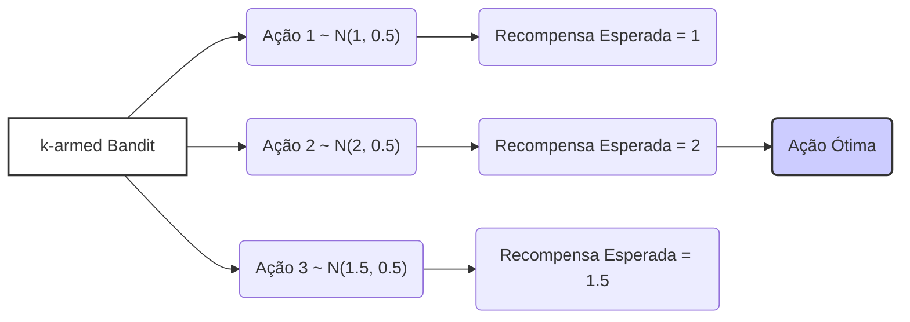
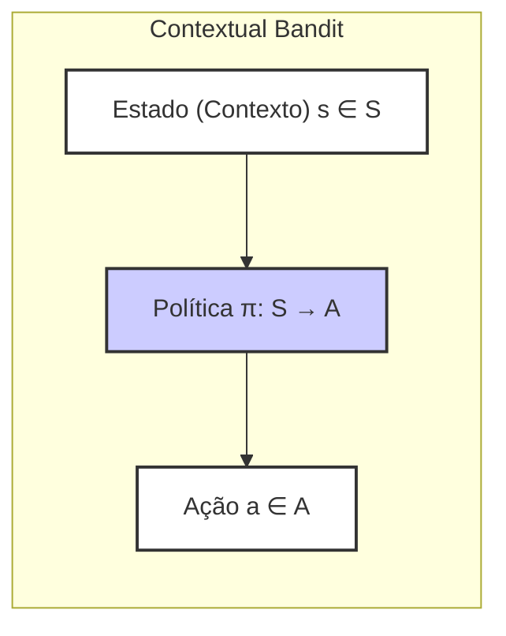
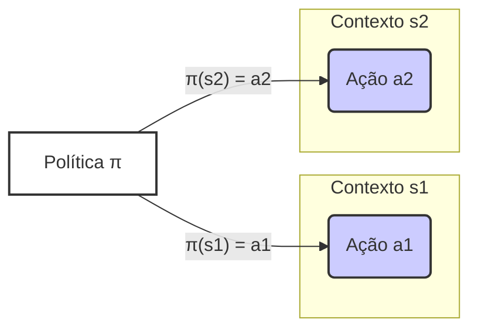
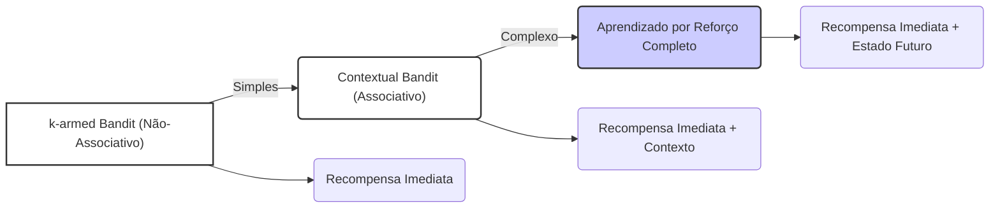
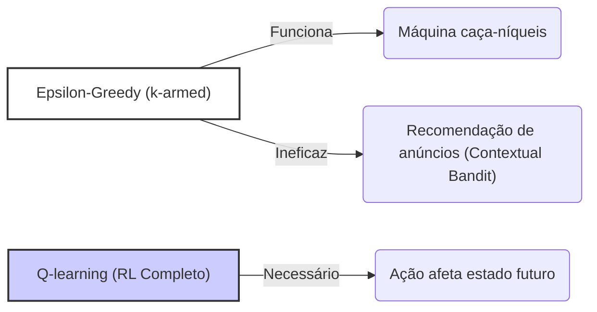

## Associative Search (Contextual Bandits) em Reinforcement Learning

### Introdução
O aprendizado por reforço se distingue de outras formas de aprendizado por utilizar informações de treinamento que avaliam as ações tomadas, em vez de instruir fornecendo as ações corretas [^1]. Este aspecto avaliativo é fundamental para a necessidade de exploração ativa e busca explícita por um bom comportamento. No contexto de **multi-armed bandits**, exploramos inicialmente cenários *não-associativos*, onde o aprendizado não envolve agir em múltiplas situações. Este capítulo aprofunda esse tema, introduzindo **cenários associativos** onde o aprendizado se estende para mapear ações a diferentes situações, o que leva ao conceito de **contextual bandits** [^1]. Em contraste com o feedback *instrutivo*, que indica a ação correta independentemente da ação tomada, o feedback *avaliativo* depende inteiramente da ação tomada. O aprendizado por reforço foca no aspecto avaliativo, que possibilita a exploração e a descoberta de quais ações são melhores em cada situação específica.

**Proposição 1:** *O feedback avaliativo, ao contrário do feedback instrutivo, não fornece explicitamente a ação ótima, mas sim uma recompensa associada à ação tomada, o que exige exploração para identificar as melhores ações em cada contexto. Essa característica é essencial para o aprendizado em ambientes complexos.*

> 💡 **Exemplo Numérico:** Imagine um cenário com duas ações (Ação 1 e Ação 2). Em feedback instrutivo, o sistema te diria "Ação 1 é a correta". Em feedback avaliativo, você tenta Ação 1 e recebe uma recompensa de 0.5; depois tenta Ação 2 e recebe uma recompensa de 0.8. Você não soube *diretamente* qual a melhor, mas aprendeu pela experiência.  Este feedback avaliativo é o cerne do aprendizado por reforço.

```mermaid
graph LR
    A[Feedback Instrutivo] -->|Informa "Ação Correta"| B("Ação Ótima Conhecida");
    C[Feedback Avaliativo] -->|Recompensa após ação| D("Ação → Recompensa");
    D --> E("Exploração Necessária");
    style A fill:#f9f,stroke:#333,stroke-width:2px
    style C fill:#ccf,stroke:#333,stroke-width:2px
```

A necessidade de exploração, decorrente da natureza avaliativa do feedback, impõe um *trade-off* entre explorar ações desconhecidas na esperança de encontrar ações melhores, e explorar as ações conhecidas que proporcionam um bom resultado. Esse *trade-off* é intrínseco ao aprendizado por reforço e será explorado com mais profundidade nas seções subsequentes.

### Conceitos Fundamentais
Nos problemas de **k-armed bandit**, o objetivo é maximizar a recompensa total esperada ao longo do tempo, fazendo escolhas repetidas entre *k* opções ou ações, onde cada escolha leva a uma recompensa numérica selecionada a partir de uma distribuição de probabilidade estacionária que depende da ação escolhida [^1]. Em cenários *não-associativos*, buscamos uma única melhor ação, seja ela fixa ou variável no tempo. No entanto, no aprendizado por reforço, a complexidade surge quando o ambiente apresenta múltiplas situações, exigindo que o agente aprenda uma *política* que mapeia situações para ações apropriadas. Essa é a essência dos problemas de **busca associativa**, também conhecidos como **contextual bandits** [^1].

**Lema 1:** *Em um problema de k-armed bandit não-associativo, se as distribuições de recompensa para cada ação forem estacionárias, existe uma ação ótima que maximiza a recompensa esperada a longo prazo.*

*Proof Strategy:* Isso segue diretamente da definição de problemas de k-armed bandits não-associativos e da existência de um valor esperado para cada distribuição estacionária. A ação com o maior valor esperado é a ação ótima.

> 💡 **Exemplo Numérico:** Considere um k-armed bandit com 3 ações (k=3). As recompensas de cada ação seguem uma distribuição normal: Ação 1 ~ N(1, 0.5), Ação 2 ~ N(2, 0.5) e Ação 3 ~ N(1.5, 0.5). A ação ótima é a Ação 2, pois tem a maior recompensa esperada (média de 2). Em um cenário não-associativo, o agente aprende a escolher essa ação repetidamente.



A **busca associativa** envolve tanto a aprendizagem por tentativa e erro para encontrar as melhores ações, quanto a associação dessas ações com as situações em que elas são mais eficazes. Este cenário é uma ponte entre o problema do k-armed bandit e o problema completo de aprendizado por reforço, pois cada ação afeta apenas a recompensa imediata, e não o estado futuro.

*O objetivo é aprender uma política*: uma função que mapeia cada situação para a melhor ação a ser tomada naquela situação. Em problemas **não-associativos**, ou o agente tenta encontrar uma única melhor ação (em um ambiente estacionário) ou acompanhar a melhor ação que muda ao longo do tempo (em um ambiente não estacionário). No entanto, em problemas mais gerais, cada situação pode exigir uma ação diferente. Para ilustrar, imagine um cenário onde se tem vários problemas de k-armed bandits e a cada passo um desses problemas é selecionado aleatoriamente [^1]. Se a probabilidade de seleção de cada problema não muda ao longo do tempo, o problema pode ser visto como um k-armed bandit estacionário. No entanto, se for oferecida uma pista distintiva sobre a identidade do problema (como uma mudança na cor do display de uma slot machine), o agente pode aprender uma política para associar cada pista à melhor ação para aquele problema. Por exemplo, "se vermelho, selecionar o braço 1; se verde, selecionar o braço 2" [^1]. Esta é a essência de um **contextual bandit**, e é um passo crucial em direção ao aprendizado por reforço.

**Definição 1:** *Uma política $\pi$ em um problema de contextual bandit é uma função $\pi: S \rightarrow A$, que mapeia cada estado (contexto) $s \in S$ para uma ação $a \in A$. O objetivo do agente é aprender uma política $\pi^*$ que maximize a recompensa esperada em cada estado.*

> 💡 **Exemplo Numérico:** Em um contexto de recomendação de filmes, $S$ pode ser o perfil do usuário (idade, gênero, histórico de visualizações) e $A$ pode ser o conjunto de filmes disponíveis. Uma política $\pi$ mapeia um perfil de usuário para um filme a ser recomendado. O objetivo é aprender uma política $\pi^*$ que maximize a probabilidade de o usuário assistir e gostar do filme recomendado. Por exemplo, $\pi(\text{user\_age=25, genre='Action'}) = \text{movie\_id=123}$



**Lema 1.1:** *Em um problema de contextual bandit com um conjunto finito de contextos $S$, a aprendizagem de uma política ótima $\pi^*$ pode ser vista como a aprendizagem de múltiplas políticas ótimas, uma para cada contexto, mas com a dificuldade de que a exploração deve considerar simultaneamente todos os contextos.*

*Proof Strategy:* Este lema demonstra que, embora a aprendizagem de políticas por contexto se assemelhe à resolução de múltiplos k-armed bandits não-associativos, o problema se torna mais complexo porque o agente deve aprender qual ação é ótima para qual contexto, e isso requer uma exploração combinada que não é necessária nos casos não associativos.

> 💡 **Exemplo Numérico:** Imagine dois contextos: $S = \{s_1, s_2\}$. Em $s_1$, a ação $a_1$ é ótima; em $s_2$, a ação $a_2$ é ótima. Resolver o problema de contextual bandit exige explorar ações em ambos os contextos para descobrir a ação ótima em cada um. O agente deve aprender uma política: $\pi(s_1) = a_1$ e $\pi(s_2) = a_2$.



O aprendizado por reforço, em sua forma completa, permite que as ações influenciem tanto a recompensa imediata quanto a situação futura, criando uma dinâmica complexa que exige uma política que lide com ambas [^1].

### Conclusão
A transição dos problemas de *k*-armed bandits não-associativos para o cenário de busca associativa representa um passo crucial na compreensão do aprendizado por reforço. O objetivo em **contextual bandits** não é apenas encontrar a melhor ação, mas sim *aprender uma política* que mapeia cada situação para a ação apropriada. Esta capacidade de generalização para diferentes contextos é uma das chaves para a resolução de problemas de aprendizado por reforço mais complexos. A capacidade de associar ações a situações permite que os agentes adaptem seu comportamento de maneira mais eficiente, o que é fundamental para o sucesso em ambientes complexos e dinâmicos. Os contextual bandits servem como um passo intermediário entre os problemas mais simples de *k*-armed bandits e os problemas de aprendizado por reforço completo, onde as ações influenciam o estado futuro.

**Teorema 1:** *Em problemas de aprendizado por reforço, a complexidade do problema aumenta à medida que passamos de problemas não-associativos (k-armed bandit) para problemas associativos (contextual bandit) e, finalmente, para problemas de aprendizado por reforço completo, onde as ações afetam não apenas a recompensa imediata, mas também o estado futuro.*

*Proof Strategy:* Este teorema sintetiza os argumentos do texto, demonstrando uma hierarquia de complexidade e a necessidade de abordagens de aprendizado cada vez mais sofisticadas para lidar com ambientes mais complexos.



**Corolário 1:** *Os algoritmos projetados para resolver problemas de k-armed bandit não-associativos podem não ser eficazes em problemas de contextual bandit, e algoritmos projetados para contextual bandit podem não ser eficazes em problemas de aprendizado por reforço completo devido ao impacto das ações nos estados futuros.*

> 💡 **Exemplo Numérico:** Um algoritmo simples para k-armed bandits, como epsilon-greedy, pode funcionar bem para escolher a melhor máquina caça-níqueis (não-associativo). Mas, em um cenário de contextual bandit (como recomendar anúncios), usar epsilon-greedy diretamente sem levar em consideração o contexto (usuário, hora, etc.) levará a escolhas subótimas. Um algoritmo de RL completo, como Q-learning, é necessário quando a ação de hoje afeta o estado de amanhã, o que um contextual bandit não cobre.



### Referências
[^1]: "The most important feature distinguishing reinforcement learning from other types of learning is that it uses training information that evaluates the actions taken rather than instructs by giving correct actions... The particular nonassociative, evaluative feedback problem that we explore is a simple version of the k-armed bandit problem... At the end of this chapter, we take a step closer to the full reinforcement learning problem by discussing what happens when the bandit problem becomes associative, that is, when the best action depends on the situation." *(Trecho de <Chapter 2: Multi-armed Bandits>)*
[^2]: "So far in this chapter we have considered only nonassociative tasks, that is, tasks in which there is no need to associate different actions with different situations... However, in a general reinforcement learning task there is more than one situation, and the goal is to learn a policy: a mapping from situations to the actions that are best in those situations." *(Trecho de <Chapter 2: Multi-armed Bandits>)*
[^3]: "This is an example of an associative search task, so called because it involves both trial-and-error learning to search for the best actions, and association of these actions with the situations in which they are best. Associative search tasks are often now called contextual bandits in the literature." *(Trecho de <Chapter 2: Multi-armed Bandits>)*
