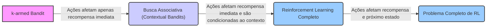
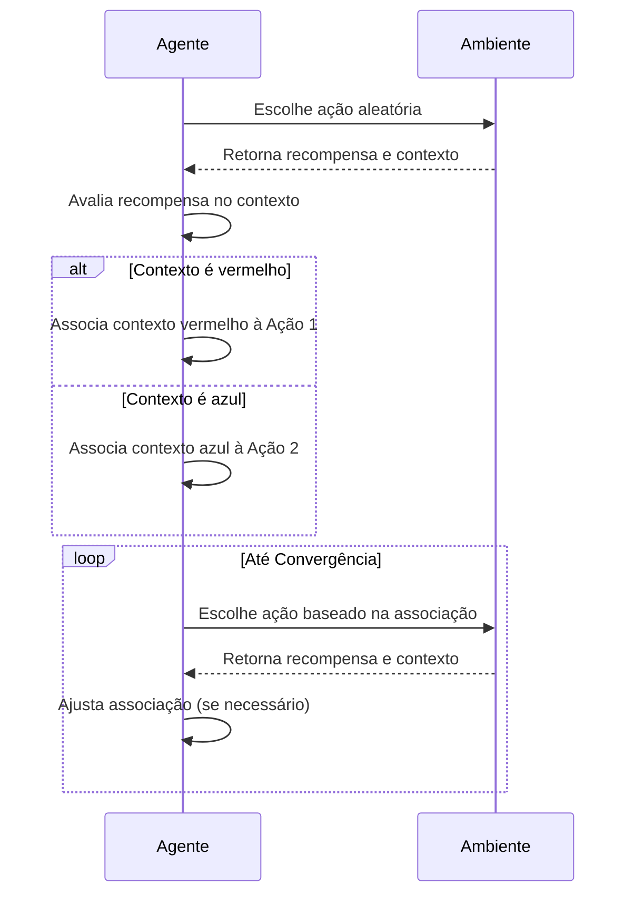
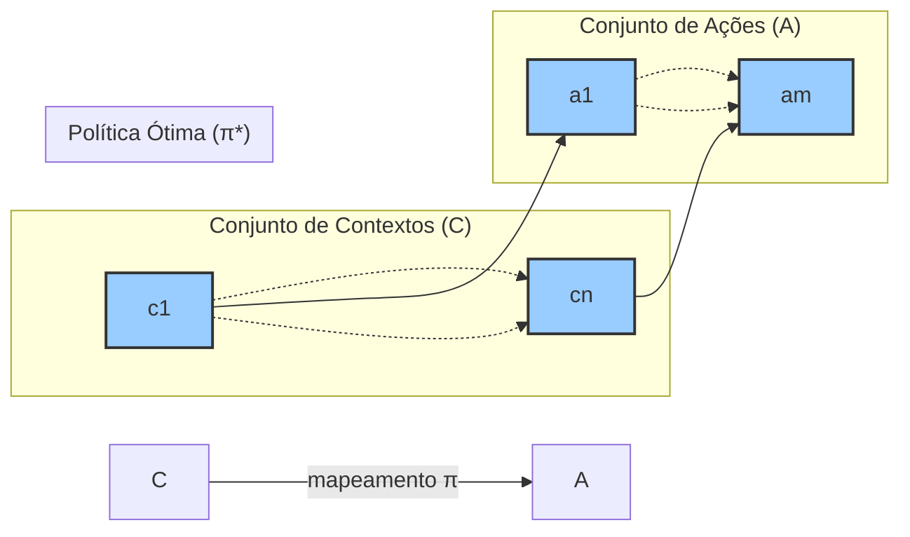
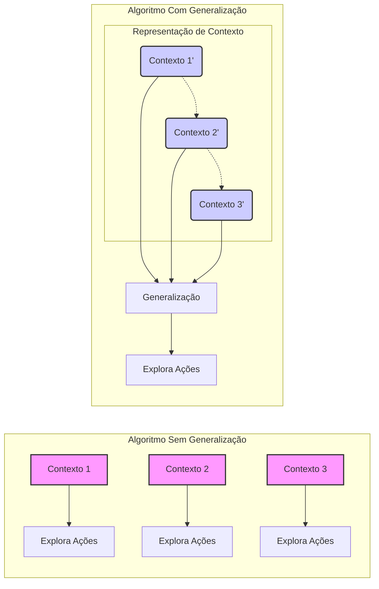
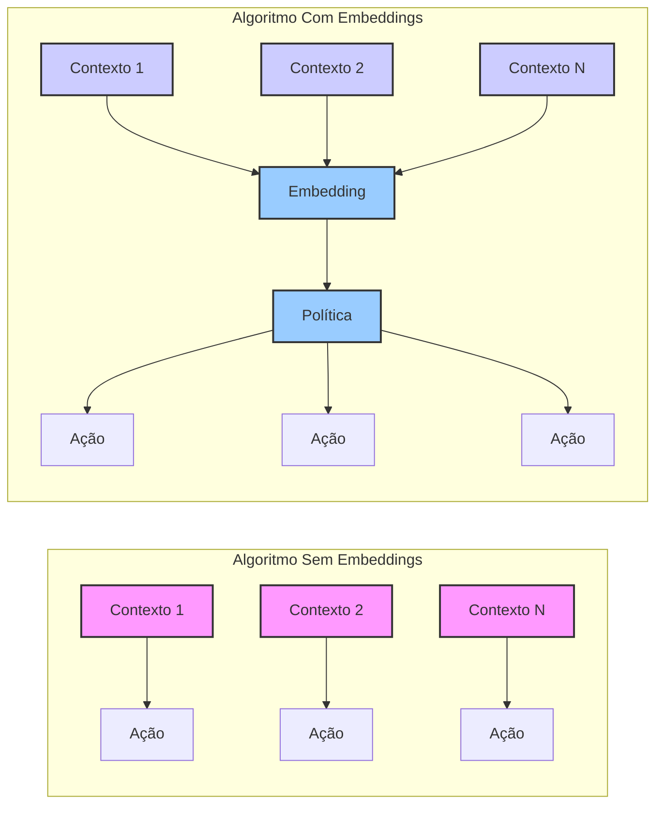

## Associative Search (Contextual Bandits)

### Introdução

Neste capítulo, exploramos inicialmente tarefas não associativas, onde o objetivo é encontrar uma única ação ideal, seja em um ambiente estacionário ou rastrear uma ação ideal em um ambiente não estacionário. Contudo, a realidade do aprendizado por reforço (reinforcement learning) frequentemente exige lidar com múltiplas situações, cada uma demandando uma ação específica. O aprendizado de uma política, ou seja, o mapeamento de situações para ações, torna-se, portanto, essencial. Para construir uma base para o problema mais geral, vamos discutir como tarefas não associativas se estendem ao contexto associativo.

### Conceitos Fundamentais

A forma mais simples de estender tarefas não associativas para o cenário associativo é considerar diversas tarefas **k-armed bandit**, cada uma apresentando uma característica única. Imagine que a cada passo você enfrenta uma dessas tarefas, selecionada aleatoriamente. Se as probabilidades de seleção das tarefas permanecem constantes, a situação se resume a uma única tarefa **k-armed bandit** estacionária, passível de solução com os métodos discutidos. No entanto, se cada tarefa for acompanhada de uma *clue* distintiva, como uma mudança na cor da máquina caça-níqueis, o problema se torna mais interessante.

Neste contexto, podemos aprender uma política que associe cada tarefa, sinalizada pela cor, à ação ótima para aquela tarefa. Por exemplo, "se a cor for vermelha, selecione o braço 1; se a cor for verde, selecione o braço 2". Uma política bem definida permite um desempenho superior em comparação com uma abordagem que ignora as informações distintivas das tarefas.

Este cenário exemplifica uma **tarefa de busca associativa**, que envolve tanto a exploração por tentativa e erro para encontrar as melhores ações, quanto a associação dessas ações com as situações em que elas são mais eficazes. Em muitos casos, essas tarefas são chamadas de **contextual bandits** na literatura. As tarefas de busca associativa atuam como intermediárias entre o problema **k-armed bandit** e o problema completo de **reinforcement learning**. Compartilham com o problema completo a necessidade de aprender uma política, enquanto mantêm a característica do **k-armed bandit**, onde cada ação afeta apenas a recompensa imediata.

Um problema completo de **reinforcement learning** surge quando as ações podem influenciar tanto a recompensa imediata quanto a próxima situação.

**Lemma 1**: *O aprendizado em tarefas associativas requer a exploração das ações e a associação dessas ações aos contextos em que elas proporcionam o melhor resultado.*

*Prova:*
Em tarefas associativas, o desempenho ótimo depende de uma política que mapeie contextos (identificadores de tarefa) para ações. Para encontrar tal política, o agente deve:

1.  **Explorar:** Realizar ações diferentes em vários contextos para avaliar suas recompensas.
2.  **Associar:** Aprender a relação entre os contextos e as ações que maximizam as recompensas.

Se o agente não explorar, ele pode ficar preso em ações subótimas, mesmo que encontre uma recompensa considerável no início. Se não associar as ações com os contextos, ele não saberá qual ação tomar em cada contexto. Assim, ambos os processos são necessários para o sucesso em tarefas associativas. $\blacksquare$

> 💡 **Exemplo Numérico:** Considere um problema com dois contextos (cores: vermelha e azul) e dois braços (Ação 1 e Ação 2). As recompensas médias para cada contexto-ação são as seguintes:
>   - Contexto Vermelho: Ação 1 -> 10, Ação 2 -> 2
>   - Contexto Azul: Ação 1 -> 1, Ação 2 -> 9
>
>   Inicialmente, o agente pode escolher ações aleatoriamente em cada contexto. Após algumas iterações, um agente que explora e associa aprenderá:
>   - Se o contexto for vermelho, a Ação 1 é melhor (recompensa média 10)
>   - Se o contexto for azul, a Ação 2 é melhor (recompensa média 9)
>   Um agente que não explora ou não associa corretamente os contextos às ações não conseguirá obter o máximo de recompensa possível, por exemplo, poderia ficar preso na ação 1 em ambos os contextos, com recompensas médias de 10 e 1, respectivamente.

**Corolário 1**: *A escolha de uma ação em uma tarefa associativa não pode ser feita sem levar em conta o contexto atual, pois a mesma ação pode ter resultados diferentes em diferentes contextos.*

*Prova:*
A partir do **Lemma 1**, inferimos que ações devem ser associadas a contextos. Isso implica que, para tomar a melhor decisão em qualquer momento, o agente precisa considerar o contexto atual. Ignorar o contexto levaria a uma aplicação de uma política inapropriada para aquela situação, resultando em um desempenho subóptimo. $\blacksquare$

> 💡 **Exemplo Numérico:** Usando o mesmo exemplo anterior, se um agente escolhe a Ação 1 independentemente do contexto, ele receberá 10 quando o contexto for vermelho e apenas 1 quando o contexto for azul. Um agente que associa a ação ao contexto, escolhe a ação 1 quando o contexto é vermelho, e a ação 2 quando o contexto é azul,  conseguirá um resultado ótimo. Isso mostra a necessidade de se levar em conta o contexto na escolha da ação.

**Proposição 1**: *Em uma tarefa de busca associativa com um número finito de contextos e ações, existe uma política ótima que associa cada contexto à ação que produz a maior recompensa esperada para aquele contexto.*

*Prova:*
Considere um conjunto finito de contextos $C = \{c_1, c_2, \ldots, c_n\}$ e um conjunto finito de ações $A = \{a_1, a_2, \ldots, a_m\}$. Para cada contexto $c_i$, existe uma recompensa esperada $Q(c_i, a_j)$ para cada ação $a_j$. Uma política $\pi$ é um mapeamento de contextos para ações, ou seja, $\pi: C \rightarrow A$.  Definimos a política ótima $\pi^*$ como aquela que para cada contexto $c_i$ escolhe a ação $a_j$ que maximiza a recompensa esperada, ou seja, $\pi^*(c_i) = \arg\max_{a_j} Q(c_i, a_j)$. Como o número de contextos e ações é finito, e a recompensa esperada para cada par (contexto, ação) é bem definida, então essa política ótima existe. $\blacksquare$

> 💡 **Exemplo Numérico:** Seja um problema com 3 contextos (c1, c2, c3) e 2 ações (a1, a2). As recompensas esperadas para cada par contexto-ação são:
>   - Q(c1, a1) = 5, Q(c1, a2) = 2
>   - Q(c2, a1) = 1, Q(c2, a2) = 8
>   - Q(c3, a1) = 9, Q(c3, a2) = 3
>
>   A política ótima $\pi^*$ seria:
>   - $\pi^*(c1) = a1$ (pois Q(c1, a1) > Q(c1, a2))
>   - $\pi^*(c2) = a2$ (pois Q(c2, a2) > Q(c2, a1))
>   - $\pi^*(c3) = a1$ (pois Q(c3, a1) > Q(c3, a2))
>   Essa política $\pi^*$ é a política que maximiza as recompensas esperadas em todos os contextos.

A **Proposição 1** estabelece a existência de uma política ótima em tarefas de busca associativa com conjuntos finitos de contextos e ações. Contudo, o desafio reside em *encontrar* esta política ótima. Para isso, devemos explorar algoritmos que aprendem a associar contextos a ações, como veremos a seguir.

**Lemma 1.1**: *A eficiência de um algoritmo para tarefas associativas depende tanto da sua capacidade de explorar ações quanto da sua capacidade de generalizar entre contextos similares.*

*Prova:*
A eficiência da exploração já foi abordada no **Lemma 1**. A generalização entre contextos similares é crucial para acelerar o aprendizado. Em alguns cenários, contextos podem compartilhar características que indicam ações ótimas semelhantes. Se o algoritmo for capaz de reconhecer e explorar essas semelhanças, ele pode aprender de forma mais eficiente, evitando a necessidade de explorar totalmente cada contexto individualmente.  Por exemplo, se a máquina caça-níqueis exibe tons de vermelho em vez de apenas vermelho, um algoritmo eficaz não precisa aprender a ação ótima para cada tom de vermelho separadamente, mas pode generalizar a partir de um subconjunto de amostras. Caso contrário, para cada novo contexto o agente teria que aprender do zero, ignorando experiências passadas. $\blacksquare$

> 💡 **Exemplo Numérico:** Imagine um cenário onde as máquinas caça-níqueis têm várias tonalidades de cor vermelha (vermelho-claro, vermelho-médio, vermelho-escuro) e a ação ótima para todas elas é a mesma (Ação 1). Um algoritmo que não generaliza trataria cada tom de vermelho como um contexto diferente e teria que explorar a ação para cada tom separadamente.  Um algoritmo que generaliza reconheceria que esses contextos são similares (todos são vermelhos) e aprenderia a ação ótima para qualquer tom de vermelho com base na sua experiência, acelerando o aprendizado.

**Corolário 1.1**: *Algoritmos que combinam estratégias de exploração com métodos de generalização entre contextos tendem a apresentar melhor desempenho em tarefas associativas complexas.*

*Prova:*
Este corolário decorre diretamente do **Lemma 1.1**. A necessidade de explorar e generalizar evidencia que um algoritmo que combine esses dois elementos tenderá a performar melhor, pois o agente precisa tanto descobrir as melhores ações (exploração) quanto aprender a associar contextos semelhantes a ações similares (generalização). $\blacksquare$

> 💡 **Exemplo Numérico:** Um algoritmo como o *Epsilon-Greedy* realiza uma exploração simples (escolher aleatoriamente uma ação com probabilidade ε), porém, combinado com técnicas de aprendizado de similaridade de contexto (como o uso de *embeddings*) pode ter um desempenho superior. Por exemplo, um algoritmo com ε-greedy e embeddings pode aprender que contextos com cores semelhantes indicam ações ótimas similares. Essa generalização, combinada com a exploração, permite que o algoritmo descubra ações ótimas mais rapidamente e se adapte a novos contextos com base em experiências passadas.

**Proposição 1.1**: *Em tarefas associativas com um grande número de contextos, algoritmos que utilizam alguma forma de representação de contexto (ex: embeddings) podem ser mais eficientes que algoritmos que tratam cada contexto como independente.*

*Prova:*
Quando o número de contextos é muito grande, memorizar um valor de ação para cada combinação contexto-ação torna-se inviável. A utilização de representações de contexto, como *embeddings*, permite que o algoritmo aprenda a generalizar sobre grupos de contextos similares, reduzindo a necessidade de amostragem exaustiva de cada contexto individualmente. O algoritmo pode projetar contextos para um espaço de representação e usar essa representação para aprender uma política. Algoritmos que tratam cada contexto como independente não conseguem generalizar entre contextos, o que resulta em uma complexidade de aprendizado muito alta para muitos contextos. $\blacksquare$

> 💡 **Exemplo Numérico:** Considere um problema com 1000 contextos, onde cada contexto é descrito por um vetor de 10 dimensões. Um algoritmo que trata cada contexto como independente teria que aprender a ação ótima para cada um dos 1000 contextos individualmente. Em contraste, um algoritmo que usa embeddings pode projetar esses vetores de 10 dimensões em um espaço de dimensão menor (por exemplo, 5 dimensões) e aprender uma política sobre esse espaço. Se contextos similares tiverem embeddings similares, o algoritmo generaliza o aprendizado, conseguindo um desempenho muito melhor. Por exemplo, usando um modelo linear para associar embeddings a ações, os pesos aprendidos generalizam para contextos não vistos, desde que seus embeddings estejam próximos.

### Conclusão

A introdução das tarefas de busca associativa ou **contextual bandits** expande a complexidade dos problemas de aprendizado por reforço, marcando a transição de problemas onde uma única ação ótima é procurada para cenários onde ações devem ser escolhidas baseadas em contextos específicos. Este conceito prepara o terreno para o tratamento de problemas mais complexos em **reinforcement learning**, que serão abordados nos próximos capítulos, onde ações podem influenciar não só a recompensa imediata, mas também o próximo estado, dando origem ao problema completo de **reinforcement learning**.

### Referências

[^1]: "So far in this chapter we have considered only nonassociative tasks, that is, tasks in which there is no need to associate different actions with different situations. In these tasks the learner either tries to find a single best action when the task is stationary, or tries to track the best action as it changes over time when the task is nonstationary. However, in a general reinforcement learning task there is more than one situation, and the goal is to learn a policy: a mapping from situations to the actions that are best in those situations. To set the stage for the full problem, we briefly discuss the simplest way in which nonassociative tasks extend to the associative setting. As an example, suppose there are several different k-armed bandit tasks, and that on each step you confront one of these chosen at random. Thus, the bandit task changes randomly from step to step. If the probabilities with which each task is selected for you do not change over time, this would appear as a single stationary k-armed bandit task, and you could use one of the methods described in this chapter. Now suppose, however, that when a bandit task is selected for you, you are given some distinctive clue about its identity (but not its action values). Maybe you are facing an actual slot machine that changes the color of its display as it changes its action values. Now you can learn a policy associating each task, signaled by the color you see, with the best action to take when facing that task—for instance, if red, select arm 1; if green, select arm 2. With the right policy you can usually do much better than you could in the absence of any information distinguishing one bandit task from another. This is an example of an associative search task, so called because it involves both trial-and-error learning to search for the best actions, and association of these actions with the situations in which they are best. Associative search tasks are often now called contextual bandits in the literature. Associative search tasks are intermediate between the k-armed bandit problem and the full reinforcement learning problem. They are like the full reinforcement learning problem in that they involve learning a policy, but they are also like our version of the k-armed bandit problem in that each action affects only the immediate reward. If actions are allowed to affect the next situation as well as the reward, then we have the full reinforcement learning problem. We present this problem in the next chapter and consider its ramifications throughout the rest of the book." *(Trecho de Multi-armed Bandits)*
