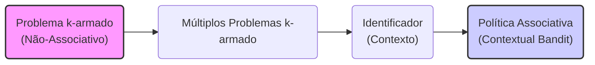
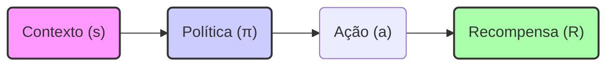
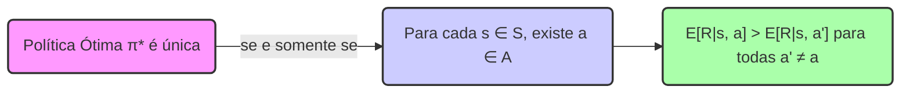
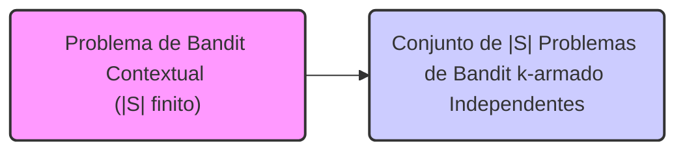
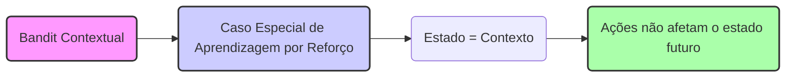
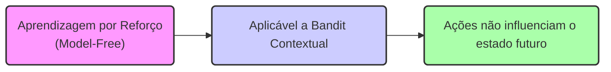

## Associative Search (Contextual Bandits)
### Introdução
O capítulo anterior focou em tarefas não associativas, onde o objetivo era encontrar uma única ação ótima, seja num ambiente estático ou dinâmico. Contudo, em cenários mais complexos de aprendizagem por reforço, é necessário associar ações específicas a diferentes situações, aprendendo assim uma política que mapeia cada situação à ação mais adequada. Esta seção do capítulo introduzirá a forma mais simples de estender as tarefas não associativas para o contexto associativo, explorando como diferentes situações influenciam as ações tomadas [1](https://chatgpt.com/c/67829922-359c-8011-96dd-970c04ed772c#user-content-fn-1).

### Conceitos Fundamentais
A transição das tarefas não associativas para as associativas é fundamental para entender como a aprendizagem por reforço se adapta a ambientes mais realistas. Imagine que, em vez de um único problema de bandit k-armado, o agente se depare com vários desses problemas, cada um selecionado aleatoriamente a cada passo [1](https://chatgpt.com/c/67829922-359c-8011-96dd-970c04ed772c#user-content-fn-1).

Inicialmente, se a probabilidade de selecionar cada problema de bandit permanecer constante ao longo do tempo, o cenário poderia ser tratado como um único problema de bandit k-armado estacionário. No entanto, a introdução de um **identificador** que fornece uma pista sobre qual problema de bandit está ativo no momento, torna a abordagem anterior inadequada. Este identificador, que pode ser, por exemplo, uma mudança na cor de uma slot machine, permite que o agente aprenda uma política que associe cada problema de bandit (identificado pelo seu sinal) à ação mais apropriada [1](https://chatgpt.com/c/67829922-359c-8011-96dd-970c04ed772c#user-content-fn-1).

A capacidade de associar ações a contextos específicos, impulsiona a necessidade do conceito de **associative search**.  A **associative search** envolve a aprendizagem por tentativa e erro para encontrar as melhores ações, mas também associa essas ações aos contextos onde são mais eficazes. Estas tarefas, também conhecidas como **contextual bandits**, preenchem a lacuna entre o problema de bandit k-armado e o problema completo de aprendizagem por reforço, introduzindo a ideia de aprender uma política, embora cada ação continue a influenciar apenas a recompensa imediata [1](https://chatgpt.com/c/67829922-359c-8011-96dd-970c04ed772c#user-content-fn-1).

Em um cenário de bandit contextual, o objetivo é aprender uma política que, para cada situação específica, determine a melhor ação a ser tomada. Em contraste com as tarefas não associativas, onde se procura uma única melhor ação para todas as situações, o bandit contextual busca a melhor ação para cada contexto possível. A política é uma função que mapeia contextos para ações, onde um contexto é uma informação observável do ambiente que influencia a melhor ação [1](https://chatgpt.com/c/67829922-359c-8011-96dd-970c04ed772c#user-content-fn-1).

Para ilustrar, suponha que o agente se depare com um problema de bandit k-armado, onde cada ação oferece uma recompensa diferente. Sem qualquer informação adicional, o agente tentaria encontrar a ação que maximiza a recompensa média. Agora, introduzindo a ideia de que cada problema tem uma "cor" diferente. O agente pode aprender que se o problema tem a cor vermelha, ele deve escolher a ação 1, se a cor for verde, deve escolher a ação 2, e assim por diante. Este aprendizado de política é um exemplo de **associative search**.

> 💡 **Exemplo Numérico:** Imagine um cenário com duas "cores" (contextos): vermelho ($s_1$) e verde ($s_2$). Existem duas ações possíveis: $a_1$ e $a_2$. As recompensas esperadas para cada contexto e ação são as seguintes:
>
> *   Contexto Vermelho ($s_1$):
>     *   $E[R | s_1, a_1] = 10$
>     *   $E[R | s_1, a_2] = 2$
> *   Contexto Verde ($s_2$):
>     *   $E[R | s_2, a_1] = 3$
>     *   $E[R | s_2, a_2] = 12$
>
> A política ótima $\pi^*$ mapearia:
>
> *   $\pi^*(s_1) = a_1$ (escolher $a_1$ no contexto vermelho)
> *   $\pi^*(s_2) = a_2$ (escolher $a_2$ no contexto verde)
>
> Esta política garante a recompensa máxima para cada contexto. Uma política subótima, como escolher sempre $a_1$ resultaria em uma recompensa média de $(10 + 3)/2=6.5$ enquanto a política ótima alcançaria $(10 + 12)/2 = 11$.

A formulação matemática pode ser descrita da seguinte forma: seja $s \in S$ o espaço dos possíveis contextos (identificadores das tarefas), e $a \in A$ o conjunto de possíveis ações. O objetivo é aprender uma política $\pi: S \rightarrow A$ que mapeie cada contexto $s$ para uma ação $a$ que maximiza a recompensa esperada $E[R|s,a]$. Ou seja, a política $\pi(s)$ indica qual ação deve ser tomada quando o agente se encontra no contexto $s$.
```mermaid
graph LR
    subgraph "Espaço de Contextos (S)"
        S("s ∈ S")
    end
    subgraph "Espaço de Ações (A)"
        A("a ∈ A")
    end
    S -->|π: S → A| A
    A -->|E[R|s,a]| R("Recompensa Esperada")
    style S fill:#f9f,stroke:#333,stroke-width:2px
    style A fill:#ccf,stroke:#333,stroke-width:2px
     style R fill:#afa,stroke:#333,stroke-width:2px
    linkStyle 0,1 stroke:#333,stroke-width:1px
```
**Lemma 1.** *A política ótima para um problema de bandit contextual é a função que mapeia cada contexto à ação que maximiza a recompensa esperada para aquele contexto.*

*Prova*: Seja $\pi^*(s)$ a ação que maximiza a recompensa esperada para o contexto $s$, isto é, $\pi^*(s) = \underset{a}{\operatorname{argmax}} \, E[R|s, a]$. Qualquer outra política $\pi(s)$ que mapeia $s$ para uma ação diferente de $\pi^*(s)$ resultará em uma recompensa esperada menor para aquele contexto. Como o objetivo é maximizar a recompensa total esperada, selecionar a ação que maximiza a recompensa em cada contexto garante a política ótima. $\blacksquare$

**Lemma 1.1.** *A política ótima $\pi^*$ é única se e somente se, para cada contexto $s \in S$, existe uma ação $a \in A$ tal que $E[R|s, a] > E[R|s, a']$ para todas as ações $a' \in A$, com $a' \neq a$.*

*Proof:* Se para cada contexto $s$ existe uma ação única $a$ que maximiza a recompensa esperada, então a política que mapeia cada contexto para essa ação é, por definição, a única política ótima. Reciprocamente, se a política ótima $\pi^*$ é única, isso significa que, em cada contexto $s$, qualquer desvio da ação escolhida por $\pi^*$ resulta em uma recompensa esperada menor. Isso só é possível se a ação escolhida por $\pi^*$ é a única ação que maximiza a recompensa esperada nesse contexto.  $\blacksquare$

> 💡 **Exemplo Numérico (Unicidade):**
>
> Considere o exemplo anterior. Para o contexto vermelho ($s_1$), a ação $a_1$ tem $E[R | s_1, a_1] = 10$, enquanto $a_2$ tem $E[R | s_1, a_2] = 2$. Como $10 > 2$, $a_1$ é a única ação ótima.  Para o contexto verde ($s_2$),  $E[R | s_2, a_1] = 3$ e $E[R | s_2, a_2] = 12$, então $a_2$ é a única ação ótima. Logo, a política que mapeia $s_1$ para $a_1$ e $s_2$ para $a_2$ é a única política ótima.
>
> Agora, imagine que $E[R | s_1, a_1] = 10$ e $E[R | s_1, a_2] = 10$. Nesse caso, as ações são equivalentes no contexto vermelho e a política ótima não é única.

A diferença crucial em relação ao problema de bandit k-armado é que, em vez de uma única ação, o agente deve aprender uma função que associe cada possível contexto a uma ação que maximize a recompensa esperada para aquele contexto. No contexto da modelagem financeira, isso pode ser aplicado para determinar estratégias de investimento ótimas com base em condições de mercado.

**Proposição 2.** *Em um problema de bandit contextual, se o número de contextos $|S|$ for finito, então o aprendizado de uma política ótima pode ser abordado como um conjunto de problemas de bandit k-armado independentes.*

*Proof:* Se o conjunto de contextos $S$ é finito, podemos considerar cada contexto $s \in S$ individualmente. Para cada contexto fixo $s$, o problema de encontrar a ação que maximiza a recompensa esperada $E[R|s,a]$ é exatamente um problema de bandit k-armado com ações $a \in A$. Portanto, o aprendizado da política ótima em um problema de bandit contextual com $|S|$ contextos finitos pode ser visto como a solução de $|S|$ problemas independentes de bandit k-armado. $\blacksquare$

> 💡 **Exemplo Numérico (Contextos Finitos):**
>
> Suponha que temos 3 contextos: $s_1, s_2,$ e $s_3$, e 2 ações: $a_1$ e $a_2$. Podemos tratar cada contexto como um problema de bandit k-armado separado:
>
> *   **Contexto $s_1$**:  $E[R | s_1, a_1] = 5$, $E[R | s_1, a_2] = 2$. O melhor seria escolher $a_1$.
> *   **Contexto $s_2$**:  $E[R | s_2, a_1] = 1$, $E[R | s_2, a_2] = 8$. O melhor seria escolher $a_2$.
> *   **Contexto $s_3$**:  $E[R | s_3, a_1] = 9$, $E[R | s_3, a_2] = 4$. O melhor seria escolher $a_1$.
>
> Para resolver o problema geral, resolvemos três problemas de bandit k-armado independentes, um para cada contexto. Assim, a política ótima é $\pi^*(s_1) = a_1$, $\pi^*(s_2) = a_2$, and $\pi^*(s_3) = a_1$.

O conceito de **associative search** destaca a importância de aprender políticas em vez de ações isoladas. Em cenários mais complexos, como em jogos ou robótica, o ambiente pode apresentar um número muito grande de contextos diferentes, tornando inviável explorar exaustivamente todas as combinações de ação e contexto. Assim, o aprendizado de uma política que generaliza o conhecimento de ações para contextos diferentes é uma solução mais eficiente e robusta. O problema de bandit contextual é um ponto de partida para a abordagem do problema de aprendizagem por reforço, onde as ações podem afetar tanto a recompensa imediata quanto o contexto futuro [1](https://chatgpt.com/c/67829922-359c-8011-96dd-970c04ed772c#user-content-fn-1).

**Teorema 3.** *O problema de bandit contextual pode ser interpretado como um caso especial do problema de aprendizagem por reforço, onde o estado é equivalente ao contexto e as ações não afetam o estado futuro.*

*Proof:* No problema de bandit contextual, cada contexto $s \in S$ pode ser visto como um estado do ambiente. A escolha de uma ação $a \in A$ em um contexto $s$ produz uma recompensa imediata $R$, mas não altera o contexto futuro, uma vez que,  por definição, o contexto é selecionado aleatoriamente a cada passo. Isso corresponde exatamente ao caso especial do problema de aprendizagem por reforço em que o próximo estado é sempre independente da ação atual. Portanto, o problema de bandit contextual é um caso particular da aprendizagem por reforço. $\blacksquare$

> 💡 **Exemplo Numérico (RL Connection):**
>
> Em um jogo simples onde um agente deve escolher entre duas ações ($a_1$ e $a_2$) em dois "estados" (contextos) diferentes ($s_1$ e $s_2$), o agente recebe recompensas imediatas, mas o "estado" seguinte é escolhido aleatoriamente, independente da ação.
>
> *   Em $s_1$, $a_1$ dá uma recompensa média de 5, e $a_2$ dá 2.
> *   Em $s_2$, $a_1$ dá uma recompensa média de 1 e $a_2$ dá 8.
>
> Mesmo que o agente esteja sempre em $s_1$ (contexto 1), ele não pode mudar para $s_2$ por suas ações. Cada escolha é independente. Isso é o mesmo que um bandit contextual, onde cada contexto ($s_1$ ou $s_2$) equivale a um estado da aprendizagem por reforço, e a ação não afeta o estado futuro.

**Corolário 3.1.** *Os algoritmos de aprendizagem por reforço que não dependem da transição de estados (model-free) são aplicáveis a problemas de bandit contextual.*

*Proof:* Dado que no problema de bandit contextual, a ação não influencia o estado futuro, algoritmos como Q-learning e SARSA, que aprendem a política diretamente através das recompensas observadas sem conhecer o modelo do ambiente, são adequados para este tipo de problema.  $\blacksquare$

> 💡 **Exemplo Numérico (Model-Free RL):**
>
> Imagine usar Q-learning para o exemplo das cores (vermelho e verde). Inicialmente, o agente não sabe as recompensas associadas a cada ação em cada contexto.
>
> O agente mantém uma tabela Q com dimensões |S| x |A|, onde S é o conjunto de contextos e A o conjunto de ações.
>
> *   $Q(s_1, a_1)$ , $Q(s_1, a_2)$, $Q(s_2, a_1)$, $Q(s_2, a_2)$
>
> O algoritmo atualiza esses valores iterativamente:
>
> $\text{Nova } Q(s, a) = \text{Antiga } Q(s, a) + \alpha [R + \gamma \max_{a'} Q(s', a') - \text{Antiga } Q(s, a)]$
>
> onde $\alpha$ é a taxa de aprendizado e $\gamma$ o fator de desconto (que pode ser 0, pois não há estados futuros). Como não existe transição de estado, o $s'$ será o próximo contexto selecionado aleatoriamente, e portanto a atualização se simplifica para
>
> $\text{Nova } Q(s, a) = \text{Antiga } Q(s, a) + \alpha [R  - \text{Antiga } Q(s, a)]$
>
> A atualização é feita com base na recompensa obtida e no valor existente, sem depender de um modelo de transição.
>
> Com o tempo e exploração, Q-learning convergeria para os valores esperados, e o agente aprenderia a política ótima.

### Conclusão
Em resumo, o problema de **associative search** ou **contextual bandit** introduz a ideia de que a melhor ação pode depender do contexto em que ela é realizada. Ao aprender uma política que associa cada contexto à sua ação mais apropriada, um agente pode otimizar o seu desempenho de forma mais eficiente. Este conceito é uma peça chave para entender a transição para problemas de aprendizagem por reforço mais complexos e está diretamente relacionado com a necessidade de aprender políticas, em vez de ações isoladas [1](https://chatgpt.com/c/67829922-359c-8011-96dd-970c04ed772c#user-content-fn-1).
### Referências
[^1]: "So far in this chapter we have considered only nonassociative tasks, that is, tasks in which there is no need to associate different actions with different situations. In these tasks the learner either tries to find a single best action when the task is stationary, or tries to track the best action as it changes over time when the task is nonstationary. However, in a general reinforcement learning task there is more than one situation, and the goal is to learn a policy: a mapping from situations to the actions that are best in those situations. To set the stage for the full problem, we briefly discuss the simplest way in which nonassociative tasks extend to the associative setting. As an example, suppose there are several different k-armed bandit tasks, and that on each step you confront one of these chosen at random. Thus, the bandit task changes randomly from step to step. If the probabilities with which each task is selected for you do not change over time, this would appear as a single stationary k-armed bandit task, and you could use one of the methods described in this chapter. Now suppose, however, that when a bandit task is selected for you, you are given some distinctive clue about its identity (but not its action values). Maybe you are facing an actual slot machine that changes the color of its display as it changes its action values. Now you can learn a policy associating each task, signaled by the color you see, with the best action to take when facing that task—for instance, if red, select arm 1; if green, select arm 2. With the right policy you can usually do much better than you could in the absence of any information distinguishing one bandit task from another. This is an example of an associative search task, so called because it involves both trial-and-error learning to search for the best actions, and association of these actions with the situations in which they are best. Associative search tasks are often now called contextual bandits in the literature. Associative search tasks are intermediate between the k-armed bandit problem and the full reinforcement learning problem. They are like the full reinforcement learning problem in that they involve learning a policy, but they are also like our version of the k-armed bandit problem in that each action affects only the immediate reward. If actions are allowed to affect the next situation as well as the reward, then we have the full reinforcement learning problem. We present this problem in the next chapter and consider its ramifications throughout the rest of the book." *(Trecho de Multi-armed Bandits)*
