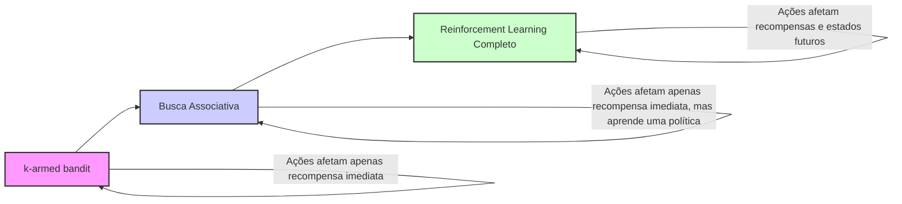
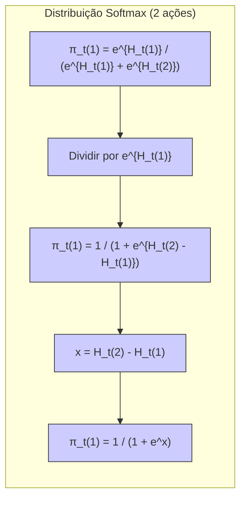
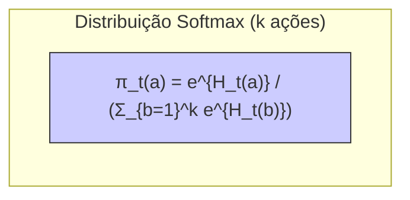
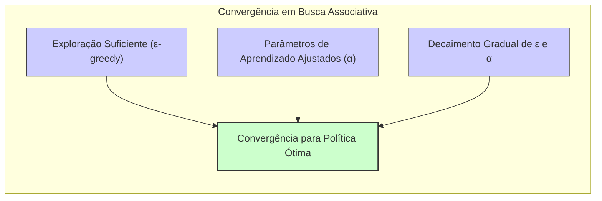
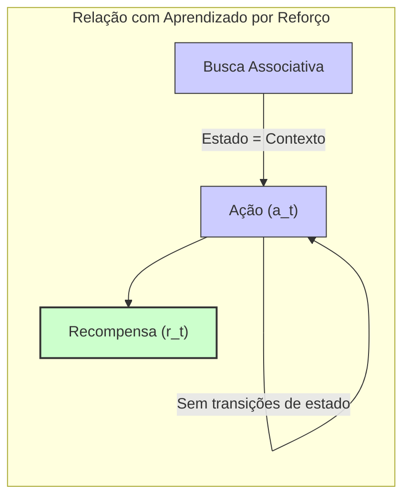

## Associative Search (Contextual Bandits)

### Introdução
Este capítulo aborda o tema de **Multi-armed Bandits**, um problema fundamental em *reinforcement learning* (RL), introduzindo o conceito de tarefas não associativas, onde o aprendizado ocorre em um único contexto. O objetivo é maximizar o total de recompensa esperada através da seleção de ações, onde cada ação resulta em uma recompensa numérica de uma distribuição de probabilidade estacionária [^1]. Este capítulo avança para um cenário mais complexo, o de **busca associativa** (associative search), que representa um passo intermediário para o problema completo de RL. Em tarefas não associativas, o foco é encontrar uma única ação ideal, enquanto em tarefas de busca associativa, as ações devem ser associadas a situações específicas. Em outras palavras, a tarefa associativa trata de mapear situações para ações que são ideais naquele contexto [^17].
```mermaid
graph LR
    A("Multi-armed Bandit (Não Associativo)") --> B("Busca Associativa (Contextual Bandit)");
    B --> C("Reinforcement Learning Completo");
    style A fill:#f9f,stroke:#333,stroke-width:2px
    style B fill:#ccf,stroke:#333,stroke-width:2px
    style C fill:#cfc,stroke:#333,stroke-width:2px
    subgraph "Níveis de Complexidade em RL"
       A
       B
       C
    end
    linkStyle 0,1,2 stroke:#333,stroke-width:1px;
```

### Conceitos Fundamentais
As tarefas de **busca associativa** (associative search), também chamadas de *contextual bandits*, são um avanço das tarefas não associativas do problema *k-armed bandit*. As tarefas não associativas focam em encontrar uma única ação ótima para todas as situações. Contudo, em cenários mais realistas, diferentes ações são adequadas dependendo do contexto, o que leva à necessidade de *aprender uma política* que mapeia situações para ações apropriadas [^17].

Imagine um cenário onde existem múltiplos problemas *k-armed bandit*, cada um com diferentes distribuições de recompensa. A cada passo, um desses problemas é selecionado aleatoriamente. Se a probabilidade de seleção de cada problema for constante, o problema pode ser tratado como um único *k-armed bandit* estacionário, aplicando os métodos abordados no capítulo [^17]. Agora, suponha que, ao selecionar um problema, o agente recebe uma dica distintiva sobre sua identidade, embora não sobre seus valores de ação. Isso pode ser ilustrado por uma máquina caça-níqueis, onde a cor da tela varia conforme os valores de ação. Nesse contexto, o agente pode aprender uma *política* que associa cada tarefa (identificada pela cor) com a melhor ação. Por exemplo, se a tela é vermelha, o braço 1 é selecionado; se a tela é verde, o braço 2 é selecionado. Essa *política* permite um desempenho muito superior se comparado a não usar essa informação distintiva [^17].

> 💡 **Exemplo Numérico:** Suponha que temos duas máquinas caça-níqueis (problemas *k-armed bandit*), uma com tela vermelha e outra com tela azul. Cada máquina tem dois braços (ações). A máquina vermelha tem uma recompensa média de 1 ao puxar o braço 1 e 0.2 ao puxar o braço 2. A máquina azul tem uma recompensa média de 0.1 ao puxar o braço 1 e 0.9 ao puxar o braço 2. Inicialmente, o agente não sabe qual braço é melhor em cada máquina. Com um algoritmo de busca associativa, o agente aprenderá a associar a cor vermelha ao braço 1 e a cor azul ao braço 2.

Essa configuração é um exemplo de uma **tarefa de busca associativa**, combinando aprendizagem por tentativa e erro para identificar as melhores ações com a associação dessas ações com as situações em que são mais eficazes [^17]. Essa classe de tarefas está entre o problema *k-armed bandit* e o problema de *reinforcement learning* completo. Assim como no *k-armed bandit*, cada ação afeta apenas a recompensa imediata, mas, como no *reinforcement learning* completo, o problema envolve o aprendizado de uma *política* [^17].


**Lemma 1: Equivalência no Cenário de Dois Braços com Soft-Max**
*Declaração*: No cenário de dois braços, a distribuição *soft-max* para seleção de ações é equivalente à distribuição dada pela função *logistic* ou *sigmoid*.
*Prova*:
Sejam $H_t(1)$ e $H_t(2)$ as preferências de ação para os braços 1 e 2, respectivamente. A distribuição *soft-max* para a escolha da ação 1 é dada por:

$$
\pi_t(1) = \frac{e^{H_t(1)}}{e^{H_t(1)} + e^{H_t(2)}}
$$

Vamos reescrever essa expressão dividindo o numerador e o denominador por $e^{H_t(1)}$:
$$
\pi_t(1) = \frac{1}{1 + e^{H_t(2) - H_t(1)}}
$$
Agora, definindo $x = H_t(2) - H_t(1)$, temos
$$
\pi_t(1) = \frac{1}{1 + e^x}
$$
que é a forma da função logística ou sigmoide, mostrando a equivalência entre as duas distribuições [^13]. $\blacksquare$


> 💡 **Exemplo Numérico:** Suponha que em um dado instante $t$, as preferências de ação são $H_t(1) = 1$ e $H_t(2) = 0.5$. Então, a probabilidade de escolher a ação 1 usando a função *soft-max* é:
>
> $\pi_t(1) = \frac{e^1}{e^1 + e^{0.5}} \approx \frac{2.718}{2.718 + 1.649} \approx \frac{2.718}{4.367} \approx 0.622$
>
> Usando a transformação para a forma sigmoide, $x = H_t(2) - H_t(1) = 0.5 - 1 = -0.5$.  A probabilidade de escolher a ação 1 é:
>
> $\pi_t(1) = \frac{1}{1 + e^{-0.5}} \approx \frac{1}{1 + 0.607} \approx \frac{1}{1.607} \approx 0.622$
>
> Este exemplo ilustra numericamente que a distribuição softmax e a função sigmoide levam à mesma probabilidade de seleção da ação, dada a diferença nas preferências.

**Lema 1.1: Generalização da Equivalência para $k$ Ações**
*Declaração*: A distribuição *soft-max* para a seleção de ações pode ser expressa em termos da função exponencial e da soma das exponenciais das preferências de todas as ações.
*Prova*:
Sejam $H_t(a)$ as preferências de ação para cada ação $a$, onde $a = 1, 2, \ldots, k$. A probabilidade de selecionar a ação $a$ é dada por:
$$
\pi_t(a) = \frac{e^{H_t(a)}}{\sum_{b=1}^k e^{H_t(b)}}
$$
Essa expressão mostra como a probabilidade de escolher uma ação $a$ é proporcional à exponencial da sua preferência $H_t(a)$, normalizada pela soma das exponenciais das preferências de todas as outras ações. Isso generaliza a formulação para $k$ ações, mantendo a ideia de que ações com preferências maiores são mais propensas a serem selecionadas. $\blacksquare$


> 💡 **Exemplo Numérico:**  Considere um cenário com 3 ações, e as preferências em um dado instante $t$ são $H_t(1) = 0.1$, $H_t(2) = 0.5$ e $H_t(3) = -0.2$. As probabilidades de selecionar cada ação usando a *soft-max* são calculadas como:
>
> $\pi_t(1) = \frac{e^{0.1}}{e^{0.1} + e^{0.5} + e^{-0.2}} \approx \frac{1.105}{1.105 + 1.649 + 0.819} \approx \frac{1.105}{3.573} \approx 0.309$
>
> $\pi_t(2) = \frac{e^{0.5}}{e^{0.1} + e^{0.5} + e^{-0.2}} \approx \frac{1.649}{3.573} \approx 0.461$
>
> $\pi_t(3) = \frac{e^{-0.2}}{e^{0.1} + e^{0.5} + e^{-0.2}} \approx \frac{0.819}{3.573} \approx 0.229$
>
> Como esperado, a ação 2, com a maior preferência (0.5), tem a maior probabilidade de ser selecionada (0.461).

A busca associativa é um problema crucial no aprendizado por reforço, pois permite que os agentes aprendam a tomar decisões ótimas em diferentes contextos, aproximando-se dos desafios do problema de RL completo.

**Lema 2: Condição para Convergência em Busca Associativa**
*Declaração*: Para garantir a convergência para a política ótima em tarefas de busca associativa, é necessário que o algoritmo de aprendizado explore suficientemente o espaço de ações em cada contexto e que os parâmetros de aprendizado sejam adequadamente ajustados.
*Prova*:
A convergência para a política ótima implica que a probabilidade de selecionar a ação correta em cada contexto se aproxima de 1 conforme o número de iterações aumenta. Para isso, o algoritmo precisa explorar ações sub-ótimas no início para descobrir a ação ótima em cada contexto. A exploração é geralmente controlada por um parâmetro $\epsilon$ em algoritmos $\epsilon$-greedy, onde o agente age aleatoriamente com probabilidade $\epsilon$ e escolhe a ação gulosa com probabilidade $1 - \epsilon$. A taxa de aprendizado $\alpha$ deve ser cuidadosamente ajustada para garantir que o algoritmo aprenda rapidamente, mas sem oscilar ou divergir. Uma taxa de aprendizado muito alta pode causar oscilações, enquanto uma taxa muito baixa pode fazer o aprendizado ser muito lento. Portanto, um decaimento gradual da taxa de exploração $\epsilon$ e da taxa de aprendizado $\alpha$ é frequentemente necessário. $\blacksquare$


> 💡 **Exemplo Numérico:** Em um experimento de busca associativa com duas máquinas caça-níqueis (vermelha e azul) e dois braços cada, podemos usar um algoritmo $\epsilon$-greedy com $\epsilon = 0.2$ e uma taxa de aprendizado $\alpha = 0.1$. Inicialmente, todas as preferências de ação são 0.
>
> - **Exploração**: Com probabilidade 0.2, o agente escolherá um braço aleatoriamente.
> - **Exploitação**: Com probabilidade 0.8, o agente escolherá o braço com a maior preferência para a máquina atual.
>
>  Suponha que o agente esteja interagindo com a máquina vermelha. No primeiro passo, o agente escolhe aleatoriamente o braço 1 (exploração), recebendo uma recompensa de 1. A preferência de ação para o braço 1 na máquina vermelha será atualizada:
>
> $H_{t+1}(1) = H_t(1) + \alpha (R_t - H_t(1)) = 0 + 0.1(1 - 0) = 0.1$
>
>  Se a próxima interação também for com a máquina vermelha e o agente escolher o braço 2 (exploração), recebendo uma recompensa de 0.2, a preferência do braço 2 será atualizada:
>
> $H_{t+1}(2) = H_t(2) + \alpha (R_t - H_t(2)) = 0 + 0.1(0.2 - 0) = 0.02$
>
> O algoritmo continuará atualizando as preferências. À medida que o número de interações aumenta, a probabilidade de exploração $(\epsilon)$ pode ser reduzida gradualmente, concentrando-se mais na exploração. O valor da taxa de aprendizado $(\alpha)$ também pode ser reduzido para estabilizar o processo. Esta abordagem garante que o algoritmo explore suficientemente o espaço de ações e encontre a política ótima.

**Teorema 1: Relação entre Busca Associativa e Aprendizado por Reforço**
*Declaração*: Tarefas de busca associativa são um caso especial de aprendizado por reforço, onde o estado é o contexto e não há transições entre estados.
*Prova*:
Em tarefas de busca associativa, cada contexto pode ser visto como um estado específico. O agente recebe um contexto (estado) $s_t$ e seleciona uma ação $a_t$ com base na política atual. A recompensa $r_t$ é recebida imediatamente após a seleção da ação, dependendo do contexto. Não há transições de estado como no aprendizado por reforço geral. Portanto, a busca associativa pode ser vista como um caso especial de aprendizado por reforço onde a dinâmica do ambiente é limitada a uma correspondência entre contextos, ações e recompensas imediatas. Em outras palavras, em tarefas de busca associativa o "estado" é o contexto, e não há transição para outros estados; uma ação leva a uma recompensa imediata dentro do mesmo contexto. $\blacksquare$


### Conclusão
As tarefas de busca associativa representam um passo fundamental na compreensão de como agentes de *reinforcement learning* podem lidar com múltiplos contextos e aprender *políticas* que mapeiam situações para ações ideais. Elas se posicionam como intermediárias entre os problemas simples *k-armed bandit* e o problema completo de *reinforcement learning*, fornecendo um ambiente de estudo para estratégias de aprendizado que consideram o contexto. A capacidade de aprender associações entre situações e ações permite que os agentes tomem decisões mais eficazes em ambientes complexos e dinâmicos. Embora o problema completo de RL ainda esteja distante, as tarefas de busca associativa nos proporcionam uma base sólida para explorar estratégias de aprendizado por reforço.

### Referências
[^1]: "The most important feature distinguishing reinforcement learning from other types of
learning is that it uses training information that evaluates the actions taken rather
than instructs by giving correct actions. This is what creates the need for active
exploration, for an explicit search for good behavior." *(Trecho de Chapter 2)*
[^17]: "So far in this chapter we have considered only nonassociative tasks, that is, tasks in which there is no need to associate different actions with different situations...However, in a general reinforcement learning task there is more than one situation, and the goal is to learn a policy: a mapping from situations to the actions that are best in those situations." *(Trecho de Chapter 2)*
[^13]: "Show that in the case of two actions, the soft-max distribution is the same as that given by the logistic, or sigmoid, function often used in statistics and artificial neural networks." *(Trecho de Chapter 2)*
