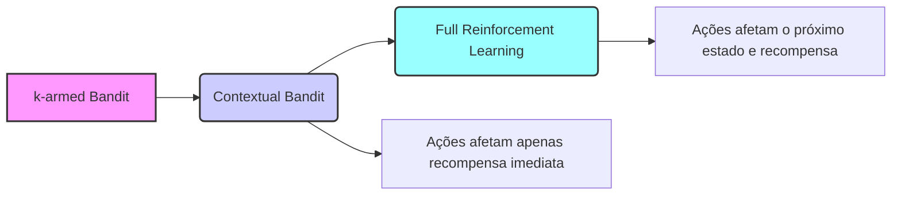
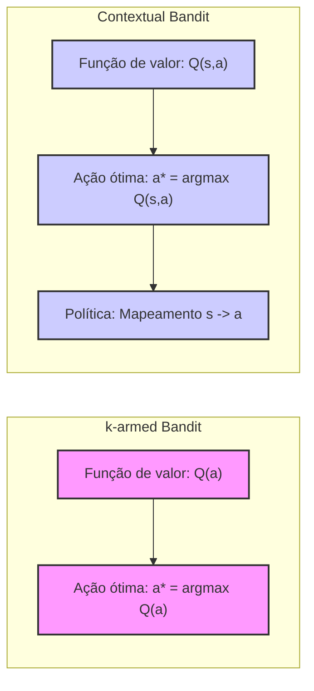
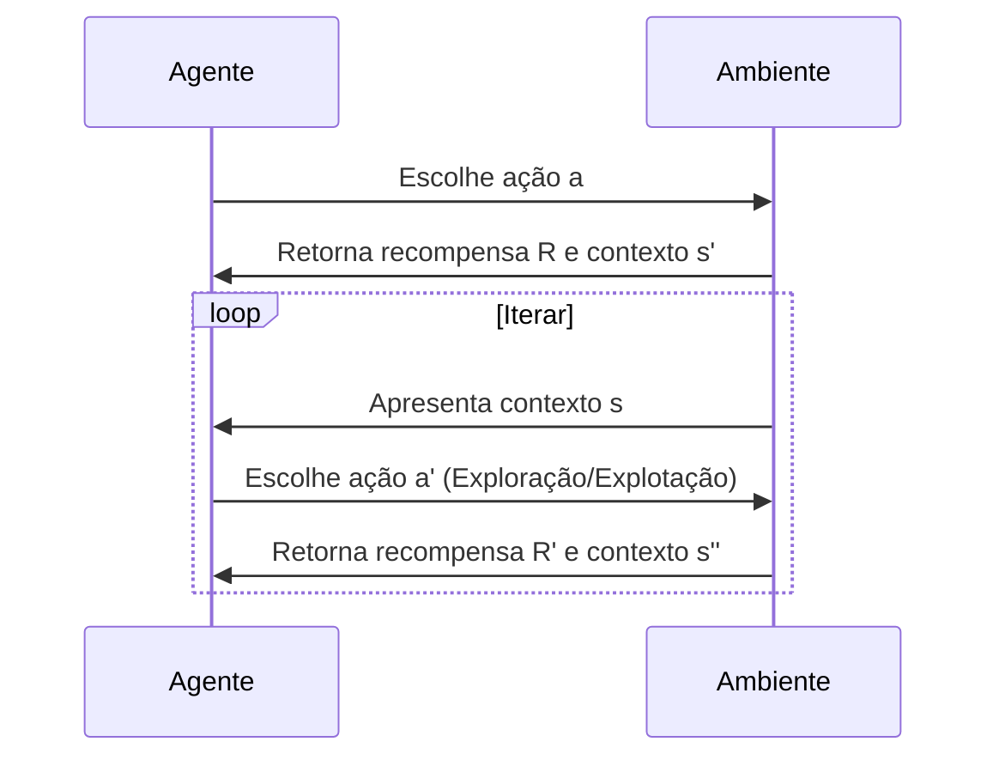

## Associative Search (Contextual Bandits)

### Introdução

Neste capítulo, até agora, foram considerados somente problemas não associativos, ou seja, problemas onde não há necessidade de associar diferentes ações com diferentes situações [1]. Nesses problemas, o agente tenta encontrar a melhor ação quando o problema é estacionário, ou acompanha a melhor ação à medida que ela muda quando o problema é não-estacionário [1]. No entanto, em um problema geral de **reinforcement learning**, existem múltiplas situações, e o objetivo é aprender uma política: um mapeamento de situações para as ações que são melhores nessas situações [1]. Para preparar o terreno para o problema completo, será discutida brevemente a forma mais simples pela qual os problemas não associativos se estendem ao cenário associativo [1].

### Conceitos Fundamentais

Imagine que existem vários problemas diferentes de *k*-armed bandits, e em cada passo o agente se depara com um desses problemas, escolhidos aleatoriamente [1]. Assim, o problema de *bandit* muda aleatoriamente de passo a passo. Se as probabilidades com que cada problema é selecionado não mudam com o tempo, isso equivaleria a um único problema estacionário de *k*-armed bandit, e um dos métodos descritos neste capítulo poderia ser usado [1].

Agora, suponha que quando um problema de *bandit* é selecionado, o agente recebe uma pista distintiva sobre sua identidade (mas não seus valores de ação) [1]. Talvez o agente esteja diante de uma máquina caça-níqueis que muda a cor de sua tela conforme seus valores de ação mudam. Agora é possível aprender uma política associando cada problema, sinalizado pela cor, com a melhor ação para aquele problema. Por exemplo, se for vermelho, selecione a alavanca 1; se for verde, selecione a alavanca 2 [1]. Com a política correta, é possível obter resultados melhores do que na ausência de informações que distinguem um problema de *bandit* do outro [1].

Este é um exemplo de **associative search task**, assim chamado porque envolve tanto aprendizado por tentativa e erro para encontrar as melhores ações, quanto a associação dessas ações com as situações em que são melhores [1]. As **associative search tasks** são frequentemente chamadas de **contextual bandits** na literatura [1]. **Contextual bandits** são um meio termo entre o problema do *k*-armed bandit e o problema completo de *reinforcement learning*. São semelhantes ao problema completo de *reinforcement learning* porque envolvem o aprendizado de uma política. No entanto, também são semelhantes à versão do problema do *k*-armed bandit porque cada ação afeta apenas a recompensa imediata [1].

*A principal distinção aqui é que, em contextual bandits, as ações não influenciam o próximo estado ou situação, apenas a recompensa obtida no momento atual.* Isto é, a ação não tem influência sobre a *próxima situação*, ou seja, qual bandit será sorteado na próxima iteração [1].

**Proposição 1:** Em um problema de *contextual bandit*, a sequência de contextos é independente da ação tomada pelo agente, o que simplifica o processo de aprendizado da política comparado a problemas onde a ação influencia a transição para o próximo estado.
*Prova:* A definição do problema *contextual bandit* estabelece que a ação escolhida afeta apenas a recompensa imediata e não o próximo contexto. Portanto, o processo de escolha do contexto é exógeno e não influenciado pelas ações do agente. $\blacksquare$

> 💡 **Exemplo Numérico:** Imagine que temos dois contextos, $s_1$ (tela vermelha) e $s_2$ (tela verde), e três ações possíveis (alavancas), $a_1$, $a_2$, e $a_3$. As recompensas associadas a cada ação em cada contexto são as seguintes:
>
> *   Contexto $s_1$: $a_1 \rightarrow 10$, $a_2 \rightarrow 2$, $a_3 \rightarrow 5$
> *   Contexto $s_2$: $a_1 \rightarrow 1$, $a_2 \rightarrow 9$, $a_3 \rightarrow 3$
>
> Uma política ótima para este problema seria selecionar $a_1$ quando o contexto é $s_1$ e $a_2$ quando o contexto é $s_2$.  A sequência de contextos é aleatória e independe das ações escolhidas. Por exemplo, a sequência pode ser $s_1, s_2, s_1, s_1, s_2$, etc., e as ações tomadas em cada etapa não influenciam qual contexto será o próximo.
>
> Em um problema tradicional de *k*-armed bandits, sem contexto, o agente tentaria aprender qual das três ações é melhor *em média*, enquanto que no *contextual bandit* o agente aprende qual ação é melhor *dado um contexto*.

Se as ações fossem permitidas para afetar a *próxima situação* bem como a recompensa, teríamos o problema completo de *reinforcement learning* [1]. Este problema será apresentado no próximo capítulo e suas ramificações serão consideradas ao longo do restante deste livro [1].

**Lemma 1:** A transição do problema de *k*-armed bandits para o **contextual bandit** adiciona a complexidade de aprendizado de uma política que associa contextos (ou situações) a ações específicas, enquanto o problema de *k*-armed bandits busca encontrar a melhor ação em uma situação fixa.

*Prova:* No problema de *k*-armed bandits, a função ótima é expressa como $$a^* = \text{argmax}_a Q(a)$$, ou seja, seleciona a ação que maximiza a recompensa esperada. Ao introduzir contextos (ou estados), passamos a ter $$a^* = \text{argmax}_a Q(s,a)$$, onde cada contexto $s$ tem sua própria função de valor, o que significa aprender um mapeamento (uma política) de contextos para ações. $\blacksquare$

**Lemma 1.1:** Em *contextual bandits*, a complexidade de aprendizado reside na necessidade de estimar $Q(s,a)$ para cada par $(s, a)$, o que aumenta o espaço de busca quando comparado ao problema de *k*-armed bandits.
*Prova:* No problema de *k*-armed bandits, temos que estimar $Q(a)$ para $k$ ações. No problema de *contextual bandits*, temos que estimar $Q(s, a)$ para cada par de contextos $s$ e ações $a$. Se temos $m$ contextos e $k$ ações, o número de parâmetros a serem aprendidos é $m \times k$, o que é uma complexidade maior quando comparado a $k$. $\blacksquare$

> 💡 **Exemplo Numérico:** Considere um problema com 2 contextos ($m=2$) e 3 ações ($k=3$). No problema de *k*-armed bandits, precisaríamos estimar 3 valores de $Q(a)$, um para cada ação. No *contextual bandit*, precisamos estimar $Q(s, a)$ para cada par $(s, a)$, ou seja, $2 \times 3 = 6$ valores: $Q(s_1, a_1), Q(s_1, a_2), Q(s_1, a_3), Q(s_2, a_1), Q(s_2, a_2), Q(s_2, a_3)$. Este aumento no número de valores a serem estimados ilustra o aumento da complexidade do problema. Se tivéssemos, por exemplo, 10 contextos e 5 ações, precisaríamos de 50 valores a serem estimados, enquanto no *k*-armed bandit seriam apenas 5.
>
> O espaço de busca é o conjunto de todas as possíveis políticas. Em um problema *k*-armed bandit, o espaço de busca é o conjunto das possíveis ações. Em *contextual bandits*, o espaço de busca é o conjunto das possíveis funções que mapeiam contextos para ações, e esse espaço cresce exponencialmente com o número de contextos.
>
> Por exemplo, se tivermos 2 contextos e 2 ações, temos 4 possíveis políticas:
>
> 1.  $s_1 \rightarrow a_1$, $s_2 \rightarrow a_1$
> 2.  $s_1 \rightarrow a_1$, $s_2 \rightarrow a_2$
> 3.  $s_1 \rightarrow a_2$, $s_2 \rightarrow a_1$
> 4.  $s_1 \rightarrow a_2$, $s_2 \rightarrow a_2$

**Corolário 1:** No problema de *k*-armed bandits, se a recompensa esperada de cada ação é constante, existe uma política ótima única; porém, em **contextual bandits**, a política ótima pode mudar dependendo do contexto, necessitando um mecanismo de aprendizado que identifique e se adapte a diferentes contextos.

**Corolário 1.1:** A necessidade de aprendizado adaptativo em *contextual bandits* significa que métodos de exploração-explotação são importantes, pois o agente precisa explorar diferentes ações em diferentes contextos para descobrir a política ótima.

> 💡 **Exemplo Numérico:** Vamos considerar novamente o exemplo de dois contextos e três ações com as recompensas dadas anteriormente. Se usarmos um método *greedy* simples (exploração = 0), o agente escolherá sempre a ação com maior recompensa estimada *até o momento* para cada contexto. Inicialmente, as estimativas das recompensas serão iguais para todas as ações, por exemplo, 0.
>
> *   **Iteração 1:** Contexto $s_1$, escolhe aleatoriamente $a_1$, recebe recompensa 10. $Q(s_1, a_1) = 10$, outras recompensas $Q(s,a)=0$.
> *   **Iteração 2:** Contexto $s_2$, escolhe aleatoriamente $a_2$, recebe recompensa 9. $Q(s_2, a_2) = 9$, outras recompensas $Q(s,a)=0$.
> *   **Iteração 3:** Contexto $s_1$, escolhe $a_1$ (maior valor), recebe recompensa 10.  $Q(s_1, a_1)$ atualizado, outras recompensas mantêm-se.
>
> Se o agente fosse *greedy*, após as duas primeiras iterações, ele nunca mais exploraria outras ações e ficaria preso a uma política subótima no caso de que, por exemplo, $a_3$ fosse a ação ótima em $s_1$.
>
> Um método $\epsilon$-greedy, por exemplo, permitiria ao agente explorar outras ações com probabilidade $\epsilon$, o que poderia levar a descobrir que $a_3$ em $s_1$ ou $a_1$ em $s_2$ poderiam ser melhores ações a longo prazo. Por exemplo, em um determinado passo onde $\epsilon$ é acionado, o agente pode escolher a ação $a_2$ em $s_1$, recebendo uma recompensa de 2, e atualizando $Q(s_1, a_2)$. Com o tempo, o agente adaptaria sua política de acordo com os valores atualizados.

### Conclusão

O **associative search** (ou **contextual bandits**) introduz a ideia de que as ações devem ser selecionadas não apenas com base em seus valores de recompensa, mas também no contexto em que são aplicadas [1]. Essa abordagem difere do problema de *k*-armed bandits ao exigir que o agente aprenda uma política, o que torna a tomada de decisões mais dependente da situação. Ao mesmo tempo, a natureza do problema **contextual bandit** ainda é restrita se comparada a um problema de **reinforcement learning** completo, pois as ações tomadas não têm impacto nas situações futuras [1].

### Referências
[^1]: "So far in this chapter we have considered only nonassociative tasks, that is, tasks in which there is no need to associate different actions with different situations. In these tasks the learner either tries to find a single best action when the task is stationary, or tries to track the best action as it changes over time when the task is nonstationary. However, in a general reinforcement learning task there is more than one situation, and the goal is to learn a policy: a mapping from situations to the actions that are best in those situations. To set the stage for the full problem, we briefly discuss the simplest way in which nonassociative tasks extend to the associative setting. As an example, suppose there are several different k-armed bandit tasks, and that on each step you confront one of these chosen at random. Thus, the bandit task changes randomly from step to step. If the probabilities with which each task is selected for you do not change over time, this would appear as a single stationary k-armed bandit task, and you could use one of the methods described in this chapter. Now suppose, however, that when a bandit task is selected for you, you are given some distinctive clue about its identity (but not its action values). Maybe you are facing an actual slot machine that changes the color of its display as it changes its action values. Now you can learn a policy associating each task, signaled by the color you see, with the best action to take when facing that task—for instance, if red, select arm 1; if green, select arm 2. With the right policy you can usually do much better than you could in the absence of any information distinguishing one bandit task from another. This is an example of an associative search task, so called because it involves both trial-and-error learning to search for the best actions, and association of these actions with the situations in which they are best. Associative search tasks are often now called contextual bandits in the literature. Associative search tasks are intermediate between the k-armed bandit problem and the full reinforcement learning problem. They are like the full reinforcement learning problem in that they involve learning a policy, but they are also like our version of the k-armed bandit problem in that each action affects only the immediate reward. If actions are allowed to affect the next situation as well as the reward, then we have the full reinforcement learning problem. We present this problem in the next chapter and consider its ramifications throughout the rest of the book." *(Trecho de Chapter 2: Multi-armed Bandits)*
