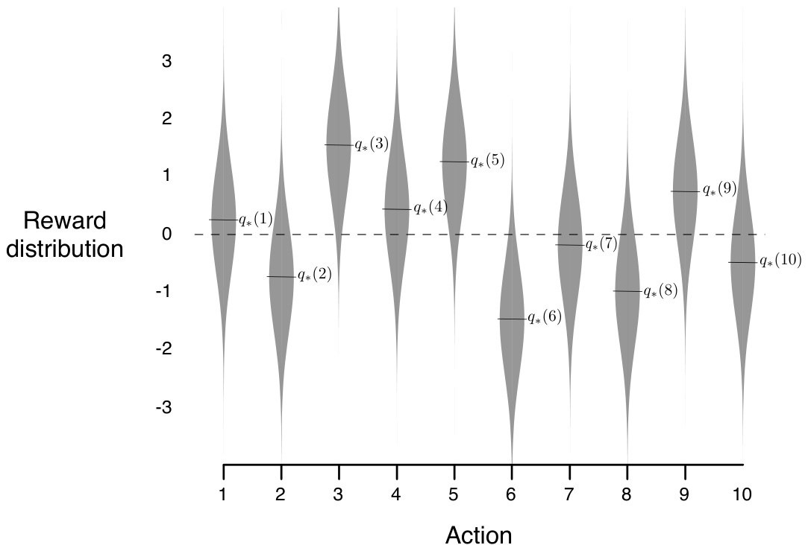
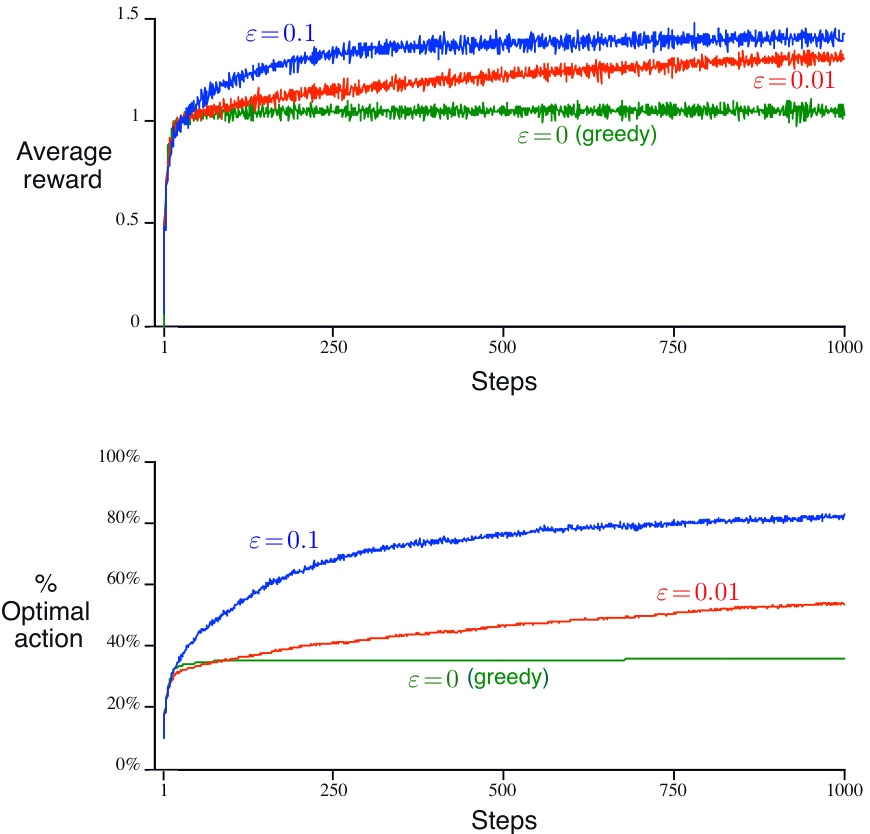
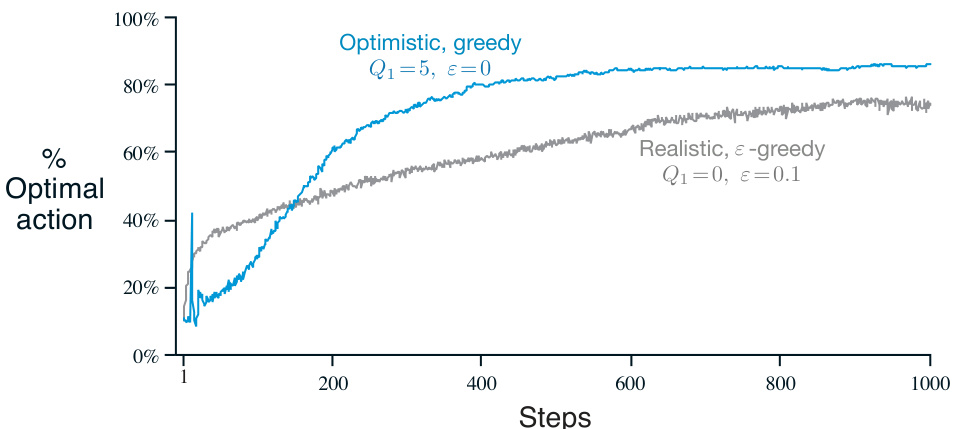
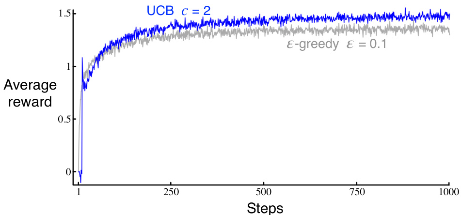
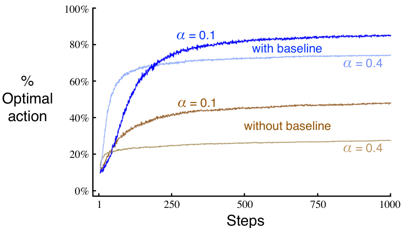
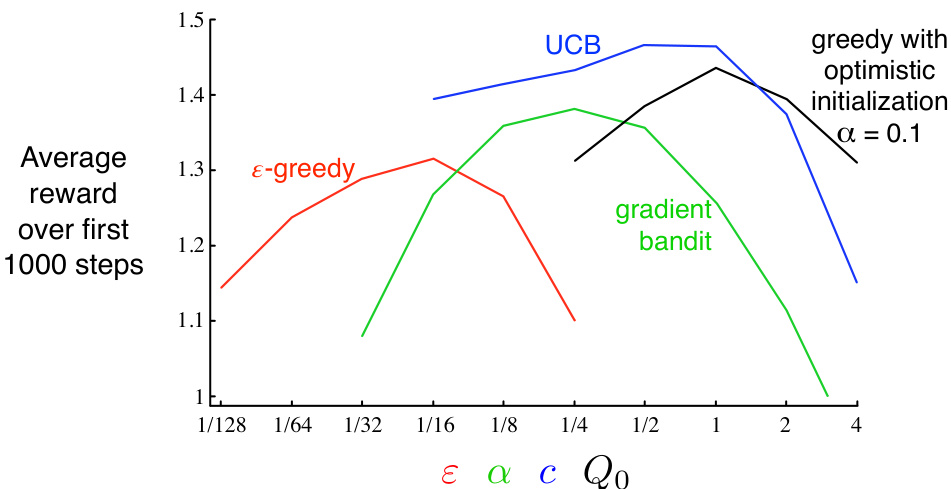

# Chapter 2  

# Multi-armed Bandits  

The most important feature distinguishing reinforcement learning from other types of learning is that it uses training information that evaluates the actions taken rather than instructs by giving correct actions. This is what creates the need for active exploration, for an explicit search for good behavior. Purely evaluative feedback indicates how good the action taken was, but not whether it was the best or the worst action possible. Purely instructive feedback, on the other hand, indicates the correct action to take, independently of the action actually taken. This kind of feedback is the basis of supervised learning, which includes large parts of pattern classification, artificial neural networks, and system identification. In their pure forms, these two kinds of feedback are quite distinct: evaluative feedback depends entirely on the action taken, whereas instructive feedback is independent of the action taken.  

In this chapter we study the evaluative aspect of reinforcement learning in a simplified setting, one that does not involve learning to act in more than one situation. This nonassociative setting is the one in which most prior work involving evaluative feedback has been done, and it avoids much of the complexity of the full reinforcement learning problem. Studying this case enables us to see most clearly how evaluative feedback di↵ers from, and yet can be combined with, instructive feedback.  

The particular nonassociative, evaluative feedback problem that we explore is a simple version of the $k$ -armed bandit problem. We use this problem to introduce a number of basic learning methods which we extend in later chapters to apply to the full reinforcement learning problem. At the end of this chapter, we take a step closer to the full reinforcement learning problem by discussing what happens when the bandit problem becomes associative, that is, when the best action depends on the situation.  

# 2.1 A k-armed Bandit Problem  

Consider the following learning problem. You are faced repeatedly with a choice among $k$ di↵erent options, or actions. After each choice you receive a numerical reward chosen from a stationary probability distribution that depends on the action you selected. Your objective is to maximize the expected total reward over some time period, for example, over 1000 action selections, or time steps.  

This is the original form of the $k$ -armed bandit problem, so named by analogy to a slot machine, or “one-armed bandit,” except that it has $k$ levers instead of one. Each action selection is like a play of one of the slot machine’s levers, and the rewards are the payo↵s for hitting the jackpot. Through repeated action selections you are to maximize your winnings by concentrating your actions on the best levers. Another analogy is that of a doctor choosing between experimental treatments for a series of seriously ill patients. Each action is the selection of a treatment, and each reward is the survival or well-being of the patient. Today the term “bandit problem” is sometimes used for a generalization of the problem described above, but in this book we use it to refer just to this simple case.  

In our $k$ -armed bandit problem, each of the $k$ actions has an expected or mean reward given that that action is selected; let us call this the value of that action. We denote the action selected on time step $t$ as $A_{t}$ , and the corresponding reward as $R_{t}$ . The value then of an arbitrary action $a$ , denoted $q_{*}(a)$ , is the expected reward given that $a$ is selected:  

$$
q_{*}(a)\doteq\mathbb{E}[R_{t}\,|\,A_{t}\!=\!a]\,.
$$

If you knew the value of each action, then it would be trivial to solve the $k$ -armed bandit problem: you would always select the action with highest value. We assume that you do not know the action values with certainty, although you may have estimates. We denote the estimated value of action $a$ at time step $t$ as $Q_{t}(a)$ . We would like $Q_{t}(a)$ to be close to $q_{*}(a)$ .  

If you maintain estimates of the action values, then at any time step there is at least one action whose estimated value is greatest. We call these the greedy actions. When you select one of these actions, we say that you are exploiting your current knowledge of the values of the actions. If instead you select one of the nongreedy actions, then we say you are exploring, because this enables you to improve your estimate of the nongreedy action’s value. Exploitation is the right thing to do to maximize the expected reward on the one step, but exploration may produce the greater total reward in the long run. For example, suppose a greedy action’s value is known with certainty, while several other actions are estimated to be nearly as good but with substantial uncertainty. The uncertainty is such that at least one of these other actions probably is actually better than the greedy action, but you don’t know which one. If you have many time steps ahead on which to make action selections, then it may be better to explore the nongreedy actions and discover which of them are better than the greedy action. Reward is lower in the short run, during exploration, but higher in the long run because after you have discovered the better actions, you can exploit them many times. Because it is not possible both to explore and to exploit with any single action selection, one often refers to the “conflict” between exploration and exploitation.  

In any specific case, whether it is better to explore or exploit depends in a complex way on the precise values of the estimates, uncertainties, and the number of remaining steps. There are many sophisticated methods for balancing exploration and exploitation for particular mathematical formulations of the $k$ -armed bandit and related problems.  

However, most of these methods make strong assumptions about stationarity and prior knowledge that are either violated or impossible to verify in most applications and in the full reinforcement learning problem that we consider in subsequent chapters. The guarantees of optimality or bounded loss for these methods are of little comfort when the assumptions of their theory do not apply.  

In this book we do not worry about balancing exploration and exploitation in a sophisticated way; we worry only about balancing them at all. In this chapter we present several simple balancing methods for the $k$ -armed bandit problem and show that they work much better than methods that always exploit. The need to balance exploration and exploitation is a distinctive challenge that arises in reinforcement learning; the simplicity of our version of the $k$ -armed bandit problem enables us to show this in a particularly clear form.  

# 2.2 Action-value Methods  

We begin by looking more closely at methods for estimating the values of actions and for using the estimates to make action selection decisions, which we collectively call action-value methods. Recall that the true value of an action is the mean reward when that action is selected. One natural way to estimate this is by averaging the rewards actually received:  

$$
Q_{t}(a)\doteq\frac{\mathrm{sum~of~rewards~when~}a\mathrm{~taken~prior~to~}t}{\mathrm{number~of~times~}a\mathrm{~taken~prior~to~}t}=\frac{\sum_{i=1}^{t-1}R_{i}\cdot\mathbb{1}_{A_{i}=a}}{\sum_{i=1}^{t-1}\mathbb{1}_{A_{i}=a}},
$$

where $\mathbb{1}_{p r e d i c a t e}$ denotes the random variable that is 1 if predicate is true and $0$ if $\mathrm{it}$ is not. If the denominator is zero, then we instead define $Q_{t}(a)$ as some default value, such as $0$ . As the denominator goes to infinity, by the law of large numbers, $Q_{t}(a)$ converges to $q_{*}(a)$ . We call this the sample-average method for estimating action values because each estimate is an average of the sample of relevant rewards. Of course this is just one way to estimate action values, and not necessarily the best one. Nevertheless, for now let us stay with this simple estimation method and turn to the question of how the estimates might be used to select actions.  

The simplest action selection rule is to select one of the actions with the highest estimated value, that is, one of the greedy actions as defined in the previous section. If there is more than one greedy action, then a selection is made among them in some arbitrary way, perhaps randomly. We write this greedy action selection method as  

$$
A_{t}\doteq\operatorname*{arg\,max}_{a}Q_{t}(a),
$$

where $\mathrm{argmax}_{a}$ denotes the action $a$ for which the expression that follows is maximized (with ties broken arbitrarily). Greedy action selection always exploits current knowledge to maximize immediate reward; it spends no time at all sampling apparently inferior actions to see if they might really be better. A simple alternative is to behave greedily most of the time, but every once in a while, say with small probability $\varepsilon$ , instead select randomly from among all the actions with equal probability, independently of the action-value estimates. We call methods using this near-greedy action selection rule $\varepsilon$ -greedy methods. An advantage of these methods is that, in the limit as the number of steps increases, every action will be sampled an infinite number of times, thus ensuring that all the $Q_{t}(a)$ converge to their respective $q_{*}(a)$ . This of course implies that the probability of selecting the optimal action converges to greater than $1-\varepsilon$ , that is, to near certainty. These are just asymptotic guarantees, however, and say little about the practical e↵ectiveness of the methods.  

Exercise 2.1 In $\varepsilon$ -greedy action selection, for the case of two actions and $\varepsilon=0.5$ , what is the probability that the greedy action is selected? ⇤  

# 2.3 The 10-armed Testbed  

To roughly assess the relative e↵ectiveness of the greedy and $\varepsilon$ -greedy action-value methods, we compared them numerically on a suite of test problems. This was a set of 2000 randomly generated $k$ -armed bandit problems with $k=10$ . For each bandit problem, such as the one shown in Figure 2.1, the action values, $q_{*}(a)$ , $a=1,\dotsc,10$ , were selected according to a normal (Gaussian) distribution with mean 0 and variance $1$ . Then, when a learning method applied to that problem selected action $A_{t}$ at time step $t$ , the actual reward, $R_{t}$ , was selected from a normal distribution with mean $q_{*}(A_{t})$ and variance 1. These distributions are shown in gray in Figure 2.1. We call this suite of test tasks the 10-armed testbed. For any learning method, we can measure its performance and behavior as it improves with experience over 1000 time steps when applied to one of the bandit problems. This makes up one run. Repeating this for 2000 independent runs, each with a di↵erent bandit problem, we obtained measures of the learning algorithm’s average behavior.  

  
Figure 2.1: An example bandit problem from the 10-armed testbed. The true value $q_{*}(a)$ of each of the ten actions was selected according to a normal distribution with mean zero and unit variance, and then the actual rewards were selected according to a mean $q_{*}(a)$ , unit-variance normal distribution, as suggested by these gray distributions.  

Figure 2.2 compares a greedy method with two $\varepsilon$ -greedy methods ( $\varepsilon\!=\!0.01$ and $\varepsilon\!=\!0.1$ ), as described above, on the 10-armed testbed. All the methods formed their action-value estimates using the sample-average technique (with an initial estimate of $0$ ). The upper graph shows the increase in expected reward with experience. The greedy method improved slightly faster than the other methods at the very beginning, but then leveled o↵ at a lower level. It achieved a reward-per-step of only about 1, compared with the best possible of about 1.54 on this testbed. The greedy method performed significantly worse in the long run because it often got stuck performing suboptimal actions. The lower graph shows that the greedy method found the optimal action in only approximately one-third of the tasks. In the other two-thirds, its initial samples of the optimal action were disappointing, and it never returned to it. The $\varepsilon$ -greedy methods eventually performed better because they continued to explore and to improve their chances of recognizing the optimal action. The $\varepsilon=0.1$ method explored more, and usually found the optimal action earlier, but it never selected that action more than $91\%$ of the time. The $\varepsilon=0.01$ method improved more slowly, but eventually would perform better than the $\varepsilon=0.1$ method on both performance measures shown in the figure. It is also possible to reduce $\varepsilon$ over time to try to get the best of both high and low values.  

  
Figure 2.2: Average performance of $\varepsilon$ -greedy action-value methods on the 10-armed testbed. These data are averages over 2000 runs with di↵erent bandit problems. All methods used sample averages as their action-value estimates.  

The advantage of $\varepsilon$ -greedy over greedy methods depends on the task. For example, suppose the reward variance had been larger, say 10 instead of 1. With noisier rewards it takes more exploration to find the optimal action, and $\varepsilon$ -greedy methods should fare even better relative to the greedy method. On the other hand, if the reward variances were zero, then the greedy method would know the true value of each action after trying it once. In this case the greedy method might actually perform best because it would soon find the optimal action and then never explore. But even in the deterministic case there is a large advantage to exploring if we weaken some of the other assumptions. For example, suppose the bandit task were nonstationary, that is, the true values of the actions changed over time. In this case exploration is needed even in the deterministic case to make sure one of the nongreedy actions has not changed to become better than the greedy one. As we shall see in the next few chapters, nonstationarity is the case most commonly encountered in reinforcement learning. Even if the underlying task is stationary and deterministic, the learner faces a set of banditlike decision tasks each of which changes over time as learning proceeds and the agent’s decision-making policy changes. Reinforcement learning requires a balance between exploration and exploitation.  

Exercise 2.2: Bandit example Consider a $k$ -armed bandit problem with $k=4$ actions, denoted 1, 2, 3, and 4. Consider applying to this problem a bandit algorithm using $\varepsilon$ -greedy action selection, sample-average action-value estimates, and initial estimates of $Q_{1}(a)=0$ , for all $a$ . Suppose the initial sequence of actions and rewards is $A_{1}=1$ , $R_{1}=-1$ , $A_{2}=2$ , $R_{2}=1$ , $A_{3}=2$ , $R_{3}=-2$ , $A_{4}=2$ , $R_{4}=2$ , ${A}_{5}=3$ , $R_{5}=0$ . On some of these time steps the $\varepsilon$ case may have occurred, causing an action to be selected at random. On which time steps did this definitely occur? On which time steps could this possibly have occurred? ⇤  

Exercise 2.3 In the comparison shown in Figure 2.2, which method will perform best in the long run in terms of cumulative reward and probability of selecting the best action? How much better will it be? Express your answer quantitatively. ⇤  

# 2.4 Incremental Implementation  

The action-value methods we have discussed so far all estimate action values as sample averages of observed rewards. We now turn to the question of how these averages can be computed in a computationally efficient manner, in particular, with constant memory and constant per-time-step computation.  

To simplify notation we concentrate on a single action. Let $R_{i}$ now denote the reward received after the $i$ th selection of this action, and let $Q_{n}$ denote the estimate of its action value after it has been selected $n-1$ times, which we can now write simply as  

$$
Q_{n}\doteq{\frac{R_{1}+R_{2}+\cdots+R_{n-1}}{n-1}}.
$$

The obvious implementation would be to maintain a record of all the rewards and then perform this computation whenever the estimated value was needed. However, if this is done, then the memory and computational requirements would grow over time as more rewards are seen. Each additional reward would require additional memory to store it and additional computation to compute the sum in the numerator.  

As you might suspect, this is not really necessary. It is easy to devise incremental formulas for updating averages with small, constant computation required to process each new reward. Given $Q_{n}$ and the $n$ th reward, $R_{n}$ , the new average of all $n$ rewards can be computed by  

$$
\begin{array}{r c l}{{Q_{n+1}}}&{{=}}&{{\displaystyle\frac{1}{n}\sum_{i=1}^{n}R_{i}}}\\ {{}}&{{=}}&{{\displaystyle\frac{1}{n}\left(R_{n}+\sum_{i=1}^{n-1}R_{i}\right)}}\\ {{}}&{{=}}&{{\displaystyle\frac{1}{n}\left(R_{n}+(n-1)\frac{1}{n-1}\sum_{i=1}^{n-1}R_{i}\right)}}\\ {{}}&{{=}}&{{\displaystyle\frac{1}{n}\left(R_{n}+(n-1)Q_{n}\right)}}\\ {{}}&{{=}}&{{\displaystyle\frac{1}{n}\left(R_{n}+n Q_{n}-Q_{n}\right)}}\\ {{}}&{{=}}&{{Q_{n}+\displaystyle\frac{1}{n}\Big[R_{n}-Q_{n}\Big],}}\end{array}
$$

which holds even for $n=1$ , obtaining $Q_{2}=R_{1}$ for arbitrary $Q_{1}$ . This implementation requires memory only for $Q_{n}$ and $n$ , and only the small computation (2.3) for each new reward.  

This update rule (2.3) is of a form that occurs frequently throughout this book. The general form is  

$$
N e w E s t i m a t e\leftarrow O I d E s t i m a t e\;+\;\;S t e p S i z e\;\Big[T a r g e t-O I d E s t i m a t e\Big].
$$

The expression $[T a r g e t-O I d E s t i m a t e]$ is an error in the estimate. It is reduced by taking a step toward the “Target.” The target is presumed to indicate a desirable direction in which to move, though it may be noisy. In the case above, for example, the target is the $n$ th reward.  

Note that the step-size parameter $(S t e p S i z e)$ used in the incremental method (2.3) changes from time step to time step. In processing the $n$ th reward for action $a$ , the method uses the step-size parameter $\scriptstyle{\frac{1}{n}}$ . In this book we denote the step-size parameter by $\alpha$ or, more generally, by $\alpha_{t}(a)$ .  

Pseudocode for a complete bandit algorithm using incrementally computed sample averages and $\varepsilon$ -greedy action selection is shown in the box below. The function bandit(a) is assumed to take an action and return a corresponding reward.  

# A simple bandit algorithm  

Initialize, for $a=1$ to $k$ : $\begin{array}{l}{Q(a)\leftarrow0}\\ {N(a)\leftarrow0}\end{array}$  

Loop forever:  

$\begin{array}{r l}&{A\gets\left\{\begin{array}{l l}{\arg\operatorname*{max}_{a}Q(a)}&{\mathrm{with~pr}}\\ {\mathrm{a~random~action}}&{\mathrm{with~pr}}\end{array}\right.}\\ &{R\gets b a n d i t(A)}\\ &{N(A)\gets N(A)+1}\\ &{Q(A)\gets Q(A)+\frac{1}{N(A)}\big[R-Q(A)\big]}\end{array}$ robability $1-\varepsilon$ (breaking ties randomly) robability $\varepsilon$  

# 2.5 Tracking a Nonstationary Problem  

The averaging methods discussed so far are appropriate for stationary bandit problems, that is, for bandit problems in which the reward probabilities do not change over time. As noted earlier, we often encounter reinforcement learning problems that are e↵ectively nonstationary. In such cases it makes sense to give more weight to recent rewards than to long-past rewards. One of the most popular ways of doing this is to use a constant step-size parameter. For example, the incremental update rule (2.3) for updating an average $Q_{n}$ of the $n-1$ past rewards is modified to be  

$$
Q_{n+1}\doteq Q_{n}+\alpha\Bigl[R_{n}-Q_{n}\Bigr],
$$

where the step-size parameter $\alpha\in(0,1]$ is constant. This results in $Q_{n+1}$ being a weighted average of past rewards and the initial estimate $Q_{1}$ :  

$$
\begin{array}{r c l}{{Q_{n+1}}}&{{=}}&{{Q_{n}+\alpha\Big[R_{n}-Q_{n}\Big]}}\\ {{}}&{{=}}&{{\alpha R_{n}+(1-\alpha)Q_{n}}}\\ {{}}&{{=}}&{{\alpha R_{n}+(1-\alpha)\big[\alpha R_{n-1}+(1-\alpha)Q_{n-1}\big]}}\\ {{}}&{{=}}&{{\alpha R_{n}+(1-\alpha)\alpha R_{n-1}+(1-\alpha)^{2}Q_{n-1}}}\\ {{}}&{{=}}&{{\alpha R_{n}+(1-\alpha)\alpha R_{n-1}+(1-\alpha)^{2}\alpha R_{n-2}+}}\\ {{}}&{{}}&{{\qquad\qquad\quad\cdots+(1-\alpha)^{n-1}\alpha R_{1}+(1-\alpha)^{n}Q_{1}}}\\ {{}}&{{=}}&{{(1-\alpha)^{n}Q_{1}+\displaystyle\sum_{i=1}^{n}\alpha(1-\alpha)^{n-i}R_{i}.}}\end{array}
$$

We call this a weighted average because the sum of the weights is $\begin{array}{r}{(1-\alpha)^{n}+\sum_{i=1}^{n}\alpha(1-}\end{array}$ $\alpha)^{n-i}=1$ , as you can check for yourself. Note that the weight, $\alpha(1-\alpha)^{n-i}$ ,  given to the reward $R_{i}$ depends on how many rewards ago, $n-i$ , it was observed. The quantity $1-\alpha$ is less than 1, and thus the weight given to $R_{i}$ decreases as the number of intervening rewards increases. In fact, the weight decays exponentially according to the exponent on $1-\alpha$ . (If $1-\alpha=0$ , then all the weight goes on the very last reward, $R_{n}$ , because of the convention that $0^{0}=1$ .) Accordingly, this is sometimes called an exponential recency-weighted average.  

Sometimes it is convenient to vary the step-size parameter from step to step. Let $\alpha_{n}(a)$ denote the step-size parameter used to process the reward received after the $n$ th selection of action $a$ . As we have noted, the choice $\textstyle\alpha_{n}(a)={\frac{1}{n}}$ results in the sample-average method, which is guaranteed to converge to the true action values by the law of large numbers. But of course convergence is not guaranteed for all choices of the sequence $\{\alpha_{n}(a)\}$ . A well-known result in stochastic approximation theory gives us the conditions required to assure convergence with probability 1:  

$$
\sum_{n=1}^{\infty}\alpha_{n}(a)=\infty\qquad\mathrm{and}\qquad\sum_{n=1}^{\infty}\alpha_{n}^{2}(a)<\infty.
$$

The first condition is required to guarantee that the steps are large enough to eventually overcome any initial conditions or random fluctuations. The second condition guarantees that eventually the steps become small enough to assure convergence.  

Note that both convergence conditions are met for the sample-average case, $\textstyle\alpha_{n}(a)={\frac{1}{n}}$ , but not for the case of constant step-size parameter, $\alpha_{n}(a)=\alpha$ . In the latter case, the second condition is not met, indicating that the estimates never completely converge but continue to vary in response to the most recently received rewards. As we mentioned above, this is actually desirable in a nonstationary environment, and problems that are e↵ectively nonstationary are the most common in reinforcement learning. In addition, sequences of step-size parameters that meet the conditions (2.7) often converge very slowly or need considerable tuning in order to obtain a satisfactory convergence rate. Although sequences of step-size parameters that meet these convergence conditions are often used in theoretical work, they are seldom used in applications and empirical research.  

Exercise 2.4 If the step-size parameters, $\alpha_{n}$ , are not constant, then the estimate $Q_{n}$ is a weighted average of previously received rewards with a weighting di↵erent from that given by (2.6). What is the weighting on each prior reward for the general case, analogous to (2.6), in terms of the sequence of step-size parameters? ⇤  

Exercise 2.5 (programming) Design and conduct an experiment to demonstrate the difficulties that sample-average methods have for nonstationary problems. Use a modified version of the 10-armed testbed in which all the $q_{*}(a)$ start out equal and then take independent random walks (say by adding a normally distributed increment with mean 0 and standard deviation 0.01 to all the $q_{*}(a)$ on each step). Prepare plots like Figure 2.2 for an action-value method using sample averages, incrementally computed, and another action-value method using a constant step-size parameter, $\alpha=0.1$ . Use $\varepsilon=0.1$ and longer runs, say of 10,000 steps. ⇤  

# 2.6 Optimistic Initial Values  

All the methods we have discussed so far are dependent to some extent on the initial action-value estimates, $Q_{1}(a)$ . In the language of statistics, these methods are biased by their initial estimates. For the sample-average methods, the bias disappears once all actions have been selected at least once, but for methods with constant $\alpha$ , the bias is permanent, though decreasing over time as given by (2.6). In practice, this kind of bias is usually not a problem and can sometimes be very helpful. The downside is that the initial estimates become, in e↵ect, a set of parameters that must be picked by the user, if only to set them all to zero. The upside is that they provide an easy way to supply some prior knowledge about what level of rewards can be expected.  

Initial action values can also be used as a simple way to encourage exploration. Suppose that instead of setting the initial action values to zero, as we did in the 10-armed testbed, we set them all to $+5$ . Recall that the $q_{*}(a)$ in this problem are selected from a normal distribution with mean 0 and variance 1. An initial estimate of $+5$ is thus wildly optimistic. But this optimism encourages action-value methods to explore. Whichever actions are initially selected, the reward is less than the starting estimates; the learner switches to other actions, being “disappointed” with the rewards it is receiving. The result is that all actions are tried several times before the value estimates converge. The system does a fair amount of exploration even if greedy actions are selected all the time.  

Figure 2.3 shows the performance on the 10-armed bandit testbed of a greedy method using $Q_{1}(a)=+5$ , for all $a$ . For comparison, also shown is an $\varepsilon$ -greedy method with $Q_{1}(a)=0$ . Initially, the optimistic method performs worse because it explores more, but eventually it performs better because its exploration decreases with time. We call this technique for encouraging exploration optimistic initial values. We regard it as a simple trick that can be quite e↵ective on stationary problems, but it is far from being a generally useful approach to encouraging exploration. For example, it is not well suited to nonstationary problems because its drive for exploration is inherently temporary. If the task changes, creating a renewed need for exploration, this method cannot help. Indeed, any method that focuses on the initial conditions in any special way is unlikely to help with the general nonstationary case. The beginning of time occurs only once, and thus we should not focus on it too much. This criticism applies as well to the sample-average methods, which also treat the beginning of time as a special event, averaging all subsequent rewards with equal weights. Nevertheless, all of these methods are very simple, and one of them—or some simple combination of them—is often adequate in practice. In the rest of this book we make frequent use of several of these simple exploration techniques.  

  
Figure 2.3: The e↵ect of optimistic initial action-value estimates on the 10-armed testbed. Both methods used a constant step-size parameter, $\alpha=0.1$ .  

Exercise 2.6: Mysterious Spikes The results shown in Figure 2.3 should be quite reliable because they are averages over 2000 individual, randomly chosen 10-armed bandit tasks. Why, then, are there oscillations and spikes in the early part of the curve for the optimistic method? In other words, what might make this method perform particularly better or worse, on average, on particular early steps? ⇤  

Exercise 2.7: Unbiased Constant-Step-Size Trick In most of this chapter we have used sample averages to estimate action values because sample averages do not produce the initial bias that constant step sizes do (see the analysis leading to (2.6)). However, sample averages are not a completely satisfactory solution because they may perform poorly on nonstationary problems. Is it possible to avoid the bias of constant step sizes while retaining their advantages on nonstationary problems? One way is to use a step size of  

$$
\beta_{n}\doteq\alpha/{\bar{o}}_{n},
$$

to process the $n$ th reward for a particular action, where $\alpha>0$ is a conventional constant step size, and $o_{n}$ is a trace of one that starts at 0:  

$$
\bar{o}_{n}\doteq\bar{o}_{n-1}+\alpha(1-\bar{o}_{n-1}),\ \ \mathrm{for}\ n>0,\ \ \mathrm{with}\ \bar{o}_{0}\doteq0.
$$

Carry out an analysis like that in (2.6) to show that $Q_{n}$ is an exponential recency-weighted average without initial bias. ⇤  

# 2.7 Upper-Confidence-Bound Action Selection  

Exploration is needed because there is always uncertainty about the accuracy of the action-value estimates. The greedy actions are those that look best at present, but some of the other actions may actually be better. $\varepsilon$ -greedy action selection forces the non-greedy actions to be tried, but indiscriminately, with no preference for those that are nearly greedy or particularly uncertain. It would be better to select among the non-greedy actions according to their potential for actually being optimal, taking into account both how close their estimates are to being maximal and the uncertainties in those estimates. One e↵ective way of doing this is to select actions according to  

$$
A_{t}\doteq\operatorname*{arg\,max}_{a}\left[Q_{t}(a)+c\sqrt{\frac{\ln t}{N_{t}(a)}}\right],
$$

where $\ln t$ denotes the natural logarithm of $t$ (the number that $e\approx2.71828$ would have to be raised to in order to equal $t$ ), $N_{t}(a)$ denotes the number of times that action $a$ has been selected prior to time $t$ (the denominator in (2.1)), and the number $c>0$ controls the degree of exploration. If $N_{t}(a)=0$ , then $a$ is considered to be a maximizing action.  

The idea of this upper confidence bound (UCB) action selection is that the square-root term is a measure of the uncertainty or variance in the estimate of $a$ ’s value. The quantity being max’ed over is thus a sort of upper bound on the possible true value of action $a$ , with $c$ determining the confidence level. Each time $a$ is selected the uncertainty is presumably reduced: $N_{t}(a)$ increments, and, as it appears in the denominator, the uncertainty term decreases. On the other hand, each time an action other than $a$ is selected, $t$ increases but $N_{t}(a)$ does not; because $t$ appears in the numerator, the uncertainty estimate increases. The use of the natural logarithm means that the increases get smaller over time, but are unbounded; all actions will eventually be selected, but actions with lower value estimates, or that have already been selected frequently, will be selected with decreasing frequency over time.  

Results with UCB on the 10-armed testbed are shown in Figure 2.4. UCB often performs well, as shown here, but is more difficult than $\varepsilon$ -greedy to extend beyond bandits to the more general reinforcement learning settings considered in the rest of this book. One difficulty is in dealing with nonstationary problems; methods more complex than those presented in Section 2.5 would be needed. Another difficulty is dealing with large state spaces, particularly when using function approximation as developed in Part II of this book. In these more advanced settings the idea of UCB action selection is usually not practical.  

  
Figure 2.4: Average performance of UCB action selection on the 10-armed testbed. As shown, UCB generally performs better than $\varepsilon$ -greedy action selection, except in the first $k$ steps, when it selects randomly among the as-yet-untried actions.  

Exercise 2.8: UCB Spikes In Figure 2.4 the UCB algorithm shows a distinct spike in performance on the 11th step. Why is this? Note that for your answer to be fully satisfactory it must explain both why the reward increases on the 11th step and why it decreases on the subsequent steps. Hint: If $c=1$ , then the spike is less prominent. ⇤  

# 2.8 Gradient Bandit Algorithms  

So far in this chapter we have considered methods that estimate action values and use those estimates to select actions. This is often a good approach, but it is not the only one possible. In this section we consider learning a numerical preference for each action $a$ , which we denote $H_{t}(a)\in\mathbb{R}$ . The larger the preference, the more often that action is taken, but the preference has no interpretation in terms of reward. Only the relative preference of one action over another is important; if we add 1000 to all the action preferences there is no e↵ect on the action probabilities, which are determined according to a soft-max distribution (i.e., Gibbs or Boltzmann distribution) as follows:  

$$
\mathrm{Pr}\{A_{t}\!=\!a\}\doteq\frac{e^{H_{t}(a)}}{\sum_{b=1}^{k}e^{H_{t}(b)}}\doteq\pi_{t}(a),
$$

where here we have also introduced a useful new notation, $\pi_{t}(a)$ , for the probability of taking action $a$ at time $t$ . Initially all action preferences are the same (e.g., $H_{1}(a)=0$ , for all $a$ ) so that all actions have an equal probability of being selected.  

Exercise 2.9 Show that in the case of two actions, the soft-max distribution is the same as that given by the logistic, or sigmoid, function often used in statistics and artificial neural networks. ⇤  

There is a natural learning algorithm for soft-max action preferences based on the idea of stochastic gradient ascent. On each step, after selecting action $A_{t}$ and receiving the reward $R_{t}$ , the action preferences are updated by:  

$$
\begin{array}{r l r l}&{H_{t+1}(A_{t})\doteq H_{t}(A_{t})+\alpha\bigl(R_{t}-\bar{R}_{t}\bigr)\bigl(1-\pi_{t}(A_{t})\bigr),}&&{\mathrm{and}}\\ &{\quad H_{t+1}(a)\doteq H_{t}(a)-\alpha\bigl(R_{t}-\bar{R}_{t}\bigr)\pi_{t}(a),}&&{\mathrm{for~all~}a\ne A_{t},}\end{array}
$$

where $\alpha>0$ is a step-size parameter, and $R_{t}\in\mathbb{R}$ is the average of the rewards up to but not including time $t$ (with $R_{1}\doteq R_{1}$ ), which can be computed incrementally as described in Section 2.4 (or Section 2.5 if the problem is nonstationary).1 The $R_{t}$ term serves as a baseline with which the reward is compared. If the reward is higher than the baseline, then the probability of taking $A_{t}$ in the future is increased, and if the reward is below baseline, then the probability is decreased. The non-selected actions move in the opposite direction.  

Figure 2.5 shows results with the gradient bandit algorithm on a variant of the 10- armed testbed in which the true expected rewards were selected according to a normal distribution with a mean of $+4$ instead of zero (and with unit variance as before). This shifting up of all the rewards has absolutely no e↵ect on the gradient bandit algorithm because of the reward baseline term, which instantaneously adapts to the new level. But if the baseline were omitted (that is, if $R_{t}$ was taken to be constant zero in (2.12)), then performance would be significantly degraded, as shown in the figure.  

  
Figure 2.5: Average performance of the gradient bandit algorithm with and without a reward baseline on the 10-armed testbed when the $q_{*}(a)$ are chosen to be near $+4$ rather than near zero.  

The Bandit Gradient Algorithm as Stochastic Gradient Ascent  

One can gain a deeper insight into the gradient bandit algorithm by understanding it as a stochastic approximation to gradient ascent. In exact gradient ascent, each action preference $\textstyle H_{t}(a)$ would be incremented in proportion to the increment’s e↵ect on performance:  

$$
H_{t+1}(a)\doteq H_{t}(a)+\alpha\frac{\partial\mathbb{E}\left[R_{t}\right]}{\partial H_{t}(a)},
$$

where the measure of performance here is the expected reward:  

$$
\mathbb{E}[R_{t}]=\sum_{x}\pi_{t}(x)q_{*}(x),
$$

and the measure of the increment’s e↵ect is the partial derivative of this performance measure with respect to the action preference. Of course, it is not possible to implement gradient ascent exactly in our case because by assumption we do not know the $q_{*}(x)$ , but in fact the updates of our algorithm (2.12) are equal to (2.13) in expected value, making the algorithm an instance of stochastic gradient ascent. The calculations showing this require only beginning calculus, but take several steps. First we take a closer look at the exact performance gradient:  

$$
\begin{array}{l}{\displaystyle\frac{\partial\mathbb{E}[R_{t}]}{\partial H_{t}(a)}=\frac{\partial}{\partial H_{t}(a)}\left[\sum_{x}\pi_{t}(x)q_{*}(x)\right]}\\ {\displaystyle=\sum_{x}q_{*}(x)\frac{\partial\pi_{t}(x)}{\partial H_{t}(a)}}\\ {\displaystyle=\sum_{x}\left(q_{*}(x)-B_{t}\right)\frac{\partial\pi_{t}(x)}{\partial H_{t}(a)},}\end{array}
$$

where $B_{t}$ , called the baseline, can be any scalar that does not depend on $x$ . We can   
include a baseline here without changing the equality because the gradient sums $\begin{array}{r}{\sum_{x}\frac{\partial\pi_{t}(x)}{\partial H_{t}(a)}=0}\end{array}$ $H_{t}(a)$   
probabilities go up and som e go down, but the sum of the changes must be zero   
because the sum of the probabilities is always one.  

Next we multiply each term of the sum by $\pi_{t}(x)/\pi_{t}(x)$ :  

$$
\frac{\partial\mathbb{E}[R_{t}]}{\partial H_{t}(a)}=\sum_{x}\pi_{t}(x)\big(q_{*}(x)-B_{t}\big)\frac{\partial\pi_{t}(x)}{\partial H_{t}(a)}/\pi_{t}(x).
$$

The equation is now in the form of an expectation, summing over all possible values $x$ of the random variable $A_{t}$ , then multiplying by the probability of taking those values. Thus:  

$$
\begin{array}{l}{\displaystyle=\mathbb{E}\bigg[\big(q_{*}(A_{t})-B_{t}\big)\frac{\partial\pi_{t}(A_{t})}{\partial H_{t}(a)}/\pi_{t}(A_{t})\bigg]}\\ {\displaystyle=\mathbb{E}\bigg[\big(R_{t}-\bar{R}_{t}\big)\frac{\partial\pi_{t}(A_{t})}{\partial H_{t}(a)}/\pi_{t}(A_{t})\bigg]\,,}\end{array}
$$

where here we have chosen the baseline $B_{t}=R_{t}$ and substituted $R_{t}$ for $q_{*}(A_{t})$ , which is permitted because $\mathbb{E}[R_{t}|A_{t}]\,=\,q_{*}(A_{t})$ . Shortly we will establish that @@ H⇡tt((xa)) = ⇡t(x)  a=x − ⇡t(a) , where a=x is defined to be 1 if a = x, else 0. Assuming that for now, we have  

$$
\begin{array}{r l}&{=\mathbb{E}\big[\big(R_{t}-\bar{R}_{t}\big)\pi_{t}(A_{t})\big(\mathbb{1}_{a=A_{t}}-\pi_{t}(a)\big)/\pi_{t}(A_{t})\big]}\\ &{=\mathbb{E}\big[\big(R_{t}-\bar{R}_{t}\big)\big(\mathbb{1}_{a=A_{t}}-\pi_{t}(a)\big)\big]\;.}\end{array}
$$

Recall that our plan has been to write the performance gradient as an expectation of something that we can sample on each step, as we have just done, and then update on each step in proportion to the sample. Substituting a sample of the expectation above for the performance gradient in (2.13) yields:  

$$
H_{t+1}(a)=H_{t}(a)+\alpha{\bigl(}R_{t}-{\bar{R}}_{t}{\bigr)}{\bigl(}\mathbb{1}_{a=A_{t}}-\pi_{t}(a){\bigr)},\qquad{\mathrm{for~all~}}a,
$$

which you may recognize as being equivalent to our original algorithm (2.12).  

Thus it remains only to show th at @@ H⇡t((xa)) = ⇡t(x) a=x − ⇡t(a) , as we assumed. Recall the standard quotient rule for derivatives:  

$$
{\frac{\partial}{\partial x}}\left[{\frac{f(x)}{g(x)}}\right]={\frac{{\frac{\partial f(x)}{\partial x}}g(x)-f(x){\frac{\partial g(x)}{\partial x}}}{g(x)^{2}}}.
$$

Using this, we can write  

(by the quotient rule)  

$$
\begin{array}{r l}{\frac{\partial\sigma_{\mathrm{r}}(x)}{\partial t_{l}(a)}=\frac{\partial}{\partial t_{l}(a)}\,\mathrm{\partial}_{\varepsilon}(x)}\\ {=}&{\frac{\partial}{\partial t_{l}(a)}\,\Biggr[\sum_{k=1}^{M(\varepsilon)}e^{\mathrm{i}\left(\varepsilon_{l}(x)\right)}}\\ {=}&{\frac{\partial\varepsilon_{\mathrm{H}}(a)}{\partial t_{l}(a)}\sum_{k=1}^{M(\varepsilon)}e^{H_{\left(\varepsilon\right)}}}\\ {=}&{\frac{\partial\varepsilon_{\mathrm{H}}(a)}{\partial t_{l}(a)}\sum_{k=1}^{M(\varepsilon)}e^{H_{\left(\varepsilon\right)}}-e^{H_{\left(\varepsilon\right)}}\frac{\partial^{2}\Sigma_{k}^{-1}+e^{H_{\left(\varepsilon\right)}}}{\partial t_{l}(a)}}\\ &{-\frac{\mathrm{I}_{\mathrm{Im}}e^{H_{\left(\varepsilon\right)}}\sum_{k=1}^{M(\varepsilon)}e^{H_{\left(\varepsilon\right)}}-e^{H_{\left(\varepsilon\right)}}\left(e^{H_{\left(\varepsilon\right)}}e^{H_{\left(\varepsilon\right)}}\right.}{\left.\sum_{k=1}^{M(\varepsilon)}e^{H_{\left(\varepsilon\right)}}\right)^{2}}}\\ {=}&{\frac{\mathrm{I}_{\mathrm{Im}}e^{H_{\left(\varepsilon\right)}}}{\sum_{k=1}^{M}e^{H_{\left(\varepsilon\right)}}}\,\Biggl[\sum_{k=1}^{M(\varepsilon)}e^{\mathrm{i}\left(\varepsilon_{l}(x)\right)}}\\ {=}&{\frac{\mathrm{I}_{\mathrm{Im}}\varepsilon_{\mathrm{H}}(\varepsilon)}{\sum_{k=1}^{M}e^{H_{\left(\varepsilon\right)}}}-\frac{e^{H_{\left(\varepsilon\right)}}\left(e^{H_{\left(\varepsilon\right)}}\right)}{\left(\sum_{k=1}^{M}e^{H_{\left(\varepsilon\right)}}\right)^{2}}}\\ {=}&{\mathrm{I}_{\omega=\varepsilon_{\mathrm{H}}}\varepsilon_{\mathrm{I}}(\varepsilon)-\tau_{\mathrm{H}}(\varepsilon)\pi_{\mathrm{I}}(\varepsilon)}\\ {=}&{\pi_{\mathrm{I}}(x)\Big(\mathrm{I}_{\omega=\varepsilon_{\mathrm{I}}}-\tau_{\mathrm{I}}(
$$

We have just shown that the expected update of the gradient bandit algorithm is equal to the gradient of expected reward, and thus that the algorithm is an instance of stochastic gradient ascent. This assures us that the algorithm has robust convergence properties.  

Note that we did not require any properties of the reward baseline other than that it does not depend on the selected action. For example, we could have set it to zero, or to 1000, and the algorithm would still be an instance of stochastic gradient ascent. The choice of the baseline does not a↵ect the expected update of the algorithm, but it does a↵ect the variance of the update and thus the rate of convergence (as shown, for example, in Figure 2.5). Choosing it as the average of the rewards may not be the very best, but it is simple and works well in practice.  

# 2.9 Associative Search (Contextual Bandits)  

So far in this chapter we have considered only nonassociative tasks, that is, tasks in which there is no need to associate di↵erent actions with di↵erent situations. In these tasks the learner either tries to find a single best action when the task is stationary, or tries to track the best action as it changes over time when the task is nonstationary. However, in a general reinforcement learning task there is more than one situation, and the goal is to learn a policy: a mapping from situations to the actions that are best in those situations. To set the stage for the full problem, we briefly discuss the simplest way in which nonassociative tasks extend to the associative setting.  

As an example, suppose there are several di↵erent $k$ -armed bandit tasks, and that on each step you confront one of these chosen at random. Thus, the bandit task changes randomly from step to step. If the probabilities with which each task is selected for you do not change over time, this would appear as a single stationary $k$ -armed bandit task, and you could use one of the methods described in this chapter. Now suppose, however, that when a bandit task is selected for you, you are given some distinctive clue about its identity (but not its action values). Maybe you are facing an actual slot machine that changes the color of its display as it changes its action values. Now you can learn a policy associating each task, signaled by the color you see, with the best action to take when facing that task—for instance, if red, select arm 1; if green, select arm 2. With the right policy you can usually do much better than you could in the absence of any information distinguishing one bandit task from another.  

This is an example of an associative search task, so called because it involves both trial-and-error learning to search for the best actions, and association of these actions with the situations in which they are best. Associative search tasks are often now called contextual bandits in the literature. Associative search tasks are intermediate between the $k$ -armed bandit problem and the full reinforcement learning problem. They are like the full reinforcement learning problem in that they involve learning a policy, but they are also like our version of the $k$ -armed bandit problem in that each action a↵ects only the immediate reward. If actions are allowed to a↵ect the next situation as well as the reward, then we have the full reinforcement learning problem. We present this problem in the next chapter and consider its ramifications throughout the rest of the book.  

Exercise 2.10 Suppose you face a 2-armed bandit task whose true action values change randomly from time step to time step. Specifically, suppose that, for any time step, the true values of actions 1 and 2 are respectively 10 and 20 with probability 0.5 (case A), and 90 and 80 with probability 0.5 (case B). If you are not able to tell which case you face at any step, what is the best expected reward you can achieve and how should you behave to achieve it? Now suppose that on each step you are told whether you are facing case A or case B (although you still don’t know the true action values). This is an associative search task. What is the best expected reward you can achieve in this task, and how should you behave to achieve it? ⇤  

# 2.10 Summary  

We have presented in this chapter several simple ways of balancing exploration and exploitation. The $\varepsilon$ -greedy methods choose randomly a small fraction of the time, whereas UCB methods choose deterministically but achieve exploration by subtly favoring at each step the actions that have so far received fewer samples. Gradient bandit algorithms estimate not action values, but action preferences, and favor the more preferred actions in a graded, probabilistic manner using a soft-max distribution. The simple expedient of initializing estimates optimistically causes even greedy methods to explore significantly.  

It is natural to ask which of these methods is best. Although this is a difficult question to answer in general, we can certainly run them all on the 10-armed testbed that we have used throughout this chapter and compare their performances. A complication is that they all have a parameter; to get a meaningful comparison we have to consider their performance as a function of their parameter. Our graphs so far have shown the course of learning over time for each algorithm and parameter setting, to produce a learning curve for that algorithm and parameter setting. If we plotted learning curves for all algorithms and all parameter settings, then the graph would be too complex and crowded to make clear comparisons. Instead we summarize a complete learning curve by its average value over the 1000 steps; this value is proportional to the area under the learning curve. Figure 2.6 shows this measure for the various bandit algorithms from this chapter, each as a function of its own parameter shown on a single scale on the x-axis. This kind of graph is called a parameter study. Note that the parameter values are varied by factors of two and presented on a log scale. Note also the characteristic inverted-U shapes of each algorithm’s performance; all the algorithms perform best at an intermediate value of their parameter, neither too large nor too small. In assessing a method, we should attend not just to how well it does at its best parameter setting, but also to how sensitive it is to its parameter value. All of these algorithms are fairly insensitive, performing well over a range of parameter values varying by about an order of magnitude. Overall, on this problem, UCB seems to perform best.  

  
Figure 2.6: A parameter study of the various bandit algorithms presented in this chapter. Each point is the average reward obtained over 1000 steps with a particular algorithm at a particular setting of its parameter.  

Despite their simplicity, in our opinion the methods presented in this chapter can fairly be considered the state of the art. There are more sophisticated methods, but their complexity and assumptions make them impractical for the full reinforcement learning problem that is our real focus. Starting in Chapter 5 we present learning methods for solving the full reinforcement learning problem that use in part the simple methods explored in this chapter.  

Although the simple methods explored in this chapter may be the best we can do at present, they are far from a fully satisfactory solution to the problem of balancing exploration and exploitation.  

One well-studied approach to balancing exploration and exploitation in $k$ -armed bandit problems is to compute a special kind of action value called a Gittins index. In certain important special cases, this computation is tractable and leads directly to optimal solutions, although it does require complete knowledge of the prior distribution of possible problems, which we generally assume is not available. In addition, neither the theory nor the computational tractability of this approach appear to generalize to the full reinforcement learning problem that we consider in the rest of the book.  

The Gittins-index approach is an instance of Bayesian methods, which assume a known initial distribution over the action values and then update the distribution exactly after each step (assuming that the true action values are stationary). In general, the update computations can be very complex, but for certain special distributions (called conjugate priors) they are easy. One possibility is to then select actions at each step according to their posterior probability of being the best action. This method, sometimes called posterior sampling or Thompson sampling, often performs similarly to the best of the distribution-free methods we have presented in this chapter.  

In the Bayesian setting it is even conceivable to compute the optimal balance between exploration and exploitation. One can compute for any possible action the probability of each possible immediate reward and the resultant posterior distributions over action values. This evolving distribution becomes the information state of the problem. Given a horizon, say of 1000 steps, one can consider all possible actions, all possible resulting rewards, all possible next actions, all next rewards, and so on for all 1000 steps. Given the assumptions, the rewards and probabilities of each possible chain of events can be determined; one need only pick the best. But the tree of possibilities grows extremely rapidly; even if there were only two actions and two rewards, the tree would have $2^{2000}$ leaves. It is generally not feasible to perform this immense computation exactly, but perhaps it could be approximated efficiently. This approach would e↵ectively turn the bandit problem into an instance of the full reinforcement learning problem. In the end, we may be able to use approximate reinforcement learning methods such as those presented in Part II of this book to approach this optimal solution. But that is a topic for research and beyond the scope of this introductory book.  

Exercise 2.11 (programming) Make a figure analogous to Figure 2.6 for the nonstationary case outlined in Exercise 2.5. Include the constant-step-size $\varepsilon$ -greedy algorithm with $\alpha\!=\!0.1$ . Use runs of 200,000 steps and, as a performance measure for each algorithm and parameter setting, use the average reward over the last 100,000 steps. ⇤  

# Bibliographical and Historical Remarks  

2.1 Bandit problems have been studied in statistics, engineering, and psychology. In statistics, bandit problems fall under the heading “sequential design of experiments,” introduced by Thompson (1933, 1934) and Robbins (1952), and studied by Bellman (1956). Berry and Fristedt (1985) provide an extensive treatment of bandit problems from the perspective of statistics. Narendra and Thathachar (1989) treat bandit problems from the engineering perspective, providing a good discussion of the various theoretical traditions that have focused on them. In psychology, bandit problems have played roles in statistical learning theory (e.g., Bush and Mosteller, 1955; Estes, 1950).  

The term greedy is often used in the heuristic search literature (e.g., Pearl, 1984). The conflict between exploration and exploitation is known in control engineering as the conflict between identification (or estimation) and control (e.g., Witten, 1976b). Feldbaum (1965) called it the dual control problem, referring to the need to solve the two problems of identification and control simultaneously when trying to control a system under uncertainty. In discussing aspects of genetic algorithms, Holland (1975) emphasized the importance of this conflict, referring to it as the conflict between the need to exploit and the need for new information.  

2.2 Action-value methods for our $k$ -armed bandit problem were first proposed by Thathachar and Sastry (1985). These are often called estimator algorithms in the learning automata literature. The term action value is due to Watkins (1989). The first to use $\varepsilon$ -greedy methods may also have been Watkins (1989, p. 187), but the idea is so simple that some earlier use seems likely.  

2.4–5 This material falls under the general heading of stochastic iterative algorithms, which is well covered by Bertsekas and Tsitsiklis (1996).  

2.6 Optimistic initialization was used in reinforcement learning by Sutton (1996).  

2.7 Early work on using estimates of the upper confidence bound to select actions was done by Lai and Robbins (1985), Kaelbling (1993b), and Agrawal (1995). The UCB algorithm we present here is called UCB1 in the literature and was first developed by Auer, Cesa-Bianchi and Fischer (2002).  

2.8 Gradient bandit algorithms are a special case of the gradient-based reinforcement learning algorithms introduced by Williams (1992) that later developed into the actor–critic and policy-gradient algorithms that we treat later in this book. Our development here was influenced by that by Balaraman Ravindran (personal  