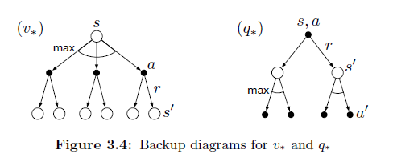

## Políticas Ótimas e Funções de Valor Ótimas em MDPs Finitos

### Introdução
Este capítulo dedica-se ao estudo das políticas ótimas e das funções de valor ótimas no contexto dos Processos de Decisão de Markov (MDPs) finitos. A busca por uma política ótima é o cerne do aprendizado por reforço, e entender as propriedades dessas políticas e como elas se relacionam com as funções de valor é fundamental para o desenvolvimento de algoritmos eficazes. Construiremos sobre os conceitos introduzidos nas seções anteriores, como o agente-ambiente interface, recompensas, retornos e, especialmente, a definição formal de políticas e funções de valor [^1].

### Conceitos Fundamentais

Em um problema de aprendizado por reforço, o objetivo principal é encontrar uma política que maximize a recompensa acumulada ao longo do tempo [^7]. No contexto de MDPs finitos, podemos definir precisamente o conceito de uma **política ótima**.

*   **Definição de Política Ótima**: Uma política $\pi$ é definida como *melhor ou igual* a uma política $\pi'$ se, e somente se, o retorno esperado de $\pi$ é maior ou igual ao de $\pi'$ para todos os estados $s \in S$ [^16]. Formalmente, $\pi \geq \pi'$ se e somente se $v_{\pi}(s) \geq v_{\pi'}(s)$ para todo $s \in S$. Uma política $\pi^*$ é considerada **ótima** se ela é melhor ou igual a todas as outras políticas possíveis. Matematicamente, $v_{\pi^*}(s) = \max_{\pi} v_{\pi}(s)$ para todo $s \in S$. Note que, embora possa existir mais de uma política ótima, todas elas compartilham a mesma **função de valor de estado ótima**, denotada por $v_*(s)$ [^16].

$$
v_*(s) = \max_{\pi} v_{\pi}(s), \forall s \in S \qquad (3.15)
$$

> 💡 **Exemplo Numérico:** Considere um MDP com dois estados, $S = \{s_1, s_2\}$, e duas políticas, $\pi_1$ e $\pi_2$. Suponha que as funções de valor para estas políticas sejam: $v_{\pi_1}(s_1) = 10$, $v_{\pi_1}(s_2) = 5$ e $v_{\pi_2}(s_1) = 8$, $v_{\pi_2}(s_2) = 7$.  Neste caso, $\pi_1$ é melhor que $\pi_2$ no estado $s_1$, mas $\pi_2$ é melhor que $\pi_1$ no estado $s_2$. Não podemos dizer que $\pi_1 \geq \pi_2$ ou $\pi_2 \geq \pi_1$ porque a condição $v_{\pi}(s) \geq v_{\pi'}(s)$ deve valer para todos os estados $s \in S$. Se existisse uma política $\pi^*$ tal que $v_{\pi^*}(s_1) = 12$ e $v_{\pi^*}(s_2) = 7$, então $\pi^*$ seria uma política ótima porque $v_{\pi^*}(s) \geq v_{\pi}(s)$ para toda política $\pi$ e para todo estado $s$.

De forma análoga, podemos definir a **função de valor de ação ótima** [^16]:

$$
q_*(s, a) = \max_{\pi} q_{\pi}(s, a), \forall s \in S, a \in A(s) \qquad (3.16)
$$

A função $q_*(s, a)$ representa o retorno esperado ao iniciar no estado $s$, tomar a ação $a$, e seguir a política ótima a partir de então. Podemos expressar $q_*(s, a)$ em termos de $v_*(s)$ como [^17]:

$$
q_*(s, a) = \mathbb{E}[R_{t+1} + \gamma v_*(S_{t+1}) | S_t = s, A_t = a] \qquad (3.17)
$$

> 💡 **Exemplo Numérico:** Suponha que em um estado $s$, tomar a ação $a_1$ leva a um estado $s'$ com $v_*(s') = 20$ e recompensa $r = 5$, enquanto tomar a ação $a_2$ leva a um estado $s''$ com $v_*(s'') = 15$ e recompensa $r = 10$. Se $\gamma = 0.9$, então:
> $q_*(s, a_1) = \mathbb{E}[5 + 0.9 \cdot 20] = 5 + 18 = 23$
> $q_*(s, a_2) = \mathbb{E}[10 + 0.9 \cdot 15] = 10 + 13.5 = 23.5$
> Neste caso, a ação ótima no estado $s$ seria $a_2$, pois $q_*(s, a_2) > q_*(s, a_1)$.

*   **Equação de otimalidade de Bellman**: A equação de otimalidade de Bellman é uma relação recursiva que expressa o valor de um estado (ou par estado-ação) em termos dos valores de seus sucessores sob uma política ótima [^13]. Ela fornece uma maneira de calcular a função de valor ótima $v_*$ e, consequentemente, encontrar uma política ótima. Intuitivamente, ela afirma que o valor de um estado sob uma política ótima deve ser igual ao retorno esperado para a melhor ação naquele estado. A equação de otimalidade de Bellman para $v_*$ é dada por [^17]:

$$
v_*(s) = \max_{a \in A(s)} \mathbb{E}[R_{t+1} + \gamma v_*(S_{t+1}) | S_t = s, A_t = a] = \max_a \sum_{s', r} p(s', r|s, a) [r + \gamma v_*(s')] \qquad (3.18, 3.19)
$$

onde $p(s', r|s, a)$ é a probabilidade de transição para o estado $s'$ e receber a recompensa $r$ ao tomar a ação $a$ no estado $s$ [^2]. A equação de otimalidade de Bellman para $q_*$ é [^18]:

$$
q_*(s, a) = \mathbb{E}[R_{t+1} + \gamma \max_{a'} q_*(S_{t+1}, a') | S_t = s, A_t = a] = \sum_{s', r} p(s', r|s, a) [r + \gamma \max_{a'} q_*(s', a')] \qquad (3.20)
$$

> 💡 **Exemplo Numérico:**  Considere um MDP com um estado $s$ e duas ações $a_1$ e $a_2$.  Ao tomar a ação $a_1$, o agente transita para o estado $s_1$ com recompensa $r_1 = 10$ e probabilidade $p(s_1, r_1|s, a_1) = 0.7$, e para o estado $s_2$ com recompensa $r_2 = 5$ e probabilidade $p(s_2, r_2|s, a_1) = 0.3$.  Ao tomar a ação $a_2$, o agente transita para o estado $s_3$ com recompensa $r_3 = 8$ e probabilidade $p(s_3, r_3|s, a_2) = 0.6$, e para o estado $s_4$ com recompensa $r_4 = 12$ e probabilidade $p(s_4, r_4|s, a_2) = 0.4$. Seja $\gamma = 0.9$, $v_*(s_1) = 20$, $v_*(s_2) = 15$, $v_*(s_3) = 18$, e $v_*(s_4) = 22$. Então, usando a Equação 3.19:
>
> $v_*(s) = \max \begin{cases}
> 0.7 \cdot (10 + 0.9 \cdot 20) + 0.3 \cdot (5 + 0.9 \cdot 15) \\
> 0.6 \cdot (8 + 0.9 \cdot 18) + 0.4 \cdot (12 + 0.9 \cdot 22)
> \end{cases}$
>
> $v_*(s) = \max \begin{cases}
> 0.7 \cdot (10 + 18) + 0.3 \cdot (5 + 13.5) \\
> 0.6 \cdot (8 + 16.2) + 0.4 \cdot (12 + 19.8)
> \end{cases}$
>
> $v_*(s) = \max \begin{cases}
> 0.7 \cdot 28 + 0.3 \cdot 18.5 \\
> 0.6 \cdot 24.2 + 0.4 \cdot 31.8
> \end{cases}$
>
> $v_*(s) = \max \begin{cases}
> 19.6 + 5.55 \\
> 14.52 + 12.72
> \end{cases}$
>
> $v_*(s) = \max \begin{cases}
> 25.15 \\
> 27.24
> \end{cases} = 27.24$
>
> Portanto, $v_*(s) = 27.24$, e a ação ótima é $a_2$.

**Teorema 1** [Formas alternativas da Equação de Otimalidade de Bellman]: A Equação de Otimalidade de Bellman para $v_*(s)$ (Equação 3.19) pode ser expressa em termos de $q_*(s,a)$ e vice-versa. Especificamente:

$$
v_*(s) = \max_{a \in A(s)} q_*(s, a) \qquad (3.21)
$$
e
$$
q_*(s, a) = \sum_{s', r} p(s', r|s, a) [r + \gamma v_*(s')] \qquad (3.22)
$$

*Proof*:
A equação (3.21) segue diretamente da definição de $v_*(s)$ como o máximo valor que pode ser obtido a partir do estado $s$ sob qualquer política, o que implica que esse valor deve ser o máximo valor de $q_*(s, a)$ sobre todas as ações $a$ disponíveis em $s$. A equação (3.22) é simplesmente a reescrita da equação (3.17) usando a notação explícita da probabilidade de transição.

*   **Unicidade da Solução**: Para MDPs finitos, a equação de otimalidade de Bellman para $v_*$ (Equação 3.19) possui uma solução única [^18]. Isso significa que existe uma única função de valor de estado ótima. Como a equação de otimalidade é um sistema de $n$ equações não lineares com $n$ incógnitas (onde $n$ é o número de estados), é possível, em princípio, resolver esse sistema usando métodos numéricos.

**Lema 1**. A contração da Equação de Bellman. O operador de Bellman é uma contração sob a norma do supremo.

*Proof*. Seja $B$ o operador de Bellman definido por
$$
(Bv)(s) = \max_{a \in A(s)} \sum_{s', r} p(s', r|s, a) [r + \gamma v(s')]
$$
Para mostrar que $B$ é uma contração, precisamos mostrar que existe um $\gamma \in [0,1)$ tal que para qualquer função de valor $v_1$ e $v_2$:
$$
||Bv_1 - Bv_2||_\infty \leq \gamma ||v_1 - v_2||_\infty
$$
onde $||v||_\infty = \max_{s \in S} |v(s)|$.
Seja $s^* = \arg \max_s |(Bv_1)(s) - (Bv_2)(s)|$, então:
$$
\begin{aligned}
|(Bv_1)(s^*) - (Bv_2)(s^*)| &= |\max_a \sum_{s',r} p(s', r|s^*, a) [r + \gamma v_1(s')] - \max_a \sum_{s',r} p(s', r|s^*, a) [r + \gamma v_2(s')]| \\
&\leq \max_a |\sum_{s',r} p(s', r|s^*, a) [r + \gamma v_1(s')] - \sum_{s',r} p(s', r|s^*, a) [r + \gamma v_2(s')]| \\
&= \max_a |\sum_{s',r} p(s', r|s^*, a) \gamma [v_1(s') - v_2(s')]| \\
&\leq \gamma \max_{s'} |v_1(s') - v_2(s')| \sum_{s',r} p(s', r|s^*, a) \\
&= \gamma ||v_1 - v_2||_\infty
\end{aligned}
$$
Portanto, $||Bv_1 - Bv_2||_\infty \leq \gamma ||v_1 - v_2||_\infty$, o que demonstra que $B$ é uma contração com fator $\gamma$.

*   **Obtenção da Política Ótima**: Uma vez que a função de valor ótima $v_*(s)$ é conhecida, a determinação de uma política ótima é relativamente direta. Para cada estado $s$, podemos escolher uma ação $a$ que maximize o lado direito da equação de otimalidade de Bellman [^18]. Qualquer política que atribua probabilidade não nula apenas a essas ações é uma política ótima. Em outras palavras, uma política *gulosa* (greedy) em relação à função de valor ótima $v_*(s)$ é necessariamente uma política ótima [^18].
    Formalmente, uma política $\pi^*$ é ótima se, para todo estado $s \in S$:

    $$
    \pi^*(a|s) =
    \begin{cases}
    1, & \text{se } a = \arg\max_{a' \in A(s)} \sum_{s', r} p(s', r|s, a') [r + \gamma v_*(s')] \\
    0, & \text{caso contrário}
    \end{cases}
    $$

*Exemplo*: No contexto do exemplo do Gridworld [^14], uma vez que a função de valor ótima $v_*(s)$ é conhecida (como mostrado na Figura 3.5), uma política ótima pode ser facilmente construída escolhendo, para cada estado $s$, a ação que leva ao estado sucessor $s'$ com o maior valor $v_*(s')$.

> 💡 **Exemplo Numérico:**  Considere um Gridworld simplificado com 3 estados: `Start`, `A`, e `Goal`.  O agente começa em `Start`, pode ir para `A` ou diretamente para `Goal`. Se vai para `A`, pode depois ir para `Goal`.  Recompensas: `Start` -> `Goal`: +10, `Start` -> `A`: 0, `A` -> `Goal`: +10. Seja $\gamma = 0.9$. Suponha que já calculamos $v_*(\text{Goal}) = 0$ (estado terminal), e $v_*(\text{A}) = 9$.
>
> No estado `Start`, temos duas ações:
> 1.  Ir direto para `Goal`: $q_*(\text{Start}, \text{Goal}) = 10 + \gamma \cdot v_*(\text{Goal}) = 10 + 0.9 * 0 = 10$
> 2.  Ir para `A`: $q_*(\text{Start}, \text{A}) = 0 + \gamma \cdot v_*(\text{A}) = 0 + 0.9 * 9 = 8.1$
>
> Assim, $v_*(\text{Start}) = \max(10, 8.1) = 10$.  A política ótima em `Start` seria ir diretamente para `Goal`.

**Proposição 1** [Multiplicidade de Políticas Ótimas]: Em um MDP, pode existir mais de uma política ótima, mas todas essas políticas alcançam a mesma função de valor ótima $v_*(s)$.

*Proof:*
I.  Suponha que existam duas políticas ótimas distintas, $\pi_1^*$ e $\pi_2^*$.
II. Pela definição de otimalidade, temos $v_{\pi_1^*}(s) = v_*(s)$ e $v_{\pi_2^*}(s) = v_*(s)$ para todo $s \in S$.
III. Portanto, $v_{\pi_1^*}(s) = v_{\pi_2^*}(s)$ para todo $s \in S$, demonstrando que ambas as políticas alcançam a mesma função de valor ótima, embora possam diferir nas ações escolhidas em alguns estados. ■

### Conclusão

A caracterização das políticas ótimas e das funções de valor ótimas é um passo crucial na teoria do aprendizado por reforço. A equação de otimalidade de Bellman fornece uma base teórica para algoritmos que buscam encontrar políticas ótimas, e a unicidade da solução garante que, sob certas condições, podemos convergir para uma solução ótima bem definida. Embora a solução direta da equação de otimalidade possa ser computacionalmente inviável para grandes MDPs, os conceitos e resultados apresentados nesta seção são fundamentais para o desenvolvimento de métodos aproximados que serão explorados em capítulos posteriores.

### Referências

[^2]: p(s',r|s,a) = Pr{St=s',R₁=r | St−1=s, At−1=a},

[^7]: The agent's objective is to maximize the amount of reward it receives over time.

[^13]: A fundamental property of value functions used throughout reinforcement learning and dynamic programming is that they satisfy recursive relationships similar to that which we have already established for the return (3.9).

[^14]: Example 3.5: Gridworld Figure 3.2 (left) shows a rectangular gridworld representation of a simple finite MDP. The cells of the grid correspond to the states of the environment.

[^16]: Value functions define a partial ordering over policies. A policy πis defined to be better than or equal to a policy π' if its expected return is greater than or equal to that of π' for all states.

[^17]:  q*(s, a) = E[Rt+1 + γυ*(St+1) | St=s, At=a]

[^18]: Once one has v∗, it is relatively easy to determine an optimal policy. For each state s, there will be one or more actions at which the maximum is obtained in the Bellman optimality equation. Any policy that assigns nonzero probability only to these actions is an optimal policy.
<!-- END -->