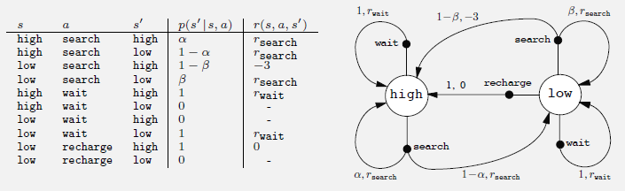

## O Interface Agente-Ambiente em Processos de Decisão de Markov Finitos

### Introdução
Em processos de decisão de Markov (MDPs) finitos, a interação entre o **agente** e o **ambiente** é fundamental para o aprendizado e a tomada de decisões. O agente, como o aprendiz e tomador de decisões, busca atingir um objetivo através da interação contínua com o ambiente. O ambiente, por sua vez, compreende tudo o que está fora do agente, respondendo às ações do agente e fornecendo *recompensas* e *novos estados* [^47]. Este capítulo explora em detalhes a natureza dessa interação, os papéis do agente e do ambiente, e como essa estrutura permite a formalização do problema de aprendizado por reforço.

### Conceitos Fundamentais

A interação entre o agente e o ambiente em um MDP finito ocorre em uma sequência de *passos de tempo discretos*, denotados por $t = 0, 1, 2, 3, \ldots$ [^48]. Em cada passo de tempo $t$, o agente recebe uma representação do **estado** do ambiente, $S_t \in \mathcal{S}$, onde $\mathcal{S}$ é o conjunto de todos os estados possíveis. Com base neste estado, o agente seleciona uma **ação**, $A_t \in \mathcal{A}(s)$, onde $\mathcal{A}(s)$ é o conjunto de ações disponíveis no estado $s$. A escolha da ação influencia não apenas a recompensa imediata, mas também os estados futuros [^47].

> 💡 **Exemplo Numérico:** Imagine um agente (um robô) em um ambiente simples com três estados: $\mathcal{S} = \{\text{Bateria Cheia, Bateria Média, Bateria Fraca}\}$. O agente está no estado $S_t = \text{Bateria Média}$. As ações possíveis nesse estado são $\mathcal{A}(\text{Bateria Média}) = \{\text{Procurar Carregador, Continuar Tarefa}\}$. Se o agente escolher a ação $A_t = \text{Procurar Carregador}$, isso afetará a recompensa imediata (gasto de energia) e o próximo estado (a bateria pode carregar ou não).

Como consequência da ação do agente, o ambiente responde com uma **recompensa numérica**, $R_{t+1} \in \mathbb{R}$, e transita para um novo **estado**, $S_{t+1}$. Essa interação contínua gera uma sequência ou trajetória que se inicia da seguinte forma:
$$S_0, A_0, R_1, S_1, A_1, R_2, S_2, A_2, R_3, \ldots$$ [^48]

> 💡 **Exemplo Numérico:** Continuando o exemplo do robô, se no estado $S_t = \text{Bateria Média}$, o robô escolhe a ação $A_t = \text{Continuar Tarefa}$, o ambiente pode responder com uma recompensa $R_{t+1} = -1$ (indicando uma pequena perda de energia) e o próximo estado pode ser $S_{t+1} = \text{Bateria Fraca}$. A sequência até agora seria:  $\text{Bateria Média}, \text{Continuar Tarefa}, -1, \text{Bateria Fraca}, \ldots$

Em um MDP *finito*, os conjuntos de estados $\mathcal{S}$, ações $\mathcal{A}$ e recompensas $\mathcal{R}$ possuem um número finito de elementos [^48]. As variáveis aleatórias $R_t$ e $S_t$ possuem *distribuições de probabilidade discretas* bem definidas, que dependem apenas do estado e da ação precedentes. Em outras palavras, para valores específicos $s' \in \mathcal{S}$ e $r \in \mathcal{R}$, existe uma probabilidade de que esses valores ocorram no tempo $t$, dado o estado $s$ e a ação $a$ no tempo anterior:

$$p(s', r | s, a) = Pr\{S_t = s', R_t = r | S_{t-1} = s, A_{t-1} = a\}$$ [^48]

> 💡 **Exemplo Numérico:** Suponha que $\mathcal{S} = \{s_1, s_2\}$, $\mathcal{A}(s_1) = \{a_1, a_2\}$ e $\mathcal{R} = \{0, 1\}$. Se o agente estiver no estado $s_1$ e tomar a ação $a_1$, a função de dinâmica pode ser:
>
>  $p(s_1, 0 | s_1, a_1) = 0.6$ (probabilidade de permanecer em $s_1$ e receber recompensa 0)
>
>  $p(s_2, 0 | s_1, a_1) = 0.3$ (probabilidade de ir para $s_2$ e receber recompensa 0)
>
>  $p(s_1, 1 | s_1, a_1) = 0.1$ (probabilidade de permanecer em $s_1$ e receber recompensa 1)
>
>  $p(s_2, 1 | s_1, a_1) = 0.0$ (probabilidade de ir para $s_2$ e receber recompensa 1)

Essa função $p$, denominada *função de dinâmica* do MDP, define a dinâmica do ambiente. A função $p : \mathcal{S} \times \mathcal{R} \times \mathcal{S} \times \mathcal{A} \rightarrow [0, 1]$ é uma função determinística de quatro argumentos [^48].

É importante notar que $p$ especifica uma distribuição de probabilidade para cada escolha de $s$ e $a$, ou seja:

$$\sum_{s' \in \mathcal{S}} \sum_{r \in \mathcal{R}} p(s', r | s, a) = 1, \text{ para todo } s \in \mathcal{S}, a \in \mathcal{A}(s)$$ [^49]

**Prova:**

Provaremos que $\sum_{s' \in \mathcal{S}} \sum_{r \in \mathcal{R}} p(s', r | s, a) = 1$ para todo $s \in \mathcal{S}$ e $a \in \mathcal{A}(s)$.

I.  $p(s', r | s, a)$ representa a probabilidade condicional de transitar para o estado $s'$ e receber a recompensa $r$, dado o estado $s$ e a ação $a$.

II. A soma $\sum_{s' \in \mathcal{S}} \sum_{r \in \mathcal{R}} p(s', r | s, a)$ representa a soma das probabilidades de *todos* os possíveis próximos estados $s'$ e recompensas $r$, dado o estado $s$ e a ação $a$.

III. Uma vez que o agente está no estado $s$ e executa a ação $a$, o ambiente *deve* transitar para algum estado $s'$ e emitir alguma recompensa $r$.

IV.  Portanto, a soma das probabilidades de todos os resultados possíveis deve ser igual a 1, pois representa a certeza de que algum resultado ocorrerá.

V.  Assim, $\sum_{s' \in \mathcal{S}} \sum_{r \in \mathcal{R}} p(s', r | s, a) = 1$. ■

> 💡 **Exemplo Numérico:** No exemplo anterior, com $\mathcal{S} = \{s_1, s_2\}$, $\mathcal{A}(s_1) = \{a_1, a_2\}$ e $\mathcal{R} = \{0, 1\}$, e $p(s_1, 0 | s_1, a_1) = 0.6$, $p(s_2, 0 | s_1, a_1) = 0.3$, $p(s_1, 1 | s_1, a_1) = 0.1$, $p(s_2, 1 | s_1, a_1) = 0.0$, podemos verificar que a soma das probabilidades é 1: $0.6 + 0.3 + 0.1 + 0.0 = 1.0$.

Em um processo de decisão de Markov, as probabilidades dadas por $p$ caracterizam completamente a dinâmica do ambiente [^49]. A probabilidade de cada valor possível para $S_t$ e $R_t$ depende do estado e da ação imediatamente anteriores, $S_{t-1}$ e $A_{t-1}$, e não depende de estados e ações anteriores, desde que $S_{t-1}$ contenha todas as informações relevantes do histórico da interação agente-ambiente [^49].

*A propriedade de Markov* impõe uma restrição não sobre o processo de decisão, mas sobre o estado. O estado deve incluir informações sobre todos os aspectos da interação agente-ambiente passada que fazem diferença para o futuro [^49]. Se o estado satisfaz a propriedade de Markov, diz-se que ele tem a *propriedade de Markov*. Assume-se que o estado sempre possui a propriedade de Markov. Métodos de aproximação que não se baseiam nesta propriedade e construção de estados Markovianos a partir de observações não Markovianas são tratados posteriormente [^49].

A partir da função de dinâmica de quatro argumentos, $p$, é possível computar outras informações sobre o ambiente, como as *probabilidades de transição de estado* (denotadas como $p(s' | s, a)$), que representam a probabilidade de transitar para o estado $s'$ dado o estado $s$ e a ação $a$:
$$p(s' | s, a) = Pr\{S_t = s' | S_{t-1} = s, A_{t-1} = a\} = \sum_{r \in \mathcal{R}} p(s', r | s, a)$$ [^49]

**Prova:**

Provaremos que $p(s' | s, a) = \sum_{r \in \mathcal{R}} p(s', r | s, a)$.

I. Queremos encontrar a probabilidade de transitar para o estado $s'$ dado o estado $s$ e a ação $a$, ou seja, $p(s' | s, a)$.

II. Sabemos que $p(s', r | s, a)$ é a probabilidade conjunta de transitar para o estado $s'$ e receber a recompensa $r$, dado o estado $s$ e a ação $a$.

III. Para obter a probabilidade de transitar para o estado $s'$ independentemente da recompensa, precisamos somar a probabilidade conjunta $p(s', r | s, a)$ sobre todos os possíveis valores de $r$.

IV. Portanto, $p(s' | s, a) = \sum_{r \in \mathcal{R}} p(s', r | s, a)$. ■

> 💡 **Exemplo Numérico:** Usando o exemplo anterior, para calcular $p(s_1 | s_1, a_1)$, somamos as probabilidades de ir para $s_1$ com cada possível recompensa:
>
> $p(s_1 | s_1, a_1) = p(s_1, 0 | s_1, a_1) + p(s_1, 1 | s_1, a_1) = 0.6 + 0.1 = 0.7$.
>
> Similarmente, $p(s_2 | s_1, a_1) = p(s_2, 0 | s_1, a_1) + p(s_2, 1 | s_1, a_1) = 0.3 + 0.0 = 0.3$.

Também é possível computar as *recompensas esperadas* para pares estado-ação $r(s, a)$:

$$r(s, a) = \mathbb{E}[R_t | S_{t-1} = s, A_{t-1} = a] = \sum_{r \in \mathcal{R}} r \sum_{s' \in \mathcal{S}} p(s', r | s, a)$$ [^49]

**Prova:**

Provaremos que $r(s, a) = \mathbb{E}[R_t | S_{t-1} = s, A_{t-1} = a] = \sum_{r \in \mathcal{R}} r \sum_{s' \in \mathcal{S}} p(s', r | s, a)$.

I.  A recompensa esperada $r(s, a)$ é definida como o valor esperado da recompensa $R_t$ dado o estado anterior $S_{t-1} = s$ e a ação anterior $A_{t-1} = a$, ou seja, $\mathbb{E}[R_t | S_{t-1} = s, A_{t-1} = a]$.

II. Pela definição de valor esperado para variáveis discretas, o valor esperado de $R_t$ é a soma de cada valor possível de $R_t$ multiplicado pela sua probabilidade condicional. Neste caso, precisamos considerar todos os possíveis próximos estados $s'$ e recompensas $r$.

III. A probabilidade de receber a recompensa $r$ e transitar para o estado $s'$ dado $s$ e $a$ é dada por $p(s', r | s, a)$.

IV. Para calcular a recompensa esperada, somamos o produto da recompensa $r$ pela probabilidade $p(s', r | s, a)$ sobre todos os possíveis estados $s'$ e recompensas $r$:

V.  $\mathbb{E}[R_t | S_{t-1} = s, A_{t-1} = a] = \sum_{r \in \mathcal{R}} \sum_{s' \in \mathcal{S}} r \cdot p(s', r | s, a)$.

VI. Rearranjando a soma, obtemos $r(s, a) = \sum_{r \in \mathcal{R}} r \sum_{s' \in \mathcal{S}} p(s', r | s, a)$. ■

> 💡 **Exemplo Numérico:** Usando os valores anteriores, a recompensa esperada para o estado $s_1$ e ação $a_1$ é:
>
> $r(s_1, a_1) = \sum_{r \in \{0, 1\}} r \sum_{s' \in \{s_1, s_2\}} p(s', r | s_1, a_1) = 0 \cdot (p(s_1, 0 | s_1, a_1) + p(s_2, 0 | s_1, a_1)) + 1 \cdot (p(s_1, 1 | s_1, a_1) + p(s_2, 1 | s_1, a_1)) = 0 \cdot (0.6 + 0.3) + 1 \cdot (0.1 + 0.0) = 0 + 0.1 = 0.1$.

E as recompensas esperadas para as triplas estado-ação-próximo estado $r(s, a, s')$:

$$r(s, a, s') = \mathbb{E}[R_t | S_{t-1} = s, A_{t-1} = a, S_t = s'] = \sum_{r \in \mathcal{R}} r \frac{p(s', r | s, a)}{p(s' | s, a)}$$ [^49]

**Prova:**

Provaremos que $r(s, a, s') = \mathbb{E}[R_t | S_{t-1} = s, A_{t-1} = a, S_t = s'] = \sum_{r \in \mathcal{R}} r \frac{p(s', r | s, a)}{p(s' | s, a)}$.

I.  A recompensa esperada $r(s, a, s')$ é definida como o valor esperado da recompensa $R_t$ dado o estado anterior $S_{t-1} = s$, a ação anterior $A_{t-1} = a$ e o próximo estado $S_t = s'$, ou seja, $\mathbb{E}[R_t | S_{t-1} = s, A_{t-1} = a, S_t = s']$.

II. Pela definição de valor esperado para variáveis discretas, o valor esperado de $R_t$ é a soma de cada valor possível de $R_t$ multiplicado pela sua probabilidade condicional. Neste caso, a probabilidade condicional é $p(r | s, a, s')$.

III. Portanto, $\mathbb{E}[R_t | S_{t-1} = s, A_{t-1} = a, S_t = s'] = \sum_{r \in \mathcal{R}} r \cdot p(r | s, a, s')$.

IV. Pela definição de probabilidade condicional, $p(r | s, a, s') = \frac{p(s', r | s, a)}{p(s' | s, a)}$.

V.  Substituindo na equação do valor esperado, obtemos $r(s, a, s') = \sum_{r \in \mathcal{R}} r \frac{p(s', r | s, a)}{p(s' | s, a)}$. ■

> 💡 **Exemplo Numérico:**  Calcular $r(s_1, a_1, s_1)$. Primeiro, $p(s_1 | s_1, a_1) = 0.7$ (calculado anteriormente).
>
> $r(s_1, a_1, s_1) = \sum_{r \in \{0, 1\}} r \frac{p(s_1, r | s_1, a_1)}{p(s_1 | s_1, a_1)} = 0 \cdot \frac{p(s_1, 0 | s_1, a_1)}{0.7} + 1 \cdot \frac{p(s_1, 1 | s_1, a_1)}{0.7} = 0 \cdot \frac{0.6}{0.7} + 1 \cdot \frac{0.1}{0.7} = 0 + \frac{0.1}{0.7} \approx 0.143$.

O framework MDP é abstrato e flexível, podendo ser aplicado em diferentes problemas. Os passos de tempo podem se referir a estágios sucessivos arbitrários de tomada de decisão e ação [^49]. As ações podem ser controles de baixo nível ou decisões de alto nível [^49]. Os estados podem ser completamente determinados por sensações de baixo nível ou serem descrições simbólicas mais abstratas [^49].

Para complementar a descrição das recompensas esperadas, podemos definir a *função de recompensa de transição* $p(r | s, a, s')$, que representa a probabilidade de receber uma recompensa $r$ ao transitar do estado $s$ para o estado $s'$ sob a ação $a$:

$$p(r | s, a, s') = Pr\{R_t = r | S_{t-1} = s, A_{t-1} = a, S_t = s'\} = \frac{p(s', r | s, a)}{p(s' | s, a)}$$

**Prova:**

Provaremos que $p(r | s, a, s') = Pr\{R_t = r | S_{t-1} = s, A_{t-1} = a, S_t = s'\} = \frac{p(s', r | s, a)}{p(s' | s, a)}$.

I.  Pela definição de probabilidade condicional, a probabilidade de um evento A dado o evento B é definida como $P(A|B) = \frac{P(A \cap B)}{P(B)}$, onde $P(A \cap B)$ é a probabilidade conjunta de A e B.

II. No nosso caso, queremos encontrar a probabilidade de receber a recompensa $r$ dado o estado anterior $s$, a ação $a$ e o próximo estado $s'$. Portanto, queremos calcular $p(r | s, a, s') = Pr\{R_t = r | S_{t-1} = s, A_{t-1} = a, S_t = s'\}$.

III. Usando a definição de probabilidade condicional, podemos reescrever isso como:
$p(r | s, a, s') = \frac{Pr\{R_t = r, S_t = s' | S_{t-1} = s, A_{t-1} = a\}}{Pr\{S_t = s' | S_{t-1} = s, A_{t-1} = a\}}$.

IV. Usando a notação da função de dinâmica, isso se torna $p(r | s, a, s') = \frac{p(s', r | s, a)}{p(s' | s, a)}$. ■

> 💡 **Exemplo Numérico:** Calcular $p(1 | s_1, a_1, s_1)$. Já sabemos que $p(s_1 | s_1, a_1) = 0.7$. Então:
>
> $p(1 | s_1, a_1, s_1) = \frac{p(s_1, 1 | s_1, a_1)}{p(s_1 | s_1, a_1)} = \frac{0.1}{0.7} \approx 0.143$.
>
> Isso significa que, dado que o agente estava em $s_1$, tomou a ação $a_1$ e foi para o estado $s_1$, a probabilidade de ter recebido uma recompensa de 1 é aproximadamente 0.143.

**Teorema 1** A função de dinâmica $p(s', r | s, a)$ e a função de recompensa de transição $p(r | s, a, s')$ caracterizam completamente as recompensas e transições de estado no MDP.

*Prova:* A função de dinâmica descreve a probabilidade conjunta de transição para um próximo estado e receber uma recompensa. A função de recompensa de transição especifica a probabilidade de receber uma recompensa dado uma transição de estado. Juntas, essas funções fornecem todas as informações necessárias para modelar as recompensas e transições de estado.

Adicionalmente, é útil definir a *função de valor esperado do próximo estado* dado o estado atual e a ação:

$$v(s, a) = \mathbb{E}[S_t | S_{t-1} = s, A_{t-1} = a] = \sum_{s' \in \mathcal{S}} s' p(s' | s, a)$$

É importante notar que, em muitos casos, o estado não é numérico, e esta função não é diretamente aplicável. No entanto, em situações onde o estado possui uma representação numérica, esta função pode ser útil para análise.

**Prova:**

Provaremos que $v(s, a) = \mathbb{E}[S_t | S_{t-1} = s, A_{t-1} = a] = \sum_{s' \in \mathcal{S}} s' p(s' | s, a)$.

I. Definimos $v(s, a)$ como o valor esperado do próximo estado $S_t$, dado o estado anterior $S_{t-1} = s$ e a ação anterior $A_{t-1} = a$. Ou seja, $v(s, a) = \mathbb{E}[S_t | S_{t-1} = s, A_{t-1} = a]$.

II. Pela definição de valor esperado,  $\mathbb{E}[X] = \sum x P(X=x)$ para uma variável aleatória discreta $X$.

III. Aplicando essa definição ao nosso caso, onde $X = S_t$, temos que $\mathbb{E}[S_t | S_{t-1} = s, A_{t-1} = a] = \sum_{s' \in \mathcal{S}} s' \cdot Pr\{S_t = s' | S_{t-1} = s, A_{t-1} = a\}$.

IV. Sabemos que $Pr\{S_t = s' | S_{t-1} = s, A_{t-1} = a\} = p(s' | s, a)$, a probabilidade de transição para o estado $s'$ dado $s$ e $a$.

V. Substituindo, obtemos $v(s, a) = \sum_{s' \in \mathcal{S}} s' p(s' | s, a)$. ■

> 💡 **Exemplo Numérico:**  Assumindo que os estados $s_1$ e $s_2$ são representados numericamente como 1 e 2, respectivamente, podemos calcular o valor esperado do próximo estado dado o estado $s_1$ e a ação $a_1$:
>
> $v(s_1, a_1) = \sum_{s' \in \{s_1, s_2\}} s' p(s' | s_1, a_1) = 1 \cdot p(s_1 | s_1, a_1) + 2 \cdot p(s_2 | s_1, a_1) = 1 \cdot 0.7 + 2 \cdot 0.3 = 0.7 + 0.6 = 1.3$.
>
> Isso significa que, em média, o próximo estado será 1.3 (em uma escala onde $s_1$ é 1 e $s_2$ é 2).

### Conclusão

A interface agente-ambiente em MDPs finitos fornece uma estrutura poderosa para modelar problemas de tomada de decisão sequencial [^47]. Ao definir claramente os papéis do agente e do ambiente, bem como a forma como eles interagem, essa estrutura permite que o problema de aprendizado por reforço seja formalizado matematicamente. A função de dinâmica, $p(s', r | s, a)$, desempenha um papel central, pois captura a maneira como o ambiente responde às ações do agente e fornece a base para a definição de conceitos como políticas, funções de valor e otimalidade [^48].

### Referências
[^47]: Sutton, Richard S., and Andrew G. Barto. *Reinforcement learning: An introduction*. Cambridge, MA: MIT press, 2018.
[^48]: Seção 3.1, Capítulo 3, *Reinforcement learning: An introduction*, Sutton and Barto, 2018.
[^49]: Seção 3.1, Capítulo 3, *Reinforcement learning: An introduction*, Sutton and Barto, 2018.
<!-- END -->