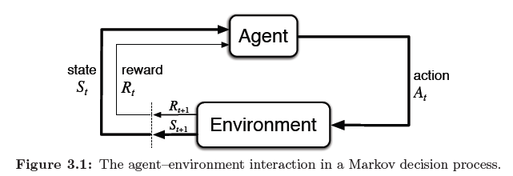

## Goals and Rewards in Reinforcement Learning: Formalizing the Objective

### Introdução
Em reinforcement learning, a formalização do objetivo do agente é crucial para direcionar o aprendizado e o comportamento. Este capítulo explora como os **goals** e **rewards** são definidos dentro do framework de **Markov Decision Processes (MDPs)**, focando na **reward hypothesis** como um elemento distintivo do reinforcement learning [^1]. A hipótese propõe que *todos os objetivos e propósitos podem ser bem representados como a maximização do valor esperado da soma cumulativa de um sinal escalar recebido (a recompensa)* [^1]. Este capítulo aprofunda essa hipótese, explorando suas implicações e exemplos práticos.

### Conceitos Fundamentais

A **reward hypothesis** é um dos pilares do reinforcement learning, fornecendo uma forma clara e concisa de definir o que o agente deve alcançar. Ao contrário de outras abordagens de aprendizado de máquina, o reinforcement learning depende fortemente de um sinal de recompensa externo para guiar o aprendizado.
No reinforcement learning, o propósito ou objetivo do agente é formalizado em termos de um sinal especial, chamado **recompensa**, que passa do ambiente para o agente [^7]. A cada passo de tempo, a recompensa é um número simples, $R_t \in \mathbb{R}$ [^7]. Informalmente, o objetivo do agente é maximizar a quantidade total de recompensa que ele recebe [^7]. Isso significa maximizar não a recompensa imediata, mas a recompensa cumulativa a longo prazo [^7]. Podemos declarar claramente essa ideia informal como a **hipótese da recompensa** [^7]:

>Que tudo o que queremos dizer por objetivos e propósitos pode ser bem pensado como a maximização do valor esperado da soma cumulativa de um sinal escalar recebido (chamado de recompensa) [^7].

A utilização de um sinal de recompensa para formalizar a ideia de um objetivo é uma das características mais distintas do reinforcement learning [^7]. Embora formular objetivos em termos de sinais de recompensa possa parecer limitante à primeira vista, na prática se mostrou flexível e amplamente aplicável [^7].

**Exemplos Práticos:**

1.  **Robot Learning to Walk:** Para fazer um robô aprender a andar, pesquisadores forneceram recompensa em cada passo de tempo proporcional ao movimento para frente do robô [^7].
2.  **Robot Escaping a Maze:** Para fazer um robô aprender a escapar de um labirinto, a recompensa é frequentemente -1 para cada passo de tempo que passa antes da fuga; isso incentiva o agente a escapar o mais rápido possível [^7].
3.  **Robot Recycling Cans:** Para fazer um robô aprender a encontrar e coletar latas de refrigerante vazias para reciclagem, pode-se dar uma recompensa de zero na maior parte do tempo e, em seguida, uma recompensa de +1 para cada lata coletada [^7]. Também se pode querer dar ao robô recompensas negativas quando ele bate em coisas ou quando alguém grita com ele [^7].

4.  **Game Playing:** Para um agente aprender a jogar damas ou xadrez, as recompensas naturais são +1 para ganhar, -1 para perder e 0 para empatar e para todas as posições não terminais [^7].

> 💡 **Exemplo Numérico:** Considere um jogo simples onde o agente recebe +1 por ganhar, -1 por perder e 0 em outros momentos. Se o agente joga 3 partidas e obtém as seguintes recompensas: [0, -1, +1], o retorno cumulativo sem desconto ($\gamma = 1$) é 0 - 1 + 1 = 0. Com um desconto de $\gamma = 0.9$, o retorno seria $0 + (-1 * 0.9) + (1 * 0.9^2) = -0.9 + 0.81 = -0.09$. Este exemplo ilustra como o fator de desconto influencia a avaliação das recompensas futuras.

Em todos esses exemplos, o agente sempre aprende a maximizar sua recompensa [^7]. Se queremos que ele faça algo por nós, devemos fornecer recompensas para ele de tal forma que, ao maximizá-las, o agente também alcance nossos objetivos [^7]. É, portanto, crucial que as recompensas que configuramos indiquem verdadeiramente o que queremos que seja realizado [^8]. Em particular, o sinal de recompensa não é o lugar para transmitir ao agente conhecimento prévio sobre *como* alcançar o que queremos que ele faça [^8]. Por exemplo, um agente de jogo de xadrez deve ser recompensado apenas por realmente vencer, não por atingir sub-objetivos, como tomar as peças do oponente ou controlar o centro do tabuleiro [^8]. Se alcançar esses tipos de sub-objetivos fosse recompensado, então o agente poderia encontrar uma maneira de alcançá-los sem atingir o objetivo real [^8]. Por exemplo, ele pode encontrar uma maneira de tomar as peças do oponente, mesmo ao custo de perder o jogo [^8]. *O sinal de recompensa é sua maneira de comunicar ao agente o que você quer que seja alcançado, não como você quer que seja alcançado* [^8].

Para complementar essa discussão sobre como formular recompensas, podemos introduzir o conceito de *recompensas esparsas* e suas implicações.

**Recompensas Esparsas:**

Em muitos problemas do mundo real, obter um sinal de recompensa significativo é raro. Nesses casos, o agente recebe recompensas zero ou muito pequenas na maioria dos passos de tempo e uma recompensa significativa apenas quando atinge um objetivo específico. Esses ambientes são caracterizados por *recompensas esparsas*.

> 💡 **Exemplo Numérico:** Imagine um robô tentando pegar um objeto em uma sala. Ele recebe uma recompensa de +1 apenas quando consegue pegar o objeto. Se ele tenta 100 vezes e só pega o objeto uma vez, ele recebe 99 recompensas de 0 e uma recompensa de +1. Este é um exemplo de recompensa esparsa.

**Desafios das Recompensas Esparsas:**

O principal desafio em ambientes com recompensas esparsas é a dificuldade de aprendizado. Como o agente raramente recebe feedback positivo, pode levar um tempo excessivamente longo para descobrir ações que levam a recompensas. Isso resulta em uma exploração ineficiente do espaço de estados-ações.

**Estratégias para Lidar com Recompensas Esparsas:**

Várias técnicas podem ser empregadas para mitigar os problemas associados a recompensas esparsas:

*   **Shaping de Recompensa:** Introduzir recompensas intermediárias para guiar o agente em direção ao objetivo. No entanto, é crucial projetar o shaping de recompensa cuidadosamente para evitar consequências indesejadas, conforme mencionado anteriormente.
*   **Curriculum Learning:** Treinar o agente em uma sequência de tarefas progressivamente mais difíceis. Isso permite que o agente aprenda habilidades básicas em ambientes mais simples antes de enfrentar o problema complexo com recompensas esparsas.
*   **Exploração Intrínseca:** Incentivar a exploração do agente, recompensando-o por visitar estados novos ou executar ações inesperadas. Isso pode ajudar o agente a descobrir caminhos para recompensas mesmo em ambientes esparsos. Exemplos incluem *curiosity-driven exploration* e *novelty search*.
*   **Aprendizado por Imitação:** Utilizar demonstrações de um especialista para inicializar o aprendizado do agente. Ao imitar as ações do especialista, o agente pode aprender a atingir o objetivo mais rapidamente, mesmo com recompensas esparsas.

> 💡 **Exemplo Numérico:** Em um ambiente com recompensas esparsas, um agente pode inicialmente explorar aleatoriamente. Sem exploração intrínseca, ele pode receber [0, 0, 0, 0, 0, 1] como recompensas após 6 passos, onde 1 é a recompensa rara. Ao adicionar um bônus de curiosidade (e.g., +0.1 para visitar um novo estado), as recompensas podem se tornar [0.1, 0.1, 0.1, 0.1, 0.1, 1.1]. Isso incentiva o agente a continuar explorando e aprender mais rápido.

### Conclusão

A **reward hypothesis** não é isenta de críticas, mas sua eficácia em uma ampla gama de problemas de reinforcement learning é inegável [^7]. Ela fornece uma base sólida para projetar agentes inteligentes capazes de aprender e se adaptar a ambientes complexos.
Ao formular o problema em termos de maximização de recompensa, o framework de MDP permite a aplicação de técnicas matemáticas e computacionais para encontrar **políticas ótimas** [^18]. A escolha cuidadosa de sinais de recompensa é essencial para garantir que o agente aprenda o comportamento desejado [^8].
Em essência, a reward hypothesis oferece um meio poderoso e flexível de formalizar o conceito de objetivo em reinforcement learning [^7]. Através da manipulação cuidadosa dos sinais de recompensa, é possível direcionar agentes de reinforcement learning para aprender e executar uma ampla variedade de tarefas complexas [^7].

Para formalizar a ideia de maximização da recompensa cumulativa, podemos definir o conceito de *retorno*.

**Definição de Retorno:**

O *retorno* $G_t$ é definido como a soma das recompensas futuras, descontadas por um fator $\gamma \in [0, 1]$:

$$G_t = R_{t+1} + \gamma R_{t+2} + \gamma^2 R_{t+3} + \ldots = \sum_{k=0}^{\infty} \gamma^k R_{t+k+1}$$

O fator de desconto $\gamma$ determina a importância das recompensas futuras. Se $\gamma = 0$, o agente se preocupa apenas com a recompensa imediata. Se $\gamma = 1$, todas as recompensas futuras são consideradas igualmente importantes.

Com essa definição, a reward hypothesis pode ser reformulada como: o objetivo do agente é maximizar o valor esperado do retorno $G_t$. Essa formulação é fundamental para o desenvolvimento de algoritmos de reinforcement learning que visam encontrar políticas ótimas.

> 💡 **Exemplo Numérico:** Suponha que um agente receba as seguintes recompensas ao longo de 5 passos: [1, 0, -1, 2, 1]. Se o fator de desconto $\gamma = 0.9$, o retorno no tempo t=0 seria:
> $G_0 = 1 + 0.9 * 0 + 0.9^2 * (-1) + 0.9^3 * 2 + 0.9^4 * 1 = 1 + 0 - 0.81 + 1.458 + 0.6561 = 2.3041$.
> Se $\gamma = 0$, o retorno no tempo t=0 seria simplesmente $G_0 = 1$.

**Prova da soma do retorno:**

A equação para o retorno $G_t$ pode ser escrita de forma recursiva, o que é útil para muitas derivações e algoritmos em reinforcement learning. Vamos provar a forma recursiva do retorno.

I. Começamos com a definição de retorno:
   $$G_t = R_{t+1} + \gamma R_{t+2} + \gamma^2 R_{t+3} + \ldots$$

II. Podemos fatorar $\gamma$ do segundo termo em diante:
    $$G_t = R_{t+1} + \gamma (R_{t+2} + \gamma R_{t+3} + \gamma^2 R_{t+4} + \ldots)$$

III. Note que o termo entre parênteses é exatamente a definição de $G_{t+1}$:
     $$G_{t+1} = R_{t+2} + \gamma R_{t+3} + \gamma^2 R_{t+4} + \ldots$$

IV. Substituindo $G_{t+1}$ na equação de $G_t$:
    $$G_t = R_{t+1} + \gamma G_{t+1}$$

V. Portanto, provamos que o retorno $G_t$ pode ser expresso recursivamente como $G_t = R_{t+1} + \gamma G_{t+1}$. ■

### Referências
[^1]: Chapter 3: Finite Markov Decision Processes
[^7]: Section 3.2 Goals and Rewards
[^8]: Section 3.2 Goals and Rewards
[^18]: Chapter 4: Dynamic Programming
<!-- END -->