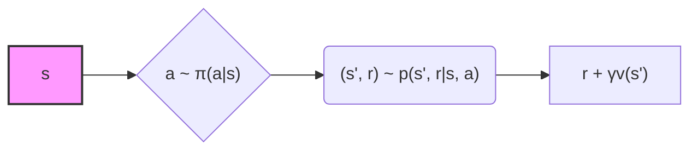

## Retornos Recursivos e a Equação de Bellman

### Introdução
A compreensão da relação recursiva entre retornos em sucessivos passos de tempo é fundamental para a teoria e os algoritmos de *reinforcement learning*. Esta seção explora essa relação, que leva diretamente à *Bellman equation*, uma ferramenta essencial para a análise e solução de *Markov decision processes (MDPs)*. o objetivo do agente é maximizar o retorno cumulativo [^53].

### Conceitos Fundamentais

A relação recursiva entre retornos em passos de tempo sucessivos é expressa pela equação [^55]:

$$
G_t = R_{t+1} + \gamma G_{t+1}
$$

onde $G_t$ é o retorno no tempo *t*, $R_{t+1}$ é a recompensa recebida no tempo *t+1*, e $\gamma$ é a taxa de desconto, com $0 \leq \gamma \leq 1$. Essa equação demonstra que o retorno no tempo *t* é a soma da recompensa imediata $R_{t+1}$ e o retorno descontado no próximo passo de tempo, $\gamma G_{t+1}$.

> 💡 **Exemplo Numérico:**
>
> Suponha que um agente esteja em um estado no tempo $t$. Ele recebe uma recompensa $R_{t+1} = 10$ no tempo $t+1$. Se a taxa de desconto $\gamma = 0.9$ e o retorno no tempo $t+1$ é $G_{t+1} = 50$, então o retorno no tempo $t$ é:
>
> $G_t = R_{t+1} + \gamma G_{t+1} = 10 + 0.9 \times 50 = 10 + 45 = 55$
>
> Isso significa que o retorno total esperado a partir do tempo $t$ é 55, considerando a recompensa imediata e o retorno futuro descontado.

Essa relação é crucial por várias razões:

1.  **Eficiência Computacional:** A recursão permite o cálculo eficiente dos retornos, evitando a necessidade de somar sequências infinitas de recompensas diretamente [^55].
2.  **Base para Algoritmos:** Muitos algoritmos de *reinforcement learning*, como *dynamic programming* e *temporal-difference learning*, exploram essa recursão para atualizar estimativas de valor e aprender políticas ótimas [^59, 60].
3.  **Fundamento Teórico:** A relação recursiva é a base da *Bellman equation*, que expressa a relação de consistência entre o valor de um estado e os valores de seus estados sucessores [^60, 63].

Além dessas razões, é importante notar que a escolha da taxa de desconto $\gamma$ impacta significativamente o comportamento do agente. Valores de $\gamma$ próximos de 0 tornam o agente míope, priorizando recompensas imediatas, enquanto valores próximos de 1 fazem com que o agente considere recompensas futuras com quase o mesmo peso das recompensas imediatas, levando a um planejamento de longo prazo mais abrangente.

> 💡 **Exemplo Numérico:**
>
> Considere dois cenários:
>
> *   Cenário 1: $\gamma = 0.1$. O agente recebe recompensas de 10, 20 e 30 em três passos de tempo subsequentes. O retorno no tempo $t=0$ seria $G_0 = 10 + 0.1 \times 20 + 0.1^2 \times 30 = 10 + 2 + 0.3 = 12.3$. O agente prioriza a recompensa imediata de 10.
> *   Cenário 2: $\gamma = 0.9$. Com as mesmas recompensas, o retorno no tempo $t=0$ seria $G_0 = 10 + 0.9 \times 20 + 0.9^2 \times 30 = 10 + 18 + 24.3 = 52.3$. O agente considera fortemente as recompensas futuras.
>
> Isso demonstra como $\gamma$ influencia a importância relativa das recompensas futuras em relação às recompensas imediatas.

A *Bellman equation* para a *state-value function* $v_\pi(s)$ sob uma política $\pi$ é dada por [^63]:

$$
v_\pi(s) = \mathbb{E}_\pi[G_t | S_t = s] = \mathbb{E}_\pi[R_{t+1} + \gamma G_{t+1} | S_t = s]
$$

Essa equação pode ser expandida para:

$$
v_\pi(s) = \sum_{a \in A(s)} \pi(a|s) \sum_{s',r} p(s', r|s, a) [r + \gamma v_\pi(s')]
$$

onde:

*   $A(s)$ é o conjunto de ações disponíveis no estado *s*.
*   $\pi(a|s)$ é a probabilidade de selecionar a ação *a* no estado *s* sob a política $\pi$.
*   $p(s', r|s, a)$ é a probabilidade de transição para o estado *s'* com recompensa *r*, dado o estado *s* e ação *a*.

A *Bellman equation* expressa que o valor de um estado é a soma ponderada dos retornos esperados para cada possível ação e estado sucessor [^63].  Essa equação é fundamental para computar, aproximar e aprender $v_\pi$ [^60].  Ela estabelece uma condição de consistência entre o valor de um estado e o valor de seus possíveis sucessores.  A solução única para a *Bellman equation* é a *state-value function* $v_\pi$ [^60].

> 💡 **Exemplo Numérico:**
>
> Considere um MDP simples com dois estados ($s_1$ e $s_2$) e duas ações ($a_1$ e $a_2$) em cada estado. Suponha que a política $\pi$ seja tal que $\pi(a_1|s_1) = 0.6$ e $\pi(a_2|s_1) = 0.4$. As probabilidades de transição e recompensas são:
>
> *   $p(s_2, 5|s_1, a_1) = 1.0$ (Ao tomar a ação $a_1$ em $s_1$, o agente vai para $s_2$ e recebe uma recompensa de 5)
> *   $p(s_1, 2|s_1, a_2) = 1.0$ (Ao tomar a ação $a_2$ em $s_1$, o agente permanece em $s_1$ e recebe uma recompensa de 2)
>
> Se $\gamma = 0.8$ e $v_\pi(s_2) = 10$, podemos calcular $v_\pi(s_1)$ usando a *Bellman equation*:
>
> $v_\pi(s_1) = \pi(a_1|s_1) \sum_{s',r} p(s', r|s_1, a_1) [r + \gamma v_\pi(s')] + \pi(a_2|s_1) \sum_{s',r} p(s', r|s_1, a_2) [r + \gamma v_\pi(s')]$
>
> $v_\pi(s_1) = 0.6 \times (5 + 0.8 \times 10) + 0.4 \times (2 + 0.8 \times v_\pi(s_1))$
>
> $v_\pi(s_1) = 0.6 \times (5 + 8) + 0.4 \times (2 + 0.8 \times v_\pi(s_1))$
>
> $v_\pi(s_1) = 0.6 \times 13 + 0.4 \times (2 + 0.8 \times v_\pi(s_1))$
>
> $v_\pi(s_1) = 7.8 + 0.8 + 0.32 \times v_\pi(s_1)$
>
> $0.68 \times v_\pi(s_1) = 8.6$
>
> $v_\pi(s_1) = \frac{8.6}{0.68} \approx 12.65$
>
> Portanto, o valor do estado $s_1$ sob a política $\pi$ é aproximadamente 12.65.

**Lema 1:** (Unicidade da Solução) A *Bellman equation* para $v_\pi$ tem uma única solução.

*Proof:* Podemos reescrever a Bellman equation na forma de um sistema de equações lineares. Seja **v** o vetor dos valores de estado, **R** o vetor das recompensas esperadas e **P** a matriz de transição ponderada pelas probabilidades de ação sob a política $\pi$. A equação pode ser escrita como:

$$
\mathbf{v} = \mathbf{R} + \gamma \mathbf{P} \mathbf{v}
$$

Resolvendo para **v**, obtemos:

$$
\mathbf{v} = (\mathbf{I} - \gamma \mathbf{P})^{-1} \mathbf{R}
$$

Como $\gamma < 1$, a matriz $(\mathbf{I} - \gamma \mathbf{P})$ é sempre invertível, garantindo a unicidade da solução para **v**.

Prova:

I.  Começamos com a *Bellman equation* na forma de matriz:
    $$\mathbf{v} = \mathbf{R} + \gamma \mathbf{P} \mathbf{v}$$

II. Rearranjamos a equação para isolar $\mathbf{v}$:
    $$\mathbf{v} - \gamma \mathbf{P} \mathbf{v} = \mathbf{R}$$

III. Fatoramos $\mathbf{v}$ do lado esquerdo:
    $$(\mathbf{I} - \gamma \mathbf{P}) \mathbf{v} = \mathbf{R}$$
    onde $\mathbf{I}$ é a matriz identidade.

IV. Multiplicamos ambos os lados pela inversa de $(\mathbf{I} - \gamma \mathbf{P})$, assumindo que ela exista:
    $$(\mathbf{I} - \gamma \mathbf{P})^{-1} (\mathbf{I} - \gamma \mathbf{P}) \mathbf{v} = (\mathbf{I} - \gamma \mathbf{P})^{-1} \mathbf{R}$$

V. Simplificamos o lado esquerdo:
    $$\mathbf{v} = (\mathbf{I} - \gamma \mathbf{P})^{-1} \mathbf{R}$$

VI. Para garantir que $(\mathbf{I} - \gamma \mathbf{P})^{-1}$ exista, precisamos mostrar que $(\mathbf{I} - \gamma \mathbf{P})$ é invertível. Isso é verdade se o determinante de $(\mathbf{I} - \gamma \mathbf{P})$ não for zero. Como $\gamma < 1$, todos os autovalores de $\gamma \mathbf{P}$ são menores que 1 em magnitude, o que garante que $(\mathbf{I} - \gamma \mathbf{P})$ é invertível.

VII. Portanto, existe uma única solução para $\mathbf{v}$, dada por:
     $$\mathbf{v} = (\mathbf{I} - \gamma \mathbf{P})^{-1} \mathbf{R}$$ ■

> 💡 **Exemplo Numérico:**
>
> Considere um MDP com 3 estados.  A matriz de transição $\mathbf{P}$ e o vetor de recompensa $\mathbf{R}$ são:
>
> $\mathbf{P} = \begin{bmatrix} 0.5 & 0.3 & 0.2 \\ 0.1 & 0.6 & 0.3 \\ 0.4 & 0.2 & 0.4 \end{bmatrix}$
>
> $\mathbf{R} = \begin{bmatrix} 10 \\ 5 \\ 2 \end{bmatrix}$
>
> Seja $\gamma = 0.9$.  Então, para encontrar o vetor de valor $\mathbf{v}$, precisamos calcular $(\mathbf{I} - \gamma \mathbf{P})^{-1}\mathbf{R}$:
>
> $\mathbf{I} - \gamma \mathbf{P} = \begin{bmatrix} 1 & 0 & 0 \\ 0 & 1 & 0 \\ 0 & 0 & 1 \end{bmatrix} - 0.9 \times \begin{bmatrix} 0.5 & 0.3 & 0.2 \\ 0.1 & 0.6 & 0.3 \\ 0.4 & 0.2 & 0.4 \end{bmatrix} = \begin{bmatrix} 0.55 & -0.27 & -0.18 \\ -0.09 & 0.46 & -0.27 \\ -0.36 & -0.18 & 0.64 \end{bmatrix}$
>
> Usando Python com NumPy para calcular a inversa e o valor:
> ```python
> import numpy as np
>
> P = np.array([[0.5, 0.3, 0.2],
>               [0.1, 0.6, 0.3],
>               [0.4, 0.2, 0.4]])
> R = np.array([10, 5, 2])
> gamma = 0.9
>
> I = np.identity(3)
> A = I - gamma * P
> A_inv = np.linalg.inv(A)
> v = np.dot(A_inv, R)
>
> print("Vetor de valor v:", v)
> ```
>
> Este código calcula a inversa da matriz $(\mathbf{I} - \gamma \mathbf{P})$ e multiplica pelo vetor de recompensas $\mathbf{R}$ para obter o vetor de valor $\mathbf{v}$.  A saída seria algo próximo a `[34.79, 22.83, 23.15]`, que representa os valores dos estados 1, 2 e 3, respectivamente.
>
> Isso demonstra numericamente a unicidade da solução para a *Bellman equation*.

**Backup Diagrams:**

Os *backup diagrams* são representações gráficas da *Bellman equation*. Eles ilustram as relações que formam a base das operações de atualização nos algoritmos de *reinforcement learning* [^60, 63]. Um *backup diagram* para $v_\pi(s)$ mostra que, a partir do estado *s*, o agente pode tomar diferentes ações de acordo com a política $\pi$, e o ambiente responde com um novo estado *s'* e uma recompensa *r*, de acordo com a dinâmica *p*. A *Bellman equation* calcula a média sobre todas essas possibilidades [^63].




> 💡 **Exemplo Numérico:**
>
> O diagrama acima representa a atualização do valor de um estado *s*. A partir de *s*, a ação *a* é selecionada de acordo com a política $\pi(a|s)$. O ambiente então transita para um novo estado *s'* com recompensa *r* de acordo com a dinâmica $p(s', r|s, a)$. A atualização do valor de *s* considera todas as ações possíveis e as transições resultantes, ponderadas por suas probabilidades.
> Imagine que, no estado *s*, temos duas ações possíveis: $a_1$ e $a_2$, com $\pi(a_1|s)=0.6$ e $\pi(a_2|s)=0.4$.
> Se tomarmos a ação $a_1$, vamos para o estado $s_1'$ com recompensa $r_1=5$.
> Se tomarmos a ação $a_2$, vamos para o estado $s_2'$ com recompensa $r_2=2$.
> Assumindo $\gamma = 0.9$, $v(s_1') = 10$, $v(s_2')=5$, o valor de *s* seria
> $v(s) = 0.6 * (5 + 0.9 * 10) + 0.4 * (2 + 0.9*5) = 0.6 * 14 + 0.4 * 6.5 = 8.4 + 2.6 = 11$.

**A Bellman Optimality Equation:**

A *Bellman optimality equation* expressa a relação que *value functions* ótimas devem satisfazer. A *state-value function* ótima $v_*(s)$ é definida como [^61]:

$$
v_*(s) = \max_\pi v_\pi(s)
$$

A *Bellman optimality equation* para $v_*(s)$ é [^63, 64]:

$$
v_*(s) = \max_a \sum_{s',r} p(s', r|s, a) [r + \gamma v_*(s')]
$$

Essa equação estabelece que o valor de um estado sob uma política ótima é o valor esperado do melhor possível *imediato* recompensa mais o valor *descontado* do próximo estado, assumindo que a partir desse ponto em diante ações ótimas são tomadas. Um agente que se comporta *greedy* com respeito a $v_*$ é otimamente garantido para atingir o melhor retorno a longo prazo.

> 💡 **Exemplo Numérico:**
>
> Considere um estado *s* com duas ações possíveis, $a_1$ e $a_2$. As probabilidades de transição e recompensas são:
>
> *   Ação $a_1$: $p(s_1', 5|s, a_1) = 0.7$ e $p(s_2', 2|s, a_1) = 0.3$
> *   Ação $a_2$: $p(s_1', 1|s, a_2) = 0.2$ e $p(s_2', 8|s, a_2) = 0.8$
>
> Se $\gamma = 0.9$, $v_*(s_1') = 20$ e $v_*(s_2') = 15$, podemos calcular o valor ótimo de *s* usando a *Bellman optimality equation*:
>
> $v_*(s) = \max_a \sum_{s',r} p(s', r|s, a) [r + \gamma v_*(s')]
$$
Para a ação $a_1$:
$$
\sum_{s',r} p(s', r|s, a_1) [r + \gamma v_*(s')] = 0.7 \times (5 + 0.9 \times 20) + 0.3 \times (2 + 0.9 \times 15) = 0.7 \times (5 + 18) + 0.3 \times (2 + 13.5) = 0.7 \times 23 + 0.3 \times 15.5 = 16.1 + 4.65 = 20.75
$$
Para a ação $a_2$:
$$
\sum_{s',r} p(s', r|s, a_2) [r + \gamma v_*(s')] = 0.2 \times (1 + 0.9 \times 20) + 0.8 \times (8 + 0.9 \times 15) = 0.2 \times (1 + 18) + 0.8 \times (8 + 13.5) = 0.2 \times 19 + 0.8 \times 21.5 = 3.8 + 17.2 = 21
$$
$v_*(s) = \max(20.75, 21) = 21$

A ação ótima é $a_2$, e o valor ótimo do estado *s* é 21.

A *action-value function* ótima $q_*(s, a)$ é definida como [^63]:
$$
q_*(s, a) = \mathbb{E}[R_{t+1} + \gamma v_*(S_{t+1}) | S_t = s, A_t = a]
$$
e a *Bellman optimality equation* para $q_*(s, a)$ é [^64]:
$$
q_*(s, a) = \sum_{s',r} p(s', r|s, a) [r + \gamma \max_{a'} q_*(s', a')]
$$


Uma vez que $q_*(s, a)$ é conhecida, uma política ótima pode ser facilmente obtida selecionando a ação que maximiza $q_*(s, a)$ para cada estado *s*. Formalmente, a política ótima $\pi_*(s)$ é dada por:
$$
\pi_*(s) = \arg\max_a q_*(s, a)
$$
> 💡 **Exemplo Numérico:**
>
> Considere um estado *s* com duas ações, *a1* e *a2*. Após tomar a ação *a1* no estado *s*, o agente transita para o estado *s'* com probabilidade 1 e recebe uma recompensa de 5. Após tomar a ação *a2* no estado *s*, o agente transita para o estado *s"* com probabilidade 1 e recebe uma recompensa de 10.
>
> Assumindo $\gamma = 0.9$, $q_*(s', a') = 20$ para toda ação *a'* em *s'*, e $q_*(s", a") = 15$ para toda ação *a"* em *s"*.
>
> $q_*(s, a_1) = 5 + 0.9 * 20 = 5 + 18 = 23$
>
> $q_*(s, a_2) = 10 + 0.9 * 15 = 10 + 13.5 = 23.5$
>
> Então, a política ótima $\pi_*(s) = \arg\max_a q_*(s, a) = a_2$. Isso significa que no estado *s*, a ação ótima é *a2* pois maximiza o valor esperado a longo prazo.

**Teorema 1:** (Existência e Unicidade da $q_*$) Existe uma única função $q_*(s, a)$ que satisfaz a *Bellman optimality equation* para $q_*(s, a)$.

*Proof:* A prova segue uma linha similar à prova da unicidade da solução para $v_\pi$. A *Bellman optimality equation* para $q_*(s, a)$ pode ser vista como um operador de Bellman $T$ aplicado à função $q$, ou seja, $q_* = Tq_*$. Pode-se mostrar que o operador de Bellman é uma contração em um espaço de Banach, e, portanto, pelo teorema do ponto fixo de Banach, existe um único ponto fixo, que é a solução $q_*(s, a)$.

Prova:

I. Considere o operador de Bellman $T$ definido como:
$$
   (Tq)(s, a) = \sum_{s', r} p(s', r | s, a) \left[r + \gamma \max_{a'} q(s', a')\right]
$$
   Este operador mapeia uma função $q$ para outra função $Tq$.

II. Para mostrar a unicidade, vamos provar que $T$ é uma contração em um espaço de Banach. Seja $q$ e $q'$ duas funções arbitrárias. Queremos mostrar que existe um $\alpha \in [0, 1)$ tal que:
$$
    ||Tq - Tq'||_\infty \leq \alpha ||q - q'||_\infty
    $$
    onde $|| \cdot ||_\infty$ é a norma suprema, definida como $||q||_\infty = \max_{s, a} |q(s, a)|$.

III. Considere a diferença entre $Tq$ e $Tq'$:
     $$
     |(Tq)(s, a) - (Tq')(s, a)| = \left| \sum_{s', r} p(s', r | s, a) \left[r + \gamma \max_{a'} q(s', a')\right] - \sum_{s', r} p(s', r | s, a) \left[r + \gamma \max_{a'} q'(s', a')\right] \right|
     $$

IV. Simplificando a expressão:
    $$
    |(Tq)(s, a) - (Tq')(s, a)| = \left| \sum_{s', r} p(s', r | s, a) \gamma \left[ \max_{a'} q(s', a') - \max_{a'} q'(s', a') \right] \right|
    $$

V. Usando a desigualdade do triângulo e o fato de que $\sum_{s', r} p(s', r | s, a) = 1$:
$$
   |(Tq)(s, a) - (Tq')(s, a)| \leq \gamma \sum_{s', r} p(s', r | s, a) \left| \max_{a'} q(s', a') - \max_{a'} q'(s', a') \right| \leq \gamma \max_{s', a'} |q(s', a') - q'(s', a')|
$$

VI. Portanto:
    $$
    |(Tq)(s, a) - (Tq')(s, a)| \leq \gamma ||q - q'||_\infty
    $$

VII. Tomando o supremo sobre todos os estados e ações:
     $$
     ||Tq - Tq'||_\infty = \max_{s, a} |(Tq)(s, a) - (Tq')(s, a)| \leq \gamma ||q - q'||_\infty
     $$

VIII. Como $\gamma \in [0, 1)$, $T$ é uma contração. Pelo teorema do ponto fixo de Banach, existe um único ponto fixo $q_*$ tal que $Tq_* = q_*$. Portanto, existe uma única solução $q_*(s, a)$ para a *Bellman optimality equation*. ■

### Conclusão

A relação recursiva $G_t = R_{t+1} + \gamma G_{t+1}$ é uma pedra angular do *reinforcement learning*. Ela leva à *Bellman equation*, que fornece uma base para calcular, aproximar e aprender *value functions* ótimas.  A exploração dessas equações e suas representações gráficas, como os *backup diagrams*, é essencial para a compreensão e implementação de algoritmos eficazes de *reinforcement learning*. $\blacksquare$

### Referências

[^53]: Sutton, Richard S.; Barto, Andrew G. *Reinforcement Learning: An Introduction*. 2nd ed. Cambridge, MA: MIT Press, 2018, p. 53.
[^55]: Sutton, Richard S.; Barto, Andrew G. *Reinforcement Learning: An Introduction*. 2nd ed. Cambridge, MA: MIT Press, 2018, p. 55.
[^59]: Sutton, Richard S.; Barto, Andrew G. *Reinforcement Learning: An Introduction*. 2nd ed. Cambridge, MA: MIT Press, 2018, p. 59.
[^60]: Sutton, Richard S.; Barto, Andrew G. *Reinforcement Learning: An Introduction*. 2nd ed. Cambridge, MA: MIT Press, 2018, p. 60.
[^61]: Sutton, Richard S.; Barto, Andrew G. *Reinforcement Learning: An Introduction*. 2nd ed. Cambridge, MA: MIT Press, 2018, p. 61.
[^63]: Sutton, Richard S.; Barto, Andrew G. *Reinforcement Learning: An Introduction*. 2nd ed. Cambridge, MA: MIT Press, 2018, p. 63.
[^64]: Sutton, Richard S.; Barto, Andrew G. *Reinforcement Learning: An Introduction*. 2nd ed. Cambridge, MA: MIT Press, 2018, p. 64.
<!-- END -->