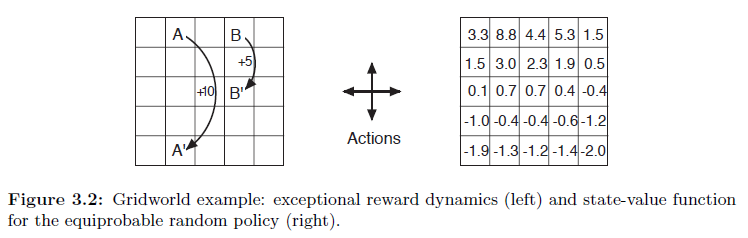
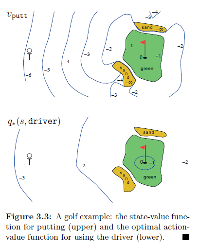

## Políticas em Processos de Decisão de Markov Finitos: Uma Análise Detalhada

### Introdução
No contexto de **Processos de Decisão de Markov Finitos (MDPs)**, uma **política** desempenha um papel central na definição do comportamento de um agente. Este capítulo se aprofunda no conceito de políticas, explorando sua definição formal e sua relação com as **funções de valor**. Políticas determinam como um agente seleciona ações em diferentes estados, buscando maximizar a recompensa acumulada ao longo do tempo. Conforme introduzido no Capítulo 3 [^1], um MDP formaliza o problema de tomada de decisão sequencial, onde as ações influenciam não apenas recompensas imediatas, mas também estados futuros e, por extensão, recompensas futuras. O entendimento de políticas é, portanto, crucial para a construção de agentes de *reinforcement learning* (RL) eficazes.

### Políticas: Mapeamento de Estados para Ações
Formalmente, uma **política** é definida como um mapeamento de estados para probabilidades de seleção de cada ação possível [^58]. Em outras palavras, dada uma política $\pi$, para cada estado $s \in S$ e cada ação $a \in A(s)$, $\pi(a|s)$ representa a probabilidade de selecionar a ação $a$ quando o agente está no estado $s$. É crucial notar que $\pi$ é uma função ordinária; o símbolo "|" em $\pi(a|s)$ serve apenas para lembrar que ela define uma distribuição de probabilidade sobre $a \in A(s)$ para cada $s \in S$ [^58].

$$
\sum_{a \in A(s)} \pi(a|s) = 1, \forall s \in S
$$

Essa equação garante que, para cada estado, a soma das probabilidades de selecionar cada ação possível seja igual a 1, o que caracteriza uma distribuição de probabilidade válida. A política, portanto, dita o comportamento do agente em cada estado, influenciando diretamente a trajetória do agente através do ambiente e as recompensas que ele recebe.

**Prova:**

Para cada estado $s \in S$, $\pi(a|s)$ representa a probabilidade de selecionar a ação $a \in A(s)$ dado o estado $s$. A soma das probabilidades de todas as ações possíveis em um dado estado deve ser igual a 1, já que o agente deve selecionar uma ação com certeza.
I. Por definição, $\pi(a|s)$ é a probabilidade de selecionar a ação $a$ no estado $s$.
II. A soma das probabilidades de todas as ações possíveis $a \in A(s)$ no estado $s$ deve ser igual a 1, pois alguma ação deve ser tomada.
III. Portanto, $\sum_{a \in A(s)} \pi(a|s) = 1$. ■

**Exemplo:** Considere um agente em um ambiente de grade simples, como o *Gridworld* apresentado no exemplo 3.5 [^60]. Uma política possível poderia ser:

*   Em estados na metade superior da grade, sempre mover para o sul (probabilidade 1).
*   Em estados na metade inferior da grade, mover para o norte com probabilidade 0.5 e para o leste com probabilidade 0.5.
*   Nos estados especiais A e B, escolher ações aleatoriamente.

Esta é uma política estocástica, pois nem sempre determina uma única ação. A escolha da política tem um impacto dramático no desempenho do agente.

> 💡 **Exemplo Numérico:**
>
> Vamos considerar um estado específico, $s_1$, na metade inferior da grade. De acordo com a política descrita, $\pi(\text{norte}|s_1) = 0.5$ e $\pi(\text{leste}|s_1) = 0.5$. As probabilidades para as ações "sul" e "oeste" neste estado seriam 0. Isso garante que a soma das probabilidades seja igual a 1:
>
> $\pi(\text{norte}|s_1) + \pi(\text{leste}|s_1) + \pi(\text{sul}|s_1) + \pi(\text{oeste}|s_1) = 0.5 + 0.5 + 0 + 0 = 1$
>
> Agora, considere um estado $s_2$ na metade superior da grade. Aqui, $\pi(\text{sul}|s_2) = 1$, e todas as outras ações têm probabilidade 0.
>
> $\pi(\text{norte}|s_2) + \pi(\text{leste}|s_2) + \pi(\text{sul}|s_2) + \pi(\text{oeste}|s_2) = 0 + 0 + 1 + 0 = 1$
>
> Este exemplo numérico demonstra como as probabilidades das ações são definidas para diferentes estados de acordo com a política.

**Observação:** É importante distinguir entre **políticas determinísticas** e **políticas estocásticas**. Uma política determinística sempre seleciona a mesma ação em um dado estado, ou seja, existe uma ação $a$ tal que $\pi(a|s) = 1$ para todo $s$. Em contraste, uma política estocástica atribui probabilidades a diferentes ações em um mesmo estado [^58].

Para clarificar ainda mais, podemos definir formalmente políticas determinísticas:

**Definição:** Uma política $\pi$ é dita *determinística* se, para todo estado $s \in S$, existe uma ação $a \in A(s)$ tal que $\pi(a|s) = 1$. Equivalentemente, para todo estado $s \in S$, existe uma única ação $a \in A(s)$ tal que $\pi(a'|s) = 0$ para todo $a' \in A(s), a' \neq a$.

> 💡 **Exemplo Numérico:**
>
> Considere uma política determinística no Gridworld onde, em todos os estados, o agente sempre se move para o norte. Neste caso, para qualquer estado $s$, $\pi(\text{norte}|s) = 1$ e $\pi(a|s) = 0$ para qualquer outra ação $a$ diferente de "norte". Isso significa que a política sempre escolhe a ação "norte" com probabilidade 1, independentemente do estado.

### Funções de Valor e Políticas

As **funções de valor** são estimativas da "bondade" de estar em um determinado estado ou de realizar uma determinada ação em um determinado estado, no sentido de recompensas futuras que podem ser esperadas [^58]. No entanto, estas recompensas dependem das ações que o agente tomará, que por sua vez são ditadas pela política. As funções de valor são, portanto, definidas em relação a políticas específicas.

**Valor de Estado:** A *função de valor de estado* $v_\pi(s)$ sob uma política $\pi$ é o retorno esperado ao iniciar no estado $s$ e seguir a política $\pi$ a partir de então [^58]. Formalmente:

$$
v_\pi(s) = \mathbb{E}_\pi[G_t | S_t = s] = \mathbb{E}_\pi \left[ \sum_{k=0}^{\infty} \gamma^k R_{t+k+1} | S_t = s \right], \forall s \in S
$$

onde $G_t$ é o retorno no tempo $t$, $R_{t+k+1}$ é a recompensa recebida $k$ passos após o tempo $t$, e $\gamma$ é o fator de desconto ( $0 \leq \gamma \leq 1$). O valor de estado representa, portanto, uma média ponderada das recompensas futuras, descontadas pelo fator $\gamma$, que o agente espera receber ao seguir a política $\pi$ a partir do estado $s$.

**Valor de Ação:** Similarmente, a *função de valor de ação* $q_\pi(s, a)$ sob uma política $\pi$ é o retorno esperado ao iniciar no estado $s$, tomar a ação $a$, e seguir a política $\pi$ a partir de então [^58]. Formalmente:

$$
q_\pi(s, a) = \mathbb{E}_\pi[G_t | S_t = s, A_t = a] = \mathbb{E}_\pi \left[ \sum_{k=0}^{\infty} \gamma^k R_{t+k+1} | S_t = s, A_t = a \right], \forall s \in S, a \in A(s)
$$

O valor de ação representa o valor de realizar uma ação específica em um estado específico, considerando o comportamento subsequente do agente ditado pela política $\pi$.

> 💡 **Exemplo Numérico:**
>
> Imagine um estado $s_3$ no Gridworld onde o agente recebe uma recompensa de +10 se alcançar o estado terminal e -1 para cada outro passo. Seja $\gamma = 0.9$. Se o agente está em $s_3$ e a política $\pi$ garante que ele chegará ao estado terminal em 2 passos, o valor de estado $v_\pi(s_3)$ pode ser calculado da seguinte forma:
>
> $v_\pi(s_3) = \mathbb{E}_\pi \left[ \sum_{k=0}^{\infty} \gamma^k R_{t+k+1} | S_t = s_3 \right] = (-1) + (0.9)(-1) + (0.9)^2(10) = -1 - 0.9 + 8.1 = 6.2$
>
> Isso significa que o valor esperado de estar no estado $s_3$ e seguir a política $\pi$ é 6.2.
>
> Agora, suponha que no mesmo estado $s_3$, o agente tem a opção de realizar a ação $a_1$ que o leva diretamente ao estado terminal (recompensa +10) com probabilidade 0.8 e a um estado "ruim" (recompensa -5) com probabilidade 0.2. O valor de ação $q_\pi(s_3, a_1)$ seria:
>
> $q_\pi(s_3, a_1) = (0.8)(10) + (0.2)(-5) = 8 - 1 = 7$

**Relação entre Valor de Estado e Valor de Ação:** O valor de um estado pode ser expresso em termos dos valores de suas ações e da política [^58]:

$$
v_\pi(s) = \sum_{a \in A(s)} \pi(a|s) q_\pi(s, a)
$$

Esta equação mostra que o valor de um estado é a média ponderada dos valores de cada ação possível nesse estado, com os pesos sendo as probabilidades de selecionar cada ação de acordo com a política $\pi$.

**Prova:**
Aqui, provaremos que $v_\pi(s)$ pode ser expresso em termos de $q_\pi(s, a)$ e $\pi(a|s)$.
I. Por definição, $v_\pi(s)$ é o valor esperado do retorno $G_t$ dado que estamos no estado $s$ e seguindo a política $\pi$.
II. Podemos expressar o valor esperado $v_\pi(s)$ como uma média ponderada dos valores de ação $q_\pi(s, a)$ para todas as ações possíveis $a \in A(s)$, ponderadas pelas probabilidades de tomar cada ação $a$ no estado $s$ segundo a política $\pi(a|s)$.
III. Portanto, $v_\pi(s) = \mathbb{E}_\pi[G_t | S_t = s] = \sum_{a \in A(s)} \pi(a|s) \mathbb{E}_\pi[G_t | S_t = s, A_t = a] = \sum_{a \in A(s)} \pi(a|s) q_\pi(s, a)$. ■

Da mesma forma, o valor de uma ação pode ser expresso em termos dos valores dos estados sucessores [^58]:

$$
q_\pi(s, a) = \sum_{s' \in S, r \in \mathbb{R}} p(s', r | s, a) \left[ r + \gamma v_\pi(s') \right]
$$

Esta equação mostra que o valor de uma ação é o retorno esperado ao realizar essa ação e, em seguida, seguir a política $\pi$ nos estados sucessores. Ela considera a probabilidade de transição para cada estado sucessor, a recompensa recebida e o valor do estado sucessor, todos descontados pelo fator $\gamma$.

**Prova:**
Provaremos que $q_\pi(s, a)$ pode ser expresso em termos de $p(s', r | s, a)$, $r$ e $v_\pi(s')$.

I. Por definição, $q_\pi(s, a)$ é o valor esperado do retorno $G_t$ dado que estamos no estado $s$, tomamos a ação $a$ e seguimos a política $\pi$ a partir de então.

II. O retorno $G_t$ pode ser decomposto na recompensa imediata $R_{t+1} = r$ e o retorno descontado a partir do próximo estado $S_{t+1} = s'$.

III. Portanto, $q_\pi(s, a) = \mathbb{E}_\pi[R_{t+1} + \gamma G_{t+1} | S_t = s, A_t = a]$.

IV. Podemos expressar o valor esperado $q_\pi(s, a)$ como uma média ponderada das recompensas imediatas $r$ e dos valores de estado descontados $\gamma v_\pi(s')$ para todos os estados sucessores possíveis $s'$, ponderados pelas probabilidades de transição $p(s', r | s, a)$.

V. Assim, $q_\pi(s, a) = \sum_{s' \in S, r \in \mathbb{R}} p(s', r | s, a) \left[ r + \gamma v_\pi(s') \right]$. ■

Podemos combinar estas duas equações para expressar $v_\pi(s)$ diretamente em termos de $v_\pi(s')$:

**Teorema 1:**

$$
v_\pi(s) = \sum_{a \in A(s)} \pi(a|s) \sum_{s' \in S, r \in \mathbb{R}} p(s', r | s, a) \left[ r + \gamma v_\pi(s') \right]
$$

*Prova:* Substituímos a equação de $q_\pi(s, a)$ na equação de $v_\pi(s)$:

$v_\pi(s) = \sum_{a \in A(s)} \pi(a|s) q_\pi(s, a) = \sum_{a \in A(s)} \pi(a|s) \sum_{s' \in S, r \in \mathbb{R}} p(s', r | s, a) \left[ r + \gamma v_\pi(s') \right]$.

> 💡 **Exemplo Numérico:**
>
> Suponha que no estado $s_4$, o agente pode escolher entre duas ações: $a_1$ e $a_2$. A política $\pi$ define $\pi(a_1|s_4) = 0.6$ e $\pi(a_2|s_4) = 0.4$. Se a ação $a_1$ leva ao estado $s'$ com recompensa +5 e $v_\pi(s') = 10$, e a ação $a_2$ leva ao estado $s''$ com recompensa -2 e $v_\pi(s'') = 2$, e $\gamma = 0.9$, então o valor de estado $v_\pi(s_4)$ pode ser calculado como:
>
> $v_\pi(s_4) = (0.6) \left[ 5 + (0.9)(10) \right] + (0.4) \left[ -2 + (0.9)(2) \right] = (0.6)[5 + 9] + (0.4)[-2 + 1.8] = (0.6)(14) + (0.4)(-0.2) = 8.4 - 0.08 = 8.32$
>
> Este cálculo demonstra como o valor de estado é influenciado pelas probabilidades da política, as recompensas esperadas e os valores dos estados sucessores.

### A Equação de Bellman para $v_\pi$
A relação recursiva entre o valor de um estado e o valor de seus sucessores é capturada pela **Equação de Bellman para $v_\pi$** [^59]:

$$
v_\pi(s) = \sum_{a \in A(s)} \pi(a|s) \sum_{s' \in S, r \in \mathbb{R}} p(s', r | s, a) [r + \gamma v_\pi(s')], \forall s \in S
$$

Esta equação expressa o valor de um estado em termos dos valores de seus estados sucessores, ponderados pelas probabilidades de transição e pelas probabilidades de seleção de ação ditadas pela política $\pi$. Ela estabelece uma restrição de consistência que deve ser satisfeita pela função de valor $v_\pi$. Especificamente, o valor do estado $s$ seguindo a política $\pi$ deve ser igual à soma das probabilidades de tomar cada ação $a$ em $s$ multiplicado pela recompensa imediata esperada $r$ mais o valor descontado $\gamma v_\pi(s')$ do próximo estado $s'$, dado que a ação $a$ foi tomada em $s$.

**Prova:**

I. Começamos com a definição do valor de estado: $v_\pi(s) = \mathbb{E}_\pi[G_t | S_t = s]$.
II. Expandimos a expectativa em termos das ações possíveis e seus valores de ação correspondentes: $v_\pi(s) = \sum_{a \in A(s)} \pi(a|s) q_\pi(s, a)$.
III. Substituímos a definição do valor de ação $q_\pi(s, a)$ em termos da recompensa esperada e do valor descontado do próximo estado: $v_\pi(s) = \sum_{a \in A(s)} \pi(a|s) \sum_{s' \in S, r \in \mathbb{R}} p(s', r | s, a) [r + \gamma v_\pi(s')]$.
IV. Portanto, a Equação de Bellman para $v_\pi$ é: $v_\pi(s) = \sum_{a \in A(s)} \pi(a|s) \sum_{s' \in S, r \in \mathbb{R}} p(s', r | s, a) [r + \gamma v_\pi(s')]$. ■

**Backup Diagram:** O backup diagram para $v_\pi$ [^59] (Figura 3.2, página 60) visualiza essa relação recursiva, mostrando como o valor de um estado é "backed up" a partir dos valores de seus sucessores, considerando as probabilidades de transição e as probabilidades de seleção de ação.

Da mesma forma, podemos escrever a Equação de Bellman para $q_\pi$:

**Teorema 2:** A Equação de Bellman para $q_\pi$ é dada por:

$$
q_\pi(s, a) = \sum_{s' \in S, r \in \mathbb{R}} p(s', r | s, a) \left[ r + \gamma \sum_{a' \in A(s')} \pi(a'|s') q_\pi(s', a') \right], \forall s \in S, a \in A(s)
$$

*Prova:* Substituímos a equação de $v_\pi(s')$ na equação de $q_\pi(s, a)$:

$q_\pi(s, a) = \sum_{s' \in S, r \in \mathbb{R}} p(s', r | s, a) \left[ r + \gamma v_\pi(s') \right] = \sum_{s' \in S, r \in \mathbb{R}} p(s', r | s, a) \left[ r + \gamma \sum_{a' \in A(s')} \pi(a'|s') q_\pi(s', a') \right]$.

**Prova:**

I. Começamos com a definição do valor de ação: $q_\pi(s, a) = \mathbb{E}_\pi[G_t | S_t = s, A_t = a]$.
II. Expandimos a expectativa em termos da recompensa imediata e do valor descontado do próximo estado: $q_\pi(s, a) = \mathbb{E}_\pi[R_{t+1} + \gamma G_{t+1} | S_t = s, A_t = a] = \sum_{s' \in S, r \in \mathbb{R}} p(s', r | s, a) [r + \gamma \mathbb{E}_\pi[G_{t+1} | S_{t+1} = s']]$.
III. Substituímos $\mathbb{E}_\pi[G_{t+1} | S_{t+1} = s']$ por $v_\pi(s')$: $q_\pi(s, a) = \sum_{s' \in S, r \in \mathbb{R}} p(s', r | s, a) [r + \gamma v_\pi(s')]$.
IV. Substituímos $v_\pi(s')$ pela sua definição em termos de $q_\pi(s', a')$: $q_\pi(s, a) = \sum_{s' \in S, r \in \mathbb{R}} p(s', r | s, a) \left[ r + \gamma \sum_{a' \in A(s')} \pi(a'|s') q_\pi(s', a') \right]$.
V. Portanto, a Equação de Bellman para $q_\pi$ é: $q_\pi(s, a) = \sum_{s' \in S, r \in \mathbb{R}} p(s', r | s, a) \left[ r + \gamma \sum_{a' \in A(s')} \pi(a'|s') q_\pi(s', a') \right]$. ■

Estas equações de Bellman são cruciais para o desenvolvimento de algoritmos de RL.

> 💡 **Exemplo Numérico:**
>
> Considere um estado $s_5$ e uma ação $a_3$. Suponha que a ação $a_3$ leva ao estado $s'$ com recompensa +3 com probabilidade 0.7 e ao estado $s''$ com recompensa -1 com probabilidade 0.3. Seja $\gamma = 0.9$. Assumindo que $\pi(a'|s') = 0.5$ para duas ações $a'_1$ e $a'_2$ no estado $s'$, e que $q_\pi(s', a'_1) = 8$ e $q_\pi(s', a'_2) = 6$. Similarmente, no estado $s''$, assuma $\pi(a'|s'') = 0.5$ para duas ações $a'_3$ e $a'_4$, e que $q_\pi(s'', a'_3) = 2$ e $q_\pi(s'', a'_4) = 0$.
>
> Então, $q_\pi(s', a') = (0.5)(8) + (0.5)(6) = 7$ e $q_\pi(s'', a') = (0.5)(2) + (0.5)(0) = 1$. Aplicando a Equação de Bellman para $q_\pi$:
>
> $q_\pi(s_5, a_3) = (0.7) \left[ 3 + (0.9)(7) \right] + (0.3) \left[ -1 + (0.9)(1) \right] = (0.7)[3 + 6.3] + (0.3)[-1 + 0.9] = (0.7)(9.3) + (0.3)(-0.1) = 6.51 - 0.03 = 6.48$.
>
> Este exemplo numérico ilustra o cálculo do valor da ação, considerando as probabilidades de transição, as recompensas, o fator de desconto e os valores das ações nos estados subsequentes.

Um exemplo prático pode ser observado na Figura 3.2 [^60], que mostra um *Gridworld* e a função de valor para uma política aleatória equiprovável.

Outros exemplos incluem o robô coletor de latas (Exemplo 3.3, página 52) [^60] e o jogo de golfe (Exemplos 3.6 e 3.7, páginas 61 e 63) [^60], que ajudam a ilustrar a aplicação prática destes conceitos.

<!-- END -->