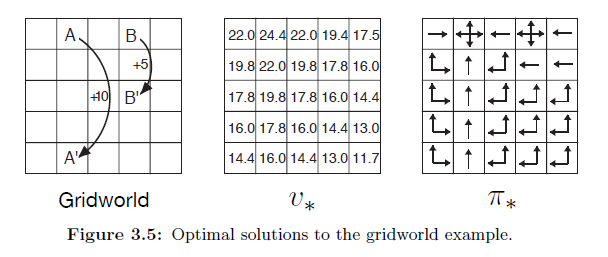

## Políticas Ótimas e Funções de Valor Ótimas em MDPs Finitos

### Introdução

No âmbito do aprendizado por reforço, o objetivo primordial é discernir uma **política** que maximize a acumulação de recompensas ao longo do tempo. Dentro da estrutura dos Processos de Decisão de Markov (MDPs) finitos, podemos definir rigorosamente o conceito de uma **política ótima** [^62]. Este capítulo se dedica a explorar as características e propriedades destas políticas ótimas, bem como as funções de valor associadas, estabelecendo as bases para a compreensão de algoritmos mais avançados.

### Políticas Ótimas

Em MDPs finitos, o objetivo do aprendizado por reforço pode ser formalizado como a busca por uma política que maximize o retorno acumulado. As **funções de valor** fornecem um meio de ordenar as políticas, permitindo a identificação de uma política ótima. Formalmente, uma política $\pi$ é definida como *melhor ou igual* a uma política $\pi'$ se, e somente se, seu retorno esperado for maior ou igual ao de $\pi'$ para todos os estados $s \in S$ [^62]. Matematicamente, isto se expressa como:

$$\pi \geq \pi' \iff v_{\pi}(s) \geq v_{\pi'}(s), \forall s \in S$$

É crucial ressaltar que sempre existe pelo menos uma política que é *melhor ou igual* a todas as outras políticas possíveis. Tal política é designada como uma **política ótima**, denotada por $\pi_*$ [^62]. Embora possa haver múltiplas políticas ótimas para um determinado MDP, elas compartilham a mesma **função de valor de estado ótima**, $v_*$, definida como [^62]:

$$v_*(s) = \max_{\pi} v_{\pi}(s), \forall s \in S$$

Essa função de valor representa o máximo retorno esperado que pode ser alcançado a partir de um estado $s$, seguindo qualquer política $\pi$.

> 💡 **Exemplo Numérico:**
>
> Considere um MDP com dois estados, $S = \{s_1, s_2\}$, e duas políticas, $\pi_1$ e $\pi_2$. Suponha que as funções de valor para essas políticas sejam:
>
> - $v_{\pi_1}(s_1) = 10$, $v_{\pi_1}(s_2) = 5$
> - $v_{\pi_2}(s_1) = 7$, $v_{\pi_2}(s_2) = 8$
>
> Para determinar qual política é melhor ou igual à outra, comparamos os valores dos estados:
>
> - Para $s_1$: $v_{\pi_1}(s_1) = 10 > v_{\pi_2}(s_1) = 7$
> - Para $s_2$: $v_{\pi_1}(s_2) = 5 < v_{\pi_2}(s_2) = 8$
>
> Como $v_{\pi_1}(s) \geq v_{\pi_2}(s)$ não é válido para todos os estados (é falso para $s_2$), então $\pi_1 \ngeq \pi_2$.
>
> Similarmente, $v_{\pi_2}(s) \geq v_{\pi_1}(s)$ não é válido para todos os estados (é falso para $s_1$), então $\pi_2 \ngeq \pi_1$.
>
> Agora, suponha que existe uma terceira política $\pi_3$ com $v_{\pi_3}(s_1) = 12$ e $v_{\pi_3}(s_2) = 10$. Nesse caso:
>
> - $v_{\pi_3}(s_1) > v_{\pi_1}(s_1)$ e $v_{\pi_3}(s_2) > v_{\pi_1}(s_2)$
> - $v_{\pi_3}(s_1) > v_{\pi_2}(s_1)$ e $v_{\pi_3}(s_2) > v_{\pi_2}(s_2)$
>
> Portanto, $\pi_3$ é melhor que $\pi_1$ e $\pi_2$. Se não houver outra política com valores maiores, então $\pi_3$ é uma política ótima $\pi_*$, e $v_*(s_1) = 12$ e $v_*(s_2) = 10$.

**Proposição 1** Se $\pi_*$ é uma política ótima, então para qualquer estado $s$, seguir $\pi_*$ a partir de $s$ produz o mesmo retorno esperado que seguir qualquer outra política ótima $\pi'_*$ a partir de $s$.

*Prova*. Se $\pi_*$ e $\pi'_*$ são ambas políticas ótimas, então $v_{\pi_*}(s) = v_*(s)$ e $v_{\pi'_*}(s) = v_*(s)$ para todo $s \in S$. Portanto, $v_{\pi_*}(s) = v_{\pi'_*}(s)$ para todo $s \in S$, o que implica que o retorno esperado ao seguir $\pi_*$ a partir de $s$ é o mesmo que seguir $\pi'_*$ a partir de $s$. $\blacksquare$

### Funções de Valor de Ação Ótimas

Além da função de valor de estado ótima, existe também a **função de valor de ação ótima**, denotada por $q_*$, que é definida como [^63]:

$$q_*(s, a) = \max_{\pi} q_{\pi}(s, a),$$

para todo $s \in S$ e $a \in A(s)$. Esta função fornece o retorno esperado ao tomar a ação $a$ no estado $s$ e, em seguida, seguir uma política ótima. Podemos relacionar $q_*$ com $v_*$ através da seguinte equação [^63]:

$$q_*(s, a) = \mathbb{E}[R_{t+1} + \gamma v_*(S_{t+1}) | S_t = s, A_t = a].$$

> 💡 **Exemplo Numérico:**
>
> Considere um estado $s$ com duas ações possíveis, $a_1$ e $a_2$. Suponha que, ao tomar a ação $a_1$, o agente recebe uma recompensa de 2 e transita para o estado $s'$ com $v_*(s') = 6$. Ao tomar a ação $a_2$, o agente recebe uma recompensa de 5 e permanece no estado $s$ com $v_*(s) = 7$. Assuma um fator de desconto $\gamma = 0.9$.
>
> Então, podemos calcular $q_*(s, a_1)$ e $q_*(s, a_2)$:
>
> $q_*(s, a_1) = \mathbb{E}[R_{t+1} + \gamma v_*(S_{t+1}) | S_t = s, A_t = a_1] = 2 + 0.9 * 6 = 2 + 5.4 = 7.4$
>
> $q_*(s, a_2) = \mathbb{E}[R_{t+1} + \gamma v_*(S_{t+1}) | S_t = s, A_t = a_2] = 5 + 0.9 * 7 = 5 + 6.3 = 11.3$
>
> Neste caso, $q_*(s, a_2) > q_*(s, a_1)$, então a ação ótima no estado $s$ é $a_2$.

**Proposição 2** Uma política $\pi$ é ótima se, e somente se, para todo estado $s \in S$, a ação $a$ selecionada por $\pi$ em $s$ maximiza $q_*(s, a)$.

*Prova*.
($\Rightarrow$) Se $\pi$ é ótima, então $v_\pi(s) = v_*(s)$ para todo $s$. Se a ação $a = \pi(s)$ não maximizasse $q_*(s, a)$, então existiria uma ação $a' \in A(s)$ tal que $q_*(s, a') > q_*(s, a)$. Isso implicaria que seguir $a'$ em $s$ e então seguir uma política ótima a partir de $S_{t+1}$ resultaria em um retorno esperado maior do que seguir $\pi$ a partir de $s$, contradizendo a otimalidade de $\pi$.

($\Leftarrow$) Se para todo $s$, a ação $a = \pi(s)$ maximiza $q_*(s, a)$, então $q_\pi(s, \pi(s)) = q_*(s, \pi(s)) = \max_{a' \in A(s)} q_*(s, a')$.  Isso implica que seguir $\pi$ a partir de $s$ resulta no retorno esperado máximo possível, que é $v_*(s)$. Portanto, $\pi$ é uma política ótima. $\blacksquare$

### Exemplo: Golfe

Para ilustrar os conceitos de políticas ótimas e funções de valor ótimas, considere o exemplo do jogo de golfe [^63]. A Figura 3.3 (não mostrada aqui, consulte a referência [^63] no contexto original) ilustra as curvas de nível de uma possível função de valor de ação ótima $q_*(s, \text{driver})$. Estas curvas representam os valores de cada estado se o jogador inicialmente usar um *driver* e, posteriormente, escolher a melhor ação (driver ou *putter*).

### A Equação de Otimalidade de Bellman

Uma vez que $v_*$ é a função de valor para uma política, ela deve satisfazer a condição de auto-consistência dada pela equação de Bellman para valores de estado [^59]. No entanto, como $v_*$ é a função de valor *ótima*, a sua condição de consistência pode ser expressa de uma forma especial, sem referência a qualquer política específica. Essa expressão é conhecida como a **equação de otimalidade de Bellman** [^63]. Intuitivamente, a equação de otimalidade de Bellman expressa o fato de que o valor de um estado sob uma política ótima deve ser igual ao retorno esperado para a melhor ação a partir desse estado [^63]:

$$v_*(s) = \max_{a \in A(s)} q_{\pi_*}(s, a) = \max_{a} \mathbb{E}[G_t | S_t = s, A_t = a]$$

Expandindo a expressão, obtemos [^63]:

$$v_*(s) = \max_{a} \mathbb{E}[R_{t+1} + \gamma G_{t+1} | S_t = s, A_t = a] = \max_{a} \mathbb{E}[R_{t+1} + \gamma v_*(S_{t+1}) | S_t = s, A_t = a].$$

Finalmente, a equação de otimalidade de Bellman pode ser escrita como [^63]:

$$v_*(s) = \max_a \sum_{s', r} p(s', r | s, a) [r + \gamma v_*(s')].$$

> 💡 **Exemplo Numérico:**
>
> Imagine um MDP simples com um estado $s$ e duas ações $a_1$ e $a_2$. As probabilidades de transição e recompensas são as seguintes:
>
> - Ação $a_1$: Transita para $s'$ com probabilidade 0.7, recompensa 1; transita para $s''$ com probabilidade 0.3, recompensa 0.
> - Ação $a_2$: Transita para $s'$ com probabilidade 0.2, recompensa 5; transita para $s''$ com probabilidade 0.8, recompensa -1.
>
> Suponha que $v_*(s') = 10$ e $v_*(s'') = 2$, e $\gamma = 0.9$.
>
> Calculamos $v_*(s)$ usando a equação de otimalidade de Bellman:
>
> $v_*(s) = \max_a \sum_{s', r} p(s', r | s, a) [r + \gamma v_*(s')]$
>
> Para $a_1$:
> $\sum_{s', r} p(s', r | s, a_1) [r + \gamma v_*(s')] = 0.7 * (1 + 0.9 * 10) + 0.3 * (0 + 0.9 * 2) = 0.7 * 10 + 0.3 * 1.8 = 6.3 + 0.54 = 7.64$
>
> Para $a_2$:
> $\sum_{s', r} p(s', r | s, a_2) [r + \gamma v_*(s')] = 0.2 * (5 + 0.9 * 10) + 0.8 * (-1 + 0.9 * 2) = 0.2 * 14 + 0.8 * 0.8 = 2.8 + 0.64 = 3.44$
>
> Portanto, $v_*(s) = \max(7.64, 3.44) = 7.64$.  A ação ótima é $a_1$.

De forma análoga, podemos obter a equação de otimalidade de Bellman para $q_*$ [^64]:

$$q_*(s, a) = \mathbb{E}[R_{t+1} + \gamma \max_{a'} q_*(S_{t+1}, a') | S_t = s, A_t = a] = \sum_{s', r} p(s', r | s, a) [r + \gamma \max_{a'} q_*(s', a')].$$
 As figuras a seguir ilustram as equações para $v_*$ e $q_*$.

> 💡 **Exemplo Numérico:**
>
> Considere um estado $s$ e uma ação $a$. Após tomar a ação $a$, o agente transita para o estado $s_1$ com probabilidade 0.6 e recebe uma recompensa de 3, ou transita para o estado $s_2$ com probabilidade 0.4 e recebe uma recompensa de 1. Seja $\gamma = 0.9$. Suponha que $q_*(s_1, a') = 5$ para todas as ações $a'$ em $s_1$, e $q_*(s_2, a') = 2$ para todas as ações $a'$ em $s_2$.
>
> Então,
>
> $q_*(s, a) = \sum_{s', r} p(s', r | s, a) [r + \gamma \max_{a'} q_*(s', a')] = 0.6 * (3 + 0.9 * 5) + 0.4 * (1 + 0.9 * 2) = 0.6 * 7.5 + 0.4 * 2.8 = 4.5 + 1.12 = 5.62$

**Teorema 3** (Unicidade da Solução da Equação de Otimalidade de Bellman). Para um MDP finito com fator de desconto $\gamma \in [0, 1)$, a equação de otimalidade de Bellman para $v_*$ tem uma única solução.

*Prova*. Considere o operador de Bellman ótimo $T_*$ definido como:
$$(T_* v)(s) = \max_a \sum_{s', r} p(s', r | s, a) [r + \gamma v(s')].$$
A equação de otimalidade de Bellman pode então ser escrita como $v_* = T_* v_*$. Para mostrar a unicidade da solução, precisamos mostrar que $T_*$ é uma contração de Banach com fator de contração $\gamma$ sob a norma do supremo $\|v\| = \max_s |v(s)|$.

Para quaisquer duas funções de valor $v$ e $v'$, temos:
\begin{align*}
\|T_* v - T_* v'\| &= \max_s |(T_* v)(s) - (T_* v')(s)| \\
&= \max_s \left| \max_a \sum_{s', r} p(s', r | s, a) [r + \gamma v(s')] - \max_a \sum_{s', r} p(s', r | s, a) [r + \gamma v'(s')] \right| \\
&\leq \max_s \max_a \left| \sum_{s', r} p(s', r | s, a) [r + \gamma v(s')] - \sum_{s', r} p(s', r | s, a) [r + \gamma v'(s')] \right| \\
&= \max_s \max_a \left| \sum_{s', r} p(s', r | s, a) \gamma [v(s') - v'(s')] \right| \\
&\leq \max_s \max_a \sum_{s', r} p(s', r | s, a) \gamma |v(s') - v'(s')| \\
&\leq \gamma \max_s |v(s) - v'(s)| = \gamma \|v - v'\|.
\end{align*}
Portanto, $\|T_* v - T_* v'\| \leq \gamma \|v - v'\|$. Como $\gamma < 1$, $T_*$ é uma contração de Banach e, pelo teorema do ponto fixo de Banach, existe um único ponto fixo, que é a única solução para a equação de otimalidade de Bellman. $\blacksquare$

### Resolvendo a Equação de Otimalidade de Bellman

Para MDPs finitos, a equação de otimalidade de Bellman para $v_*$ representa um sistema de $n$ equações com $n$ incógnitas, onde $n$ é o número de estados [^64]. Se a dinâmica do ambiente, $p$, for conhecida, este sistema de equações pode, em princípio, ser resolvido usando métodos para resolver sistemas de equações não lineares [^64]. Da mesma forma, um conjunto de equações pode ser resolvido para $q_*$ [^64].

> 💡 **Exemplo Numérico:**
>
> Considere um MDP com dois estados $s_1$ e $s_2$, e duas ações $a_1$ e $a_2$ em cada estado. As recompensas são sempre 0.  As transições são determinísticas:
>
> - Em $s_1$: $a_1$ leva a $s_2$, $a_2$ leva a $s_1$.
> - Em $s_2$: $a_1$ leva a $s_1$, $a_2$ leva a $s_2$.
>
> Seja $\gamma = 0.5$.  Queremos encontrar $v_*(s_1)$ e $v_*(s_2)$.
>
> As equações de Bellman são:
>
> $v_*(s_1) = \max\{0 + \gamma v_*(s_2), 0 + \gamma v_*(s_1)\} = \max\{0.5v_*(s_2), 0.5v_*(s_1)\}$
> $v_*(s_2) = \max\{0 + \gamma v_*(s_1), 0 + \gamma v_*(s_2)\} = \max\{0.5v_*(s_1), 0.5v_*(s_2)\}$
>
> Assumindo $v_*(s_1) > v_*(s_2)$, temos $v_*(s_1) = 0.5v_*(s_1)$, o que implica $v_*(s_1) = 0$.  Similarmente, $v_*(s_2) = 0$. A solução trivial é $v_*(s_1) = v_*(s_2) = 0$.

Uma vez que $v_*$ é conhecida, determinar uma política ótima torna-se relativamente simples [^64]. Para cada estado $s$, basta selecionar a ação (ou ações) que maximiza(m) o lado direito da equação de otimalidade de Bellman. Qualquer política que atribua probabilidade não nula apenas a estas ações é uma política ótima. Em outras palavras, qualquer política *gulosa* com respeito à função de avaliação ótima $v_*$ é uma política ótima.

**Corolário 3.1** Se $v_*$ é a solução única da equação de otimalidade de Bellman, então qualquer política gulosa em relação a $v_*$ é uma política ótima.

*Prova*. Seja $\pi$ uma política gulosa em relação a $v_*$. Isso significa que para todo $s \in S$, $\pi(s) = \arg\max_a \sum_{s', r} p(s', r | s, a) [r + \gamma v_*(s')]$. Pela equação de otimalidade de Bellman, temos:
$$v_*(s) = \max_a \sum_{s', r} p(s', r | s, a) [r + \gamma v_*(s')].$$
Como $\pi$ é gulosa, temos:
$$v_*(s) = \sum_{s', r} p(s', r | s, \pi(s)) [r + \gamma v_*(s')].$$
Isso significa que $v_*$ é a função de valor para a política $\pi$, e como $v_*$ é a função de valor ótima, $\pi$ deve ser uma política ótima. $\blacksquare$

A seguir, uma figura com a política ótima e a função de valor ótima para o exemplo *gridworld*:

### Optimalidade e Aproximação

Embora tenhamos definido funções de valor e políticas ótimas, na prática, alcançar a otimalidade completa é raro. Para as classes de problemas que nos interessam, as políticas ótimas só podem ser geradas com um custo computacional proibitivo [^67]. Uma noção bem definida de otimalidade organiza a abordagem de aprendizado que descrevemos neste livro e fornece uma maneira de entender as propriedades teóricas de vários algoritmos de aprendizado, mas é um ideal que os agentes só podem se aproximar [^67].

<!-- END -->