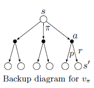
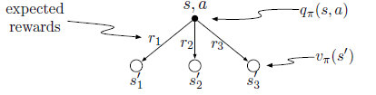
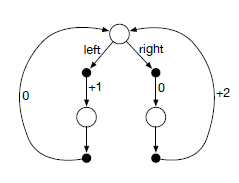
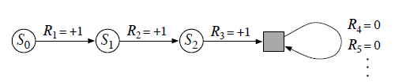
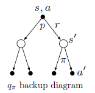

The image (Figure 3.4 from Chapter 3) illustrates backup diagrams for state-value function \(v_*\) and action-value function \(q_*\) in Markov Decision Processes (MDPs). On the left, the diagram for \(v_*\) shows the value of a state \(s\) being updated by considering the maximum value achievable from its possible successor states, each reached after taking an action. The diagram on the right, representing \(q_*\), shows the value of taking a specific action \(a\) in state \(s\), considering the immediate reward \(r\) and the value of the resulting next state \(s'\), which is further maximized over possible actions from \(s'\). These diagrams provide a graphical representation of how value functions are updated, forming the basis for update or backup operations used in reinforcement learning methods.

The image, labeled as Figure 3.5, presents an example of optimal solutions for a gridworld problem, as referenced in the document. The left panel illustrates the gridworld setup with special states A and B that transition to A' and B' respectively, providing +10 and +5 rewards. The central panel showcases the optimal state-value function \(v_*\), representing the discounted cumulative rewards for each state, whereas the right panel shows the corresponding optimal policy \(\pi_*\), indicating the optimal actions to take from each state to maximize the reward, demonstrating core concepts in Markov Decision Processes.

A imagem é um diagrama de backup para a função de valor \(v_\pi\), como discutido na página 59 do Capítulo 3 do documento. O diagrama ilustra a relação entre o valor de um estado \(s\) e os valores de seus possíveis estados sucessores após tomar ações de acordo com uma política \(\pi\), considerando a probabilidade de transição \(p\) e a recompensa \(r\). Os nós abertos representam estados, enquanto os nós fechados representam pares estado-ação; as setas indicam transições, com \(\pi\) indicando a seleção da ação e \(p\) e \(r\) indicando a dinâmica do ambiente e recompensas resultantes.

A imagem apresenta o exemplo do robô coletor de latas de reciclagem, detalhado no Capítulo 3, especificamente na seção do Exemplo 3.3 na página 52. A imagem mostra a representação do sistema como um processo de decisão de Markov (MDP) finito, exibindo a tabela de probabilidades de transição (p(s'|s,a)) e as recompensas esperadas (r(s,a,s')) para cada transição de estado e ação. Além da tabela, é fornecido um diagrama de transição de estados que ilustra visualmente as possíveis transições entre os estados 'high' e 'low' de energia, bem como as ações 'search', 'wait' e 'recharge' e as recompensas associadas.

The image represents a decision tree illustrating the relationship between state-action pairs, rewards, and future states in a Markov Decision Process (MDP), likely found within Chapter 3, which introduces finite MDPs. A state-action pair `(s, a)` leads to different possible states `s'_i` with associated rewards `r_i`, where the agent's policy `π` determines the probabilities of these transitions. The diagram also indicates the action-value function `q_π(s, a)` and the state-value function `v_π(s')`, representing the expected return from the state-action pair and subsequent state, respectively, under policy `π`.

A imagem representa um diagrama de transição de estados para um processo de decisão de Markov (MDP) simples, como ilustrado em diagramas similares na página 6 do documento. O diagrama mostra um estado inicial (círculo superior) a partir do qual duas ações, 'left' e 'right', levam a estados intermediários (círculos pretos) com recompensas associadas (+1 e 0, respectivamente). Os estados intermediários levam a estados finais (círculos inferiores). Loops de feedback indicam a possibilidade de retorno ao estado inicial com recompensas de 0 ou +2 dependendo do caminho percorrido.

This image, labeled as Figure 3.1 and found on page 48, illustrates the interaction between an agent and its environment within a Markov decision process. The agent receives the state (St) from the environment, takes an action (At), and subsequently receives a reward (Rt+1) and a new state (St+1) from the environment. This cyclical process demonstrates the continuous feedback loop central to reinforcement learning, where actions taken by the agent influence the environment and vice-versa.

The image depicts a golf example illustrating state-value functions for putting (upper) and optimal action-value functions for using a driver (lower), as referenced in Example 3.6 on page 61 and Example 3.7 on page 63. The state-value function for putting, denoted as v_putt(s), shows contour lines indicating the number of strokes to the hole from different locations, assuming only the putter is used, with sand traps having a value of -∞. The optimal action-value function for using the driver, q*(s, driver), shows the values after committing to the driver for the first stroke, using either the driver or the putter thereafter, with contours representing the expected number of strokes to the hole.

A imagem apresenta um diagrama de transição de estados, com círculos rotulados de S0 a S2 representando estados, conectados por setas que indicam transições. Cada seta é rotulada com um valor de recompensa (R1=+1, R2=+1, R3=+1), indicando o ganho ao transitar entre os estados. Após o estado S2, o diagrama se ramifica em um estado absorvente representado por um quadrado cinza, com um loop de auto-transição e setas direcionadas para fora, indicando recompensas zero (R4=0, R5=0). Este diagrama, que pode ser encontrado na página 57, ilustra um processo de decisão de Markov (MDP) com um estado terminal absorvente, usado para unificar notações entre tarefas episódicas e contínuas.

A imagem é um diagrama de backup de qπ, que é uma representação gráfica utilizada em reinforcement learning para ilustrar as relações entre estados, ações e recompensas. O diagrama mostra que a partir de um estado s e uma ação a, existem duas possíveis transições: uma com probabilidade p e outra com recompensa r, levando a um novo estado s'. No novo estado s', a política π é utilizada para selecionar a próxima ação a'. Este tipo de diagrama é utilizado para visualizar e analisar algoritmos de reinforcement learning, como explicado na Seção 3.5 do documento.

A imagem, identificada como Figura 3.2, ilustra um exemplo de Gridworld. O lado esquerdo da figura mostra a dinâmica de recompensa excepcional, onde ações em determinados estados (A e B) resultam em transições para A' e B' com recompensas +10 e +5, respectivamente; ações que levariam o agente para fora da grade resultam em uma recompensa de -1. O lado direito exibe a função de valor de estado para a política aleatória equiprovável, demonstrando os valores numéricos associados a cada estado na grade sob essa política específica. A figura é relevante para a discussão de MDPs e funções de valor no Capítulo 3.
