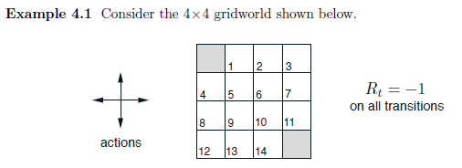
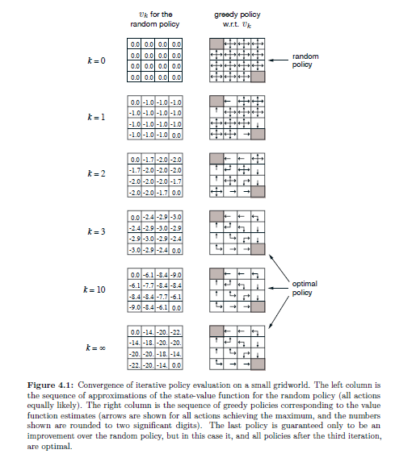
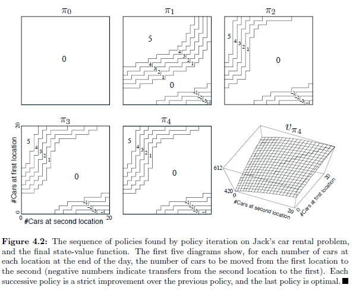
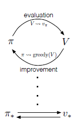
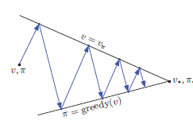

## Value Functions in Dynamic Programming

### Introdução
As **value functions**, representadas por $v_*(s)$ e $q_*(s, a)$, são conceitos fundamentais tanto em Dynamic Programming (DP) quanto em Reinforcement Learning (RL) [^1]. Elas fornecem um mecanismo para organizar e estruturar a busca por políticas ótimas em um ambiente de decisão sequencial. Em essência, uma value function estima o *valor* de estar em um determinado estado ou de tomar uma ação específica em um estado, considerando o retorno esperado a longo prazo. Este capítulo aprofunda o papel central das value functions e sua relação com as equações de otimalidade de Bellman.

### Conceitos Fundamentais
**Value functions** são estimativas do *quão bom* é para um agente estar em um determinado estado (state-value function) ou executar uma determinada ação em um determinado estado (action-value function) [^1]. Mais formalmente:

*   **State-value function $v_*(s)$**: Representa o valor do estado $s$ seguindo a política ótima. Ela quantifica o retorno esperado máximo que um agente pode obter se começar no estado $s$ e seguir a política ótima a partir de então.
*   **Action-value function $q_*(s, a)$**: Representa o valor de executar a ação $a$ no estado $s$ e, subsequentemente, seguir a política ótima. Ela quantifica o retorno esperado máximo que um agente pode obter se começar no estado $s$, executar a ação $a$ e seguir a política ótima a partir de então.

As value functions $v_*(s)$ e $q_*(s, a)$ estão intrinsecamente ligadas pelas **Bellman optimality equations** [^1]. Estas equações fornecem uma definição recursiva do valor ótimo, decompondo o problema em subproblemas menores e mais tratáveis.

A **Bellman optimality equation** para $v_*(s)$ é dada por:

$$v_*(s) = \max_{a} \mathbb{E}[R_{t+1} + \gamma v_*(S_{t+1}) | S_t=s, A_t=a]$$

Esta equação afirma que o valor ótimo de um estado $s$ é igual ao retorno esperado máximo que se pode obter ao tomar a melhor ação $a$ em $s$ e, em seguida, seguir a política ótima a partir do próximo estado $S_{t+1}$. Expansão [^1]:

$$v_*(s) = \max_{a} \sum_{s', r} p(s', r|s, a) [r + \gamma v_*(s')] \qquad (4.1)$$

Onde:
*   $p(s', r|s, a)$ é a probabilidade de transição para o estado $s'$ com recompensa $r$ ao tomar a ação $a$ no estado $s$.
*   $\gamma$ é o fator de desconto, que determina o peso relativo das recompensas futuras em relação às recompensas imediatas.

> 💡 **Exemplo Numérico:** Imagine um MDP com três estados: $S = \{s_1, s_2, s_3\}$ e duas ações: $A = \{a_1, a_2\}$. Suponha que estamos no estado $s_1$. Se tomarmos a ação $a_1$, temos uma probabilidade de 0.7 de ir para o estado $s_2$ com uma recompensa de 10 e uma probabilidade de 0.3 de ir para o estado $s_3$ com uma recompensa de 0. Se tomarmos a ação $a_2$, temos uma probabilidade de 0.9 de ir para o estado $s_3$ com uma recompensa de 5 e uma probabilidade de 0.1 de ficar em $s_1$ com uma recompensa de 2.  O fator de desconto $\gamma$ é 0.9.  Podemos expressar isso como:
>
> $p(s_2, 10 | s_1, a_1) = 0.7$
> $p(s_3, 0 | s_1, a_1) = 0.3$
> $p(s_3, 5 | s_1, a_2) = 0.9$
> $p(s_1, 2 | s_1, a_2) = 0.1$
>
> Para calcular $v_*(s_1)$, precisamos saber $v_*(s_2)$ e $v_*(s_3)$. Suponha que, após algumas iterações, determinamos que $v_*(s_2) = 100$ e $v_*(s_3) = 50$. Agora, podemos calcular o valor de $s_1$:
>
> $v_*(s_1) = \max_{a} \sum_{s', r} p(s', r|s_1, a) [r + \gamma v_*(s')]$
> $v_*(s_1) = \max \begin{cases} 0.7 \cdot [10 + 0.9 \cdot 100] + 0.3 \cdot [0 + 0.9 \cdot 50] \\ 0.9 \cdot [5 + 0.9 \cdot 50] + 0.1 \cdot [2 + 0.9 \cdot v_*(s_1)] \end{cases}$
> $v_*(s_1) = \max \begin{cases} 0.7 \cdot [10 + 90] + 0.3 \cdot [0 + 45] \\ 0.9 \cdot [5 + 45] + 0.1 \cdot [2 + 0.9 \cdot v_*(s_1)] \end{cases}$
> $v_*(s_1) = \max \begin{cases} 0.7 \cdot 100 + 0.3 \cdot 45 \\ 0.9 \cdot 50 + 0.1 \cdot [2 + 0.9 \cdot v_*(s_1)] \end{cases}$
> $v_*(s_1) = \max \begin{cases} 70 + 13.5 \\ 45 + 0.2 + 0.09 \cdot v_*(s_1) \end{cases}$
> $v_*(s_1) = \max \begin{cases} 83.5 \\ 45.2 + 0.09 \cdot v_*(s_1) \end{cases}$
>
> Para encontrar o valor de $v_*(s_1)$, podemos resolver a equação $v_*(s_1) = 45.2 + 0.09 \cdot v_*(s_1)$ se $45.2 + 0.09 \cdot v_*(s_1) > 83.5$.
> $v_*(s_1) - 0.09 \cdot v_*(s_1) = 45.2$
> $0.91 \cdot v_*(s_1) = 45.2$
> $v_*(s_1) = \frac{45.2}{0.91} \approx 49.67$
>
> Como $49.67 < 83.5$, então $v_*(s_1) = 83.5$, e a ação ótima no estado $s_1$ é $a_1$.

A **Bellman optimality equation** para $q_*(s, a)$ é dada por:

$$q_*(s, a) = \mathbb{E}[R_{t+1} + \gamma \max_{a'} q_*(S_{t+1}, a') | S_t=s, A_t=a]$$

Esta equação afirma que o valor ótimo de tomar a ação $a$ no estado $s$ é igual ao retorno esperado que se pode obter ao tomar a ação $a$ em $s$ e, em seguida, seguir a política ótima a partir do próximo estado $S_{t+1}$. Expansão [^1]:

$$q_*(s, a) = \sum_{s', r} p(s', r|s, a) [r + \gamma \max_{a'} q_*(s', a')] \qquad (4.2)$$

> 💡 **Exemplo Numérico:** Usando o mesmo MDP do exemplo anterior, vamos calcular $q_*(s_1, a_1)$. Sabemos que $v_*(s_2) = 100$ e $v_*(s_3) = 50$.  Da relação entre $q_*$ e $v_*$, temos que $\max_{a'} q_*(s_2, a') = v_*(s_2) = 100$ e $\max_{a'} q_*(s_3, a') = v_*(s_3) = 50$.
>
> $q_*(s_1, a_1) = \sum_{s', r} p(s', r|s_1, a_1) [r + \gamma \max_{a'} q_*(s', a')]$
> $q_*(s_1, a_1) = 0.7 \cdot [10 + 0.9 \cdot v_*(s_2)] + 0.3 \cdot [0 + 0.9 \cdot v_*(s_3)]$
> $q_*(s_1, a_1) = 0.7 \cdot [10 + 0.9 \cdot 100] + 0.3 \cdot [0 + 0.9 \cdot 50]$
> $q_*(s_1, a_1) = 0.7 \cdot [10 + 90] + 0.3 \cdot [0 + 45]$
> $q_*(s_1, a_1) = 0.7 \cdot 100 + 0.3 \cdot 45$
> $q_*(s_1, a_1) = 70 + 13.5 = 83.5$
>
> Este resultado corresponde ao valor que calculamos para $v_*(s_1)$ quando escolhemos $a_1$ como a ação ótima.

As equações de otimalidade de Bellman são *não-lineares* devido à operação de máximo ($\max$). Isso significa que não podemos simplesmente resolver essas equações diretamente usando técnicas lineares. Em vez disso, empregamos métodos iterativos, como policy iteration e value iteration, para encontrar soluções aproximadas [^1].

As equações de Bellman são fundamentais para Dynamic Programming, pois fornecem uma maneira de calcular o valor ótimo recursivamente. Elas garantem que, ao atualizar iterativamente as estimativas de valor com base nessas equações, as estimativas convergirão para os valores ótimos reais.

**Teorema 1** [Convergência das iterações de valor]: Sob condições de contrição (e.g., o ambiente é um MDP descontado com fator de desconto $\gamma < 1$), a iteração de valor converge para a value function ótima $v_*$.

*Estratégia de prova:* A prova envolve demonstrar que a iteração de valor é uma aplicação de contração no espaço de value functions, utilizando a norma do supremo. Como uma aplicação de contração tem um ponto fixo único (pelo Teorema do Ponto Fixo de Banach), e esse ponto fixo satisfaz a equação de otimalidade de Bellman, segue-se que ele é a value function ótima.

Para formalizar a estratégia de prova do Teorema 1, podemos fornecer a seguinte prova:

**Prova do Teorema 1:**

I.  Definimos o operador de Bellman $T$ para iteração de valor como:

$$(Tv)(s) = \max_{a} \sum_{s', r} p(s', r|s, a) [r + \gamma v(s')] \qquad (1)$$

Onde $v$ é uma value function arbitrária.

II. Mostraremos que $T$ é uma contração sob a norma do supremo (também conhecida como norma do máximo), definida como:

$$||v|| = \max_{s} |v(s)|$$

III. Considere duas value functions arbitrárias $u$ e $v$. Queremos mostrar que existe um $\gamma \in [0, 1)$ tal que:

 $$||Tu - Tv|| \le \gamma ||u - v||$$

IV.  Expandindo $||Tu - Tv||$, temos:

 $$||Tu - Tv|| = \max_{s} |(Tu)(s) - (Tv)(s)|$$

V. Usando a definição do operador de Bellman $T$:

$$||Tu - Tv|| = \max_{s} \left| \max_{a} \sum_{s', r} p(s', r|s, a) [r + \gamma u(s')] - \max_{a} \sum_{s', r} p(s', r|s, a) [r + \gamma v(s')] \right|$$

VI. Seja $a_1^*$ a ação ótima para $(Tu)(s)$ e $a_2^*$ a ação ótima para $(Tv)(s)$. Então,

$$||Tu - Tv|| = \max_{s} \left| \sum_{s', r} p(s', r|s, a_1^*) [r + \gamma u(s')] - \sum_{s', r} p(s', r|s, a_2^*) [r + \gamma v(s')] \right|$$

VII. Adicionando e subtraindo um termo similar, podemos escrever:

 $$||Tu - Tv|| = \max_{s} \left| \sum_{s', r} p(s', r|s, a_1^*) [r + \gamma u(s')] - \sum_{s', r} p(s', r|s, a_1^*) [r + \gamma v(s')] + \sum_{s', r} p(s', r|s, a_1^*) [r + \gamma v(s')] - \sum_{s', r} p(s', r|s, a_2^*) [r + \gamma v(s')] \right|$$

VIII. Usando a desigualdade triangular:

  $$||Tu - Tv|| \le \max_{s} \left| \sum_{s', r} p(s', r|s, a_1^*) [r + \gamma u(s')] - \sum_{s', r} p(s', r|s, a_1^*) [r + \gamma v(s')] \right| + \max_{s} \left| \sum_{s', r} p(s', r|s, a_1^*) [r + \gamma v(s')] - \sum_{s', r} p(s', r|s, a_2^*) [r + \gamma v(s')] \right|$$

IX. Simplificando o primeiro termo:
      $$||Tu - Tv|| \le \max_{s} \left| \sum_{s', r} p(s', r|s, a_1^*) \gamma [u(s') - v(s')] \right| + \max_{s} \left| \sum_{s', r} p(s', r|s, a_1^*) [r + \gamma v(s')] - \sum_{s', r} p(s', r|s, a_2^*) [r + \gamma v(s')] \right|$$
X. Como $a_1^*$ é a ação ótima para u(s) e $a_2^*$ para v(s), podemos deduzir que:
$$\sum_{s', r} p(s', r|s, a_1^*) [r + \gamma u(s')] \geq \sum_{s', r} p(s', r|s, a_2^*) [r + \gamma u(s')] $$ e
$$\sum_{s', r} p(s', r|s, a_2^*) [r + \gamma v(s')] \geq \sum_{s', r} p(s', r|s, a_1^*) [r + \gamma v(s')] $$
Portanto,
$$\sum_{s', r} p(s', r|s, a_1^*) [r + \gamma v(s')] - \sum_{s', r} p(s', r|s, a_2^*) [r + \gamma v(s')] \leq 0 $$
e
$$\sum_{s', r} p(s', r|s, a_2^*) [r + \gamma u(s')] - \sum_{s', r} p(s', r|s, a_1^*) [r + \gamma u(s')] \leq 0 $$

XI. Usando o fato de que $\sum_{s', r} p(s', r|s, a) = 1$, temos:
       $$||Tu - Tv|| \le \max_{s} \gamma \sum_{s', r} p(s', r|s, a_1^*) |u(s') - v(s')|$$
       $$||Tu - Tv|| \le \gamma \max_{s'} |u(s') - v(s')| \sum_{s', r} p(s', r|s, a_1^*) $$
       $$||Tu - Tv|| \le \gamma \max_{s'} |u(s') - v(s')| $$
       $$||Tu - Tv|| \le \gamma ||u - v||$$

XII. Como $0 \le \gamma < 1$, $T$ é uma contração.

XIII. Pelo Teorema do Ponto Fixo de Banach, $T$ tem um ponto fixo único $v_*$, que é a value function ótima, ou seja, $Tv_* = v_*$.

XIV. Portanto, a iteração de valor converge para a value function ótima $v_*$. ■

Além disso, podemos expressar a relação entre $v_*(s)$ e $q_*(s, a)$ de forma explícita, o que é útil para algoritmos que aprendem uma e usam a outra.

**Lema 2** [Relação entre $v_*(s)$ e $q_*(s, a)$]: A state-value function ótima pode ser expressa em termos da action-value function ótima como:

$$v_*(s) = \max_a q_*(s, a)$$

*Prova:* Esta relação decorre diretamente da definição de $v_*(s)$ como o valor máximo que pode ser obtido a partir do estado $s$, e da definição de $q_*(s, a)$ como o valor de se tomar a ação $a$ no estado $s$ e seguir a política ótima a partir daí. Portanto, o valor máximo que pode ser obtido a partir de $s$ é simplesmente o valor da melhor ação em $s$.

Para formalizar a prova do Lema 2, podemos fornecer a seguinte prova:

**Prova do Lema 2:**

I.  Definição de $v_*(s)$: O valor ótimo de um estado $s$ é o retorno esperado máximo que pode ser obtido seguindo a política ótima $\pi_*$.

II. Definição de $q_*(s, a)$: O valor ótimo de tomar a ação $a$ no estado $s$ é o retorno esperado que se obtém ao tomar a ação $a$ e, em seguida, seguir a política ótima $\pi_*$.

III. Pela definição de política ótima, a política ótima $\pi_*(s)$ no estado $s$ é a ação que maximiza o valor esperado:
    $$\pi_*(s) = \arg\max_a q_*(s, a)$$

IV. Portanto, o valor ótimo do estado $s$ é o valor esperado de seguir a política ótima:
    $$v_*(s) = q_*(s, \pi_*(s))$$

V.  Substituindo $\pi_*(s)$ pela definição em (III):
    $$v_*(s) = q_*(s, \arg\max_a q_*(s, a))$$

VI.  Como estamos maximizando sobre todas as ações $a$, podemos escrever:
    $$v_*(s) = \max_a q_*(s, a)$$

VII. Portanto, a relação entre $v_*(s)$ e $q_*(s, a)$ é dada por:
     $$v_*(s) = \max_a q_*(s, a)$$ ■

Similarmente, podemos expressar $q_*(s, a)$ em termos de $v_*(s')$:

**Lema 3** [Relação entre $q_*(s, a)$ e $v_*(s')$]: A action-value function ótima pode ser expressa em termos da state-value function ótima como:

$$q_*(s, a) = \sum_{s', r} p(s', r|s, a) [r + \gamma v_*(s')] $$

*Prova:* Esta relação é uma consequência direta da equação (4.2) e da definição de $v_*(s')$. Substituindo $v_*(s')$ na equação de Bellman para $q_*(s, a)$, obtemos a relação desejada.

Para formalizar a prova do Lema 3, podemos fornecer a seguinte prova:

**Prova do Lema 3:**

I.  Começamos com a equação de Bellman para $q_*(s, a)$:

    $$q_*(s, a) = \mathbb{E}[R_{t+1} + \gamma \max_{a'} q_*(S_{t+1}, a') | S_t=s, A_t=a]$$

II. Usando a definição de $v_*(s)$ do Lema 2, temos:

    $$v_*(s') = \max_{a'} q_*(s', a')$$

III. Substituímos $v_*(s')$ na equação de Bellman para $q_*(s, a)$:

     $$q_*(s, a) = \mathbb{E}[R_{t+1} + \gamma v_*(S_{t+1}) | S_t=s, A_t=a]$$

IV. Expandimos o valor esperado em termos da probabilidade de transição:

    $$q_*(s, a) = \sum_{s', r} p(s', r|s, a) [r + \gamma v_*(s')] $$

V. Portanto, a relação entre $q_*(s, a)$ e $v_*(s')$ é dada por:

     $$q_*(s, a) = \sum_{s', r} p(s', r|s, a) [r + \gamma v_*(s')] $$ ■

**Exemplo:**
Considere um ambiente simples onde um agente pode se mover para a esquerda ou para a direita. Se o agente estiver em um estado que o leve ao estado terminal, o agente recebe +1 se for bem sucedido ou -1 se fracassar. As probabilidades de transição são conhecidas, e o fator de desconto $\gamma$ é 0.9. Podemos usar as equações de Bellman para calcular iterativamente o valor ótimo de cada estado.

> 💡 **Exemplo Numérico:** Vamos considerar um problema de grade world simples com 4 estados (1, 2, 3, 4) e duas ações (esquerda, direita). O objetivo é alcançar o estado 4, que tem uma recompensa de +1. Todas as outras transições têm uma recompensa de 0. Se o agente tentar ir para a esquerda no estado 1 ou para a direita no estado 4, ele permanece no mesmo estado. O fator de desconto é $\gamma = 0.9$.
>
> Podemos inicializar os valores dos estados como 0: $v(1) = v(2) = v(3) = v(4) = 0$. Vamos realizar uma iteração de valor:
>
> *   **Iteração 1:**
>
>     *   $v(1) = \max \begin{cases} q(1, \text{esquerda}) \\ q(1, \text{direita}) \end{cases}$
>
>         *   $q(1, \text{esquerda}) = 0 + 0.9 \cdot v(1) = 0$
>         *   $q(1, \text{direita}) = 0 + 0.9 \cdot v(2) = 0$
>         *   $v(1) = 0$
>     *   $v(2) = \max \begin{cases} q(2, \text{esquerda}) \\ q(2, \text{direita}) \end{cases}$
>
>         *   $q(2, \text{esquerda}) = 0 + 0.9 \cdot v(1) = 0$
>         *   $q(2, \text{direita}) = 0 + 0.9 \cdot v(3) = 0$
>         *   $v(2) = 0$
>     *   $v(3) = \max \begin{cases} q(3, \text{esquerda}) \\ q(3, \text{direita}) \end{cases}$
>
>         *   $q(3, \text{esquerda}) = 0 + 0.9 \cdot v(2) = 0$
>         *   $q(3, \text{direita}) = 1 + 0.9 \cdot v(4) = 1$
>         *   $v(3) = 1$
>     *   $v(4) = \max \begin{cases} q(4, \text{esquerda}) \\ q(4, \text{direita}) \end{cases}$
>
>         *   $q(4, \text{esquerda}) = 0 + 0.9 \cdot v(3) = 0.9$
>         *   $q(4, \text{direita}) = 0 + 0.9 \cdot v(4) = 0$
>         *   $v(4) = 0.9$
>
> *   **Iteração 2:**
>
>     *   $v(1) = \max \begin{cases} q(1, \text{esquerda}) \\ q(1, \text{direita}) \end{cases}$
>
>         *   $q(1, \text{esquerda}) = 0 + 0.9 \cdot v(1) = 0$
>         *   $q(1, \text{direita}) = 0 + 0.9 \cdot v(2) = 0$
>         *   $v(1) = 0$
>     *   $v(2) = \max \begin{cases} q(2, \text{esquerda}) \\ q(2, \text{direita}) \end{cases}$
>
>         *   $q(2, \text{esquerda}) = 0 + 0.9 \cdot v(1) = 0$
>         *   $q(2, \text{direita}) = 0 + 0.9 \cdot v(3) = 0.9$
>         *   $v(2) = 0.9$
>     *   $v(3) = \max \begin{cases} q(3, \text{esquerda}) \\ q(3, \text{direita}) \end{cases}$
>
>         *   $q(3, \text{esquerda}) = 0 + 0.9 \cdot v(2) = 0.81$
>         *   $q(3, \text{direita}) = 1 + 0.9 \cdot v(4) = 1.81$
>         *   $v(3) = 1.81$
>     *   $v(4) = \max \begin{cases} q(4, \text{esquerda}) \\ q(4, \text{direita}) \end{cases}$
>
>         *   $q(4, \text{esquerda}) = 0 + 0.9 \cdot v(3) = 1.629$
>         *   $q(4, \text{direita}) = 0 + 0.9 \cdot v(4) = 0.81$
>         *   $v(4) = 1.629$
>
> Podemos observar que os valores dos estados estão começando a convergir. Após várias iterações, os valores convergirão para os valores ótimos.

Para ilustrar o Teorema 1, podemos simular a iteração de valor neste ambiente simples e observar a convergência das estimativas de valor para os valores ótimos reais.

Este código simula a iteração de valor para um grid world simples e mostra como os valores dos estados convergem ao longo das iterações. O gráfico gerado visualiza essa convergência, demonstrando o Teorema 1 na prática.
Um exemplo prático que pode ajudar na visualização é o *gridworld*.

A imagem acima ilustra um gridworld 4x4, onde cada célula representa um estado. As setas indicam as possíveis ações (cima, baixo, esquerda, direita) e o objetivo é encontrar a política ótima que maximiza o retorno. As células sombreadas são estados terminais.

Outro exemplo que pode ser útil é a convergência da avaliação iterativa da política.

Esta figura demonstra a convergência da avaliação iterativa de política em um gridworld 4x4. A coluna da esquerda mostra as aproximações sucessivas da função valor-estado para uma política aleatória, enquanto a coluna da direita ilustra as políticas *greedy* correspondentes. Observa-se a melhoria iterativa das políticas, progredindo de uma política aleatória para uma política ótima.

Um exemplo mais complexo é o problema do aluguel de carros de Jack.

Esta figura ilustra a sequência de políticas encontradas pela iteração de política no problema de aluguel de carros de Jack. Os cinco primeiros diagramas representam as políticas de \(\pi_0\) a \(\pi_4\), indicando o número de carros a serem movidos entre dois locais. O gráfico 3D mostra a função valor-estado final \(v_{\pi_4}\).

O algoritmo de iteração de políticas é um método para encontrar a política ótima.

A imagem descreve o algoritmo de Iteração de Política, que itera entre a avaliação da política e a melhoria da política até a convergência.

O algoritmo de iteração de valor é outro método para encontrar a política ótima.

A imagem mostra o pseudocódigo para a Iteração de Valor, um algoritmo que combina os passos de avaliação e melhoria da política em cada varredura, levando a uma convergência mais rápida.

A avaliação iterativa de política é um algoritmo usado para estimar a função de valor de estado.

Esta imagem apresenta o pseudocódigo para Avaliação Iterativa de Política, um algoritmo usado para estimar a função valor-estado V para uma dada política π.

A iteração de política generalizada (GPI) é um conceito chave que envolve a interação entre avaliação e melhoria de políticas.

A imagem acima representa o diagrama da GPI, mostrando o ciclo iterativo entre a avaliação da política e a melhoria da política.

Esta imagem também ilustra o conceito de GPI, enfatizando a interação entre os processos de avaliação e melhoria da política.

Um exemplo concreto de aplicação dos conceitos apresentados é o problema do apostador.

A imagem ilustra a solução para o Problema do Apostador com ph=0.4. O gráfico superior mostra as funções de valor obtidas através de varreduras sucessivas de iteração de valor e o gráfico inferior representa a política final.

### Conclusão
As value functions e as equações de otimalidade de Bellman são os pilares da programação dinâmica e fornecem um framework poderoso para encontrar políticas ótimas em Markov Decision Processes (MDPs) [^1]. A habilidade de decompor o problema de otimização em subproblemas menores, juntamente com os métodos iterativos para resolver as equações de Bellman, torna a programação dinâmica uma técnica valiosa para uma ampla gama de aplicações em reinforcement learning.

### Referências
[^1]: Dynamic Programming, Richard S. Sutton and Andrew G. Barto, Reinforcement Learning: An Introduction, 2nd Edition, 2020.
<!-- END -->