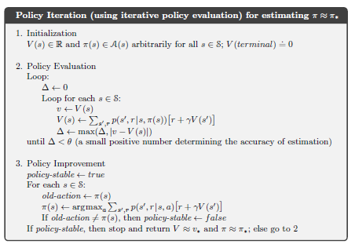

## Policy Improvement via Greedy Policy Construction

### Introdução
O objetivo central do **policy improvement** é encontrar políticas que superem ou, no mínimo, igualem a política atual em termos de recompensa esperada. Este processo é crucial no contexto do **dynamic programming** (DP), onde se busca iterativamente a política ótima através da avaliação e subsequente melhoria das políticas [^1]. O presente capítulo explora detalhadamente o processo de **policy improvement**, focando na construção de uma nova política *greedy* em relação à função de valor da política original.

### Conceitos Fundamentais

O processo de **policy improvement** começa com uma política arbitrária $\pi$ e sua função de valor associada $v_\pi$ [^1]. Para determinar se uma mudança na política é benéfica, avaliamos a ação $a \ne \pi(s)$ em um estado $s$ específico. A qualidade de selecionar $a$ em $s$ e, posteriormente, seguir $\pi$ é dada por $q_\pi(s, a)$ [^7]:

$$q_\pi(s, a) = \mathbb{E}[R_{t+1} + \gamma v_\pi(S_{t+1}) | S_t = s, A_t = a] = \sum_{s', r} p(s', r | s, a) [r + \gamma v_\pi(s')] \$$ [^7]

> 💡 **Exemplo Numérico:**
>
> Suponha um ambiente com 3 estados ($S = \{s_1, s_2, s_3\}$) e duas ações ($A = \{a_1, a_2\}$). Considere que estamos avaliando a política $\pi$ e já calculamos $v_\pi(s_1) = 10$, $v_\pi(s_2) = 5$, e $v_\pi(s_3) = 0$. Estamos no estado $s_1$ e $\pi(s_1) = a_1$. Agora, queremos avaliar a ação $a_2$ em $s_1$. Suponha que:
>
> *   $p(s_2, 2 | s_1, a_2) = 0.8$ (probabilidade de ir para $s_2$ com recompensa 2)
> *   $p(s_3, -1 | s_1, a_2) = 0.2$ (probabilidade de ir para $s_3$ com recompensa -1)
> *   $\gamma = 0.9$ (fator de desconto)
>
> Então, $q_\pi(s_1, a_2)$ seria calculado como:
>
> $q_\pi(s_1, a_2) = (0.8) * [2 + (0.9) * 5] + (0.2) * [-1 + (0.9) * 0] = (0.8) * [2 + 4.5] + (0.2) * [-1] = (0.8) * 6.5 - 0.2 = 5.2 - 0.2 = 5.0$
>
> Isso significa que, se escolhermos a ação $a_2$ no estado $s_1$ e seguirmos a política $\pi$ a partir do próximo estado, o valor esperado é 5.0.

O critério fundamental para melhoria é comparar $q_\pi(s, a)$ com $v_\pi(s)$. Se $q_\pi(s, a) > v_\pi(s)$, sugere-se que selecionar $a$ em $s$ e seguir $\pi$ é superior a seguir $\pi$ integralmente [^7]. A **policy improvement theorem** formaliza esta ideia:

*Sejam $\pi$ e $\pi'$ duas políticas determinísticas tais que, para todo $s \in S$, $q_\pi(s, \pi'(s)) \ge v_\pi(s)$, então a política $\pi'$ deve ser tão boa quanto ou melhor que a política $\pi$, ou seja, $v_{\pi'}(s) \ge v_\pi(s)$ para todo $s \in S$.* [^7]

**Prova da Policy Improvement Theorem:**

I. Começamos com a definição de $v_\pi(s)$:
   $$v_\pi(s) = \mathbb{E}_\pi[G_t | S_t = s]$$

II. Usando a definição de $q_\pi(s, a)$:
    $$v_\pi(s) \le q_\pi(s, \pi'(s)) = \mathbb{E}[R_{t+1} + \gamma v_\pi(S_{t+1}) | S_t = s, A_t = \pi'(s)]$$
    (Dado que $q_\pi(s, \pi'(s)) \ge v_\pi(s)$ para todo $s$)

III. Expandindo recursivamente $v_\pi(S_{t+1})$:
     $$v_\pi(s) \le \mathbb{E}[R_{t+1} + \gamma q_\pi(S_{t+1}, \pi'(S_{t+1})) | S_t = s, A_t = \pi'(s)]$$

IV. Aplicando repetidamente a condição $q_\pi(s, \pi'(s)) \ge v_\pi(s)$:
    $$v_\pi(s) \le \mathbb{E}_{\pi'}[R_{t+1} + \gamma R_{t+2} + \gamma^2 R_{t+3} + \ldots | S_t = s] = v_{\pi'}(s)$$

V. Portanto, $v_{\pi'}(s) \ge v_\pi(s)$ para todo $s \in S$. ■

**Lema 1:** Se existe um estado $s$ tal que $q_\pi(s, \pi'(s)) > v_\pi(s)$, então existe uma probabilidade não nula de que a política $\pi'$ tenha um desempenho estritamente melhor do que a política $\pi$.

*Prova:* Seja $s$ um estado tal que $q_\pi(s, \pi'(s)) > v_\pi(s)$.  Considere a trajetória que começa no estado $s$. A diferença entre seguir $\pi'$ e seguir $\pi$ no estado $s$ é $q_\pi(s, \pi'(s)) - v_\pi(s) > 0$.  Se a trajetória visita este estado com probabilidade não nula, então o valor esperado de seguir $\pi'$ ao invés de $\pi$ será maior. $\blacksquare$

**Construção da Política Greedy:**
Com base na **policy improvement theorem**, construímos uma nova política *greedy* $\pi'$, que seleciona, em cada estado $s$, a ação que maximiza $q_\pi(s, a)$ [^7]. Essa política é definida como:

$$\pi'(s) = \underset{a}{\text{argmax}} \, q_\pi(s, a) = \underset{a}{\text{argmax}} \, \mathbb{E}[R_{t+1} + \gamma v_\pi(S_{t+1}) | S_t = s, A_t = a] = \underset{a}{\text{argmax}} \sum_{s', r} p(s', r | s, a) [r + \gamma v_\pi(s')] \$$ [^7]

> 💡 **Exemplo Numérico:**
>
> Continuando o exemplo anterior, onde $q_\pi(s_1, a_2) = 5.0$ e $v_\pi(s_1) = 10$, vamos supor que já calculamos $q_\pi(s_1, a_1)$ e descobrimos que $q_\pi(s_1, a_1) = 8.0$.
>
> A política *greedy* $\pi'$ então escolheria a ação que maximiza $q_\pi(s_1, a)$. Neste caso:
>
> $\pi'(s_1) = \underset{a}{\text{argmax}} \, q_\pi(s_1, a) = \text{argmax}(q_\pi(s_1, a_1), q_\pi(s_1, a_2)) = \text{argmax}(8.0, 5.0) = a_1$
>
> Portanto, a política *greedy* $\pi'$ seleciona a ação $a_1$ no estado $s_1$, pois $q_\pi(s_1, a_1) > q_\pi(s_1, a_2)$. Observe que, mesmo que $q_\pi(s_1, a_1) < v_\pi(s_1)$, o que importa é que $a_1$ é a melhor ação *em relação a outras ações*, dadas as estimativas atuais de $v_\pi$.

Esta nova política, por construção, satisfaz a condição da **policy improvement theorem**. Portanto, espera-se que ela seja uma política aprimorada em relação à original [^7].

**Observação sobre políticas não determinísticas:** Embora a política greedy $\pi'$ seja determinística por construção, a política original $\pi$ não precisa ser. A **policy improvement theorem** também se aplica a políticas estocásticas. Para ver isso, considere a política $\pi'$ definida como $\pi'(a|s) = \mathbb{P}(A_t = a | S_t = s)$. Então, podemos definir $q_\pi(s, \pi'(s)) = \sum_{a} \pi'(a|s)q_\pi(s, a)$. A condição para melhoria da política torna-se $\sum_{a} \pi'(a|s)q_\pi(s, a) \ge v_\pi(s)$ para todo $s \in S$.

**O Teorema da Melhoria da Política**
O teorema da melhoria da política assegura que a nova política *greedy* $\pi'$ é pelo menos tão boa quanto a política original $\pi$. Se $v_{\pi'}(s) = v_{\pi}(s)$ para todos os estados, então ambas as políticas são ótimas [^7]. Caso contrário, $\pi'$ é estritamente melhor do que $\pi$ [^7].

**Formalmente:**
1.  Seja $\pi$ uma política arbitrária.
2.  Calcule $v_\pi$ para $\pi$.
3.  Crie uma política *greedy* $\pi'$ com respeito a $v_\pi$ [^7].

4.  Se $v_{\pi'}(s) = v_\pi(s)$ para todo $s$, então $\pi$ e $\pi'$ são ótimas.
5.  Caso contrário, $\pi'$ é uma política estritamente melhor.

**Prova:**
Como $\pi'(s) = \underset{a}{\text{argmax}} \, $q_\pi(s, a)$, temos que $q_\pi(s, \pi'(s)) \geq v_\pi(s)$ para todo $s \in S$.
Aplicando o teorema da melhoria da política, segue-se que $v_{\pi'}(s) \geq v_\pi(s)$ para todo $s \in S$.

Se $v_{\pi'}(s) = v_\pi(s)$ para todo $s \in S$, então $v_\pi(s) = \max_a \sum_{s', r} p(s', r | s, a) [r + \gamma v_\pi(s')] \$, que é a equação de otimalidade de Bellman. Portanto, $\pi$ (e $\pi'$) são ótimas [^7].
$\blacksquare$

**Teorema 2:** Se a política greedy $\pi'$ construída a partir de $v_\pi$ é tal que $v_{\pi'} = v_\pi$, então $\pi$ é uma política ótima.

*Prova:* Se $v_{\pi'} = v_\pi$, então para todo $s$, $v_\pi(s) = v_{\pi'}(s)$. Como $\pi'$ é uma política greedy com respeito a $v_\pi$, temos que $v_{\pi'}(s) = \max_a q_\pi(s, a)$. Portanto, $v_\pi(s) = \max_a q_\pi(s, a)$ para todo $s$. Isso significa que $v_\pi$ satisfaz a equação de Bellman para otimalidade, e portanto, $\pi$ é uma política ótima. $\blacksquare$

**Corolário 2.1:** Se durante a iteração de melhoria de política, a política não muda (isto é, $\pi' = \pi$), então $\pi$ é uma política ótima.

*Prova:* Se $\pi' = \pi$, então $v_{\pi'} = v_\pi$. Pelo Teorema 2, $\pi$ é uma política ótima. $\blacksquare$

**Observação:**
A política *greedy* é determinada pela função $q(s,a)$, que denota o valor de se executar a ação $a$ no estado $s$ e, subsequentemente, seguir a política $\pi$. Esta formulação permite que a melhoria da política seja expressa em termos dos valores Q [^7].

**Teorema 3:** O processo iterativo de policy evaluation e policy improvement converge para a política ótima.

*Prova:* A cada iteração, a política é garantidamente melhorada (ou permanece a mesma se já for ótima). Como o número de políticas determinísticas é finito (para um espaço de estados e ações finito), o processo deve convergir para uma política ótima em um número finito de iterações. $\blacksquare$

### Conclusão
O **policy improvement** através da construção de uma política *greedy* é um passo fundamental nos algoritmos de **dynamic programming**. Ao explorar a função de valor da política atual e construir uma nova política que age *greedy* em relação a essa função, garantimos uma melhoria ou, no mínimo, a manutenção do desempenho. Este processo iterativo converge para a política ótima, demonstrando a eficácia da combinação entre **policy evaluation** e **policy improvement** no contexto do **reinforcement learning** [^1].

### Referências
[^1]: Chapter 4: Dynamic Programming
[^7]: Section 4.2 Policy Improvement
<!-- END -->