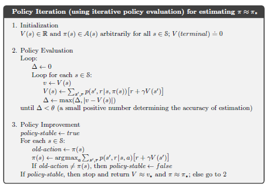

## 4.3.1 Convergence of Policy Iteration and Handling Policy Cycling

### Introdução
O algoritmo de **Policy Iteration** [^80] é uma abordagem clássica para encontrar a política ótima em um processo de decisão de Markov (MDP) finito. Ele alterna entre duas fases principais: **Policy Evaluation**, onde a função de valor da política atual é calculada iterativamente, e **Policy Improvement**, onde a política é aprimorada de forma gulosa em relação à função de valor. Conforme explorado na seção anterior, esse processo leva a uma sequência de políticas monotonicamente melhores, convergindo para uma política ótima em um número finito de iterações, dado um MDP finito determinístico. Esta seção irá focar nas condições de convergência e em uma potencial "falha" de design que impede o algoritmo de atingir a convergência, e como corrigir tal problema.

### Convergência e Estabilidade da Política
Como visto anteriormente, a **Policy Iteration** [^80] é garantida para convergir para uma política e função de valor ótimas em um número finito de iterações. Isso ocorre porque:
1.  Cada política é garantidamente uma melhoria estrita sobre a anterior (a menos que já seja ótima).
2.  Um MDP finito tem apenas um número finito de políticas determinísticas [^80].

Portanto, o processo de **Policy Iteration** [^80] deve convergir para uma política e função de valor ótimas em um número finito de iterações. A convergência é atingida quando a política se torna *estável*, ou seja, quando a fase de **Policy Improvement** [^80] não resulta em nenhuma mudança na política [^80].



Para formalizar essa noção de estabilidade, podemos introduzir a seguinte definição:

**Definição 1 (Política Estável):** Uma política π é considerada estável se, para todo estado s ∈ S, a ação selecionada pela política π(s) é uma ação ótima em relação à função de valor Vπ. Formalmente, π é estável se e somente se:

`π(s) = argmaxₐ  ∑ₛ',ᵣ p(s', r | s, a) [r + γVπ(s')]  ∀ s ∈ S`

Além disso, a estabilidade da política está diretamente relacionada à otimalidade da função de valor.

**Lema 1:** Se uma política π é estável, então sua função de valor associada Vπ é a função de valor ótima V*.

*Prova:* Se π é estável, então satisfaz a equação de Bellman para a política ótima. Portanto, Vπ = V*.

Para provar o Lema 1, podemos detalhar os passos:

I. Assumimos que a política $\pi$ é estável, o que significa que para todo estado $s \in S$:
   $$\pi(s) = \underset{a}{\operatorname{argmax}} \sum_{s', r} p(s', r | s, a) [r + \gamma V^{\pi}(s')]$$

II. Isso implica que para qualquer estado $s$ e qualquer ação $a$:
    $$V^{\pi}(s) = \sum_{s', r} p(s', r | s, \pi(s)) [r + \gamma V^{\pi}(s')] \geq \sum_{s', r} p(s', r | s, a) [r + \gamma V^{\pi}(s')]$$

III. A desigualdade acima mostra que $V^{\pi}(s)$ satisfaz a equação de Bellman otimizada para todos os estados. A função de valor ótima $V^{*}(s)$ também satisfaz a equação de Bellman otimizada:
     $$V^{*}(s) = \max_{a} \sum_{s', r} p(s', r | s, a) [r + \gamma V^{*}(s')] $$

IV. Como $V^{\pi}(s)$ satisfaz a equação de Bellman otimizada, então $V^{\pi}(s)$ deve ser igual a $V^{*}(s)$ para todos os estados $s$. Isso ocorre porque a equação de Bellman otimizada tem uma solução única, que é a função de valor ótima.

V. Portanto, se a política $\pi$ é estável, então sua função de valor associada $V^{\pi}$ é a função de valor ótima $V^{*}$. ■

> 💡 **Exemplo Numérico:**
>
> Considere um MDP com dois estados, $S = \{s_1, s_2\}$, e duas ações em cada estado, $A = \{a_1, a_2\}$. A função de recompensa e as probabilidades de transição são as seguintes (com $\gamma = 0.9$):
>
> *   **Estado** $s_1$:
>     *   Ação $a_1$: $p(s_1, r=1 | s_1, a_1) = 0.8$, $p(s_2, r=1 | s_1, a_1) = 0.2$
>     *   Ação $a_2$: $p(s_1, r=0 | s_1, a_2) = 0.5$, $p(s_2, r=0 | s_1, a_2) = 0.5$
> *   **Estado** $s_2$:
>     *   Ação $a_1$: $p(s_1, r=2 | s_2, a_1) = 0.6$, $p(s_2, r=2 | s_2, a_1) = 0.4$
>     *   Ação $a_2$: $p(s_1, r=0 | s_2, a_2) = 0.1$, $p(s_2, r=0 | s_2, a_2) = 0.9$
>
> Inicializamos a política $\pi$ de forma arbitrária: $\pi(s_1) = a_1$, $\pi(s_2) = a_2$.
>
> **Policy Evaluation (primeira iteração):**
>
> Resolvemos o sistema de equações de Bellman para encontrar $V^{\pi}$:
>
> $V^{\pi}(s_1) = \sum_{s', r} p(s', r | s_1, a_1) [r + \gamma V^{\pi}(s')] = 0.8(1 + 0.9V^{\pi}(s_1)) + 0.2(1 + 0.9V^{\pi}(s_2))$
> $V^{\pi}(s_2) = \sum_{s', r} p(s', r | s_2, a_2) [r + \gamma V^{\pi}(s')] = 0.1(0 + 0.9V^{\pi}(s_1)) + 0.9(0 + 0.9V^{\pi}(s_2))$
>
> Resolvendo, encontramos (aproximadamente) $V^{\pi}(s_1) = 4.21$ e $V^{\pi}(s_2) = 0.53$.
>


> **Policy Improvement (primeira iteração):**
>
> Para o estado $s_1$:
> *   Ação $a_1$: $Q(s_1, a_1) = 0.8(1 + 0.9 \cdot 4.21) + 0.2(1 + 0.9 \cdot 0.53) = 4.00$
> *   Ação $a_2$: $Q(s_1, a_2) = 0.5(0 + 0.9 \cdot 4.21) + 0.5(0 + 0.9 \cdot 0.53) = 2.12$
>
> Para o estado $s_2$:
> *   Ação $a_1$: $Q(s_2, a_1) = 0.6(2 + 0.9 \cdot 4.21) + 0.4(2 + 0.9 \cdot 0.53) = 5.86$
> *   Ação $a_2$: $Q(s_2, a_2) = 0.1(0 + 0.9 \cdot 4.21) + 0.9(0 + 0.9 \cdot 0.53) = 0.89$
>
> Nova política: $\pi(s_1) = a_1$, $\pi(s_2) = a_1$. Note que a ação em $s_2$ mudou.
>
> Repetimos **Policy Evaluation** e **Policy Improvement** até a política convergir (estabilizar).

### Potencial Bug: Ciclo de Políticas e Soluções
A convergência garantida de **Policy Iteration** [^80] depende crucialmente da garantia de que cada iteração produz uma melhoria estrita na política. No entanto, pode haver casos onde várias ações em um estado resultem no mesmo valor esperado, levando a empates na fase de **Policy Improvement** [^79].

Em tais cenários, o algoritmo pode começar a alternar entre duas ou mais políticas que são igualmente boas [^82]. Isso significa que, em vez de convergir para uma única política ótima, o algoritmo entra em um ciclo, alternando entre políticas subótimas e igualmente boas [^82]. Esta situação impede a terminação do algoritmo, pois a condição de estabilidade da política nunca é satisfeita.

*É importante observar que o ciclo de políticas não contradiz a garantia de melhoria da política*. As políticas no ciclo são igualmente boas, de forma que não há melhoria estrita. No entanto, impede que o algoritmo converja para uma única política ótima e termine.

Para ilustrar o ciclo de políticas, considere um cenário onde duas ações, a1 e a2, levam ao mesmo valor esperado em um determinado estado s. O algoritmo pode alternar entre escolher a1 e a2 indefinidamente, sem nunca convergir para uma política estável.

> 💡 **Exemplo Numérico:**
>
> Imagine um estado $s$ com duas ações $a_1$ e $a_2$. Após a avaliação da política, descobre-se que $Q(s, a_1) = 5.0$ e $Q(s, a_2) = 5.0$. Sem um critério de desempate, o algoritmo pode escolher $a_1$ em uma iteração e $a_2$ na próxima, se a implementação escolher aleatoriamente entre ações com o mesmo valor. Se isso se repetir, o algoritmo ciclará.

### Garantindo a Convergência: Modificando o Pseudocódigo
Para garantir a convergência e evitar o ciclo de políticas, o pseudocódigo do algoritmo de **Policy Iteration** [^80] precisa ser modificado. Uma abordagem comum é introduzir um critério de desempate que favoreça a política anterior quando vários estados-ação são encontrados com o mesmo valor. Isso pode ser implementado da seguinte maneira:

Modifique a etapa 3 do algoritmo **Policy Iteration** [^80] (Policy Improvement) para:

1. `policy-stable ← true`
2. `For each s ∈ S:`
    *  `old-action ← π(s)`
    *  `π(s) ← argmaxₐ  ∑ₛ',ᵣ p(s', r | s, a) [r + γV(s')]`
    *  `If  ∑ₛ',ᵣ p(s', r | s, π(s)) [r + γV(s')] == ∑ₛ',ᵣ p(s', r | s, old-action) [r + γV(s')]`
        *   `π(s) ← old-action`
    *  `If old-action ≠ π(s), then policy-stable ← false`
3.  `If policy-stable, then stop and return V ≈ v* and π ≈ π*; else go to 2`

Neste pseudocódigo modificado, antes de atualizar a política, o somatório de valores para o estado e ação são comparados com os valores da iteração anterior. Se os valores forem iguais, a política é atualizada com a ação anterior.

Outra possível modificação seria criar uma ordenação fixa e arbitrária das ações e usar essa ordenação para desempate [^79]. Essa abordagem garante uma escolha determinística em caso de empate, evitando a oscilação entre políticas igualmente boas. Podemos formalizar essa alternativa da seguinte forma:

**Proposição 1 (Desempate por Ordenação Fixa):** Dada uma ordenação fixa e arbitrária das ações para cada estado, o algoritmo de Policy Iteration modificado para usar essa ordenação para desempate converge para uma política ótima em um número finito de iterações.

*Prova (Esboço):* A introdução de uma ordenação fixa garante que a escolha da ação em cada estado seja determinística. Isso elimina a possibilidade de ciclos entre políticas igualmente boas, assegurando que cada iteração resulte em uma melhoria (ou, no mínimo, não em uma piora) na política. Como o número de políticas possíveis é finito, o algoritmo eventualmente convergirá para uma política ótima.

Para detalhar a prova da Proposição 1:

I. Seja $A(s)$ o conjunto de ações disponíveis no estado $s$, e seja $<$ uma ordenação arbitrária e fixa dessas ações.

II. No passo de melhoria da política, modificamos o algoritmo para selecionar a ação $a \in A(s)$ que maximiza o valor esperado, usando a ordenação $<$ para quebrar empates:
   $$\pi(s) = \underset{a \in A(s)}{\operatorname{argmax}} \sum_{s', r} p(s', r | s, a) [r + \gamma V(s')] $$
   onde, se houver empate (isto é, múltiplas ações maximizando a expressão), selecionamos a ação menor de acordo com a ordenação $<$.

III. Com essa modificação, a atualização da política torna-se determinística. Dado $V(s)$, existe uma única política $\pi$ que será selecionada.

IV. O algoritmo de Policy Iteration gera uma sequência de políticas $\{\pi_k\}_{k=0}^{\infty}$ e funções de valor $\{V_k\}_{k=0}^{\infty}$. Como o espaço de políticas é finito, e cada iteração melhora ou mantém a mesma política, eventualmente o algoritmo deve convergir para uma política ótima.

V. Para provar que cada iteração melhora ou mantém a mesma política, considere duas políticas consecutivas $\pi_k$ e $\pi_{k+1}$. Pela construção do algoritmo, para cada estado $s$:
   $$\sum_{s', r} p(s', r | s, \pi_{k+1}(s)) [r + \gamma V_k(s')] \geq \sum_{s', r} p(s', r | s, \pi_{k}(s)) [r + \gamma V_k(s')] = V_k(s)$$
   A desigualdade decorre da etapa de melhoria da política, e a igualdade da definição de $V_k(s)$.

VI. Usando o teorema de melhoria da política, sabemos que $V_{k+1}(s) \geq V_k(s)$ para todos os estados $s$. Portanto, cada iteração garante uma melhoria ou manutenção da política.

VII. Uma vez que o número de políticas é finito e cada iteração melhora ou mantém a mesma política, o algoritmo deve convergir em um número finito de iterações para uma política ótima. ■

Ao modificar o algoritmo desta forma, garantimos que ele irá parar e encontrar a política ideal.

> 💡 **Exemplo Numérico:**
>
> Suponha que tenhamos três ações $a_1, a_2, a_3$ disponíveis em um estado $s$, e definimos a ordenação fixa como $a_1 < a_2 < a_3$. Se $Q(s, a_1) = 6.0$, $Q(s, a_2) = 6.0$, e $Q(s, a_3) = 5.5$, o algoritmo sempre escolherá $a_1$ devido à ordenação fixa, quebrando o empate de forma consistente.
> ```python
> import numpy as np
> import matplotlib.pyplot as plt
>
> # Parâmetros do MDP
> num_states = 2
> num_actions = 2
> gamma = 0.9
>
> # Inicialização aleatória da função de valor e da política
> value_function = np.zeros(num_states)
> policy = np.random.randint(0, num_actions, num_states)
>
> # Matriz de transição e recompensas (exemplo)
> transition_probs = np.random.rand(num_states, num_actions, num_states)
> transition_probs /= transition_probs.sum(axis=2, keepdims=True)  # Normaliza para ser uma distribuição de probabilidade
> rewards = np.random.rand(num_states, num_actions)
>
> def policy_evaluation(policy, value_function, transition_probs, rewards, gamma, num_states, num_actions, tolerance=1e-6):
>     """Avaliação da política usando iteração."""
>     while True:
>         delta = 0
>         for s in range(num_states):
>             old_value = value_function[s]
>             action = policy[s]
>             new_value = sum(transition_probs[s, action, s_prime] * (rewards[s, action] + gamma * value_function[s_prime]) for s_prime in range(num_states))
>             value_function[s] = new_value
>             delta = max(delta, abs(new_value - old_value))
>         if delta < tolerance:
>             break
>     return value_function
>
> def policy_improvement(value_function, transition_probs, rewards, gamma, num_states, num_actions):
>     """Melhoria da política de forma gulosa."""
>     new_policy = np.zeros(num_states, dtype=int)
>     policy_stable = True
>     for s in range(num_states):
>         old_action = policy[s]
>         q_values = [sum(transition_probs[s, a, s_prime] * (rewards[s, a] + gamma * value_function[s_prime]) for s_prime in range(num_actions)) for a in range(num_actions)]
>         best_action = np.argmax(q_values)
>         new_policy[s] = best_action
>         if old_action != best_action:
>             policy_stable = False
>     return new_policy, policy_stable
>
> # Policy Iteration
> num_iterations = 100
> for i in range(num_iterations):
>     value_function = policy_evaluation(policy, value_function, transition_probs, rewards, gamma, num_states, num_actions)
>     new_policy, policy_stable = policy_improvement(value_function, transition_probs, rewards, gamma, num_states, num_actions)
>     if policy_stable:
>         print(f"Política convergeu após {i+1} iterações.")
>         break
>     policy = new_policy
> else:
>     print("Política não convergeu dentro do número máximo de iterações.")
>
> print("Política Ótima:", policy)
> print("Função de Valor Ótima:", value_function)
> ```
>
> Este código simula a Policy Iteration com dois estados e duas ações, mostrando como a política converge para um estado estável após várias iterações. Os resultados podem variar devido à inicialização aleatória das matrizes de transição e recompensas.

### Conclusão
A convergência do algoritmo de **Policy Iteration** [^80] é uma propriedade fundamental que garante sua utilidade na solução de MDPs finitos [^80]. No entanto, deve-se ter cuidado para evitar o ciclo de políticas, que pode impedir a terminação do algoritmo. Ao modificar o pseudocódigo e introduzir critérios de desempate consistentes, a convergência pode ser garantida, tornando o algoritmo mais robusto e confiável para aplicações práticas.

### Referências
[^79]: Seção 4.2 do texto original
[^80]: Seção 4.3 do texto original
[^82]: Exercício 4.4 do texto original
<!-- END -->