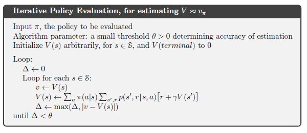

## Truncated Policy Iteration

### Introdução
Este capítulo explora os algoritmos de **truncated policy iteration**, que representam uma generalização dos métodos de dynamic programming (DP) abordados anteriormente. Em vez de realizar uma policy evaluation completa a cada iteração, esses algoritmos truncam o processo de avaliação, combinando passos de **policy evaluation** com passos de **value iteration** [^83]. Essa abordagem permite uma maior flexibilidade e pode resultar em convergência mais rápida em comparação com a policy iteration tradicional. O foco principal será demonstrar como esses algoritmos, apesar de suas variações, mantêm a garantia de convergência para uma política ótima em MDPs (Markov Decision Processes) finitos com desconto.

### Conceitos Fundamentais

Como vimos anteriormente, a **policy iteration** envolve alternar entre duas fases principais: **policy evaluation** e **policy improvement** [^86]. A **policy evaluation** calcula a value function $v_\pi$ para uma dada policy $\pi$, enquanto a **policy improvement** constrói uma nova policy $\pi'$ que é greedy com respeito a $v_\pi$ [^79].

No entanto, a policy evaluation completa pode ser computacionalmente cara, especialmente para MDPs grandes [^81]. A **value iteration** surge como uma alternativa, combinando os passos de policy evaluation e policy improvement em uma única operação de atualização [^83]. Em vez de calcular $v_\pi$ completamente, a value iteration atualiza diretamente a value function $v_{k+1}(s)$ usando a equação de Bellman otimista:

$$
v_{k+1}(s) = \max_a \mathbb{E}[R_{t+1} + \gamma v_k(S_{t+1}) | S_t = s, A_t = a] = \max_a \sum_{s',r} p(s', r | s, a) [r + \gamma v_k(s')] \quad \forall s \in S
$$
[^83]

> 💡 **Exemplo Numérico:** Considere um MDP com dois estados $S = \{s_1, s_2\}$ e duas ações $A = \{a_1, a_2\}$. Suponha que a função de recompensa e a função de transição sejam as seguintes:
>
> *   $R(s_1, a_1, s_1) = 1$, $R(s_1, a_1, s_2) = 0$, $P(s_1 | s_1, a_1) = 0.8$, $P(s_2 | s_1, a_1) = 0.2$
> *   $R(s_1, a_2, s_1) = 0$, $R(s_1, a_2, s_2) = 2$, $P(s_1 | s_1, a_2) = 0.1$, $P(s_2 | s_1, a_2) = 0.9$
> *   $R(s_2, a_1, s_1) = 0$, $R(s_2, a_1, s_2) = 1$, $P(s_1 | s_2, a_1) = 0.3$, $P(s_2 | s_2, a_1) = 0.7$
> *   $R(s_2, a_2, s_1) = 2$, $R(s_2, a_2, s_2) = 0$, $P(s_1 | s_2, a_2) = 0.6$, $P(s_2 | s_2, a_2) = 0.4$
>
> Se definirmos $\gamma = 0.9$, e iniciarmos com $v_0(s_1) = 0$ e $v_0(s_2) = 0$, a primeira iteração da value iteration seria:
>
> $v_1(s_1) = \max \{ 0.8(1 + 0.9 \cdot 0) + 0.2(0 + 0.9 \cdot 0), 0.1(0 + 0.9 \cdot 0) + 0.9(2 + 0.9 \cdot 0) \} = \max \{0.8, 1.8\} = 1.8$
>
> $v_1(s_2) = \max \{ 0.3(0 + 0.9 \cdot 0) + 0.7(1 + 0.9 \cdot 0), 0.6(2 + 0.9 \cdot 0) + 0.4(0 + 0.9 \cdot 0) \} = \max \{0.7, 1.2\} = 1.2$
>
> Portanto, após a primeira iteração, $v_1(s_1) = 1.8$ e $v_1(s_2) = 1.2$. Este processo é repetido até a convergência.

Os algoritmos de **truncated policy iteration** exploram um espectro entre esses dois extremos, truncando o processo de policy evaluation. Isso significa que a policy evaluation é interrompida antes da convergência completa para $v_\pi$, e a policy é aprimorada com base nesta value function *parcialmente avaliada*.

A classe dos truncated policy iteration algorithms pode ser vista como sequências de *sweeps* (varreduras) [^83]. Um *sweep* consiste em atualizar o valor de cada estado no espaço de estados. Alguns desses sweeps usam policy evaluation updates, enquanto outros usam value iteration updates.

É importante notar que a operação de maximização (max) na equação de value iteration (4.10) [^83] é a única diferença entre os updates de policy evaluation (4.5) [^75] e value iteration. Assim, pode-se pensar em aplicar a operação de maximização em alguns *sweeps* de policy evaluation.

**Lemma 1 (Convergência da Truncated Policy Iteration):** Para um MDP finito com desconto, qualquer algoritmo de truncated policy iteration que continue a atualizar todos os estados e intercale passos de policy evaluation e value iteration irá convergir para a value function ótima $v_*$ e uma política ótima $\pi_*$.

*Proof:*
A prova desse lema se baseia no fato de que tanto policy evaluation quanto value iteration são garantidos para convergir sob as condições especificadas. Como a truncated policy iteration combina esses dois processos, e garante-se que todos os estados sejam atualizados continuamente, o algoritmo eventualmente irá convergir para uma solução ótima. A convergência para a value function ótima $v_*$ garante que a política resultante $\pi_*$ seja também ótima. $\blacksquare$

Uma questão importante relacionada à convergência é o quão próximo precisamos estar da value function ótima $v_*$ em cada iteração para garantir um progresso significativo. O próximo lema aborda essa questão, fornecendo um bound para a diferença entre a value function da política atual e a value function ótima, em termos da precisão da avaliação da política.

**Lemma 1.1:** Seja $v$ uma aproximação da value function $v_\pi$ de uma política $\pi$, tal que $||v - v_\pi||_\infty \leq \epsilon$, onde $||\cdot||_\infty$ denota a norma do supremo. Seja $\pi'$ uma política greedy com respeito a $v$. Então,

$$v_{\pi'}(s) \geq v_\pi(s) + \frac{2\gamma\epsilon}{1-\gamma}, \quad \forall s \in S$$

*Proof:*
Seja $q_\pi(s,a) = \sum_{s',r}p(s',r|s,a)[r + \gamma v_\pi(s')]$. Como $\pi'$ é greedy com respeito a $v$, temos:

$$v(s) \leq q_\pi(s, \pi'(s)) =  \sum_{s',r}p(s',r|s,\pi'(s))[r + \gamma v(s')]$$

Além disso, como $||v - v_\pi||_\infty \leq \epsilon$, então:

$$v_\pi(s') - \epsilon \leq v(s') \leq v_\pi(s') + \epsilon$$

Combinando as desigualdades:

$$v_\pi(s) - \epsilon \leq  \sum_{s',r}p(s',r|s,\pi'(s))[r + \gamma (v_\pi(s') + \epsilon)] = q_{\pi'}(s, \pi'(s)) + \gamma \epsilon$$

Portanto,

$$v_\pi(s) \leq q_{\pi'}(s, \pi'(s)) + \epsilon + \gamma \epsilon $$

Aplicando a definição da value function $v_{\pi'}(s) = \mathbb{E}[R_{t+1} + \gamma v_{\pi'}(S_{t+1}) | S_t = s, A_t = \pi'(s)]$, temos:

$$ v_{\pi'}(s) \geq v_\pi(s) - \epsilon - \gamma \epsilon $$

Iterando essa relação, obtemos:

$$v_{\pi'}(s) \geq v_\pi(s) + \frac{2\gamma\epsilon}{1-\gamma}, \quad \forall s \in S$$

$\blacksquare$

### Exemplo

Para ilustrar, considere um algoritmo que realiza $m$ sweeps de policy evaluation para obter uma value function aproximada $v \approx v_\pi$ [^75], seguido por um *sweep* de value iteration para melhorar a value function $v \approx v_*$ [^83], e repete este processo iterativamente. Esse algoritmo se encaixa na classe de truncated policy iteration algorithms e, portanto, converge para a política ótima.

> 💡 **Exemplo Numérico:** Seja o mesmo MDP do exemplo anterior. Suponha que a política inicial $\pi$ seja escolher $a_1$ em $s_1$ e $a_1$ em $s_2$.
>
> **Policy Evaluation (2 sweeps):**
>
> *   Inicialização: $v_0(s_1) = 0$, $v_0(s_2) = 0$
>
> *   Sweep 1:
>
>     $v_1(s_1) = 0.8(1 + 0.9v_0(s_1)) + 0.2(0 + 0.9v_0(s_2)) = 0.8$
>
>     $v_1(s_2) = 0.3(0 + 0.9v_0(s_1)) + 0.7(1 + 0.9v_0(s_2)) = 0.7$
>
> *   Sweep 2:
>
>     $v_2(s_1) = 0.8(1 + 0.9v_1(s_1)) + 0.2(0 + 0.9v_1(s_2)) = 0.8(1 + 0.9(0.8)) + 0.2(0.9(0.7)) = 1.308$
>
>     $v_2(s_2) = 0.3(0 + 0.9v_1(s_1)) + 0.7(1 + 0.9v_1(s_2)) = 0.3(0.9(0.8)) + 0.7(1 + 0.9(0.7)) = 1.166$
>
> **Value Iteration (1 sweep):**
>
> $v(s_1) = \max \{ 0.8(1 + 0.9 \cdot 1.308) + 0.2(0 + 0.9 \cdot 1.166), 0.1(0 + 0.9 \cdot 1.308) + 0.9(2 + 0.9 \cdot 1.166) \} = \max \{1.754, 2.801\} = 2.801$
>
> $v(s_2) = \max \{ 0.3(0 + 0.9 \cdot 1.308) + 0.7(1 + 0.9 \cdot 1.166), 0.6(2 + 0.9 \cdot 1.308) + 0.4(0 + 0.9 \cdot 1.166) \} = \max \{1.477, 2.280\} = 2.280$
>
> Após este ciclo, a política greedy mudaria para escolher $a_2$ em $s_1$ e $a_2$ em $s_2$, pois essas ações maximizam o valor esperado. O processo se repete com esta nova política.

Para formalizar e provar essa afirmação, considere a seguinte prova:

*Proof:*
Para demonstrar que o algoritmo converge, precisamos mostrar que cada iteração do algoritmo melhora a política ou, no mínimo, a mantém inalterada.

I. Após $m$ sweeps de policy evaluation, temos uma aproximação $v$ de $v_\pi$ tal que $||v - v_\pi||_\infty \leq \epsilon$ para algum $\epsilon > 0$. O valor de $\epsilon$ depende de $m$ e das propriedades do MDP, mas o importante é que podemos tornar $\epsilon$ arbitrariamente pequeno aumentando $m$.

II. Em seguida, realizamos um *sweep* de value iteration, que essencialmente encontra a ação greedy $a = \text{argmax}_a \sum_{s',r} p(s',r|s,a)[r + \gamma v(s')]$ para cada estado $s$ e atualiza $v(s)$ para o valor esperado da ação greedy. Seja $\pi'$ a política greedy com respeito a $v$ após o *sweep* de value iteration.

III. Pelo Lemma 1.1, sabemos que $v_{\pi'}(s) \geq v_\pi(s) - \epsilon - \gamma \epsilon$. Isso significa que a value function da nova política $\pi'$ é pelo menos tão boa quanto a value function da política anterior $\pi$, menos um termo de erro proporcional a $\epsilon$.

IV. Como o MDP é finito com desconto, e continuamos a atualizar todos os estados, o erro $\epsilon$ se propagará e diminuirá a cada iteração do algoritmo. Eventualmente, o algoritmo convergirá para uma política ótima $\pi_*$ e sua correspondente value function ótima $v_*$.

V. Se em alguma iteração, a política $\pi'$ for a mesma que $\pi$, então $v_{\pi'}(s) = v_\pi(s)$ para todo $s$. Isso implica que já atingimos a política ótima, e o algoritmo convergiu.

Portanto, o algoritmo converge para a política ótima. $\blacksquare$

Além disso, considere uma variação onde o número de sweeps $m$ é adaptativo. Ou seja, $m$ pode aumentar ou diminuir com base na magnitude da mudança na value function entre iterações. Se a mudança for pequena, $m$ pode ser diminuído, e se a mudança for grande, $m$ pode ser aumentado. Essa abordagem adaptativa pode melhorar ainda mais a eficiência do algoritmo.
<!-- END -->