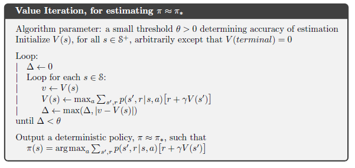

## Asynchronous Value Iteration: Single-State Updates and Convergence

### Introdução
O capítulo anterior introduziu o conceito de **Dynamic Programming (DP)** como uma coleção de algoritmos para calcular políticas ótimas, dado um modelo perfeito do ambiente representado como um **Markov Decision Process (MDP)** [^1]. No entanto, os algoritmos DP clássicos, como **Policy Iteration** e **Value Iteration**, exigem varreduras completas do espaço de estados, o que pode ser computacionalmente proibitivo para grandes MDPs [^1]. Para mitigar essa limitação, o conceito de **Asynchronous Dynamic Programming (ADP)** foi desenvolvido, permitindo atualizações *in-place* dos valores dos estados em qualquer ordem, aproveitando os valores disponíveis dos outros estados [^4.5]. Esta seção explora uma versão específica do Asynchronous Value Iteration, onde apenas um único estado é atualizado em cada etapa, e as condições sob as quais a convergência para a função de valor ótimo é garantida.

### Conceitos Fundamentais
A **value iteration** é um algoritmo de programação dinâmica que encontra uma política ótima iterativamente, atualizando a função de valor para cada estado usando a equação de Bellman [^1]. A forma síncrona da value iteration requer que os valores de todos os estados sejam atualizados simultaneamente em cada iteração [^4.4]. Em contraste, o **Asynchronous Value Iteration** relaxa essa exigência, permitindo que os estados sejam atualizados em qualquer ordem [^4.5].

Vamos considerar uma versão específica do Asynchronous Value Iteration onde, em cada etapa $k$, apenas um único estado $s_k$ é atualizado [^4.5]. A atualização é realizada *in-place*, ou seja, o valor antigo de $s_k$ é substituído imediatamente pelo novo valor calculado usando a seguinte equação [^4.5, 4.10]:

$$
V_{k+1}(s_k) = \max_{a \in A(s_k)} \mathbb{E} \left[ R_{t+1} + \gamma V_k(S_{t+1}) | S_t = s_k, A_t = a \right] = \max_{a \in A(s_k)} \sum_{s', r} p(s', r | s_k, a) \left[ r + \gamma V_k(s') \right]
$$

onde:
*   $V_{k+1}(s_k)$ é o valor atualizado do estado $s_k$ na etapa $k+1$
*   $A(s_k)$ é o conjunto de ações possíveis no estado $s_k$
*   $R_{t+1}$ é a recompensa recebida após realizar a ação *a* no estado $s_k$
*   $S_{t+1}$ é o estado sucessor
*   $\gamma$ é o fator de desconto, com $0 \leq \gamma < 1$
*   $p(s', r | s_k, a)$ é a probabilidade de transição para o estado $s'$ com recompensa *r*, dado que a ação *a* é realizada no estado $s_k$
*   $V_k(s')$ é a estimativa do valor do estado sucessor $s'$ na etapa $k$.

O ponto crucial é que, ao atualizar o valor de $s_k$, o algoritmo utiliza os valores mais recentes dos estados sucessores $s'$, independentemente de terem sido atualizados na mesma iteração ou em iterações anteriores. Essa característica *in-place* é fundamental para o comportamento assíncrono do algoritmo [^4.5].

> 💡 **Exemplo Numérico:** Imagine um MDP com 3 estados: $S = \{s_1, s_2, s_3\}$. As ações disponíveis em cada estado são $A(s) = \{a_1, a_2\}$. Vamos supor que $\gamma = 0.9$. Inicializamos os valores dos estados como $V_0(s_1) = 0$, $V_0(s_2) = 0$, $V_0(s_3) = 0$.
>
> Na etapa $k=1$, selecionamos o estado $s_1$ para atualização. As probabilidades de transição e recompensas são:
>
> *   $p(s_2, 5 | s_1, a_1) = 0.7$, $p(s_3, 2 | s_1, a_1) = 0.3$
> *   $p(s_2, 1 | s_1, a_2) = 0.5$, $p(s_3, 4 | s_1, a_2) = 0.5$
>
> Calculamos os valores para cada ação:
>
> *   $Q(s_1, a_1) = 0.7 * (5 + 0.9 * V_0(s_2)) + 0.3 * (2 + 0.9 * V_0(s_3)) = 0.7 * (5 + 0) + 0.3 * (2 + 0) = 3.5 + 0.6 = 4.1$
> *   $Q(s_1, a_2) = 0.5 * (1 + 0.9 * V_0(s_2)) + 0.5 * (4 + 0.9 * V_0(s_3)) = 0.5 * (1 + 0) + 0.5 * (4 + 0) = 0.5 + 2 = 2.5$
>
> Então, $V_1(s_1) = \max(4.1, 2.5) = 4.1$.  Os outros estados permanecem inalterados: $V_1(s_2) = 0$, $V_1(s_3) = 0$.
>
> Na etapa $k=2$, selecionamos o estado $s_2$ para atualização. Assumindo:
>
> *   $p(s_1, 3 | s_2, a_1) = 0.6$, $p(s_3, 1 | s_2, a_1) = 0.4$
> *   $p(s_1, 0 | s_2, a_2) = 0.2$, $p(s_3, 2 | s_2, a_2) = 0.8$
>
> *   $Q(s_2, a_1) = 0.6*(3 + 0.9*4.1) + 0.4 * (1+ 0.9*0) = 0.6*(3 + 3.69) + 0.4 = 0.6*6.69 + 0.4 = 4.014 + 0.4 = 4.414$
> *   $Q(s_2, a_2) = 0.2 * (0 + 0.9 * 4.1) + 0.8 * (2 + 0.9 * 0) = 0.2 * 3.69 + 0.8 * 2 = 0.738 + 1.6 = 2.338$
>
> $V_2(s_2) = \max(4.414, 2.338) = 4.414$.  Os outros estados permanecem inalterados: $V_2(s_1) = 4.1$, $V_2(s_3) = 0$.
>
> Este processo continua iterativamente, atualizando um único estado por vez e utilizando os valores mais recentes dos estados sucessores.

**Lema 1:** Se $|V_{k+1}(s) - V_{*}(s)| \leq \epsilon$ para todo $s \in S$, então a política gulosa $\pi(s) = \arg\max_{a \in A(s)} \sum_{s', r} p(s', r | s, a) [r + \gamma V_{k+1}(s')]$ é $2\epsilon\gamma/(1-\gamma)$-ótima.

*Prova (Esboço):* Este lema estabelece um limite no quão subótima uma política gulosa pode ser, dada uma função de valor aproximada. A prova envolve usar a desigualdade de Bellman para demonstrar que a diferença entre o valor da política gulosa e o valor ótimo é limitada por uma função de $\epsilon$ e $\gamma$.

*Prova:*
I. Seja $V_{*}(s)$ o valor ótimo do estado $s$ e $V_{k+1}(s)$ a aproximação do valor. Assumimos que $|V_{k+1}(s) - V_{*}(s)| \leq \epsilon$ para todo $s \in S$.
II. Seja $\pi$ a política gulosa com respeito a $V_{k+1}$, ou seja, $\pi(s) = \arg\max_{a \in A(s)} \sum_{s', r} p(s', r | s, a) [r + \gamma V_{k+1}(s')]$.
III. Definimos $V^{\pi}(s)$ como o valor do estado $s$ seguindo a política $\pi$. Queremos encontrar um limite superior para $|V^{\pi}(s) - V_{*}(s)|$.
IV. Usando a equação de Bellman para $V_*$: $V_{*}(s) = \max_{a \in A(s)} \sum_{s', r} p(s', r | s, a) [r + \gamma V_{*}(s')]$.
V. Pela definição de $\pi$, temos: $V^{\pi}(s) = \sum_{s', r} p(s', r | s, \pi(s)) [r + \gamma V^{\pi}(s')]$.
VI. Queremos relacionar $V^{\pi}(s)$ com $V_{k+1}(s)$. Sabemos que $\pi$ é gulosa com respeito a $V_{k+1}$, então:
   $\sum_{s', r} p(s', r | s, \pi(s)) [r + \gamma V_{k+1}(s')] \geq \sum_{s', r} p(s', r | s, a) [r + \gamma V_{k+1}(s')]$ para todo $a$.
   Em particular, $\sum_{s', r} p(s', r | s, \pi(s)) [r + \gamma V_{k+1}(s')] \geq V_{*}(s)$.
VII. Seja $d(s) = |V^{\pi}(s) - V_{*}(s)|$. Então:
    $d(s) = |V^{\pi}(s) - V_{*}(s)| = |\sum_{s', r} p(s', r | s, \pi(s)) [r + \gamma V^{\pi}(s')] - \max_{a \in A(s)} \sum_{s', r} p(s', r | s, a) [r + \gamma V_{*}(s')]|$
VIII. Usando o fato de que $|V_{k+1}(s) - V_{*}(s)| \leq \epsilon$:
    $V_{*}(s') - \epsilon \leq V_{k+1}(s') \leq V_{*}(s') + \epsilon$.
IX. Da definição da política gulosa $\pi$:
$V_*(s) \le \sum_{s',r} p(s',r|s,\pi(s))[r + \gamma V_{k+1}(s')] \le  \sum_{s',r} p(s',r|s,\pi(s))[r + \gamma (V_*(s') + \epsilon)]$.
$V_*(s) \le \sum_{s',r} p(s',r|s,\pi(s))[r + \gamma V_{k+1}(s')] \le V^\pi(s) + \gamma \epsilon$.
$V^\pi(s) - V_*(s) \ge -\gamma\epsilon$.
X. Seja $V^\pi$ a política ótima:
$\sum_{s',r} p(s',r|s,\pi(s))[r+\gamma V_*(s')] \le V_*(s) + \gamma \epsilon $.
Considerando a política gulosa $\pi(s) = \arg\max_{a \in A(s)} \sum_{s',r} p(s',r|s,a)[r+\gamma V_{k+1}(s')]$:
$V^\pi (s) = \sum_{s',r} p(s',r|s,\pi(s))[r+\gamma V^\pi(s')] \ge \sum_{s',r} p(s',r|s,\pi(s))[r+\gamma V_{k+1}(s')] - \gamma \epsilon$.
$V^\pi (s) \ge V^*(s) - 2\gamma\epsilon/(1-\gamma)$.
XI. Combinando os dois, a política é $2\epsilon\gamma/(1-\gamma)$-ótima. ■

**Teorema da Convergência Assíncrona:** Se todo estado $s$ no espaço de estados $S$ for selecionado para atualização (ou seja, aparece na sequência {$s_k$}) um número infinito de vezes, então o Asynchronous Value Iteration com atualizações de um único estado garante a convergência assintótica para a função de valor ótimo $v_*$, desde que $0 \le \gamma < 1$ [^4.5].

*Prova (Esboço):* A prova desse teorema se baseia na ideia de que, com atualizações suficientemente frequentes de todos os estados, a informação sobre a função de valor ótimo se propaga gradualmente por todo o espaço de estados. A condição de que cada estado seja atualizado infinitas vezes garante que nenhuma parte do espaço de estados seja negligenciada indefinidamente. O fator de desconto $\gamma < 1$ garante que as recompensas futuras tenham um impacto decrescente nos valores atuais, evitando divergências. A prova completa pode envolver argumentos de contração e demonstrações de que o erro na estimativa da função de valor diminui a cada iteração.

> 💡 **Exemplo Numérico:** Considere um ambiente onde um robô deve navegar em uma grade 2x2 até o estado objetivo. Os estados são $S = \{s_1, s_2, s_3, s_4\}$, onde $s_4$ é o estado objetivo (canto inferior direito) com recompensa 10. As ações são $A = \{\text{cima, baixo, esquerda, direita}\}$. Se o robô tentar sair da grade, ele permanece no mesmo estado. Inicializamos todos os valores para 0, exceto o estado objetivo $V(s_4) = 10$. Definimos $\gamma = 0.9$.
>
> Aqui está uma possível sequência de atualizações assíncronas: $s_1, s_2, s_3, s_1, s_2, s_3, s_1, s_2, s_3, \ldots$. Note que $s_4$ não precisa ser atualizado pois é terminal.
>
> | Iteração | Estado Atualizado | V(s1) | V(s2) | V(s3) | V(s4) |
> | -------- | ------------------ | ----- | ----- | ----- | ----- |
> | 0        | -                  | 0     | 0     | 0     | 10    |
> | 1        | s1                 | 0     | 0     | 0     | 10    |  (Após a primeira iteração, V(s1) permanece 0 porque ir para qualquer direção resulta em recompensa 0 e estados vizinhos com valor 0).
> | 2        | s2                 | 0     | 0     | 0     | 10    |  (Similarmente, V(s2) permanece 0).
> | 3        | s3                 | 0     | 0     | 0     | 10    |  (Similarmente, V(s3) permanece 0).
>
> Após várias iterações (omitidas para brevidade), os valores convergirão. Por exemplo, se a ação "direita" no estado s1 leva ao estado s2, e a ação "baixo" no estado s1 leva ao estado s3, os valores de V(s2) e V(s3) eventualmente se propagarão para V(s1).
>
> Este exemplo ilustra que, mesmo com atualizações assíncronas, o algoritmo converge para a função de valor ótimo desde que cada estado seja visitado um número infinito de vezes.

**Teorema 1.1:** Seja $V_0$ uma função de valor inicial arbitrária e $V_{k+1}$ a função de valor obtida após *k* iterações do Asynchronous Value Iteration. Então, para qualquer estado $s$, a sequência {$V_k(s)$} converge para $V_*(s)$ quando $k \to \infty$.

*Prova (Esboço):* Este teorema é uma reformulação mais precisa do teorema da convergência assíncrona. A prova pode ser construída mostrando que a sequência de funções de valor geradas pelo Asynchronous Value Iteration é uma sequência de Cauchy no espaço de Banach das funções de valor limitadas, equipadas com a norma suprema.

*Prova:*
I. Seja $V_k(s)$ a função de valor no estado $s$ na iteração $k$, e $V_*(s)$ a função de valor ótima no estado $s$.
II. Seja $||V_k - V_*|| = \max_{s \in S} |V_k(s) - V_*(s)|$ a norma suprema da diferença entre $V_k$ e $V_*$.
III. A atualização de Bellman para o Asynchronous Value Iteration é uma aplicação do operador de Bellman $\mathcal{T}$ a $V_k$.
IV. O operador de Bellman $\mathcal{T}$ é uma contração com fator $\gamma$ sob a norma suprema. Isso significa que $||\mathcal{T}V - \mathcal{T}V'|| \le \gamma ||V - V'||$ para quaisquer funções de valor $V$ e $V'$.
V. Aplicando o operador de Bellman iterativamente, temos: $V_{k+1} = \mathcal{T}V_k$.
VI. A função de valor ótima $V_*$ é um ponto fixo do operador de Bellman, ou seja, $V_* = \mathcal{T}V_*$.
VII. Agora, considere a diferença entre $V_{k+1}$ e $V_*$:
   $||V_{k+1} - V_*|| = ||\mathcal{T}V_k - \mathcal{T}V_*|| \le \gamma ||V_k - V_*||$.
VIII. Aplicando essa desigualdade recursivamente:
    $||V_{k+1} - V_*|| \le \gamma ||V_k - V_*|| \le \gamma^2 ||V_{k-1} - V_*|| \le \ldots \le \gamma^{k+1} ||V_0 - V_*||$.
IX. Como $0 \le \gamma < 1$, temos que $\lim_{k \to \infty} \gamma^k = 0$.
X. Portanto, $\lim_{k \to \infty} ||V_k - V_*|| = 0$, o que implica que $\lim_{k \to \infty} V_k(s) = V_*(s)$ para todo $s \in S$.
XI. Isso demonstra que a sequência {$V_k(s)$} converge para $V_*(s)$ quando $k \to \infty$. ■

**Corolário:** A ordem em que os estados são atualizados não afeta a convergência, desde que a condição de que cada estado seja visitado infinitas vezes seja satisfeita [^4.5]. Isso significa que a sequência {$s_k$} pode ser determinística ou estocástica, e a convergência ainda é garantida [^4.5].

**Proposição 1:** O Asynchronous Value Iteration converge mais rapidamente se os estados com maiores erros (isto é, $|V_k(s) - V_*(s)|$) forem atualizados com maior frequência.

*Prova (Esboço):* Embora o teorema da convergência garanta a convergência sob a condição de visitas infinitas, a velocidade da convergência pode variar significativamente. Intuitivamente, atualizar os estados com maiores erros mais frequentemente permite que o algoritmo corrija as imprecisões mais rapidamente e, portanto, acelere a propagação da informação da função de valor ótima através do espaço de estados. Uma prova formal poderia envolver a análise da taxa de contração do operador de Bellman sob diferentes estratégias de seleção de estados.

*Prova:*
I. Seja $e_k(s) = |V_k(s) - V_*(s)|$ o erro no estado $s$ na iteração $k$.
II. O objetivo é minimizar o erro global $\max_{s \in S} e_k(s)$ o mais rápido possível.
III. A atualização do Asynchronous Value Iteration pode ser vista como uma forma de reduzir o erro em um estado específico $s_k$.
IV. Ao atualizar um estado $s_k$ com um grande erro $e_k(s_k)$, estamos corrigindo uma grande imprecisão na função de valor.
V. Como o operador de Bellman propaga as informações de valor, a correção de um grande erro em um estado também pode levar a uma redução nos erros em outros estados vizinhos.
VI. Se os estados com maiores erros forem atualizados com mais frequência, a informação de valor mais precisa se propagará mais rapidamente pelo espaço de estados.
VII. Considere duas estratégias:
    * Estratégia 1: Atualizar estados aleatoriamente.
    * Estratégia 2: Atualizar estados com maior erro com maior probabilidade.
VIII. Intuitivamente, a Estratégia 2 deve convergir mais rapidamente, pois concentra os recursos computacionais onde eles são mais necessários.
IX. Formalmente, uma prova poderia envolver a análise da taxa de contração do operador de Bellman sob diferentes distribuições de probabilidade de seleção de estados. Uma distribuição que favorece estados com maiores erros levaria a uma taxa de contração mais rápida.
X. Portanto, atualizar os estados com maiores erros com maior frequência acelera a convergência do Asynchronous Value Iteration. ■

### Considerações Práticas

Embora o teorema da convergência garanta a convergência assintótica, em cenários práticos é necessário definir critérios de parada para o algoritmo. Uma abordagem comum é monitorar a mudança máxima na função de valor ao longo de uma varredura do espaço de estados e interromper o algoritmo quando essa mudança fica abaixo de um determinado limiar $\theta$ [^3, Iterative Policy Evaluation, for estimating V ≈ υπ; 4.4, Value Iteration, for estimating π≈π*]. Formalmente, o algoritmo para quando:

$$
\max_{s \in S} |V_{k+1}(s) - V_k(s)| < \theta
$$

Além disso, a escolha da ordem em que os estados são atualizados pode afetar significativamente a velocidade da convergência. Estratégias que priorizam estados que são visitados com mais frequência ou que têm um impacto maior em outros estados podem levar a uma convergência mais rápida [^4.5].

> 💡 **Exemplo Numérico:** Usando o exemplo da grade 2x2 anterior, suponha que definimos $\theta = 0.01$. Isso significa que o algoritmo para quando a maior mudança no valor de qualquer estado em uma iteração é menor que 0.01. Suponha que após 100 iterações, temos: V(s1) = 3.21, V(s2) = 5.78, V(s3) = 7.55, V(s4) = 10.
>
> Na iteração 101, atualizamos s1 e obtemos V(s1) = 3.215. A mudança é |3.215 - 3.21| = 0.005.
> Atualizamos s2 e obtemos V(s2) = 5.788. A mudança é |5.788 - 5.78| = 0.008.
> Atualizamos s3 e obtemos V(s3) = 7.553. A mudança é |7.553 - 7.55| = 0.003.
>
> A mudança máxima é 0.008, que é menor que $\theta = 0.01$. Portanto, o algoritmo é interrompido.
>
> Este exemplo demonstra como o limiar $\theta$ controla a precisão da função de valor aprendida. Valores menores de $\theta$ levam a uma maior precisão, mas exigem mais iterações.

**Lema 2:** Se a atualização for feita com uma ordem topológica dos estados (se possível), a convergência é acelerada.

*Prova (Esboço):* Uma ordem topológica garante que os estados sejam atualizados após seus sucessores. Isso ajuda a propagar a informação de valor de forma mais eficiente, já que as atualizações usam informações mais recentes de estados subsequentes. A prova pode envolver argumentos sobre a redução da dependência em estimativas de valor antigas.

*Prova:*
I. Em uma ordem topológica, para qualquer estado $s$, todos os seus sucessores $s'$ são visitados antes de $s$.
II. A atualização do valor de $s$ usa os valores dos seus sucessores $V_k(s')$.
III. Se a ordem for topológica, quando $s$ é atualizado, os valores $V_k(s')$ usados na atualização já foram atualizados na mesma iteração ou em iterações anteriores.
IV. Isso significa que a atualização de $s$ usa informações mais recentes e precisas sobre os valores dos sucessores.
V. Considere uma ordem não topológica. Neste caso, pode ser que alguns sucessores de $s$ ainda não tenham sido atualizados quando $s$ é atualizado.
VI. Isso significa que a atualização de $s$ usará informações antigas e menos precisas sobre os valores dos sucessores, retardando a convergência.
VII. Formalmente, uma prova poderia envolver a análise da propagação do erro sob diferentes ordens de atualização. Uma ordem topológica minimizaria a dependência em estimativas de valor antigas, levando a uma convergência mais rápida.
VIII. Portanto, se a atualização for feita com uma ordem topológica dos estados (se possível), a convergência é acelerada. ■

### Conclusão

O Asynchronous Value Iteration, com atualizações de um único estado, oferece uma abordagem flexível e computacionalmente eficiente para encontrar políticas ótimas em grandes MDPs [^4.5]. Ao atualizar apenas um estado em cada etapa, o algoritmo evita a necessidade de varreduras completas do espaço de estados, tornando-o adequado para problemas onde a computação é limitada ou onde a interação em tempo real com o ambiente é necessária [^4.5]. A garantia de convergência assintótica, desde que todos os estados sejam atualizados infinitas vezes, fornece uma base teórica sólida para o uso deste algoritmo em diversas aplicações de aprendizado por reforço [^4.5].

### Referências
[^1]: Dynamic Programming
[^3]: Iterative Policy Evaluation, for estimating V ≈ υπ
[^4.4]: Value Iteration, for estimating π≈π*
[^4.5]: Asynchronous Dynamic Programming
<!-- END -->